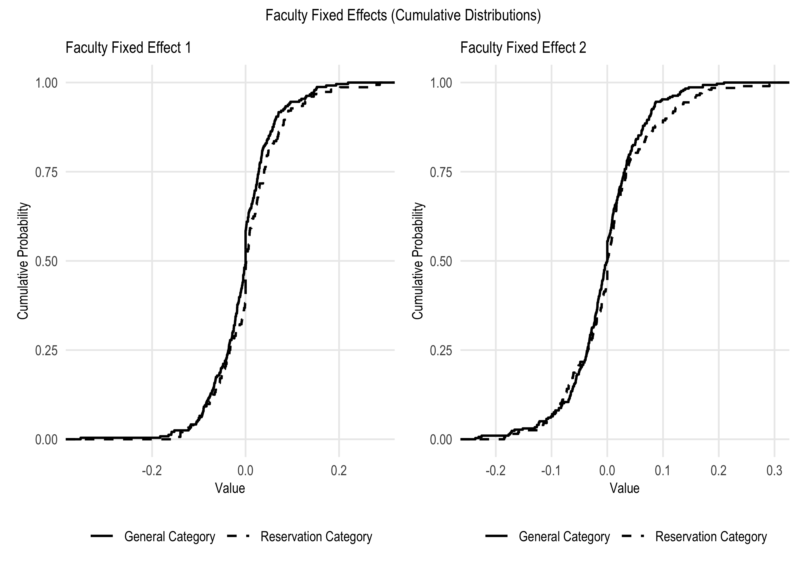

Affirmative Action, Faculty Productivity and Caste Interactions:
Evidence from Engineering Colleges in India
================
Robert Fairlie, Saurabh Khanna, Prashant Loyalka, Gagandeep
Sachdeva<br/>
2025-12-22

- [Main Tables](#main-tables)
  - [Table 3.1](#table-31)
  - [Table 5.1](#table-51)
  - [Table 5.2](#table-52)
  - [Table 5.3](#table-53)
  - [Table 5.4](#table-54)
  - [Table 5.5](#table-55)
  - [Table 5.6](#table-56)
  - [Table 5.7](#table-57)
  - [Table 5.8](#table-58)
  - [Table 5.9](#table-59)
  - [Table 5.10](#table-510)
  - [Table 5.11](#table-511)
  - [Table 5.12](#table-512)
  - [Table 5.13](#table-513)
  - [Table 5.14](#table-514)
- [Appendix](#appendix)
  - [Table A1](#table-a1)
  - [Table B1](#table-b1)
  - [Table C1](#table-c1)
  - [Table D1](#table-d1)
  - [Figure E1 and E2](#figure-e1-and-e2)
  - [Table F1](#table-f1)
  - [Table F2](#table-f2)
  - [Table G1](#table-g1)
  - [Table G2](#table-g2)
  - [Table G3](#table-g3)
  - [Table H1](#table-h1)
  - [Table H2](#table-h2)
  - [Table I1](#table-i1)
  - [Table I2](#table-i2)
  - [Table J1](#table-j1)
  - [Table J2](#table-j2)
  - [Table J3](#table-j3)
  - [Table J4](#table-j4)
  - [Table J5](#table-j5)

<br/>

``` r
# Libraries
pacman::p_load(haven, estimatr, extrafont, texreg, janitor, hrbrthemes, xtable, papeR, tidyverse, compareGroups, Hmisc, skimr, datawizard, lme4, lattice, broom, fixest, lfe, survey, broom, patchwork)
```

``` r
read_csv("appendix/table_I1.csv") %>%
  mutate(
    studentnum = dense_rank(studentnum),
    facultynum = dense_rank(facultynum),
    course_name = str_c("C", dense_rank(course_name)),
  ) %>%
  arrange(facultynum, studentnum) %>% 
  rename(course = course_name)


"appendix" %>%
  list.files(pattern = "\\.csv$", full.names = TRUE) %>%
  keep(~ "course_name" %in% names(read_csv(.x, n_max = 0, show_col_types = FALSE)))
```

# Main Tables

## Table 3.1

Faculty and Student Characteristics in Engineering Colleges in India.

``` r
# calculate weighted mean and sd using department-level weights ("sw_f") from the national representative sample

weighted_mean_sd_multi <- function(data, vars, weight=1) {
  data %>% 
    summarise(
      across(
        all_of(vars),
        list(
          mean = ~ weighted.mean(.x, w = {{weight}}, na.rm = T),
          sd = ~ sqrt(Hmisc::wtd.var(.x, weights = {{weight}}, na.rm = T))
        ),
        .names = "{col}_{fn}"
      )
    ) %>%
    mutate(across(everything(), ~ round(.x, 2)))
}
```

Faculty:

``` r
read_csv("main/table_31_51_58_59_510.csv") %>% 
  weighted_mean_sd_multi(c("fac_reservation", "fac_assistant_professor", "fac_associate_professor", "fac_professor", "fac_yearsinhighed", "fac_highest_degree_masters", "fac_highest_degree_phd", "fac_highest_degree_phd_in_prog",  "fac_degree_college_elite", "fac_female"), sw_f) %>% 
  t()
```

    ##                                     [,1]
    ## fac_reservation_mean                0.50
    ## fac_reservation_sd                  0.50
    ## fac_assistant_professor_mean        0.77
    ## fac_assistant_professor_sd          0.42
    ## fac_associate_professor_mean        0.13
    ## fac_associate_professor_sd          0.34
    ## fac_professor_mean                  0.06
    ## fac_professor_sd                    0.23
    ## fac_yearsinhighed_mean              9.49
    ## fac_yearsinhighed_sd                6.86
    ## fac_highest_degree_masters_mean     0.61
    ## fac_highest_degree_masters_sd       0.49
    ## fac_highest_degree_phd_mean         0.17
    ## fac_highest_degree_phd_sd           0.38
    ## fac_highest_degree_phd_in_prog_mean 0.19
    ## fac_highest_degree_phd_in_prog_sd   0.39
    ## fac_degree_college_elite_mean       0.25
    ## fac_degree_college_elite_sd         0.43
    ## fac_female_mean                     0.42
    ## fac_female_sd                       0.49

Students:

``` r
read_csv("main/table_31_stu.csv") %>%
  weighted_mean_sd_multi(c("reservation", "female", "age", "father_college", "mother_college"), sw_f) %>% 
  t()
```

    ##                      [,1]
    ## reservation_mean     0.56
    ## reservation_sd       0.50
    ## female_mean          0.41
    ## female_sd            0.49
    ## age_mean            18.95
    ## age_sd               1.49
    ## father_college_mean  0.48
    ## father_college_sd    0.50
    ## mother_college_mean  0.35
    ## mother_college_sd    0.48

## Table 5.1

Faculty Qualifications by Reservation Status at Engineering and
Technology Colleges in India

Weighgted means:

``` r
read_csv("main/table_31_51_58_59_510.csv") %>%
  group_by(fac_reservation) %>%
  drop_na(fac_reservation) %>%
  summarise(
    fac_assistant_professor = weighted.mean(fac_assistant_professor, w = sw_f, na.rm = T),
    fac_associate_professor = weighted.mean(fac_associate_professor, w = sw_f, na.rm = T),
    fac_professor = weighted.mean(fac_professor, w = sw_f, na.rm = T),
    fac_yearsinhighed = weighted.mean(fac_yearsinhighed, w = sw_f, na.rm = T),
    fac_highest_degree_phd = weighted.mean(fac_highest_degree_phd, w = sw_f, na.rm = T),
    fac_highest_degree_phd_in_prog = weighted.mean(fac_highest_degree_phd_in_prog, w = sw_f, na.rm = T),
    fac_highest_degree_masters = weighted.mean(fac_highest_degree_masters, w = sw_f, na.rm = T),
    fac_degree_college_elite = weighted.mean(fac_degree_college_elite, w = sw_f, na.rm = T),
    fac_female = weighted.mean(fac_female, w = sw_f, na.rm = T)
  ) %>% 
  mutate_all(~ round(.x, 2)) %>% 
  arrange(-fac_reservation) %>% 
  t()
```

    ##                                [,1]  [,2]
    ## fac_reservation                1.00  0.00
    ## fac_assistant_professor        0.80  0.74
    ## fac_associate_professor        0.13  0.14
    ## fac_professor                  0.03  0.08
    ## fac_yearsinhighed              8.91 10.06
    ## fac_highest_degree_phd         0.14  0.21
    ## fac_highest_degree_phd_in_prog 0.18  0.18
    ## fac_highest_degree_masters     0.64  0.58
    ## fac_degree_college_elite       0.26  0.23
    ## fac_female                     0.40  0.44

Differences:

``` r
svy <- svydesign(ids = ~1, weights = ~sw_f, data = read_csv("main/table_31_51_58_59_510.csv"))

map_dfr(c("fac_assistant_professor", "fac_associate_professor", "fac_professor",
          "fac_yearsinhighed", "fac_highest_degree_phd", "fac_highest_degree_phd_in_prog",
          "fac_highest_degree_masters", "fac_degree_college_elite", "fac_female"),
        ~{
          tidy(svyttest(as.formula(paste(.x, "~ fac_reservation")), svy)) %>%
            mutate(variable = .x)
        }) %>% 
  transmute(variable, estimate = round(estimate, 2), statistic, p.value, conf.low, conf.high)
```

    ## # A tibble: 9 × 6
    ##   variable                       estimate statistic   p.value conf.low conf.high
    ##   <chr>                             <dbl>     <dbl>     <dbl>    <dbl>     <dbl>
    ## 1 fac_assistant_professor            0.06    2.30     2.14e-2  0.00936    0.117 
    ## 2 fac_associate_professor           -0.01   -0.345    7.30e-1 -0.0573     0.0401
    ## 3 fac_professor                     -0.05   -4.84     1.34e-6 -0.0670    -0.0284
    ## 4 fac_yearsinhighed                 -1.15   -2.38     1.72e-2 -2.10      -0.205 
    ## 5 fac_highest_degree_phd            -0.07   -3.12     1.86e-3 -0.111     -0.0253
    ## 6 fac_highest_degree_phd_in_prog     0      -0.0565   9.55e-1 -0.0528     0.0498
    ## 7 fac_highest_degree_masters         0.06    1.82     6.83e-2 -0.00454    0.125 
    ## 8 fac_degree_college_elite           0.03    0.995    3.20e-1 -0.0271     0.0830
    ## 9 fac_female                        -0.04   -1.15     2.49e-1 -0.108      0.0280

## Table 5.2

Tables 5.2 uses microdata from the 68th Round of the National Sample
Survey’s Employment and Unemployment Survey (Reference ID
DDI-IND-MOSPI-NSSO-68-10-2013). Steps to replicate:

1.  Download the microdata setup from the following link:
    <https://microdata.gov.in/NADA/index.php/catalog/127/study-description>
2.  Follow the instructions for installing NESSTAR’s Extraction Software
    (the exe file comes with the microdata)
3.  Extract each block as a .dta file into the source folder
4.  Use the Stata do-file titled “NSS_tables.do” to replicate the table.

## Table 5.3

Faculty Differences and Balance Checks for the Sample of Colleges with
Random Assignment

Faculty means and sds:

``` r
df_temp <- read_csv("main/table_53_54.csv")
  
df_temp %>% 
  summarise_at(
    vars(starts_with("fac_")),
    list(
      mean = ~ round(mean(.x, na.rm = T), 2),
      sd = ~ round(sd(.x, na.rm = T), 2)
    )
  ) %>% 
  t()
```

    ##                                      [,1]
    ## fac_reservation_mean                 0.39
    ## fac_assistant_professor_mean         0.69
    ## fac_associate_professor_mean         0.20
    ## fac_professor_mean                   0.09
    ## fac_yearsinhighed_mean              10.50
    ## fac_highest_degree_masters_mean      0.54
    ## fac_highest_degree_phd_mean          0.26
    ## fac_highest_degree_phd_in_prog_mean  0.18
    ## fac_degree_college_elite_mean        0.28
    ## fac_female_mean                      0.34
    ## fac_caste_mean                         NA
    ## fac_publications_mean                1.91
    ## fac_reservation_sd                   0.49
    ## fac_assistant_professor_sd           0.46
    ## fac_associate_professor_sd           0.40
    ## fac_professor_sd                     0.29
    ## fac_yearsinhighed_sd                 6.35
    ## fac_highest_degree_masters_sd        0.50
    ## fac_highest_degree_phd_sd            0.44
    ## fac_highest_degree_phd_in_prog_sd    0.38
    ## fac_degree_college_elite_sd          0.45
    ## fac_female_sd                        0.47
    ## fac_caste_sd                           NA
    ## fac_publications_sd                  2.51

Faculty differences:

``` r
df_temp %>%
  mutate(fe_var = str_c(department_id, course, sep = "_")) %>% # course fixed effects within a department
  lm_robust(fac_assistant_professor ~ fac_reservation, data = ., fixed_effects = ~ fe_var, se_type = "stata", clusters = facultynum) %>% 
  knitreg(digits = 3, stars = c(0.01, 0.05, 0.1), include.ci = F, caption="")
```

<table class="texreg" style="margin: 10px auto;border-collapse: collapse;border-spacing: 0px;caption-side: bottom;color: #000000;border-top: 2px solid #000000;">

<thead>

<tr>

<th style="padding-left: 5px;padding-right: 5px;">

 
</th>

<th style="padding-left: 5px;padding-right: 5px;">

Model 1
</th>

</tr>

</thead>

<tbody>

<tr style="border-top: 1px solid #000000;">

<td style="padding-left: 5px;padding-right: 5px;">

fac_reservation
</td>

<td style="padding-left: 5px;padding-right: 5px;">

0.055
</td>

</tr>

<tr>

<td style="padding-left: 5px;padding-right: 5px;">

 
</td>

<td style="padding-left: 5px;padding-right: 5px;">

(0.061)
</td>

</tr>

<tr style="border-top: 1px solid #000000;">

<td style="padding-left: 5px;padding-right: 5px;">

R<sup>2</sup>
</td>

<td style="padding-left: 5px;padding-right: 5px;">

0.746
</td>

</tr>

<tr>

<td style="padding-left: 5px;padding-right: 5px;">

Adj. R<sup>2</sup>
</td>

<td style="padding-left: 5px;padding-right: 5px;">

0.743
</td>

</tr>

<tr>

<td style="padding-left: 5px;padding-right: 5px;">

Num. obs.
</td>

<td style="padding-left: 5px;padding-right: 5px;">

37978
</td>

</tr>

<tr>

<td style="padding-left: 5px;padding-right: 5px;">

RMSE
</td>

<td style="padding-left: 5px;padding-right: 5px;">

0.235
</td>

</tr>

<tr style="border-bottom: 2px solid #000000;">

<td style="padding-left: 5px;padding-right: 5px;">

N Clusters
</td>

<td style="padding-left: 5px;padding-right: 5px;">

498
</td>

</tr>

</tbody>

<tfoot>

<tr>

<td style="font-size: 0.8em;" colspan="2">

<sup>\*\*\*</sup>p \< 0.01; <sup>\*\*</sup>p \< 0.05; <sup>\*</sup>p \<
0.1
</td>

</tr>

</tfoot>

</table>

``` r
df_temp %>%
  mutate(fe_var = str_c(department_id, course, sep = "_")) %>%
  lm_robust(fac_associate_professor ~ fac_reservation, data = ., fixed_effects = ~ fe_var, se_type = "stata", clusters = facultynum) %>% 
  knitreg(digits = 3, stars = c(0.01, 0.05, 0.1), include.ci = F, caption="")
```

<table class="texreg" style="margin: 10px auto;border-collapse: collapse;border-spacing: 0px;caption-side: bottom;color: #000000;border-top: 2px solid #000000;">

<thead>

<tr>

<th style="padding-left: 5px;padding-right: 5px;">

 
</th>

<th style="padding-left: 5px;padding-right: 5px;">

Model 1
</th>

</tr>

</thead>

<tbody>

<tr style="border-top: 1px solid #000000;">

<td style="padding-left: 5px;padding-right: 5px;">

fac_reservation
</td>

<td style="padding-left: 5px;padding-right: 5px;">

0.018
</td>

</tr>

<tr>

<td style="padding-left: 5px;padding-right: 5px;">

 
</td>

<td style="padding-left: 5px;padding-right: 5px;">

(0.043)
</td>

</tr>

<tr style="border-top: 1px solid #000000;">

<td style="padding-left: 5px;padding-right: 5px;">

R<sup>2</sup>
</td>

<td style="padding-left: 5px;padding-right: 5px;">

0.725
</td>

</tr>

<tr>

<td style="padding-left: 5px;padding-right: 5px;">

Adj. R<sup>2</sup>
</td>

<td style="padding-left: 5px;padding-right: 5px;">

0.722
</td>

</tr>

<tr>

<td style="padding-left: 5px;padding-right: 5px;">

Num. obs.
</td>

<td style="padding-left: 5px;padding-right: 5px;">

37978
</td>

</tr>

<tr>

<td style="padding-left: 5px;padding-right: 5px;">

RMSE
</td>

<td style="padding-left: 5px;padding-right: 5px;">

0.210
</td>

</tr>

<tr style="border-bottom: 2px solid #000000;">

<td style="padding-left: 5px;padding-right: 5px;">

N Clusters
</td>

<td style="padding-left: 5px;padding-right: 5px;">

498
</td>

</tr>

</tbody>

<tfoot>

<tr>

<td style="font-size: 0.8em;" colspan="2">

<sup>\*\*\*</sup>p \< 0.01; <sup>\*\*</sup>p \< 0.05; <sup>\*</sup>p \<
0.1
</td>

</tr>

</tfoot>

</table>

``` r
df_temp %>%
  mutate(fe_var = str_c(department_id, course, sep = "_")) %>%
  lm_robust(fac_professor ~ fac_reservation, data = ., fixed_effects = ~ fe_var, se_type = "stata", clusters = facultynum) %>% 
  knitreg(digits = 3, stars = c(0.01, 0.05, 0.1), include.ci = F, caption="")
```

<table class="texreg" style="margin: 10px auto;border-collapse: collapse;border-spacing: 0px;caption-side: bottom;color: #000000;border-top: 2px solid #000000;">

<thead>

<tr>

<th style="padding-left: 5px;padding-right: 5px;">

 
</th>

<th style="padding-left: 5px;padding-right: 5px;">

Model 1
</th>

</tr>

</thead>

<tbody>

<tr style="border-top: 1px solid #000000;">

<td style="padding-left: 5px;padding-right: 5px;">

fac_reservation
</td>

<td style="padding-left: 5px;padding-right: 5px;">

-0.071
</td>

</tr>

<tr>

<td style="padding-left: 5px;padding-right: 5px;">

 
</td>

<td style="padding-left: 5px;padding-right: 5px;">

(0.043)
</td>

</tr>

<tr style="border-top: 1px solid #000000;">

<td style="padding-left: 5px;padding-right: 5px;">

R<sup>2</sup>
</td>

<td style="padding-left: 5px;padding-right: 5px;">

0.684
</td>

</tr>

<tr>

<td style="padding-left: 5px;padding-right: 5px;">

Adj. R<sup>2</sup>
</td>

<td style="padding-left: 5px;padding-right: 5px;">

0.680
</td>

</tr>

<tr>

<td style="padding-left: 5px;padding-right: 5px;">

Num. obs.
</td>

<td style="padding-left: 5px;padding-right: 5px;">

37978
</td>

</tr>

<tr>

<td style="padding-left: 5px;padding-right: 5px;">

RMSE
</td>

<td style="padding-left: 5px;padding-right: 5px;">

0.164
</td>

</tr>

<tr style="border-bottom: 2px solid #000000;">

<td style="padding-left: 5px;padding-right: 5px;">

N Clusters
</td>

<td style="padding-left: 5px;padding-right: 5px;">

498
</td>

</tr>

</tbody>

<tfoot>

<tr>

<td style="font-size: 0.8em;" colspan="2">

<sup>\*\*\*</sup>p \< 0.01; <sup>\*\*</sup>p \< 0.05; <sup>\*</sup>p \<
0.1
</td>

</tr>

</tfoot>

</table>

``` r
df_temp %>%
  mutate(fe_var = str_c(department_id, course, sep = "_")) %>%
  lm_robust(fac_yearsinhighed ~ fac_reservation, data = ., fixed_effects = ~ fe_var, se_type = "stata", clusters = facultynum) %>% 
  knitreg(digits = 3, stars = c(0.01, 0.05, 0.1), include.ci = F, caption="")
```

<table class="texreg" style="margin: 10px auto;border-collapse: collapse;border-spacing: 0px;caption-side: bottom;color: #000000;border-top: 2px solid #000000;">

<thead>

<tr>

<th style="padding-left: 5px;padding-right: 5px;">

 
</th>

<th style="padding-left: 5px;padding-right: 5px;">

Model 1
</th>

</tr>

</thead>

<tbody>

<tr style="border-top: 1px solid #000000;">

<td style="padding-left: 5px;padding-right: 5px;">

fac_reservation
</td>

<td style="padding-left: 5px;padding-right: 5px;">

-1.391<sup>\*</sup>
</td>

</tr>

<tr>

<td style="padding-left: 5px;padding-right: 5px;">

 
</td>

<td style="padding-left: 5px;padding-right: 5px;">

(0.793)
</td>

</tr>

<tr style="border-top: 1px solid #000000;">

<td style="padding-left: 5px;padding-right: 5px;">

R<sup>2</sup>
</td>

<td style="padding-left: 5px;padding-right: 5px;">

0.760
</td>

</tr>

<tr>

<td style="padding-left: 5px;padding-right: 5px;">

Adj. R<sup>2</sup>
</td>

<td style="padding-left: 5px;padding-right: 5px;">

0.758
</td>

</tr>

<tr>

<td style="padding-left: 5px;padding-right: 5px;">

Num. obs.
</td>

<td style="padding-left: 5px;padding-right: 5px;">

37970
</td>

</tr>

<tr>

<td style="padding-left: 5px;padding-right: 5px;">

RMSE
</td>

<td style="padding-left: 5px;padding-right: 5px;">

3.126
</td>

</tr>

<tr style="border-bottom: 2px solid #000000;">

<td style="padding-left: 5px;padding-right: 5px;">

N Clusters
</td>

<td style="padding-left: 5px;padding-right: 5px;">

497
</td>

</tr>

</tbody>

<tfoot>

<tr>

<td style="font-size: 0.8em;" colspan="2">

<sup>\*\*\*</sup>p \< 0.01; <sup>\*\*</sup>p \< 0.05; <sup>\*</sup>p \<
0.1
</td>

</tr>

</tfoot>

</table>

``` r
df_temp %>%
  mutate(fe_var = str_c(department_id, course, sep = "_")) %>%
  lm_robust(fac_highest_degree_masters ~ fac_reservation, data = ., fixed_effects = ~ fe_var, se_type = "stata", clusters = facultynum) %>%
  knitreg(digits = 3, stars = c(0.01, 0.05, 0.1), include.ci = F, caption="")
```

<table class="texreg" style="margin: 10px auto;border-collapse: collapse;border-spacing: 0px;caption-side: bottom;color: #000000;border-top: 2px solid #000000;">

<thead>

<tr>

<th style="padding-left: 5px;padding-right: 5px;">

 
</th>

<th style="padding-left: 5px;padding-right: 5px;">

Model 1
</th>

</tr>

</thead>

<tbody>

<tr style="border-top: 1px solid #000000;">

<td style="padding-left: 5px;padding-right: 5px;">

fac_reservation
</td>

<td style="padding-left: 5px;padding-right: 5px;">

0.147<sup>\*\*</sup>
</td>

</tr>

<tr>

<td style="padding-left: 5px;padding-right: 5px;">

 
</td>

<td style="padding-left: 5px;padding-right: 5px;">

(0.074)
</td>

</tr>

<tr style="border-top: 1px solid #000000;">

<td style="padding-left: 5px;padding-right: 5px;">

R<sup>2</sup>
</td>

<td style="padding-left: 5px;padding-right: 5px;">

0.762
</td>

</tr>

<tr>

<td style="padding-left: 5px;padding-right: 5px;">

Adj. R<sup>2</sup>
</td>

<td style="padding-left: 5px;padding-right: 5px;">

0.759
</td>

</tr>

<tr>

<td style="padding-left: 5px;padding-right: 5px;">

Num. obs.
</td>

<td style="padding-left: 5px;padding-right: 5px;">

38021
</td>

</tr>

<tr>

<td style="padding-left: 5px;padding-right: 5px;">

RMSE
</td>

<td style="padding-left: 5px;padding-right: 5px;">

0.244
</td>

</tr>

<tr style="border-bottom: 2px solid #000000;">

<td style="padding-left: 5px;padding-right: 5px;">

N Clusters
</td>

<td style="padding-left: 5px;padding-right: 5px;">

499
</td>

</tr>

</tbody>

<tfoot>

<tr>

<td style="font-size: 0.8em;" colspan="2">

<sup>\*\*\*</sup>p \< 0.01; <sup>\*\*</sup>p \< 0.05; <sup>\*</sup>p \<
0.1
</td>

</tr>

</tfoot>

</table>

``` r
df_temp %>%
  mutate(fe_var = str_c(department_id, course, sep = "_")) %>%
  lm_robust(fac_highest_degree_phd ~ fac_reservation, data = ., fixed_effects = ~ fe_var, se_type = "stata", clusters = facultynum) %>%
  knitreg(digits = 3, stars = c(0.01, 0.05, 0.1), include.ci = F, caption="")
```

<table class="texreg" style="margin: 10px auto;border-collapse: collapse;border-spacing: 0px;caption-side: bottom;color: #000000;border-top: 2px solid #000000;">

<thead>

<tr>

<th style="padding-left: 5px;padding-right: 5px;">

 
</th>

<th style="padding-left: 5px;padding-right: 5px;">

Model 1
</th>

</tr>

</thead>

<tbody>

<tr style="border-top: 1px solid #000000;">

<td style="padding-left: 5px;padding-right: 5px;">

fac_reservation
</td>

<td style="padding-left: 5px;padding-right: 5px;">

-0.133<sup>\*\*\*</sup>
</td>

</tr>

<tr>

<td style="padding-left: 5px;padding-right: 5px;">

 
</td>

<td style="padding-left: 5px;padding-right: 5px;">

(0.041)
</td>

</tr>

<tr style="border-top: 1px solid #000000;">

<td style="padding-left: 5px;padding-right: 5px;">

R<sup>2</sup>
</td>

<td style="padding-left: 5px;padding-right: 5px;">

0.794
</td>

</tr>

<tr>

<td style="padding-left: 5px;padding-right: 5px;">

Adj. R<sup>2</sup>
</td>

<td style="padding-left: 5px;padding-right: 5px;">

0.792
</td>

</tr>

<tr>

<td style="padding-left: 5px;padding-right: 5px;">

Num. obs.
</td>

<td style="padding-left: 5px;padding-right: 5px;">

38021
</td>

</tr>

<tr>

<td style="padding-left: 5px;padding-right: 5px;">

RMSE
</td>

<td style="padding-left: 5px;padding-right: 5px;">

0.201
</td>

</tr>

<tr style="border-bottom: 2px solid #000000;">

<td style="padding-left: 5px;padding-right: 5px;">

N Clusters
</td>

<td style="padding-left: 5px;padding-right: 5px;">

499
</td>

</tr>

</tbody>

<tfoot>

<tr>

<td style="font-size: 0.8em;" colspan="2">

<sup>\*\*\*</sup>p \< 0.01; <sup>\*\*</sup>p \< 0.05; <sup>\*</sup>p \<
0.1
</td>

</tr>

</tfoot>

</table>

``` r
df_temp %>%
  mutate(fe_var = str_c(department_id, course, sep = "_")) %>%
  lm_robust(fac_highest_degree_phd_in_prog ~ fac_reservation, data = ., fixed_effects = ~ fe_var, se_type = "stata", clusters = facultynum) %>%
  knitreg(digits = 3, stars = c(0.01, 0.05, 0.1), include.ci = F, caption="")
```

<table class="texreg" style="margin: 10px auto;border-collapse: collapse;border-spacing: 0px;caption-side: bottom;color: #000000;border-top: 2px solid #000000;">

<thead>

<tr>

<th style="padding-left: 5px;padding-right: 5px;">

 
</th>

<th style="padding-left: 5px;padding-right: 5px;">

Model 1
</th>

</tr>

</thead>

<tbody>

<tr style="border-top: 1px solid #000000;">

<td style="padding-left: 5px;padding-right: 5px;">

fac_reservation
</td>

<td style="padding-left: 5px;padding-right: 5px;">

-0.023
</td>

</tr>

<tr>

<td style="padding-left: 5px;padding-right: 5px;">

 
</td>

<td style="padding-left: 5px;padding-right: 5px;">

(0.068)
</td>

</tr>

<tr style="border-top: 1px solid #000000;">

<td style="padding-left: 5px;padding-right: 5px;">

R<sup>2</sup>
</td>

<td style="padding-left: 5px;padding-right: 5px;">

0.654
</td>

</tr>

<tr>

<td style="padding-left: 5px;padding-right: 5px;">

Adj. R<sup>2</sup>
</td>

<td style="padding-left: 5px;padding-right: 5px;">

0.650
</td>

</tr>

<tr>

<td style="padding-left: 5px;padding-right: 5px;">

Num. obs.
</td>

<td style="padding-left: 5px;padding-right: 5px;">

38021
</td>

</tr>

<tr>

<td style="padding-left: 5px;padding-right: 5px;">

RMSE
</td>

<td style="padding-left: 5px;padding-right: 5px;">

0.224
</td>

</tr>

<tr style="border-bottom: 2px solid #000000;">

<td style="padding-left: 5px;padding-right: 5px;">

N Clusters
</td>

<td style="padding-left: 5px;padding-right: 5px;">

499
</td>

</tr>

</tbody>

<tfoot>

<tr>

<td style="font-size: 0.8em;" colspan="2">

<sup>\*\*\*</sup>p \< 0.01; <sup>\*\*</sup>p \< 0.05; <sup>\*</sup>p \<
0.1
</td>

</tr>

</tfoot>

</table>

``` r
df_temp %>%
  mutate(fe_var = str_c(department_id, course, sep = "_")) %>%
  lm_robust(fac_degree_college_elite ~ fac_reservation, data =  ., fixed_effects = ~ fe_var, se_type = "stata", clusters = facultynum) %>% 
  knitreg(digits = 3, stars = c(0.01, 0.05, 0.1), include.ci = F, caption="")
```

<table class="texreg" style="margin: 10px auto;border-collapse: collapse;border-spacing: 0px;caption-side: bottom;color: #000000;border-top: 2px solid #000000;">

<thead>

<tr>

<th style="padding-left: 5px;padding-right: 5px;">

 
</th>

<th style="padding-left: 5px;padding-right: 5px;">

Model 1
</th>

</tr>

</thead>

<tbody>

<tr style="border-top: 1px solid #000000;">

<td style="padding-left: 5px;padding-right: 5px;">

fac_reservation
</td>

<td style="padding-left: 5px;padding-right: 5px;">

-0.109<sup>\*</sup>
</td>

</tr>

<tr>

<td style="padding-left: 5px;padding-right: 5px;">

 
</td>

<td style="padding-left: 5px;padding-right: 5px;">

(0.063)
</td>

</tr>

<tr style="border-top: 1px solid #000000;">

<td style="padding-left: 5px;padding-right: 5px;">

R<sup>2</sup>
</td>

<td style="padding-left: 5px;padding-right: 5px;">

0.717
</td>

</tr>

<tr>

<td style="padding-left: 5px;padding-right: 5px;">

Adj. R<sup>2</sup>
</td>

<td style="padding-left: 5px;padding-right: 5px;">

0.714
</td>

</tr>

<tr>

<td style="padding-left: 5px;padding-right: 5px;">

Num. obs.
</td>

<td style="padding-left: 5px;padding-right: 5px;">

38021
</td>

</tr>

<tr>

<td style="padding-left: 5px;padding-right: 5px;">

RMSE
</td>

<td style="padding-left: 5px;padding-right: 5px;">

0.239
</td>

</tr>

<tr style="border-bottom: 2px solid #000000;">

<td style="padding-left: 5px;padding-right: 5px;">

N Clusters
</td>

<td style="padding-left: 5px;padding-right: 5px;">

499
</td>

</tr>

</tbody>

<tfoot>

<tr>

<td style="font-size: 0.8em;" colspan="2">

<sup>\*\*\*</sup>p \< 0.01; <sup>\*\*</sup>p \< 0.05; <sup>\*</sup>p \<
0.1
</td>

</tr>

</tfoot>

</table>

``` r
df_temp %>%
  mutate(fe_var = str_c(department_id, course, sep = "_")) %>%
  lm_robust(fac_female ~ fac_reservation, data = ., fixed_effects = ~ fe_var, se_type = "stata", clusters = facultynum) %>% 
  knitreg(digits = 3, stars = c(0.01, 0.05, 0.1), include.ci = F, caption="")
```

<table class="texreg" style="margin: 10px auto;border-collapse: collapse;border-spacing: 0px;caption-side: bottom;color: #000000;border-top: 2px solid #000000;">

<thead>

<tr>

<th style="padding-left: 5px;padding-right: 5px;">

 
</th>

<th style="padding-left: 5px;padding-right: 5px;">

Model 1
</th>

</tr>

</thead>

<tbody>

<tr style="border-top: 1px solid #000000;">

<td style="padding-left: 5px;padding-right: 5px;">

fac_reservation
</td>

<td style="padding-left: 5px;padding-right: 5px;">

-0.008
</td>

</tr>

<tr>

<td style="padding-left: 5px;padding-right: 5px;">

 
</td>

<td style="padding-left: 5px;padding-right: 5px;">

(0.076)
</td>

</tr>

<tr style="border-top: 1px solid #000000;">

<td style="padding-left: 5px;padding-right: 5px;">

R<sup>2</sup>
</td>

<td style="padding-left: 5px;padding-right: 5px;">

0.700
</td>

</tr>

<tr>

<td style="padding-left: 5px;padding-right: 5px;">

Adj. R<sup>2</sup>
</td>

<td style="padding-left: 5px;padding-right: 5px;">

0.696
</td>

</tr>

<tr>

<td style="padding-left: 5px;padding-right: 5px;">

Num. obs.
</td>

<td style="padding-left: 5px;padding-right: 5px;">

38021
</td>

</tr>

<tr>

<td style="padding-left: 5px;padding-right: 5px;">

RMSE
</td>

<td style="padding-left: 5px;padding-right: 5px;">

0.260
</td>

</tr>

<tr style="border-bottom: 2px solid #000000;">

<td style="padding-left: 5px;padding-right: 5px;">

N Clusters
</td>

<td style="padding-left: 5px;padding-right: 5px;">

499
</td>

</tr>

</tbody>

<tfoot>

<tr>

<td style="font-size: 0.8em;" colspan="2">

<sup>\*\*\*</sup>p \< 0.01; <sup>\*\*</sup>p \< 0.05; <sup>\*</sup>p \<
0.1
</td>

</tr>

</tfoot>

</table>

Student means and SDs:

``` r
df_temp %>%
  summarise_at(
    vars(reservation_stu, female, age, father_college, mother_college, b_i_jeemain_score, took_jee),
    list(
      mean = ~ round(mean(.x, na.rm = T), 2),
      sd = ~ round(sd(.x, na.rm = T), 2)
    )
  ) %>% 
  t()
```

    ##                         [,1]
    ## reservation_stu_mean    0.53
    ## female_mean             0.47
    ## age_mean               17.72
    ## father_college_mean     0.52
    ## mother_college_mean     0.36
    ## b_i_jeemain_score_mean 69.62
    ## took_jee_mean           0.66
    ## reservation_stu_sd      0.50
    ## female_sd               0.50
    ## age_sd                  0.81
    ## father_college_sd       0.50
    ## mother_college_sd       0.48
    ## b_i_jeemain_score_sd   43.90
    ## took_jee_sd             0.47

Student differences:

``` r
# Reservation status
df_temp %>%
  mutate(fe_var = str_c(department_id, course, sep = "_")) %>%
  lm_robust(reservation_stu ~ fac_reservation, data = ., fixed_effects = ~ fe_var, se_type = "stata", clusters = facultynum) %>%
  knitreg(include.ci = F, digits = 3, stars = c(0.01, 0.05, 0.1), caption="")
```

<table class="texreg" style="margin: 10px auto;border-collapse: collapse;border-spacing: 0px;caption-side: bottom;color: #000000;border-top: 2px solid #000000;">

<thead>

<tr>

<th style="padding-left: 5px;padding-right: 5px;">

 
</th>

<th style="padding-left: 5px;padding-right: 5px;">

Model 1
</th>

</tr>

</thead>

<tbody>

<tr style="border-top: 1px solid #000000;">

<td style="padding-left: 5px;padding-right: 5px;">

fac_reservation
</td>

<td style="padding-left: 5px;padding-right: 5px;">

-0.008
</td>

</tr>

<tr>

<td style="padding-left: 5px;padding-right: 5px;">

 
</td>

<td style="padding-left: 5px;padding-right: 5px;">

(0.010)
</td>

</tr>

<tr style="border-top: 1px solid #000000;">

<td style="padding-left: 5px;padding-right: 5px;">

R<sup>2</sup>
</td>

<td style="padding-left: 5px;padding-right: 5px;">

0.101
</td>

</tr>

<tr>

<td style="padding-left: 5px;padding-right: 5px;">

Adj. R<sup>2</sup>
</td>

<td style="padding-left: 5px;padding-right: 5px;">

0.091
</td>

</tr>

<tr>

<td style="padding-left: 5px;padding-right: 5px;">

Num. obs.
</td>

<td style="padding-left: 5px;padding-right: 5px;">

37972
</td>

</tr>

<tr>

<td style="padding-left: 5px;padding-right: 5px;">

RMSE
</td>

<td style="padding-left: 5px;padding-right: 5px;">

0.476
</td>

</tr>

<tr style="border-bottom: 2px solid #000000;">

<td style="padding-left: 5px;padding-right: 5px;">

N Clusters
</td>

<td style="padding-left: 5px;padding-right: 5px;">

499
</td>

</tr>

</tbody>

<tfoot>

<tr>

<td style="font-size: 0.8em;" colspan="2">

<sup>\*\*\*</sup>p \< 0.01; <sup>\*\*</sup>p \< 0.05; <sup>\*</sup>p \<
0.1
</td>

</tr>

</tfoot>

</table>

``` r
# Female
df_temp %>%
  mutate(fe_var = str_c(department_id, course, sep = "_")) %>%
  lm_robust(female ~ fac_reservation, data = ., fixed_effects = ~ fe_var, se_type = "stata", clusters = facultynum) %>%
  knitreg(include.ci = F, digits = 3, stars = c(0.01, 0.05, 0.1), caption="")
```

<table class="texreg" style="margin: 10px auto;border-collapse: collapse;border-spacing: 0px;caption-side: bottom;color: #000000;border-top: 2px solid #000000;">

<thead>

<tr>

<th style="padding-left: 5px;padding-right: 5px;">

 
</th>

<th style="padding-left: 5px;padding-right: 5px;">

Model 1
</th>

</tr>

</thead>

<tbody>

<tr style="border-top: 1px solid #000000;">

<td style="padding-left: 5px;padding-right: 5px;">

fac_reservation
</td>

<td style="padding-left: 5px;padding-right: 5px;">

-0.002
</td>

</tr>

<tr>

<td style="padding-left: 5px;padding-right: 5px;">

 
</td>

<td style="padding-left: 5px;padding-right: 5px;">

(0.007)
</td>

</tr>

<tr style="border-top: 1px solid #000000;">

<td style="padding-left: 5px;padding-right: 5px;">

R<sup>2</sup>
</td>

<td style="padding-left: 5px;padding-right: 5px;">

0.408
</td>

</tr>

<tr>

<td style="padding-left: 5px;padding-right: 5px;">

Adj. R<sup>2</sup>
</td>

<td style="padding-left: 5px;padding-right: 5px;">

0.401
</td>

</tr>

<tr>

<td style="padding-left: 5px;padding-right: 5px;">

Num. obs.
</td>

<td style="padding-left: 5px;padding-right: 5px;">

37983
</td>

</tr>

<tr>

<td style="padding-left: 5px;padding-right: 5px;">

RMSE
</td>

<td style="padding-left: 5px;padding-right: 5px;">

0.386
</td>

</tr>

<tr style="border-bottom: 2px solid #000000;">

<td style="padding-left: 5px;padding-right: 5px;">

N Clusters
</td>

<td style="padding-left: 5px;padding-right: 5px;">

499
</td>

</tr>

</tbody>

<tfoot>

<tr>

<td style="font-size: 0.8em;" colspan="2">

<sup>\*\*\*</sup>p \< 0.01; <sup>\*\*</sup>p \< 0.05; <sup>\*</sup>p \<
0.1
</td>

</tr>

</tfoot>

</table>

``` r
# Age
df_temp %>%
  mutate(fe_var = str_c(department_id, course, sep = "_")) %>%
  lm_robust(age ~ fac_reservation, data = ., fixed_effects = ~ fe_var, se_type = "stata", clusters = facultynum) %>%
  knitreg(include.ci = F, digits = 3, stars = c(0.01, 0.05, 0.1), caption="")
```

<table class="texreg" style="margin: 10px auto;border-collapse: collapse;border-spacing: 0px;caption-side: bottom;color: #000000;border-top: 2px solid #000000;">

<thead>

<tr>

<th style="padding-left: 5px;padding-right: 5px;">

 
</th>

<th style="padding-left: 5px;padding-right: 5px;">

Model 1
</th>

</tr>

</thead>

<tbody>

<tr style="border-top: 1px solid #000000;">

<td style="padding-left: 5px;padding-right: 5px;">

fac_reservation
</td>

<td style="padding-left: 5px;padding-right: 5px;">

0.001
</td>

</tr>

<tr>

<td style="padding-left: 5px;padding-right: 5px;">

 
</td>

<td style="padding-left: 5px;padding-right: 5px;">

(0.011)
</td>

</tr>

<tr style="border-top: 1px solid #000000;">

<td style="padding-left: 5px;padding-right: 5px;">

R<sup>2</sup>
</td>

<td style="padding-left: 5px;padding-right: 5px;">

0.228
</td>

</tr>

<tr>

<td style="padding-left: 5px;padding-right: 5px;">

Adj. R<sup>2</sup>
</td>

<td style="padding-left: 5px;padding-right: 5px;">

0.218
</td>

</tr>

<tr>

<td style="padding-left: 5px;padding-right: 5px;">

Num. obs.
</td>

<td style="padding-left: 5px;padding-right: 5px;">

34695
</td>

</tr>

<tr>

<td style="padding-left: 5px;padding-right: 5px;">

RMSE
</td>

<td style="padding-left: 5px;padding-right: 5px;">

0.717
</td>

</tr>

<tr style="border-bottom: 2px solid #000000;">

<td style="padding-left: 5px;padding-right: 5px;">

N Clusters
</td>

<td style="padding-left: 5px;padding-right: 5px;">

496
</td>

</tr>

</tbody>

<tfoot>

<tr>

<td style="font-size: 0.8em;" colspan="2">

<sup>\*\*\*</sup>p \< 0.01; <sup>\*\*</sup>p \< 0.05; <sup>\*</sup>p \<
0.1
</td>

</tr>

</tfoot>

</table>

``` r
# Father attended college
df_temp %>%
  mutate(fe_var = str_c(department_id, course, sep = "_")) %>%
  lm_robust(father_college ~ fac_reservation, data = ., fixed_effects = ~ fe_var, se_type = "stata", clusters = facultynum) %>%
  knitreg(include.ci = F, digits = 3, stars = c(0.01, 0.05, 0.1), caption="")
```

<table class="texreg" style="margin: 10px auto;border-collapse: collapse;border-spacing: 0px;caption-side: bottom;color: #000000;border-top: 2px solid #000000;">

<thead>

<tr>

<th style="padding-left: 5px;padding-right: 5px;">

 
</th>

<th style="padding-left: 5px;padding-right: 5px;">

Model 1
</th>

</tr>

</thead>

<tbody>

<tr style="border-top: 1px solid #000000;">

<td style="padding-left: 5px;padding-right: 5px;">

fac_reservation
</td>

<td style="padding-left: 5px;padding-right: 5px;">

0.005
</td>

</tr>

<tr>

<td style="padding-left: 5px;padding-right: 5px;">

 
</td>

<td style="padding-left: 5px;padding-right: 5px;">

(0.010)
</td>

</tr>

<tr style="border-top: 1px solid #000000;">

<td style="padding-left: 5px;padding-right: 5px;">

R<sup>2</sup>
</td>

<td style="padding-left: 5px;padding-right: 5px;">

0.061
</td>

</tr>

<tr>

<td style="padding-left: 5px;padding-right: 5px;">

Adj. R<sup>2</sup>
</td>

<td style="padding-left: 5px;padding-right: 5px;">

0.051
</td>

</tr>

<tr>

<td style="padding-left: 5px;padding-right: 5px;">

Num. obs.
</td>

<td style="padding-left: 5px;padding-right: 5px;">

37859
</td>

</tr>

<tr>

<td style="padding-left: 5px;padding-right: 5px;">

RMSE
</td>

<td style="padding-left: 5px;padding-right: 5px;">

0.487
</td>

</tr>

<tr style="border-bottom: 2px solid #000000;">

<td style="padding-left: 5px;padding-right: 5px;">

N Clusters
</td>

<td style="padding-left: 5px;padding-right: 5px;">

499
</td>

</tr>

</tbody>

<tfoot>

<tr>

<td style="font-size: 0.8em;" colspan="2">

<sup>\*\*\*</sup>p \< 0.01; <sup>\*\*</sup>p \< 0.05; <sup>\*</sup>p \<
0.1
</td>

</tr>

</tfoot>

</table>

``` r
# Mother attended college
df_temp %>%
  mutate(fe_var = str_c(department_id, course, sep = "_")) %>%
  lm_robust(mother_college ~ fac_reservation, data = ., fixed_effects = ~ fe_var, se_type = "stata", clusters = facultynum) %>%
  knitreg(include.ci = F, digits = 3, stars = c(0.01, 0.05, 0.1), caption="")
```

<table class="texreg" style="margin: 10px auto;border-collapse: collapse;border-spacing: 0px;caption-side: bottom;color: #000000;border-top: 2px solid #000000;">

<thead>

<tr>

<th style="padding-left: 5px;padding-right: 5px;">

 
</th>

<th style="padding-left: 5px;padding-right: 5px;">

Model 1
</th>

</tr>

</thead>

<tbody>

<tr style="border-top: 1px solid #000000;">

<td style="padding-left: 5px;padding-right: 5px;">

fac_reservation
</td>

<td style="padding-left: 5px;padding-right: 5px;">

0.018<sup>\*\*</sup>
</td>

</tr>

<tr>

<td style="padding-left: 5px;padding-right: 5px;">

 
</td>

<td style="padding-left: 5px;padding-right: 5px;">

(0.008)
</td>

</tr>

<tr style="border-top: 1px solid #000000;">

<td style="padding-left: 5px;padding-right: 5px;">

R<sup>2</sup>
</td>

<td style="padding-left: 5px;padding-right: 5px;">

0.063
</td>

</tr>

<tr>

<td style="padding-left: 5px;padding-right: 5px;">

Adj. R<sup>2</sup>
</td>

<td style="padding-left: 5px;padding-right: 5px;">

0.052
</td>

</tr>

<tr>

<td style="padding-left: 5px;padding-right: 5px;">

Num. obs.
</td>

<td style="padding-left: 5px;padding-right: 5px;">

37879
</td>

</tr>

<tr>

<td style="padding-left: 5px;padding-right: 5px;">

RMSE
</td>

<td style="padding-left: 5px;padding-right: 5px;">

0.468
</td>

</tr>

<tr style="border-bottom: 2px solid #000000;">

<td style="padding-left: 5px;padding-right: 5px;">

N Clusters
</td>

<td style="padding-left: 5px;padding-right: 5px;">

499
</td>

</tr>

</tbody>

<tfoot>

<tr>

<td style="font-size: 0.8em;" colspan="2">

<sup>\*\*\*</sup>p \< 0.01; <sup>\*\*</sup>p \< 0.05; <sup>\*</sup>p \<
0.1
</td>

</tr>

</tfoot>

</table>

``` r
# Baseline academic skills (math and physics exams stacked)
bind_rows(
  df_temp %>% transmute(studentnum, fac_reservation, b_score = scale(b_math_g1_score) %>% as.vector, exam = "Math", facultynum, fe_var = str_c(department_id, course, sep = "_")) %>% drop_na(b_score),
  df_temp %>% transmute(studentnum, fac_reservation, b_score = scale(b_physics_g1_score) %>% as.vector, exam = "Physics", facultynum, fe_var = str_c(department_id, course, sep = "_")) %>% drop_na(b_score)
) %>%
  lm_robust(b_score ~ fac_reservation + exam, data = ., fixed_effects = ~ fe_var, se_type = "stata", clusters = facultynum) %>%
  knitreg(include.ci = F, digits = 3, stars = c(0.01, 0.05, 0.1), caption="")
```

<table class="texreg" style="margin: 10px auto;border-collapse: collapse;border-spacing: 0px;caption-side: bottom;color: #000000;border-top: 2px solid #000000;">

<thead>

<tr>

<th style="padding-left: 5px;padding-right: 5px;">

 
</th>

<th style="padding-left: 5px;padding-right: 5px;">

Model 1
</th>

</tr>

</thead>

<tbody>

<tr style="border-top: 1px solid #000000;">

<td style="padding-left: 5px;padding-right: 5px;">

fac_reservation
</td>

<td style="padding-left: 5px;padding-right: 5px;">

-0.004
</td>

</tr>

<tr>

<td style="padding-left: 5px;padding-right: 5px;">

 
</td>

<td style="padding-left: 5px;padding-right: 5px;">

(0.020)
</td>

</tr>

<tr>

<td style="padding-left: 5px;padding-right: 5px;">

examPhysics
</td>

<td style="padding-left: 5px;padding-right: 5px;">

0.001
</td>

</tr>

<tr>

<td style="padding-left: 5px;padding-right: 5px;">

 
</td>

<td style="padding-left: 5px;padding-right: 5px;">

(0.017)
</td>

</tr>

<tr style="border-top: 1px solid #000000;">

<td style="padding-left: 5px;padding-right: 5px;">

R<sup>2</sup>
</td>

<td style="padding-left: 5px;padding-right: 5px;">

0.284
</td>

</tr>

<tr>

<td style="padding-left: 5px;padding-right: 5px;">

Adj. R<sup>2</sup>
</td>

<td style="padding-left: 5px;padding-right: 5px;">

0.276
</td>

</tr>

<tr>

<td style="padding-left: 5px;padding-right: 5px;">

Num. obs.
</td>

<td style="padding-left: 5px;padding-right: 5px;">

36049
</td>

</tr>

<tr>

<td style="padding-left: 5px;padding-right: 5px;">

RMSE
</td>

<td style="padding-left: 5px;padding-right: 5px;">

0.852
</td>

</tr>

<tr style="border-bottom: 2px solid #000000;">

<td style="padding-left: 5px;padding-right: 5px;">

N Clusters
</td>

<td style="padding-left: 5px;padding-right: 5px;">

480
</td>

</tr>

</tbody>

<tfoot>

<tr>

<td style="font-size: 0.8em;" colspan="2">

<sup>\*\*\*</sup>p \< 0.01; <sup>\*\*</sup>p \< 0.05; <sup>\*</sup>p \<
0.1
</td>

</tr>

</tfoot>

</table>

``` r
# JEE exam score
df_temp %>%
  mutate(fe_var = str_c(department_id, course, sep = "_")) %>%
  lm_robust(b_i_jeemain_score ~ fac_reservation, data = ., fixed_effects = ~ fe_var, se_type = "stata", clusters = facultynum) %>%
  knitreg(include.ci = F, digits = 3, stars = c(0.01, 0.05, 0.1), caption="")
```

<table class="texreg" style="margin: 10px auto;border-collapse: collapse;border-spacing: 0px;caption-side: bottom;color: #000000;border-top: 2px solid #000000;">

<thead>

<tr>

<th style="padding-left: 5px;padding-right: 5px;">

 
</th>

<th style="padding-left: 5px;padding-right: 5px;">

Model 1
</th>

</tr>

</thead>

<tbody>

<tr style="border-top: 1px solid #000000;">

<td style="padding-left: 5px;padding-right: 5px;">

fac_reservation
</td>

<td style="padding-left: 5px;padding-right: 5px;">

0.971
</td>

</tr>

<tr>

<td style="padding-left: 5px;padding-right: 5px;">

 
</td>

<td style="padding-left: 5px;padding-right: 5px;">

(0.920)
</td>

</tr>

<tr style="border-top: 1px solid #000000;">

<td style="padding-left: 5px;padding-right: 5px;">

R<sup>2</sup>
</td>

<td style="padding-left: 5px;padding-right: 5px;">

0.433
</td>

</tr>

<tr>

<td style="padding-left: 5px;padding-right: 5px;">

Adj. R<sup>2</sup>
</td>

<td style="padding-left: 5px;padding-right: 5px;">

0.421
</td>

</tr>

<tr>

<td style="padding-left: 5px;padding-right: 5px;">

Num. obs.
</td>

<td style="padding-left: 5px;padding-right: 5px;">

20127
</td>

</tr>

<tr>

<td style="padding-left: 5px;padding-right: 5px;">

RMSE
</td>

<td style="padding-left: 5px;padding-right: 5px;">

33.451
</td>

</tr>

<tr style="border-bottom: 2px solid #000000;">

<td style="padding-left: 5px;padding-right: 5px;">

N Clusters
</td>

<td style="padding-left: 5px;padding-right: 5px;">

473
</td>

</tr>

</tbody>

<tfoot>

<tr>

<td style="font-size: 0.8em;" colspan="2">

<sup>\*\*\*</sup>p \< 0.01; <sup>\*\*</sup>p \< 0.05; <sup>\*</sup>p \<
0.1
</td>

</tr>

</tfoot>

</table>

``` r
# Reported taking JEE exam
df_temp %>%
  mutate(fe_var = str_c(department_id, course, sep = "_")) %>%
  lm_robust(took_jee ~ fac_reservation, data = ., fixed_effects = ~ fe_var, se_type = "stata", clusters = facultynum) %>%
  knitreg(include.ci = F, digits = 3, stars = c(0.01, 0.05, 0.1), caption="")
```

<table class="texreg" style="margin: 10px auto;border-collapse: collapse;border-spacing: 0px;caption-side: bottom;color: #000000;border-top: 2px solid #000000;">

<thead>

<tr>

<th style="padding-left: 5px;padding-right: 5px;">

 
</th>

<th style="padding-left: 5px;padding-right: 5px;">

Model 1
</th>

</tr>

</thead>

<tbody>

<tr style="border-top: 1px solid #000000;">

<td style="padding-left: 5px;padding-right: 5px;">

fac_reservation
</td>

<td style="padding-left: 5px;padding-right: 5px;">

0.004
</td>

</tr>

<tr>

<td style="padding-left: 5px;padding-right: 5px;">

 
</td>

<td style="padding-left: 5px;padding-right: 5px;">

(0.008)
</td>

</tr>

<tr style="border-top: 1px solid #000000;">

<td style="padding-left: 5px;padding-right: 5px;">

R<sup>2</sup>
</td>

<td style="padding-left: 5px;padding-right: 5px;">

0.223
</td>

</tr>

<tr>

<td style="padding-left: 5px;padding-right: 5px;">

Adj. R<sup>2</sup>
</td>

<td style="padding-left: 5px;padding-right: 5px;">

0.214
</td>

</tr>

<tr>

<td style="padding-left: 5px;padding-right: 5px;">

Num. obs.
</td>

<td style="padding-left: 5px;padding-right: 5px;">

34827
</td>

</tr>

<tr>

<td style="padding-left: 5px;padding-right: 5px;">

RMSE
</td>

<td style="padding-left: 5px;padding-right: 5px;">

0.420
</td>

</tr>

<tr style="border-bottom: 2px solid #000000;">

<td style="padding-left: 5px;padding-right: 5px;">

N Clusters
</td>

<td style="padding-left: 5px;padding-right: 5px;">

496
</td>

</tr>

</tbody>

<tfoot>

<tr>

<td style="font-size: 0.8em;" colspan="2">

<sup>\*\*\*</sup>p \< 0.01; <sup>\*\*</sup>p \< 0.05; <sup>\*</sup>p \<
0.1
</td>

</tr>

</tfoot>

</table>

## Table 5.4

Regressions for Student Course Grades Measuring Quality of Instruction,
Reservation vs. General Category Faculty

``` r
df_temp <- read_csv("main/table_53_54.csv")

df_temp %>%
  mutate(fe_var = str_c(department_id, course, sep = "_")) %>%
  lm_robust(course_grade ~ fac_reservation, data = ., fixed_effects = ~ studentnum + fe_var, se_type = "stata", clusters = facultynum) %>% 
  knitreg(digits = 2, stars = c(0.01, 0.05, 0.1), include.ci = F, caption="")
```

<table class="texreg" style="margin: 10px auto;border-collapse: collapse;border-spacing: 0px;caption-side: bottom;color: #000000;border-top: 2px solid #000000;">

<thead>

<tr>

<th style="padding-left: 5px;padding-right: 5px;">

 
</th>

<th style="padding-left: 5px;padding-right: 5px;">

Model 1
</th>

</tr>

</thead>

<tbody>

<tr style="border-top: 1px solid #000000;">

<td style="padding-left: 5px;padding-right: 5px;">

fac_reservation
</td>

<td style="padding-left: 5px;padding-right: 5px;">

1.44<sup>\*\*</sup>
</td>

</tr>

<tr>

<td style="padding-left: 5px;padding-right: 5px;">

 
</td>

<td style="padding-left: 5px;padding-right: 5px;">

(0.58)
</td>

</tr>

<tr style="border-top: 1px solid #000000;">

<td style="padding-left: 5px;padding-right: 5px;">

R<sup>2</sup>
</td>

<td style="padding-left: 5px;padding-right: 5px;">

0.43
</td>

</tr>

<tr>

<td style="padding-left: 5px;padding-right: 5px;">

Adj. R<sup>2</sup>
</td>

<td style="padding-left: 5px;padding-right: 5px;">

0.39
</td>

</tr>

<tr>

<td style="padding-left: 5px;padding-right: 5px;">

Num. obs.
</td>

<td style="padding-left: 5px;padding-right: 5px;">

37767
</td>

</tr>

<tr>

<td style="padding-left: 5px;padding-right: 5px;">

RMSE
</td>

<td style="padding-left: 5px;padding-right: 5px;">

21.87
</td>

</tr>

<tr style="border-bottom: 2px solid #000000;">

<td style="padding-left: 5px;padding-right: 5px;">

N Clusters
</td>

<td style="padding-left: 5px;padding-right: 5px;">

498
</td>

</tr>

</tbody>

<tfoot>

<tr>

<td style="font-size: 0.8em;" colspan="2">

<sup>\*\*\*</sup>p \< 0.01; <sup>\*\*</sup>p \< 0.05; <sup>\*</sup>p \<
0.1
</td>

</tr>

</tfoot>

</table>

``` r
df_temp %>%
  mutate(fe_var = str_c(department_id, course, sep = "_")) %>%
  lm_robust(course_grade ~ fac_reservation + fac_associate_professor + fac_professor + fac_yearsinhighed, data = ., fixed_effects = ~ studentnum + fe_var, se_type = "stata", clusters = facultynum) %>% 
  knitreg(digits = 2, stars = c(0.01, 0.05, 0.1), include.ci = F, caption="")
```

<table class="texreg" style="margin: 10px auto;border-collapse: collapse;border-spacing: 0px;caption-side: bottom;color: #000000;border-top: 2px solid #000000;">

<thead>

<tr>

<th style="padding-left: 5px;padding-right: 5px;">

 
</th>

<th style="padding-left: 5px;padding-right: 5px;">

Model 1
</th>

</tr>

</thead>

<tbody>

<tr style="border-top: 1px solid #000000;">

<td style="padding-left: 5px;padding-right: 5px;">

fac_reservation
</td>

<td style="padding-left: 5px;padding-right: 5px;">

1.52<sup>\*\*</sup>
</td>

</tr>

<tr>

<td style="padding-left: 5px;padding-right: 5px;">

 
</td>

<td style="padding-left: 5px;padding-right: 5px;">

(0.59)
</td>

</tr>

<tr>

<td style="padding-left: 5px;padding-right: 5px;">

fac_associate_professor
</td>

<td style="padding-left: 5px;padding-right: 5px;">

0.57
</td>

</tr>

<tr>

<td style="padding-left: 5px;padding-right: 5px;">

 
</td>

<td style="padding-left: 5px;padding-right: 5px;">

(0.75)
</td>

</tr>

<tr>

<td style="padding-left: 5px;padding-right: 5px;">

fac_professor
</td>

<td style="padding-left: 5px;padding-right: 5px;">

1.46
</td>

</tr>

<tr>

<td style="padding-left: 5px;padding-right: 5px;">

 
</td>

<td style="padding-left: 5px;padding-right: 5px;">

(0.93)
</td>

</tr>

<tr>

<td style="padding-left: 5px;padding-right: 5px;">

fac_yearsinhighed
</td>

<td style="padding-left: 5px;padding-right: 5px;">

-0.02
</td>

</tr>

<tr>

<td style="padding-left: 5px;padding-right: 5px;">

 
</td>

<td style="padding-left: 5px;padding-right: 5px;">

(0.05)
</td>

</tr>

<tr style="border-top: 1px solid #000000;">

<td style="padding-left: 5px;padding-right: 5px;">

R<sup>2</sup>
</td>

<td style="padding-left: 5px;padding-right: 5px;">

0.43
</td>

</tr>

<tr>

<td style="padding-left: 5px;padding-right: 5px;">

Adj. R<sup>2</sup>
</td>

<td style="padding-left: 5px;padding-right: 5px;">

0.39
</td>

</tr>

<tr>

<td style="padding-left: 5px;padding-right: 5px;">

Num. obs.
</td>

<td style="padding-left: 5px;padding-right: 5px;">

37716
</td>

</tr>

<tr>

<td style="padding-left: 5px;padding-right: 5px;">

RMSE
</td>

<td style="padding-left: 5px;padding-right: 5px;">

21.87
</td>

</tr>

<tr style="border-bottom: 2px solid #000000;">

<td style="padding-left: 5px;padding-right: 5px;">

N Clusters
</td>

<td style="padding-left: 5px;padding-right: 5px;">

496
</td>

</tr>

</tbody>

<tfoot>

<tr>

<td style="font-size: 0.8em;" colspan="2">

<sup>\*\*\*</sup>p \< 0.01; <sup>\*\*</sup>p \< 0.05; <sup>\*</sup>p \<
0.1
</td>

</tr>

</tfoot>

</table>

``` r
df_temp %>%
  mutate(fe_var = str_c(department_id, course, sep = "_")) %>%
  lm_robust(course_grade ~ fac_reservation + fac_associate_professor + fac_professor + fac_yearsinhighed + fac_highest_degree_phd + fac_highest_degree_phd_in_prog + fac_degree_college_elite, data = ., fixed_effects = ~ studentnum + fe_var, se_type = "stata", clusters = facultynum) %>% 
  knitreg(digits = 2, stars = c(0.01, 0.05, 0.1), include.ci = F, caption="")
```

<table class="texreg" style="margin: 10px auto;border-collapse: collapse;border-spacing: 0px;caption-side: bottom;color: #000000;border-top: 2px solid #000000;">

<thead>

<tr>

<th style="padding-left: 5px;padding-right: 5px;">

 
</th>

<th style="padding-left: 5px;padding-right: 5px;">

Model 1
</th>

</tr>

</thead>

<tbody>

<tr style="border-top: 1px solid #000000;">

<td style="padding-left: 5px;padding-right: 5px;">

fac_reservation
</td>

<td style="padding-left: 5px;padding-right: 5px;">

1.33<sup>\*\*</sup>
</td>

</tr>

<tr>

<td style="padding-left: 5px;padding-right: 5px;">

 
</td>

<td style="padding-left: 5px;padding-right: 5px;">

(0.57)
</td>

</tr>

<tr>

<td style="padding-left: 5px;padding-right: 5px;">

fac_associate_professor
</td>

<td style="padding-left: 5px;padding-right: 5px;">

1.25
</td>

</tr>

<tr>

<td style="padding-left: 5px;padding-right: 5px;">

 
</td>

<td style="padding-left: 5px;padding-right: 5px;">

(0.83)
</td>

</tr>

<tr>

<td style="padding-left: 5px;padding-right: 5px;">

fac_professor
</td>

<td style="padding-left: 5px;padding-right: 5px;">

2.97<sup>\*\*</sup>
</td>

</tr>

<tr>

<td style="padding-left: 5px;padding-right: 5px;">

 
</td>

<td style="padding-left: 5px;padding-right: 5px;">

(1.35)
</td>

</tr>

<tr>

<td style="padding-left: 5px;padding-right: 5px;">

fac_yearsinhighed
</td>

<td style="padding-left: 5px;padding-right: 5px;">

-0.02
</td>

</tr>

<tr>

<td style="padding-left: 5px;padding-right: 5px;">

 
</td>

<td style="padding-left: 5px;padding-right: 5px;">

(0.05)
</td>

</tr>

<tr>

<td style="padding-left: 5px;padding-right: 5px;">

fac_highest_degree_phd
</td>

<td style="padding-left: 5px;padding-right: 5px;">

-2.37<sup>\*\*</sup>
</td>

</tr>

<tr>

<td style="padding-left: 5px;padding-right: 5px;">

 
</td>

<td style="padding-left: 5px;padding-right: 5px;">

(1.19)
</td>

</tr>

<tr>

<td style="padding-left: 5px;padding-right: 5px;">

fac_highest_degree_phd_in_prog
</td>

<td style="padding-left: 5px;padding-right: 5px;">

-0.75
</td>

</tr>

<tr>

<td style="padding-left: 5px;padding-right: 5px;">

 
</td>

<td style="padding-left: 5px;padding-right: 5px;">

(0.80)
</td>

</tr>

<tr>

<td style="padding-left: 5px;padding-right: 5px;">

fac_degree_college_elite
</td>

<td style="padding-left: 5px;padding-right: 5px;">

0.37
</td>

</tr>

<tr>

<td style="padding-left: 5px;padding-right: 5px;">

 
</td>

<td style="padding-left: 5px;padding-right: 5px;">

(0.59)
</td>

</tr>

<tr style="border-top: 1px solid #000000;">

<td style="padding-left: 5px;padding-right: 5px;">

R<sup>2</sup>
</td>

<td style="padding-left: 5px;padding-right: 5px;">

0.43
</td>

</tr>

<tr>

<td style="padding-left: 5px;padding-right: 5px;">

Adj. R<sup>2</sup>
</td>

<td style="padding-left: 5px;padding-right: 5px;">

0.39
</td>

</tr>

<tr>

<td style="padding-left: 5px;padding-right: 5px;">

Num. obs.
</td>

<td style="padding-left: 5px;padding-right: 5px;">

37716
</td>

</tr>

<tr>

<td style="padding-left: 5px;padding-right: 5px;">

RMSE
</td>

<td style="padding-left: 5px;padding-right: 5px;">

21.87
</td>

</tr>

<tr style="border-bottom: 2px solid #000000;">

<td style="padding-left: 5px;padding-right: 5px;">

N Clusters
</td>

<td style="padding-left: 5px;padding-right: 5px;">

496
</td>

</tr>

</tbody>

<tfoot>

<tr>

<td style="font-size: 0.8em;" colspan="2">

<sup>\*\*\*</sup>p \< 0.01; <sup>\*\*</sup>p \< 0.05; <sup>\*</sup>p \<
0.1
</td>

</tr>

</tfoot>

</table>

``` r
df_temp %>%
  mutate(fe_var = str_c(department_id, course, sep = "_")) %>%
  lm_robust(course_grade ~ fac_reservation + fac_associate_professor + fac_professor + fac_yearsinhighed + fac_highest_degree_phd + fac_highest_degree_phd_in_prog + fac_degree_college_elite + fac_female, data = ., fixed_effects = ~ studentnum + fe_var, se_type = "stata", clusters = facultynum) %>% 
  knitreg(digits = 2, stars = c(0.01, 0.05, 0.1), include.ci = F, caption="")
```

<table class="texreg" style="margin: 10px auto;border-collapse: collapse;border-spacing: 0px;caption-side: bottom;color: #000000;border-top: 2px solid #000000;">

<thead>

<tr>

<th style="padding-left: 5px;padding-right: 5px;">

 
</th>

<th style="padding-left: 5px;padding-right: 5px;">

Model 1
</th>

</tr>

</thead>

<tbody>

<tr style="border-top: 1px solid #000000;">

<td style="padding-left: 5px;padding-right: 5px;">

fac_reservation
</td>

<td style="padding-left: 5px;padding-right: 5px;">

1.34<sup>\*\*</sup>
</td>

</tr>

<tr>

<td style="padding-left: 5px;padding-right: 5px;">

 
</td>

<td style="padding-left: 5px;padding-right: 5px;">

(0.56)
</td>

</tr>

<tr>

<td style="padding-left: 5px;padding-right: 5px;">

fac_associate_professor
</td>

<td style="padding-left: 5px;padding-right: 5px;">

1.27
</td>

</tr>

<tr>

<td style="padding-left: 5px;padding-right: 5px;">

 
</td>

<td style="padding-left: 5px;padding-right: 5px;">

(0.82)
</td>

</tr>

<tr>

<td style="padding-left: 5px;padding-right: 5px;">

fac_professor
</td>

<td style="padding-left: 5px;padding-right: 5px;">

3.18<sup>\*\*</sup>
</td>

</tr>

<tr>

<td style="padding-left: 5px;padding-right: 5px;">

 
</td>

<td style="padding-left: 5px;padding-right: 5px;">

(1.32)
</td>

</tr>

<tr>

<td style="padding-left: 5px;padding-right: 5px;">

fac_yearsinhighed
</td>

<td style="padding-left: 5px;padding-right: 5px;">

-0.01
</td>

</tr>

<tr>

<td style="padding-left: 5px;padding-right: 5px;">

 
</td>

<td style="padding-left: 5px;padding-right: 5px;">

(0.05)
</td>

</tr>

<tr>

<td style="padding-left: 5px;padding-right: 5px;">

fac_highest_degree_phd
</td>

<td style="padding-left: 5px;padding-right: 5px;">

-2.55<sup>\*\*</sup>
</td>

</tr>

<tr>

<td style="padding-left: 5px;padding-right: 5px;">

 
</td>

<td style="padding-left: 5px;padding-right: 5px;">

(1.17)
</td>

</tr>

<tr>

<td style="padding-left: 5px;padding-right: 5px;">

fac_highest_degree_phd_in_prog
</td>

<td style="padding-left: 5px;padding-right: 5px;">

-0.94
</td>

</tr>

<tr>

<td style="padding-left: 5px;padding-right: 5px;">

 
</td>

<td style="padding-left: 5px;padding-right: 5px;">

(0.82)
</td>

</tr>

<tr>

<td style="padding-left: 5px;padding-right: 5px;">

fac_degree_college_elite
</td>

<td style="padding-left: 5px;padding-right: 5px;">

0.31
</td>

</tr>

<tr>

<td style="padding-left: 5px;padding-right: 5px;">

 
</td>

<td style="padding-left: 5px;padding-right: 5px;">

(0.59)
</td>

</tr>

<tr>

<td style="padding-left: 5px;padding-right: 5px;">

fac_female
</td>

<td style="padding-left: 5px;padding-right: 5px;">

1.09<sup>\*</sup>
</td>

</tr>

<tr>

<td style="padding-left: 5px;padding-right: 5px;">

 
</td>

<td style="padding-left: 5px;padding-right: 5px;">

(0.57)
</td>

</tr>

<tr style="border-top: 1px solid #000000;">

<td style="padding-left: 5px;padding-right: 5px;">

R<sup>2</sup>
</td>

<td style="padding-left: 5px;padding-right: 5px;">

0.43
</td>

</tr>

<tr>

<td style="padding-left: 5px;padding-right: 5px;">

Adj. R<sup>2</sup>
</td>

<td style="padding-left: 5px;padding-right: 5px;">

0.39
</td>

</tr>

<tr>

<td style="padding-left: 5px;padding-right: 5px;">

Num. obs.
</td>

<td style="padding-left: 5px;padding-right: 5px;">

37716
</td>

</tr>

<tr>

<td style="padding-left: 5px;padding-right: 5px;">

RMSE
</td>

<td style="padding-left: 5px;padding-right: 5px;">

21.87
</td>

</tr>

<tr style="border-bottom: 2px solid #000000;">

<td style="padding-left: 5px;padding-right: 5px;">

N Clusters
</td>

<td style="padding-left: 5px;padding-right: 5px;">

496
</td>

</tr>

</tbody>

<tfoot>

<tr>

<td style="font-size: 0.8em;" colspan="2">

<sup>\*\*\*</sup>p \< 0.01; <sup>\*\*</sup>p \< 0.05; <sup>\*</sup>p \<
0.1
</td>

</tr>

</tfoot>

</table>

## Table 5.5

Regressions for Follow-on Course Grades and Test Scores, Reservation
vs. General Category Faculty

Model 1:

``` r
read_csv("main/table_55_model1.csv") %>% 
  mutate(fe_var = str_c(department_id, course, sep = "_")) %>%
  lm_robust(course_grade ~ fac_reservation, data = ., fixed_effects = ~ studentnum + fe_var, se_type = "stata", clusters = facultynum) %>% 
  knitreg(custom.note = "%stars", stars = c(0.01, 0.05, 0.1), include.ci = FALSE, caption = "", digits = 3)
```

<table class="texreg" style="margin: 10px auto;border-collapse: collapse;border-spacing: 0px;caption-side: bottom;color: #000000;border-top: 2px solid #000000;">

<thead>

<tr>

<th style="padding-left: 5px;padding-right: 5px;">

 
</th>

<th style="padding-left: 5px;padding-right: 5px;">

Model 1
</th>

</tr>

</thead>

<tbody>

<tr style="border-top: 1px solid #000000;">

<td style="padding-left: 5px;padding-right: 5px;">

fac_reservation
</td>

<td style="padding-left: 5px;padding-right: 5px;">

0.484
</td>

</tr>

<tr>

<td style="padding-left: 5px;padding-right: 5px;">

 
</td>

<td style="padding-left: 5px;padding-right: 5px;">

(1.660)
</td>

</tr>

<tr style="border-top: 1px solid #000000;">

<td style="padding-left: 5px;padding-right: 5px;">

R<sup>2</sup>
</td>

<td style="padding-left: 5px;padding-right: 5px;">

0.446
</td>

</tr>

<tr>

<td style="padding-left: 5px;padding-right: 5px;">

Adj. R<sup>2</sup>
</td>

<td style="padding-left: 5px;padding-right: 5px;">

0.383
</td>

</tr>

<tr>

<td style="padding-left: 5px;padding-right: 5px;">

Num. obs.
</td>

<td style="padding-left: 5px;padding-right: 5px;">

23218
</td>

</tr>

<tr>

<td style="padding-left: 5px;padding-right: 5px;">

RMSE
</td>

<td style="padding-left: 5px;padding-right: 5px;">

21.843
</td>

</tr>

<tr style="border-bottom: 2px solid #000000;">

<td style="padding-left: 5px;padding-right: 5px;">

N Clusters
</td>

<td style="padding-left: 5px;padding-right: 5px;">

398
</td>

</tr>

</tbody>

<tfoot>

<tr>

<td style="font-size: 0.8em;" colspan="2">

<sup>\*\*\*</sup>p \< 0.01; <sup>\*\*</sup>p \< 0.05; <sup>\*</sup>p \<
0.1
</td>

</tr>

</tfoot>

</table>

Model 2:

``` r
read_csv("main/table_55_model2.csv") %>% 
  mutate(fe_var = str_c(department_id, course, sep = "_")) %>%
  lm_robust(course_grade ~ fac_reservation, data = ., fixed_effects = ~ studentnum + fe_var, se_type = "stata", clusters = facultynum) %>% 
  knitreg(custom.note = "%stars", stars = c(0.01, 0.05, 0.1), include.ci = FALSE, caption = "", digits = 3)
```

<table class="texreg" style="margin: 10px auto;border-collapse: collapse;border-spacing: 0px;caption-side: bottom;color: #000000;border-top: 2px solid #000000;">

<thead>

<tr>

<th style="padding-left: 5px;padding-right: 5px;">

 
</th>

<th style="padding-left: 5px;padding-right: 5px;">

Model 1
</th>

</tr>

</thead>

<tbody>

<tr style="border-top: 1px solid #000000;">

<td style="padding-left: 5px;padding-right: 5px;">

fac_reservation
</td>

<td style="padding-left: 5px;padding-right: 5px;">

0.934
</td>

</tr>

<tr>

<td style="padding-left: 5px;padding-right: 5px;">

 
</td>

<td style="padding-left: 5px;padding-right: 5px;">

(0.787)
</td>

</tr>

<tr style="border-top: 1px solid #000000;">

<td style="padding-left: 5px;padding-right: 5px;">

R<sup>2</sup>
</td>

<td style="padding-left: 5px;padding-right: 5px;">

0.527
</td>

</tr>

<tr>

<td style="padding-left: 5px;padding-right: 5px;">

Adj. R<sup>2</sup>
</td>

<td style="padding-left: 5px;padding-right: 5px;">

0.417
</td>

</tr>

<tr>

<td style="padding-left: 5px;padding-right: 5px;">

Num. obs.
</td>

<td style="padding-left: 5px;padding-right: 5px;">

11743
</td>

</tr>

<tr>

<td style="padding-left: 5px;padding-right: 5px;">

RMSE
</td>

<td style="padding-left: 5px;padding-right: 5px;">

21.266
</td>

</tr>

<tr style="border-bottom: 2px solid #000000;">

<td style="padding-left: 5px;padding-right: 5px;">

N Clusters
</td>

<td style="padding-left: 5px;padding-right: 5px;">

264
</td>

</tr>

</tbody>

<tfoot>

<tr>

<td style="font-size: 0.8em;" colspan="2">

<sup>\*\*\*</sup>p \< 0.01; <sup>\*\*</sup>p \< 0.05; <sup>\*</sup>p \<
0.1
</td>

</tr>

</tfoot>

</table>

Model 3:

``` r
read_csv("main/table_55_model3.csv") %>%
  lm_robust(e_g3_score ~ fac_reservation + subject + reservation_stu + female + age + father_college + mother_college, data = ., se_type = "stata", fixed_effects = ~ department_id) %>% 
  knitreg(custom.note = "%stars", stars = c(0.01, 0.05, 0.1), include.ci = FALSE, caption = "", digits = 3)
```

<table class="texreg" style="margin: 10px auto;border-collapse: collapse;border-spacing: 0px;caption-side: bottom;color: #000000;border-top: 2px solid #000000;">

<thead>

<tr>

<th style="padding-left: 5px;padding-right: 5px;">

 
</th>

<th style="padding-left: 5px;padding-right: 5px;">

Model 1
</th>

</tr>

</thead>

<tbody>

<tr style="border-top: 1px solid #000000;">

<td style="padding-left: 5px;padding-right: 5px;">

fac_reservation
</td>

<td style="padding-left: 5px;padding-right: 5px;">

0.010
</td>

</tr>

<tr>

<td style="padding-left: 5px;padding-right: 5px;">

 
</td>

<td style="padding-left: 5px;padding-right: 5px;">

(0.010)
</td>

</tr>

<tr>

<td style="padding-left: 5px;padding-right: 5px;">

subjectPhysics
</td>

<td style="padding-left: 5px;padding-right: 5px;">

-0.014
</td>

</tr>

<tr>

<td style="padding-left: 5px;padding-right: 5px;">

 
</td>

<td style="padding-left: 5px;padding-right: 5px;">

(0.039)
</td>

</tr>

<tr>

<td style="padding-left: 5px;padding-right: 5px;">

reservation_stu
</td>

<td style="padding-left: 5px;padding-right: 5px;">

-0.296<sup>\*\*\*</sup>
</td>

</tr>

<tr>

<td style="padding-left: 5px;padding-right: 5px;">

 
</td>

<td style="padding-left: 5px;padding-right: 5px;">

(0.042)
</td>

</tr>

<tr>

<td style="padding-left: 5px;padding-right: 5px;">

female
</td>

<td style="padding-left: 5px;padding-right: 5px;">

0.111<sup>\*\*</sup>
</td>

</tr>

<tr>

<td style="padding-left: 5px;padding-right: 5px;">

 
</td>

<td style="padding-left: 5px;padding-right: 5px;">

(0.047)
</td>

</tr>

<tr>

<td style="padding-left: 5px;padding-right: 5px;">

age
</td>

<td style="padding-left: 5px;padding-right: 5px;">

0.008<sup>\*\*</sup>
</td>

</tr>

<tr>

<td style="padding-left: 5px;padding-right: 5px;">

 
</td>

<td style="padding-left: 5px;padding-right: 5px;">

(0.004)
</td>

</tr>

<tr>

<td style="padding-left: 5px;padding-right: 5px;">

father_college
</td>

<td style="padding-left: 5px;padding-right: 5px;">

0.022
</td>

</tr>

<tr>

<td style="padding-left: 5px;padding-right: 5px;">

 
</td>

<td style="padding-left: 5px;padding-right: 5px;">

(0.047)
</td>

</tr>

<tr>

<td style="padding-left: 5px;padding-right: 5px;">

mother_college
</td>

<td style="padding-left: 5px;padding-right: 5px;">

0.024
</td>

</tr>

<tr>

<td style="padding-left: 5px;padding-right: 5px;">

 
</td>

<td style="padding-left: 5px;padding-right: 5px;">

(0.048)
</td>

</tr>

<tr style="border-top: 1px solid #000000;">

<td style="padding-left: 5px;padding-right: 5px;">

R<sup>2</sup>
</td>

<td style="padding-left: 5px;padding-right: 5px;">

0.159
</td>

</tr>

<tr>

<td style="padding-left: 5px;padding-right: 5px;">

Adj. R<sup>2</sup>
</td>

<td style="padding-left: 5px;padding-right: 5px;">

0.149
</td>

</tr>

<tr>

<td style="padding-left: 5px;padding-right: 5px;">

Num. obs.
</td>

<td style="padding-left: 5px;padding-right: 5px;">

2181
</td>

</tr>

<tr style="border-bottom: 2px solid #000000;">

<td style="padding-left: 5px;padding-right: 5px;">

RMSE
</td>

<td style="padding-left: 5px;padding-right: 5px;">

0.901
</td>

</tr>

</tbody>

<tfoot>

<tr>

<td style="font-size: 0.8em;" colspan="2">

<sup>\*\*\*</sup>p \< 0.01; <sup>\*\*</sup>p \< 0.05; <sup>\*</sup>p \<
0.1
</td>

</tr>

</tfoot>

</table>

## Table 5.6

Regressions for Additional Educational Outcomes, Reservation vs. General
Category Faculty

Model 1:

``` r
read_csv("main/table_56_model1.csv") %>% 
  lm_robust(e_attend ~ fac_reservation + subject + reservation_stu + female + age + miss_age + father_college + mother_college, data = ., se_type = "stata", fixed_effects = ~ department_id) %>% 
  knitreg(custom.note = "%stars", stars = c(0.01, 0.05, 0.1), include.ci = FALSE, caption = "", digits = 3)
```

<table class="texreg" style="margin: 10px auto;border-collapse: collapse;border-spacing: 0px;caption-side: bottom;color: #000000;border-top: 2px solid #000000;">

<thead>

<tr>

<th style="padding-left: 5px;padding-right: 5px;">

 
</th>

<th style="padding-left: 5px;padding-right: 5px;">

Model 1
</th>

</tr>

</thead>

<tbody>

<tr style="border-top: 1px solid #000000;">

<td style="padding-left: 5px;padding-right: 5px;">

fac_reservation
</td>

<td style="padding-left: 5px;padding-right: 5px;">

0.047
</td>

</tr>

<tr>

<td style="padding-left: 5px;padding-right: 5px;">

 
</td>

<td style="padding-left: 5px;padding-right: 5px;">

(0.050)
</td>

</tr>

<tr>

<td style="padding-left: 5px;padding-right: 5px;">

subjectMath
</td>

<td style="padding-left: 5px;padding-right: 5px;">

-1.164<sup>\*\*\*</sup>
</td>

</tr>

<tr>

<td style="padding-left: 5px;padding-right: 5px;">

 
</td>

<td style="padding-left: 5px;padding-right: 5px;">

(0.169)
</td>

</tr>

<tr>

<td style="padding-left: 5px;padding-right: 5px;">

subjectPhysics
</td>

<td style="padding-left: 5px;padding-right: 5px;">

-1.493<sup>\*\*\*</sup>
</td>

</tr>

<tr>

<td style="padding-left: 5px;padding-right: 5px;">

 
</td>

<td style="padding-left: 5px;padding-right: 5px;">

(0.164)
</td>

</tr>

<tr>

<td style="padding-left: 5px;padding-right: 5px;">

reservation_stu
</td>

<td style="padding-left: 5px;padding-right: 5px;">

0.607<sup>\*\*\*</sup>
</td>

</tr>

<tr>

<td style="padding-left: 5px;padding-right: 5px;">

 
</td>

<td style="padding-left: 5px;padding-right: 5px;">

(0.162)
</td>

</tr>

<tr>

<td style="padding-left: 5px;padding-right: 5px;">

female
</td>

<td style="padding-left: 5px;padding-right: 5px;">

0.536<sup>\*\*\*</sup>
</td>

</tr>

<tr>

<td style="padding-left: 5px;padding-right: 5px;">

 
</td>

<td style="padding-left: 5px;padding-right: 5px;">

(0.188)
</td>

</tr>

<tr>

<td style="padding-left: 5px;padding-right: 5px;">

age
</td>

<td style="padding-left: 5px;padding-right: 5px;">

0.007
</td>

</tr>

<tr>

<td style="padding-left: 5px;padding-right: 5px;">

 
</td>

<td style="padding-left: 5px;padding-right: 5px;">

(0.125)
</td>

</tr>

<tr>

<td style="padding-left: 5px;padding-right: 5px;">

miss_age
</td>

<td style="padding-left: 5px;padding-right: 5px;">

-0.035
</td>

</tr>

<tr>

<td style="padding-left: 5px;padding-right: 5px;">

 
</td>

<td style="padding-left: 5px;padding-right: 5px;">

(2.226)
</td>

</tr>

<tr>

<td style="padding-left: 5px;padding-right: 5px;">

father_college
</td>

<td style="padding-left: 5px;padding-right: 5px;">

-0.019
</td>

</tr>

<tr>

<td style="padding-left: 5px;padding-right: 5px;">

 
</td>

<td style="padding-left: 5px;padding-right: 5px;">

(0.180)
</td>

</tr>

<tr>

<td style="padding-left: 5px;padding-right: 5px;">

mother_college
</td>

<td style="padding-left: 5px;padding-right: 5px;">

-0.300
</td>

</tr>

<tr>

<td style="padding-left: 5px;padding-right: 5px;">

 
</td>

<td style="padding-left: 5px;padding-right: 5px;">

(0.191)
</td>

</tr>

<tr style="border-top: 1px solid #000000;">

<td style="padding-left: 5px;padding-right: 5px;">

R<sup>2</sup>
</td>

<td style="padding-left: 5px;padding-right: 5px;">

0.124
</td>

</tr>

<tr>

<td style="padding-left: 5px;padding-right: 5px;">

Adj. R<sup>2</sup>
</td>

<td style="padding-left: 5px;padding-right: 5px;">

0.116
</td>

</tr>

<tr>

<td style="padding-left: 5px;padding-right: 5px;">

Num. obs.
</td>

<td style="padding-left: 5px;padding-right: 5px;">

3140
</td>

</tr>

<tr style="border-bottom: 2px solid #000000;">

<td style="padding-left: 5px;padding-right: 5px;">

RMSE
</td>

<td style="padding-left: 5px;padding-right: 5px;">

4.206
</td>

</tr>

</tbody>

<tfoot>

<tr>

<td style="font-size: 0.8em;" colspan="2">

<sup>\*\*\*</sup>p \< 0.01; <sup>\*\*</sup>p \< 0.05; <sup>\*</sup>p \<
0.1
</td>

</tr>

</tfoot>

</table>

Model 2:

``` r
read_csv("main/table_53_54.csv") %>%
  mutate(
    miss_age = if_else(is.na(age), 1L, 0L),
    age = if_else(is.na(age), 0, age),
  ) %>%
  group_by(studentnum, e_dropped_out, reservation_stu, female, father_college, mother_college, age, miss_age, department_id) %>% 
  summarise(
    fac_reservation = mean(fac_reservation, na.rm = T) * 10,
    fac_associate_professor = mean(fac_associate_professor, na.rm = T) * 10,
    fac_professor = mean(fac_professor, na.rm = T) * 10,
    fac_yearsinhighed = mean(fac_yearsinhighed, na.rm = T) * 10,
    fac_highest_degree_phd = mean(fac_highest_degree_phd, na.rm = T) * 10,
    fac_highest_degree_phd_in_prog = mean(fac_highest_degree_phd_in_prog, na.rm = T) * 10,
    fac_degree_college_elite = mean(fac_degree_college_elite, na.rm = T) * 10,
    fac_female = mean(fac_female, na.rm = T) * 10,
  ) %>% 
  ungroup() %>% 
  mfx::probitmfx(e_dropped_out ~ fac_reservation + reservation_stu + female + age + miss_age + father_college + mother_college + department_id, data = ., robust = T) %>% 
  knitreg(custom.note = "%stars", stars = c(0.01, 0.05, 0.1), include.ci = FALSE, caption = "", digits = 3)
```

<table class="texreg" style="margin: 10px auto;border-collapse: collapse;border-spacing: 0px;caption-side: bottom;color: #000000;border-top: 2px solid #000000;">

<thead>

<tr>

<th style="padding-left: 5px;padding-right: 5px;">

 
</th>

<th style="padding-left: 5px;padding-right: 5px;">

Model 1
</th>

</tr>

</thead>

<tbody>

<tr style="border-top: 1px solid #000000;">

<td style="padding-left: 5px;padding-right: 5px;">

fac_reservation
</td>

<td style="padding-left: 5px;padding-right: 5px;">

0.000
</td>

</tr>

<tr>

<td style="padding-left: 5px;padding-right: 5px;">

 
</td>

<td style="padding-left: 5px;padding-right: 5px;">

(0.000)
</td>

</tr>

<tr>

<td style="padding-left: 5px;padding-right: 5px;">

reservation_stu
</td>

<td style="padding-left: 5px;padding-right: 5px;">

0.000
</td>

</tr>

<tr>

<td style="padding-left: 5px;padding-right: 5px;">

 
</td>

<td style="padding-left: 5px;padding-right: 5px;">

(0.000)
</td>

</tr>

<tr>

<td style="padding-left: 5px;padding-right: 5px;">

female
</td>

<td style="padding-left: 5px;padding-right: 5px;">

-0.000
</td>

</tr>

<tr>

<td style="padding-left: 5px;padding-right: 5px;">

 
</td>

<td style="padding-left: 5px;padding-right: 5px;">

(0.000)
</td>

</tr>

<tr>

<td style="padding-left: 5px;padding-right: 5px;">

age
</td>

<td style="padding-left: 5px;padding-right: 5px;">

0.000
</td>

</tr>

<tr>

<td style="padding-left: 5px;padding-right: 5px;">

 
</td>

<td style="padding-left: 5px;padding-right: 5px;">

(0.000)
</td>

</tr>

<tr>

<td style="padding-left: 5px;padding-right: 5px;">

miss_age
</td>

<td style="padding-left: 5px;padding-right: 5px;">

-0.000
</td>

</tr>

<tr>

<td style="padding-left: 5px;padding-right: 5px;">

 
</td>

<td style="padding-left: 5px;padding-right: 5px;">

(0.000)
</td>

</tr>

<tr>

<td style="padding-left: 5px;padding-right: 5px;">

father_college
</td>

<td style="padding-left: 5px;padding-right: 5px;">

-0.000
</td>

</tr>

<tr>

<td style="padding-left: 5px;padding-right: 5px;">

 
</td>

<td style="padding-left: 5px;padding-right: 5px;">

(0.000)
</td>

</tr>

<tr>

<td style="padding-left: 5px;padding-right: 5px;">

mother_college
</td>

<td style="padding-left: 5px;padding-right: 5px;">

0.000
</td>

</tr>

<tr>

<td style="padding-left: 5px;padding-right: 5px;">

 
</td>

<td style="padding-left: 5px;padding-right: 5px;">

(0.000)
</td>

</tr>

<tr>

<td style="padding-left: 5px;padding-right: 5px;">

department_idIR004EE
</td>

<td style="padding-left: 5px;padding-right: 5px;">

0.000
</td>

</tr>

<tr>

<td style="padding-left: 5px;padding-right: 5px;">

 
</td>

<td style="padding-left: 5px;padding-right: 5px;">

(0.000)
</td>

</tr>

<tr>

<td style="padding-left: 5px;padding-right: 5px;">

department_idIR006CS
</td>

<td style="padding-left: 5px;padding-right: 5px;">

-0.000<sup>\*\*\*</sup>
</td>

</tr>

<tr>

<td style="padding-left: 5px;padding-right: 5px;">

 
</td>

<td style="padding-left: 5px;padding-right: 5px;">

(0.000)
</td>

</tr>

<tr>

<td style="padding-left: 5px;padding-right: 5px;">

department_idIR010CS
</td>

<td style="padding-left: 5px;padding-right: 5px;">

0.442<sup>\*\*</sup>
</td>

</tr>

<tr>

<td style="padding-left: 5px;padding-right: 5px;">

 
</td>

<td style="padding-left: 5px;padding-right: 5px;">

(0.172)
</td>

</tr>

<tr>

<td style="padding-left: 5px;padding-right: 5px;">

department_idIR010EE
</td>

<td style="padding-left: 5px;padding-right: 5px;">

0.753<sup>\*\*</sup>
</td>

</tr>

<tr>

<td style="padding-left: 5px;padding-right: 5px;">

 
</td>

<td style="padding-left: 5px;padding-right: 5px;">

(0.315)
</td>

</tr>

<tr>

<td style="padding-left: 5px;padding-right: 5px;">

department_idIR012CS
</td>

<td style="padding-left: 5px;padding-right: 5px;">

0.367<sup>\*\*</sup>
</td>

</tr>

<tr>

<td style="padding-left: 5px;padding-right: 5px;">

 
</td>

<td style="padding-left: 5px;padding-right: 5px;">

(0.151)
</td>

</tr>

<tr>

<td style="padding-left: 5px;padding-right: 5px;">

department_idIR012EE
</td>

<td style="padding-left: 5px;padding-right: 5px;">

0.000
</td>

</tr>

<tr>

<td style="padding-left: 5px;padding-right: 5px;">

 
</td>

<td style="padding-left: 5px;padding-right: 5px;">

(0.000)
</td>

</tr>

<tr>

<td style="padding-left: 5px;padding-right: 5px;">

department_idIR016EE
</td>

<td style="padding-left: 5px;padding-right: 5px;">

0.408
</td>

</tr>

<tr>

<td style="padding-left: 5px;padding-right: 5px;">

 
</td>

<td style="padding-left: 5px;padding-right: 5px;">

(0.309)
</td>

</tr>

<tr>

<td style="padding-left: 5px;padding-right: 5px;">

department_idIR020CS
</td>

<td style="padding-left: 5px;padding-right: 5px;">

0.417<sup>\*</sup>
</td>

</tr>

<tr>

<td style="padding-left: 5px;padding-right: 5px;">

 
</td>

<td style="padding-left: 5px;padding-right: 5px;">

(0.220)
</td>

</tr>

<tr>

<td style="padding-left: 5px;padding-right: 5px;">

department_idIR020EE
</td>

<td style="padding-left: 5px;padding-right: 5px;">

0.434<sup>\*\*\*</sup>
</td>

</tr>

<tr>

<td style="padding-left: 5px;padding-right: 5px;">

 
</td>

<td style="padding-left: 5px;padding-right: 5px;">

(0.166)
</td>

</tr>

<tr>

<td style="padding-left: 5px;padding-right: 5px;">

department_idIR032CS
</td>

<td style="padding-left: 5px;padding-right: 5px;">

0.434
</td>

</tr>

<tr>

<td style="padding-left: 5px;padding-right: 5px;">

 
</td>

<td style="padding-left: 5px;padding-right: 5px;">

(0.646)
</td>

</tr>

<tr>

<td style="padding-left: 5px;padding-right: 5px;">

department_idIR033CS
</td>

<td style="padding-left: 5px;padding-right: 5px;">

0.288
</td>

</tr>

<tr>

<td style="padding-left: 5px;padding-right: 5px;">

 
</td>

<td style="padding-left: 5px;padding-right: 5px;">

(0.613)
</td>

</tr>

<tr>

<td style="padding-left: 5px;padding-right: 5px;">

department_idIR033EE
</td>

<td style="padding-left: 5px;padding-right: 5px;">

0.292
</td>

</tr>

<tr>

<td style="padding-left: 5px;padding-right: 5px;">

 
</td>

<td style="padding-left: 5px;padding-right: 5px;">

(0.693)
</td>

</tr>

<tr>

<td style="padding-left: 5px;padding-right: 5px;">

department_idIR036CS
</td>

<td style="padding-left: 5px;padding-right: 5px;">

0.183
</td>

</tr>

<tr>

<td style="padding-left: 5px;padding-right: 5px;">

 
</td>

<td style="padding-left: 5px;padding-right: 5px;">

(0.404)
</td>

</tr>

<tr>

<td style="padding-left: 5px;padding-right: 5px;">

department_idIR036EE
</td>

<td style="padding-left: 5px;padding-right: 5px;">

-0.000
</td>

</tr>

<tr>

<td style="padding-left: 5px;padding-right: 5px;">

 
</td>

<td style="padding-left: 5px;padding-right: 5px;">

(0.000)
</td>

</tr>

<tr>

<td style="padding-left: 5px;padding-right: 5px;">

department_idIR042CS
</td>

<td style="padding-left: 5px;padding-right: 5px;">

0.404<sup>\*\*\*</sup>
</td>

</tr>

<tr>

<td style="padding-left: 5px;padding-right: 5px;">

 
</td>

<td style="padding-left: 5px;padding-right: 5px;">

(0.140)
</td>

</tr>

<tr>

<td style="padding-left: 5px;padding-right: 5px;">

department_idIR042EE
</td>

<td style="padding-left: 5px;padding-right: 5px;">

-0.000
</td>

</tr>

<tr>

<td style="padding-left: 5px;padding-right: 5px;">

 
</td>

<td style="padding-left: 5px;padding-right: 5px;">

(0.000)
</td>

</tr>

<tr>

<td style="padding-left: 5px;padding-right: 5px;">

department_idIR045EE
</td>

<td style="padding-left: 5px;padding-right: 5px;">

-0.000<sup>\*\*\*</sup>
</td>

</tr>

<tr>

<td style="padding-left: 5px;padding-right: 5px;">

 
</td>

<td style="padding-left: 5px;padding-right: 5px;">

(0.000)
</td>

</tr>

<tr>

<td style="padding-left: 5px;padding-right: 5px;">

department_idIR050CS
</td>

<td style="padding-left: 5px;padding-right: 5px;">

-0.000<sup>\*\*</sup>
</td>

</tr>

<tr>

<td style="padding-left: 5px;padding-right: 5px;">

 
</td>

<td style="padding-left: 5px;padding-right: 5px;">

(0.000)
</td>

</tr>

<tr>

<td style="padding-left: 5px;padding-right: 5px;">

department_idIR050EE
</td>

<td style="padding-left: 5px;padding-right: 5px;">

0.284
</td>

</tr>

<tr>

<td style="padding-left: 5px;padding-right: 5px;">

 
</td>

<td style="padding-left: 5px;padding-right: 5px;">

(0.605)
</td>

</tr>

<tr style="border-top: 1px solid #000000;">

<td style="padding-left: 5px;padding-right: 5px;">

Num. obs.
</td>

<td style="padding-left: 5px;padding-right: 5px;">

1965
</td>

</tr>

<tr>

<td style="padding-left: 5px;padding-right: 5px;">

Log Likelihood
</td>

<td style="padding-left: 5px;padding-right: 5px;">

-93.908
</td>

</tr>

<tr>

<td style="padding-left: 5px;padding-right: 5px;">

Deviance
</td>

<td style="padding-left: 5px;padding-right: 5px;">

187.817
</td>

</tr>

<tr>

<td style="padding-left: 5px;padding-right: 5px;">

AIC
</td>

<td style="padding-left: 5px;padding-right: 5px;">

241.817
</td>

</tr>

<tr style="border-bottom: 2px solid #000000;">

<td style="padding-left: 5px;padding-right: 5px;">

BIC
</td>

<td style="padding-left: 5px;padding-right: 5px;">

392.564
</td>

</tr>

</tbody>

<tfoot>

<tr>

<td style="font-size: 0.8em;" colspan="2">

<sup>\*\*\*</sup>p \< 0.01; <sup>\*\*</sup>p \< 0.05; <sup>\*</sup>p \<
0.1
</td>

</tr>

</tfoot>

</table>

Model 3:

``` r
read_csv("main/table_53_54.csv") %>%
  mutate(
    miss_age = if_else(is.na(age), 1L, 0L),
    age = if_else(is.na(age), 0, age),
  ) %>%
  group_by(studentnum, e_attend_grad_school, reservation_stu, female, father_college, mother_college, age, miss_age, department_id) %>% 
  summarise(
    fac_reservation = mean(fac_reservation, na.rm = T) * 10,
    fac_associate_professor = mean(fac_associate_professor, na.rm = T) * 10,
    fac_professor = mean(fac_professor, na.rm = T) * 10,
    fac_yearsinhighed = mean(fac_yearsinhighed, na.rm = T) * 10,
    fac_highest_degree_phd = mean(fac_highest_degree_phd, na.rm = T) * 10,
    fac_highest_degree_phd_in_prog = mean(fac_highest_degree_phd_in_prog, na.rm = T) * 10,
    fac_degree_college_elite = mean(fac_degree_college_elite, na.rm = T) * 10,
    fac_female = mean(fac_female, na.rm = T) * 10,
  ) %>% 
  ungroup() %>% 
  lm_robust(e_attend_grad_school ~ fac_reservation + reservation_stu + female + age + miss_age + father_college + mother_college, data = ., se_type = "stata", fixed_effects = ~ department_id) %>%
  knitreg(custom.note = "%stars", stars = c(0.01, 0.05, 0.1), include.ci = FALSE, caption = "", digits = 3)
```

<table class="texreg" style="margin: 10px auto;border-collapse: collapse;border-spacing: 0px;caption-side: bottom;color: #000000;border-top: 2px solid #000000;">

<thead>

<tr>

<th style="padding-left: 5px;padding-right: 5px;">

 
</th>

<th style="padding-left: 5px;padding-right: 5px;">

Model 1
</th>

</tr>

</thead>

<tbody>

<tr style="border-top: 1px solid #000000;">

<td style="padding-left: 5px;padding-right: 5px;">

fac_reservation
</td>

<td style="padding-left: 5px;padding-right: 5px;">

0.022
</td>

</tr>

<tr>

<td style="padding-left: 5px;padding-right: 5px;">

 
</td>

<td style="padding-left: 5px;padding-right: 5px;">

(0.015)
</td>

</tr>

<tr>

<td style="padding-left: 5px;padding-right: 5px;">

reservation_stu
</td>

<td style="padding-left: 5px;padding-right: 5px;">

-0.027
</td>

</tr>

<tr>

<td style="padding-left: 5px;padding-right: 5px;">

 
</td>

<td style="padding-left: 5px;padding-right: 5px;">

(0.023)
</td>

</tr>

<tr>

<td style="padding-left: 5px;padding-right: 5px;">

female
</td>

<td style="padding-left: 5px;padding-right: 5px;">

0.012
</td>

</tr>

<tr>

<td style="padding-left: 5px;padding-right: 5px;">

 
</td>

<td style="padding-left: 5px;padding-right: 5px;">

(0.026)
</td>

</tr>

<tr>

<td style="padding-left: 5px;padding-right: 5px;">

age
</td>

<td style="padding-left: 5px;padding-right: 5px;">

0.016
</td>

</tr>

<tr>

<td style="padding-left: 5px;padding-right: 5px;">

 
</td>

<td style="padding-left: 5px;padding-right: 5px;">

(0.015)
</td>

</tr>

<tr>

<td style="padding-left: 5px;padding-right: 5px;">

miss_age
</td>

<td style="padding-left: 5px;padding-right: 5px;">

0.241
</td>

</tr>

<tr>

<td style="padding-left: 5px;padding-right: 5px;">

 
</td>

<td style="padding-left: 5px;padding-right: 5px;">

(0.276)
</td>

</tr>

<tr>

<td style="padding-left: 5px;padding-right: 5px;">

father_college
</td>

<td style="padding-left: 5px;padding-right: 5px;">

0.043<sup>\*</sup>
</td>

</tr>

<tr>

<td style="padding-left: 5px;padding-right: 5px;">

 
</td>

<td style="padding-left: 5px;padding-right: 5px;">

(0.024)
</td>

</tr>

<tr>

<td style="padding-left: 5px;padding-right: 5px;">

mother_college
</td>

<td style="padding-left: 5px;padding-right: 5px;">

0.029
</td>

</tr>

<tr>

<td style="padding-left: 5px;padding-right: 5px;">

 
</td>

<td style="padding-left: 5px;padding-right: 5px;">

(0.026)
</td>

</tr>

<tr style="border-top: 1px solid #000000;">

<td style="padding-left: 5px;padding-right: 5px;">

R<sup>2</sup>
</td>

<td style="padding-left: 5px;padding-right: 5px;">

0.029
</td>

</tr>

<tr>

<td style="padding-left: 5px;padding-right: 5px;">

Adj. R<sup>2</sup>
</td>

<td style="padding-left: 5px;padding-right: 5px;">

0.017
</td>

</tr>

<tr>

<td style="padding-left: 5px;padding-right: 5px;">

Num. obs.
</td>

<td style="padding-left: 5px;padding-right: 5px;">

2156
</td>

</tr>

<tr style="border-bottom: 2px solid #000000;">

<td style="padding-left: 5px;padding-right: 5px;">

RMSE
</td>

<td style="padding-left: 5px;padding-right: 5px;">

0.484
</td>

</tr>

</tbody>

<tfoot>

<tr>

<td style="font-size: 0.8em;" colspan="2">

<sup>\*\*\*</sup>p \< 0.01; <sup>\*\*</sup>p \< 0.05; <sup>\*</sup>p \<
0.1
</td>

</tr>

</tfoot>

</table>

Model 4:

``` r
read_csv("main/table_56_model4.csv") %>% 
  lm_robust(e_workprof_research ~ fac_reservation + survey + reservation_stu + female + age + miss_age + father_college + mother_college, data = ., se_type = "stata", fixed_effects = ~ department_id) %>% 
  knitreg(custom.note = "%stars", stars = c(0.01, 0.05, 0.1), include.ci = FALSE, caption = "", digits = 3)
```

<table class="texreg" style="margin: 10px auto;border-collapse: collapse;border-spacing: 0px;caption-side: bottom;color: #000000;border-top: 2px solid #000000;">

<thead>

<tr>

<th style="padding-left: 5px;padding-right: 5px;">

 
</th>

<th style="padding-left: 5px;padding-right: 5px;">

Model 1
</th>

</tr>

</thead>

<tbody>

<tr style="border-top: 1px solid #000000;">

<td style="padding-left: 5px;padding-right: 5px;">

fac_reservation
</td>

<td style="padding-left: 5px;padding-right: 5px;">

-0.003
</td>

</tr>

<tr>

<td style="padding-left: 5px;padding-right: 5px;">

 
</td>

<td style="padding-left: 5px;padding-right: 5px;">

(0.005)
</td>

</tr>

<tr>

<td style="padding-left: 5px;padding-right: 5px;">

surveyMath
</td>

<td style="padding-left: 5px;padding-right: 5px;">

-0.057<sup>\*\*\*</sup>
</td>

</tr>

<tr>

<td style="padding-left: 5px;padding-right: 5px;">

 
</td>

<td style="padding-left: 5px;padding-right: 5px;">

(0.017)
</td>

</tr>

<tr>

<td style="padding-left: 5px;padding-right: 5px;">

reservation_stu
</td>

<td style="padding-left: 5px;padding-right: 5px;">

0.036<sup>\*\*</sup>
</td>

</tr>

<tr>

<td style="padding-left: 5px;padding-right: 5px;">

 
</td>

<td style="padding-left: 5px;padding-right: 5px;">

(0.018)
</td>

</tr>

<tr>

<td style="padding-left: 5px;padding-right: 5px;">

female
</td>

<td style="padding-left: 5px;padding-right: 5px;">

-0.053<sup>\*\*</sup>
</td>

</tr>

<tr>

<td style="padding-left: 5px;padding-right: 5px;">

 
</td>

<td style="padding-left: 5px;padding-right: 5px;">

(0.021)
</td>

</tr>

<tr>

<td style="padding-left: 5px;padding-right: 5px;">

age
</td>

<td style="padding-left: 5px;padding-right: 5px;">

0.001
</td>

</tr>

<tr>

<td style="padding-left: 5px;padding-right: 5px;">

 
</td>

<td style="padding-left: 5px;padding-right: 5px;">

(0.013)
</td>

</tr>

<tr>

<td style="padding-left: 5px;padding-right: 5px;">

miss_age
</td>

<td style="padding-left: 5px;padding-right: 5px;">

0.059
</td>

</tr>

<tr>

<td style="padding-left: 5px;padding-right: 5px;">

 
</td>

<td style="padding-left: 5px;padding-right: 5px;">

(0.233)
</td>

</tr>

<tr>

<td style="padding-left: 5px;padding-right: 5px;">

father_college
</td>

<td style="padding-left: 5px;padding-right: 5px;">

-0.077<sup>\*\*\*</sup>
</td>

</tr>

<tr>

<td style="padding-left: 5px;padding-right: 5px;">

 
</td>

<td style="padding-left: 5px;padding-right: 5px;">

(0.019)
</td>

</tr>

<tr>

<td style="padding-left: 5px;padding-right: 5px;">

mother_college
</td>

<td style="padding-left: 5px;padding-right: 5px;">

0.022
</td>

</tr>

<tr>

<td style="padding-left: 5px;padding-right: 5px;">

 
</td>

<td style="padding-left: 5px;padding-right: 5px;">

(0.019)
</td>

</tr>

<tr style="border-top: 1px solid #000000;">

<td style="padding-left: 5px;padding-right: 5px;">

R<sup>2</sup>
</td>

<td style="padding-left: 5px;padding-right: 5px;">

0.100
</td>

</tr>

<tr>

<td style="padding-left: 5px;padding-right: 5px;">

Adj. R<sup>2</sup>
</td>

<td style="padding-left: 5px;padding-right: 5px;">

0.088
</td>

</tr>

<tr>

<td style="padding-left: 5px;padding-right: 5px;">

Num. obs.
</td>

<td style="padding-left: 5px;padding-right: 5px;">

2134
</td>

</tr>

<tr style="border-bottom: 2px solid #000000;">

<td style="padding-left: 5px;padding-right: 5px;">

RMSE
</td>

<td style="padding-left: 5px;padding-right: 5px;">

0.388
</td>

</tr>

</tbody>

<tfoot>

<tr>

<td style="font-size: 0.8em;" colspan="2">

<sup>\*\*\*</sup>p \< 0.01; <sup>\*\*</sup>p \< 0.05; <sup>\*</sup>p \<
0.1
</td>

</tr>

</tfoot>

</table>

## Table 5.7

Regressions for Additional Educational Outcomes, Reservation vs. General
Category Faculty Using the Second Cohort of Students

Model 1:

``` r
read_csv("main/table_57.csv") %>%
  lm_robust(e_ee_short_score ~ fac_reservation + reservation_stu + female + age + miss_age + father_college + mother_college, data = ., se_type = "stata", fixed_effects = ~ department_id) %>% 
  knitreg(custom.note = "%stars", stars = c(0.01, 0.05, 0.1), include.ci = FALSE, caption = "", digits = 3)
```

<table class="texreg" style="margin: 10px auto;border-collapse: collapse;border-spacing: 0px;caption-side: bottom;color: #000000;border-top: 2px solid #000000;">

<thead>

<tr>

<th style="padding-left: 5px;padding-right: 5px;">

 
</th>

<th style="padding-left: 5px;padding-right: 5px;">

Model 1
</th>

</tr>

</thead>

<tbody>

<tr style="border-top: 1px solid #000000;">

<td style="padding-left: 5px;padding-right: 5px;">

fac_reservation
</td>

<td style="padding-left: 5px;padding-right: 5px;">

-0.029
</td>

</tr>

<tr>

<td style="padding-left: 5px;padding-right: 5px;">

 
</td>

<td style="padding-left: 5px;padding-right: 5px;">

(0.027)
</td>

</tr>

<tr>

<td style="padding-left: 5px;padding-right: 5px;">

reservation_stu
</td>

<td style="padding-left: 5px;padding-right: 5px;">

-0.182<sup>\*\*\*</sup>
</td>

</tr>

<tr>

<td style="padding-left: 5px;padding-right: 5px;">

 
</td>

<td style="padding-left: 5px;padding-right: 5px;">

(0.058)
</td>

</tr>

<tr>

<td style="padding-left: 5px;padding-right: 5px;">

female
</td>

<td style="padding-left: 5px;padding-right: 5px;">

-0.141<sup>\*\*</sup>
</td>

</tr>

<tr>

<td style="padding-left: 5px;padding-right: 5px;">

 
</td>

<td style="padding-left: 5px;padding-right: 5px;">

(0.067)
</td>

</tr>

<tr>

<td style="padding-left: 5px;padding-right: 5px;">

age
</td>

<td style="padding-left: 5px;padding-right: 5px;">

-0.065<sup>\*\*</sup>
</td>

</tr>

<tr>

<td style="padding-left: 5px;padding-right: 5px;">

 
</td>

<td style="padding-left: 5px;padding-right: 5px;">

(0.026)
</td>

</tr>

<tr>

<td style="padding-left: 5px;padding-right: 5px;">

miss_age
</td>

<td style="padding-left: 5px;padding-right: 5px;">

-1.963<sup>\*\*\*</sup>
</td>

</tr>

<tr>

<td style="padding-left: 5px;padding-right: 5px;">

 
</td>

<td style="padding-left: 5px;padding-right: 5px;">

(0.661)
</td>

</tr>

<tr>

<td style="padding-left: 5px;padding-right: 5px;">

father_college
</td>

<td style="padding-left: 5px;padding-right: 5px;">

0.086
</td>

</tr>

<tr>

<td style="padding-left: 5px;padding-right: 5px;">

 
</td>

<td style="padding-left: 5px;padding-right: 5px;">

(0.071)
</td>

</tr>

<tr>

<td style="padding-left: 5px;padding-right: 5px;">

mother_college
</td>

<td style="padding-left: 5px;padding-right: 5px;">

0.022
</td>

</tr>

<tr>

<td style="padding-left: 5px;padding-right: 5px;">

 
</td>

<td style="padding-left: 5px;padding-right: 5px;">

(0.071)
</td>

</tr>

<tr style="border-top: 1px solid #000000;">

<td style="padding-left: 5px;padding-right: 5px;">

R<sup>2</sup>
</td>

<td style="padding-left: 5px;padding-right: 5px;">

0.209
</td>

</tr>

<tr>

<td style="padding-left: 5px;padding-right: 5px;">

Adj. R<sup>2</sup>
</td>

<td style="padding-left: 5px;padding-right: 5px;">

0.197
</td>

</tr>

<tr>

<td style="padding-left: 5px;padding-right: 5px;">

Num. obs.
</td>

<td style="padding-left: 5px;padding-right: 5px;">

1060
</td>

</tr>

<tr style="border-bottom: 2px solid #000000;">

<td style="padding-left: 5px;padding-right: 5px;">

RMSE
</td>

<td style="padding-left: 5px;padding-right: 5px;">

0.896
</td>

</tr>

</tbody>

<tfoot>

<tr>

<td style="font-size: 0.8em;" colspan="2">

<sup>\*\*\*</sup>p \< 0.01; <sup>\*\*</sup>p \< 0.05; <sup>\*</sup>p \<
0.1
</td>

</tr>

</tfoot>

</table>

Model 2:

``` r
read_csv("main/table_57.csv") %>% 
  lm_robust(e_cs_score ~ fac_reservation + reservation_stu + female + age + miss_age + father_college + mother_college, data = ., se_type = "stata", fixed_effects = ~ department_id) %>% 
  knitreg(custom.note = "%stars", stars = c(0.01, 0.05, 0.1), include.ci = FALSE, caption = "", digits = 3)
```

<table class="texreg" style="margin: 10px auto;border-collapse: collapse;border-spacing: 0px;caption-side: bottom;color: #000000;border-top: 2px solid #000000;">

<thead>

<tr>

<th style="padding-left: 5px;padding-right: 5px;">

 
</th>

<th style="padding-left: 5px;padding-right: 5px;">

Model 1
</th>

</tr>

</thead>

<tbody>

<tr style="border-top: 1px solid #000000;">

<td style="padding-left: 5px;padding-right: 5px;">

fac_reservation
</td>

<td style="padding-left: 5px;padding-right: 5px;">

0.020
</td>

</tr>

<tr>

<td style="padding-left: 5px;padding-right: 5px;">

 
</td>

<td style="padding-left: 5px;padding-right: 5px;">

(0.037)
</td>

</tr>

<tr>

<td style="padding-left: 5px;padding-right: 5px;">

reservation_stu
</td>

<td style="padding-left: 5px;padding-right: 5px;">

-0.398<sup>\*\*\*</sup>
</td>

</tr>

<tr>

<td style="padding-left: 5px;padding-right: 5px;">

 
</td>

<td style="padding-left: 5px;padding-right: 5px;">

(0.080)
</td>

</tr>

<tr>

<td style="padding-left: 5px;padding-right: 5px;">

female
</td>

<td style="padding-left: 5px;padding-right: 5px;">

-0.083
</td>

</tr>

<tr>

<td style="padding-left: 5px;padding-right: 5px;">

 
</td>

<td style="padding-left: 5px;padding-right: 5px;">

(0.083)
</td>

</tr>

<tr>

<td style="padding-left: 5px;padding-right: 5px;">

age
</td>

<td style="padding-left: 5px;padding-right: 5px;">

-0.026
</td>

</tr>

<tr>

<td style="padding-left: 5px;padding-right: 5px;">

 
</td>

<td style="padding-left: 5px;padding-right: 5px;">

(0.033)
</td>

</tr>

<tr>

<td style="padding-left: 5px;padding-right: 5px;">

miss_age
</td>

<td style="padding-left: 5px;padding-right: 5px;">

-0.886
</td>

</tr>

<tr>

<td style="padding-left: 5px;padding-right: 5px;">

 
</td>

<td style="padding-left: 5px;padding-right: 5px;">

(0.687)
</td>

</tr>

<tr>

<td style="padding-left: 5px;padding-right: 5px;">

father_college
</td>

<td style="padding-left: 5px;padding-right: 5px;">

-0.005
</td>

</tr>

<tr>

<td style="padding-left: 5px;padding-right: 5px;">

 
</td>

<td style="padding-left: 5px;padding-right: 5px;">

(0.085)
</td>

</tr>

<tr>

<td style="padding-left: 5px;padding-right: 5px;">

mother_college
</td>

<td style="padding-left: 5px;padding-right: 5px;">

0.126
</td>

</tr>

<tr>

<td style="padding-left: 5px;padding-right: 5px;">

 
</td>

<td style="padding-left: 5px;padding-right: 5px;">

(0.089)
</td>

</tr>

<tr style="border-top: 1px solid #000000;">

<td style="padding-left: 5px;padding-right: 5px;">

R<sup>2</sup>
</td>

<td style="padding-left: 5px;padding-right: 5px;">

0.119
</td>

</tr>

<tr>

<td style="padding-left: 5px;padding-right: 5px;">

Adj. R<sup>2</sup>
</td>

<td style="padding-left: 5px;padding-right: 5px;">

0.090
</td>

</tr>

<tr>

<td style="padding-left: 5px;padding-right: 5px;">

Num. obs.
</td>

<td style="padding-left: 5px;padding-right: 5px;">

510
</td>

</tr>

<tr style="border-bottom: 2px solid #000000;">

<td style="padding-left: 5px;padding-right: 5px;">

RMSE
</td>

<td style="padding-left: 5px;padding-right: 5px;">

0.821
</td>

</tr>

</tbody>

<tfoot>

<tr>

<td style="font-size: 0.8em;" colspan="2">

<sup>\*\*\*</sup>p \< 0.01; <sup>\*\*</sup>p \< 0.05; <sup>\*</sup>p \<
0.1
</td>

</tr>

</tfoot>

</table>

Model 3:

``` r
read_csv("main/table_57.csv") %>%
   mfx::probitmfx(expgrad4 ~ fac_reservation + reservation_stu + female + age + miss_age + father_college + mother_college + department_id, data = ., robust = T) %>% 
  knitreg(custom.note = "%stars", stars = c(0.01, 0.05, 0.1), include.ci = FALSE, caption = "", digits = 3)
```

<table class="texreg" style="margin: 10px auto;border-collapse: collapse;border-spacing: 0px;caption-side: bottom;color: #000000;border-top: 2px solid #000000;">

<thead>

<tr>

<th style="padding-left: 5px;padding-right: 5px;">

 
</th>

<th style="padding-left: 5px;padding-right: 5px;">

Model 1
</th>

</tr>

</thead>

<tbody>

<tr style="border-top: 1px solid #000000;">

<td style="padding-left: 5px;padding-right: 5px;">

fac_reservation
</td>

<td style="padding-left: 5px;padding-right: 5px;">

-0.000
</td>

</tr>

<tr>

<td style="padding-left: 5px;padding-right: 5px;">

 
</td>

<td style="padding-left: 5px;padding-right: 5px;">

(0.000)
</td>

</tr>

<tr>

<td style="padding-left: 5px;padding-right: 5px;">

reservation_stu
</td>

<td style="padding-left: 5px;padding-right: 5px;">

-0.000
</td>

</tr>

<tr>

<td style="padding-left: 5px;padding-right: 5px;">

 
</td>

<td style="padding-left: 5px;padding-right: 5px;">

(0.000)
</td>

</tr>

<tr>

<td style="padding-left: 5px;padding-right: 5px;">

female
</td>

<td style="padding-left: 5px;padding-right: 5px;">

0.001<sup>\*\*</sup>
</td>

</tr>

<tr>

<td style="padding-left: 5px;padding-right: 5px;">

 
</td>

<td style="padding-left: 5px;padding-right: 5px;">

(0.000)
</td>

</tr>

<tr>

<td style="padding-left: 5px;padding-right: 5px;">

age
</td>

<td style="padding-left: 5px;padding-right: 5px;">

-0.000
</td>

</tr>

<tr>

<td style="padding-left: 5px;padding-right: 5px;">

 
</td>

<td style="padding-left: 5px;padding-right: 5px;">

(0.000)
</td>

</tr>

<tr>

<td style="padding-left: 5px;padding-right: 5px;">

miss_age
</td>

<td style="padding-left: 5px;padding-right: 5px;">

0.000<sup>\*\*\*</sup>
</td>

</tr>

<tr>

<td style="padding-left: 5px;padding-right: 5px;">

 
</td>

<td style="padding-left: 5px;padding-right: 5px;">

(0.000)
</td>

</tr>

<tr>

<td style="padding-left: 5px;padding-right: 5px;">

father_college
</td>

<td style="padding-left: 5px;padding-right: 5px;">

-0.001<sup>\*\*</sup>
</td>

</tr>

<tr>

<td style="padding-left: 5px;padding-right: 5px;">

 
</td>

<td style="padding-left: 5px;padding-right: 5px;">

(0.000)
</td>

</tr>

<tr>

<td style="padding-left: 5px;padding-right: 5px;">

mother_college
</td>

<td style="padding-left: 5px;padding-right: 5px;">

0.001<sup>\*\*</sup>
</td>

</tr>

<tr>

<td style="padding-left: 5px;padding-right: 5px;">

 
</td>

<td style="padding-left: 5px;padding-right: 5px;">

(0.000)
</td>

</tr>

<tr>

<td style="padding-left: 5px;padding-right: 5px;">

department_idIR004EE
</td>

<td style="padding-left: 5px;padding-right: 5px;">

0.000<sup>\*\*\*</sup>
</td>

</tr>

<tr>

<td style="padding-left: 5px;padding-right: 5px;">

 
</td>

<td style="padding-left: 5px;padding-right: 5px;">

(0.000)
</td>

</tr>

<tr>

<td style="padding-left: 5px;padding-right: 5px;">

department_idIR006CS
</td>

<td style="padding-left: 5px;padding-right: 5px;">

0.001<sup>\*\*\*</sup>
</td>

</tr>

<tr>

<td style="padding-left: 5px;padding-right: 5px;">

 
</td>

<td style="padding-left: 5px;padding-right: 5px;">

(0.000)
</td>

</tr>

<tr>

<td style="padding-left: 5px;padding-right: 5px;">

department_idIR010CS
</td>

<td style="padding-left: 5px;padding-right: 5px;">

-0.001
</td>

</tr>

<tr>

<td style="padding-left: 5px;padding-right: 5px;">

 
</td>

<td style="padding-left: 5px;padding-right: 5px;">

(0.002)
</td>

</tr>

<tr>

<td style="padding-left: 5px;padding-right: 5px;">

department_idIR010EE
</td>

<td style="padding-left: 5px;padding-right: 5px;">

0.001<sup>\*\*\*</sup>
</td>

</tr>

<tr>

<td style="padding-left: 5px;padding-right: 5px;">

 
</td>

<td style="padding-left: 5px;padding-right: 5px;">

(0.000)
</td>

</tr>

<tr>

<td style="padding-left: 5px;padding-right: 5px;">

department_idIR012CS
</td>

<td style="padding-left: 5px;padding-right: 5px;">

0.001<sup>\*\*\*</sup>
</td>

</tr>

<tr>

<td style="padding-left: 5px;padding-right: 5px;">

 
</td>

<td style="padding-left: 5px;padding-right: 5px;">

(0.000)
</td>

</tr>

<tr>

<td style="padding-left: 5px;padding-right: 5px;">

department_idIR012EE
</td>

<td style="padding-left: 5px;padding-right: 5px;">

0.001<sup>\*\*\*</sup>
</td>

</tr>

<tr>

<td style="padding-left: 5px;padding-right: 5px;">

 
</td>

<td style="padding-left: 5px;padding-right: 5px;">

(0.000)
</td>

</tr>

<tr>

<td style="padding-left: 5px;padding-right: 5px;">

department_idIR016EE
</td>

<td style="padding-left: 5px;padding-right: 5px;">

0.001<sup>\*\*\*</sup>
</td>

</tr>

<tr>

<td style="padding-left: 5px;padding-right: 5px;">

 
</td>

<td style="padding-left: 5px;padding-right: 5px;">

(0.000)
</td>

</tr>

<tr>

<td style="padding-left: 5px;padding-right: 5px;">

department_idIR020CS
</td>

<td style="padding-left: 5px;padding-right: 5px;">

0.001<sup>\*\*\*</sup>
</td>

</tr>

<tr>

<td style="padding-left: 5px;padding-right: 5px;">

 
</td>

<td style="padding-left: 5px;padding-right: 5px;">

(0.000)
</td>

</tr>

<tr>

<td style="padding-left: 5px;padding-right: 5px;">

department_idIR020EE
</td>

<td style="padding-left: 5px;padding-right: 5px;">

-0.001
</td>

</tr>

<tr>

<td style="padding-left: 5px;padding-right: 5px;">

 
</td>

<td style="padding-left: 5px;padding-right: 5px;">

(0.002)
</td>

</tr>

<tr>

<td style="padding-left: 5px;padding-right: 5px;">

department_idIR032CS
</td>

<td style="padding-left: 5px;padding-right: 5px;">

0.000<sup>\*\*\*</sup>
</td>

</tr>

<tr>

<td style="padding-left: 5px;padding-right: 5px;">

 
</td>

<td style="padding-left: 5px;padding-right: 5px;">

(0.000)
</td>

</tr>

<tr>

<td style="padding-left: 5px;padding-right: 5px;">

department_idIR033CS
</td>

<td style="padding-left: 5px;padding-right: 5px;">

-0.000
</td>

</tr>

<tr>

<td style="padding-left: 5px;padding-right: 5px;">

 
</td>

<td style="padding-left: 5px;padding-right: 5px;">

(0.001)
</td>

</tr>

<tr>

<td style="padding-left: 5px;padding-right: 5px;">

department_idIR033EE
</td>

<td style="padding-left: 5px;padding-right: 5px;">

0.000
</td>

</tr>

<tr>

<td style="padding-left: 5px;padding-right: 5px;">

 
</td>

<td style="padding-left: 5px;padding-right: 5px;">

(0.000)
</td>

</tr>

<tr>

<td style="padding-left: 5px;padding-right: 5px;">

department_idIR036CS
</td>

<td style="padding-left: 5px;padding-right: 5px;">

0.000
</td>

</tr>

<tr>

<td style="padding-left: 5px;padding-right: 5px;">

 
</td>

<td style="padding-left: 5px;padding-right: 5px;">

(0.001)
</td>

</tr>

<tr>

<td style="padding-left: 5px;padding-right: 5px;">

department_idIR036EE
</td>

<td style="padding-left: 5px;padding-right: 5px;">

-0.000
</td>

</tr>

<tr>

<td style="padding-left: 5px;padding-right: 5px;">

 
</td>

<td style="padding-left: 5px;padding-right: 5px;">

(0.001)
</td>

</tr>

<tr>

<td style="padding-left: 5px;padding-right: 5px;">

department_idIR042CS
</td>

<td style="padding-left: 5px;padding-right: 5px;">

-0.000
</td>

</tr>

<tr>

<td style="padding-left: 5px;padding-right: 5px;">

 
</td>

<td style="padding-left: 5px;padding-right: 5px;">

(0.001)
</td>

</tr>

<tr>

<td style="padding-left: 5px;padding-right: 5px;">

department_idIR042EE
</td>

<td style="padding-left: 5px;padding-right: 5px;">

0.000
</td>

</tr>

<tr>

<td style="padding-left: 5px;padding-right: 5px;">

 
</td>

<td style="padding-left: 5px;padding-right: 5px;">

(0.000)
</td>

</tr>

<tr>

<td style="padding-left: 5px;padding-right: 5px;">

department_idIR045EE
</td>

<td style="padding-left: 5px;padding-right: 5px;">

0.000
</td>

</tr>

<tr>

<td style="padding-left: 5px;padding-right: 5px;">

 
</td>

<td style="padding-left: 5px;padding-right: 5px;">

(0.000)
</td>

</tr>

<tr>

<td style="padding-left: 5px;padding-right: 5px;">

department_idIR050CS
</td>

<td style="padding-left: 5px;padding-right: 5px;">

-0.000
</td>

</tr>

<tr>

<td style="padding-left: 5px;padding-right: 5px;">

 
</td>

<td style="padding-left: 5px;padding-right: 5px;">

(0.001)
</td>

</tr>

<tr>

<td style="padding-left: 5px;padding-right: 5px;">

department_idIR050EE
</td>

<td style="padding-left: 5px;padding-right: 5px;">

-0.002
</td>

</tr>

<tr>

<td style="padding-left: 5px;padding-right: 5px;">

 
</td>

<td style="padding-left: 5px;padding-right: 5px;">

(0.005)
</td>

</tr>

<tr style="border-top: 1px solid #000000;">

<td style="padding-left: 5px;padding-right: 5px;">

Num. obs.
</td>

<td style="padding-left: 5px;padding-right: 5px;">

2247
</td>

</tr>

<tr>

<td style="padding-left: 5px;padding-right: 5px;">

Log Likelihood
</td>

<td style="padding-left: 5px;padding-right: 5px;">

-121.869
</td>

</tr>

<tr>

<td style="padding-left: 5px;padding-right: 5px;">

Deviance
</td>

<td style="padding-left: 5px;padding-right: 5px;">

243.738
</td>

</tr>

<tr>

<td style="padding-left: 5px;padding-right: 5px;">

AIC
</td>

<td style="padding-left: 5px;padding-right: 5px;">

297.738
</td>

</tr>

<tr style="border-bottom: 2px solid #000000;">

<td style="padding-left: 5px;padding-right: 5px;">

BIC
</td>

<td style="padding-left: 5px;padding-right: 5px;">

452.107
</td>

</tr>

</tbody>

<tfoot>

<tr>

<td style="font-size: 0.8em;" colspan="2">

<sup>\*\*\*</sup>p \< 0.01; <sup>\*\*</sup>p \< 0.05; <sup>\*</sup>p \<
0.1
</td>

</tr>

</tfoot>

</table>

Model 4:

``` r
read_csv("main/table_57.csv") %>%
  lm_robust(e_attend_grad_school ~ fac_reservation + reservation_stu + female + age + miss_age + father_college + mother_college, data = ., se_type = "stata", fixed_effects = ~ department_id) %>% 
  knitreg(custom.note = "%stars", stars = c(0.01, 0.05, 0.1), include.ci = FALSE, caption = "", digits = 3)
```

<table class="texreg" style="margin: 10px auto;border-collapse: collapse;border-spacing: 0px;caption-side: bottom;color: #000000;border-top: 2px solid #000000;">

<thead>

<tr>

<th style="padding-left: 5px;padding-right: 5px;">

 
</th>

<th style="padding-left: 5px;padding-right: 5px;">

Model 1
</th>

</tr>

</thead>

<tbody>

<tr style="border-top: 1px solid #000000;">

<td style="padding-left: 5px;padding-right: 5px;">

fac_reservation
</td>

<td style="padding-left: 5px;padding-right: 5px;">

0.007
</td>

</tr>

<tr>

<td style="padding-left: 5px;padding-right: 5px;">

 
</td>

<td style="padding-left: 5px;padding-right: 5px;">

(0.012)
</td>

</tr>

<tr>

<td style="padding-left: 5px;padding-right: 5px;">

reservation_stu
</td>

<td style="padding-left: 5px;padding-right: 5px;">

-0.006
</td>

</tr>

<tr>

<td style="padding-left: 5px;padding-right: 5px;">

 
</td>

<td style="padding-left: 5px;padding-right: 5px;">

(0.023)
</td>

</tr>

<tr>

<td style="padding-left: 5px;padding-right: 5px;">

female
</td>

<td style="padding-left: 5px;padding-right: 5px;">

-0.038
</td>

</tr>

<tr>

<td style="padding-left: 5px;padding-right: 5px;">

 
</td>

<td style="padding-left: 5px;padding-right: 5px;">

(0.027)
</td>

</tr>

<tr>

<td style="padding-left: 5px;padding-right: 5px;">

age
</td>

<td style="padding-left: 5px;padding-right: 5px;">

0.021<sup>\*</sup>
</td>

</tr>

<tr>

<td style="padding-left: 5px;padding-right: 5px;">

 
</td>

<td style="padding-left: 5px;padding-right: 5px;">

(0.011)
</td>

</tr>

<tr>

<td style="padding-left: 5px;padding-right: 5px;">

miss_age
</td>

<td style="padding-left: 5px;padding-right: 5px;">

0.414
</td>

</tr>

<tr>

<td style="padding-left: 5px;padding-right: 5px;">

 
</td>

<td style="padding-left: 5px;padding-right: 5px;">

(0.260)
</td>

</tr>

<tr>

<td style="padding-left: 5px;padding-right: 5px;">

father_college
</td>

<td style="padding-left: 5px;padding-right: 5px;">

0.031
</td>

</tr>

<tr>

<td style="padding-left: 5px;padding-right: 5px;">

 
</td>

<td style="padding-left: 5px;padding-right: 5px;">

(0.027)
</td>

</tr>

<tr>

<td style="padding-left: 5px;padding-right: 5px;">

mother_college
</td>

<td style="padding-left: 5px;padding-right: 5px;">

0.076<sup>\*\*\*</sup>
</td>

</tr>

<tr>

<td style="padding-left: 5px;padding-right: 5px;">

 
</td>

<td style="padding-left: 5px;padding-right: 5px;">

(0.027)
</td>

</tr>

<tr style="border-top: 1px solid #000000;">

<td style="padding-left: 5px;padding-right: 5px;">

R<sup>2</sup>
</td>

<td style="padding-left: 5px;padding-right: 5px;">

0.027
</td>

</tr>

<tr>

<td style="padding-left: 5px;padding-right: 5px;">

Adj. R<sup>2</sup>
</td>

<td style="padding-left: 5px;padding-right: 5px;">

0.015
</td>

</tr>

<tr>

<td style="padding-left: 5px;padding-right: 5px;">

Num. obs.
</td>

<td style="padding-left: 5px;padding-right: 5px;">

2083
</td>

</tr>

<tr style="border-bottom: 2px solid #000000;">

<td style="padding-left: 5px;padding-right: 5px;">

RMSE
</td>

<td style="padding-left: 5px;padding-right: 5px;">

0.496
</td>

</tr>

</tbody>

<tfoot>

<tr>

<td style="font-size: 0.8em;" colspan="2">

<sup>\*\*\*</sup>p \< 0.01; <sup>\*\*</sup>p \< 0.05; <sup>\*</sup>p \<
0.1
</td>

</tr>

</tfoot>

</table>

## Table 5.8

Regressions for Number of Publications per Year, Reservation Category
vs. General Category Faculty using the National Sample

``` r
lm_pub1 <-
  read_csv("main/table_31_51_58_59_510.csv") %>%
  lm_robust(fac_publications ~ fac_reservation, data = ., se_type = "stata", weights = sw_f, fixed_effects = ~ univcode + majtype)

lm_pub2 <-
  read_csv("main/table_31_51_58_59_510.csv") %>%
  lm_robust(fac_publications ~ fac_reservation + fac_associate_professor + fac_professor + fac_yearsinhighed, data = ., se_type = "stata", weights = sw_f, fixed_effects = ~ univcode + majtype)

lm_pub3 <-
  read_csv("main/table_31_51_58_59_510.csv") %>%
  lm_robust(fac_publications ~ fac_reservation + fac_associate_professor + fac_professor + fac_yearsinhighed + fac_highest_degree_phd + fac_highest_degree_phd_in_prog + fac_degree_college_elite, data = ., se_type = "stata", weights = sw_f, fixed_effects = ~ univcode + majtype)

lm_pub4 <-
  read_csv("main/table_31_51_58_59_510.csv") %>%
  lm_robust(fac_publications ~ fac_reservation + fac_associate_professor + fac_professor + fac_yearsinhighed + fac_highest_degree_phd + fac_highest_degree_phd_in_prog + fac_degree_college_elite + fac_female, data = ., se_type = "stata", weights = sw_f, fixed_effects = ~ univcode + majtype)


knitreg(list(lm_pub1, lm_pub2, lm_pub3, lm_pub4), custom.note = "%stars", stars = c(0.01, 0.05, 0.1), include.ci = FALSE, dcolumn = TRUE, booktabs = TRUE, float.pos = "H", caption = "", digits = 2, include.nclust = F, include.rsquared = F, include.adjrs = F, include.rmse = F, custom.model.names = c("I", "II", "III", "IV"), custom.coef.names = c("Reservation faculty", "Associate professor", "Professor", "Experience in years", "Highest degree is PhD", "Highest degree is PhD in progress", "Degree college elite", "Female"))
```

<table class="texreg" style="margin: 10px auto;border-collapse: collapse;border-spacing: 0px;caption-side: bottom;color: #000000;border-top: 2px solid #000000;">

<thead>

<tr>

<th style="padding-left: 5px;padding-right: 5px;">

 
</th>

<th style="padding-left: 5px;padding-right: 5px;">

I
</th>

<th style="padding-left: 5px;padding-right: 5px;">

II
</th>

<th style="padding-left: 5px;padding-right: 5px;">

III
</th>

<th style="padding-left: 5px;padding-right: 5px;">

IV
</th>

</tr>

</thead>

<tbody>

<tr style="border-top: 1px solid #000000;">

<td style="padding-left: 5px;padding-right: 5px;">

Reservation faculty
</td>

<td style="padding-left: 5px;padding-right: 5px;">

-0.12
</td>

<td style="padding-left: 5px;padding-right: 5px;">

0.07
</td>

<td style="padding-left: 5px;padding-right: 5px;">

0.09
</td>

<td style="padding-left: 5px;padding-right: 5px;">

0.06
</td>

</tr>

<tr>

<td style="padding-left: 5px;padding-right: 5px;">

 
</td>

<td style="padding-left: 5px;padding-right: 5px;">

(0.12)
</td>

<td style="padding-left: 5px;padding-right: 5px;">

(0.10)
</td>

<td style="padding-left: 5px;padding-right: 5px;">

(0.10)
</td>

<td style="padding-left: 5px;padding-right: 5px;">

(0.11)
</td>

</tr>

<tr>

<td style="padding-left: 5px;padding-right: 5px;">

Associate professor
</td>

<td style="padding-left: 5px;padding-right: 5px;">

 
</td>

<td style="padding-left: 5px;padding-right: 5px;">

0.63<sup>\*\*\*</sup>
</td>

<td style="padding-left: 5px;padding-right: 5px;">

0.16
</td>

<td style="padding-left: 5px;padding-right: 5px;">

0.17
</td>

</tr>

<tr>

<td style="padding-left: 5px;padding-right: 5px;">

 
</td>

<td style="padding-left: 5px;padding-right: 5px;">

 
</td>

<td style="padding-left: 5px;padding-right: 5px;">

(0.18)
</td>

<td style="padding-left: 5px;padding-right: 5px;">

(0.20)
</td>

<td style="padding-left: 5px;padding-right: 5px;">

(0.20)
</td>

</tr>

<tr>

<td style="padding-left: 5px;padding-right: 5px;">

Professor
</td>

<td style="padding-left: 5px;padding-right: 5px;">

 
</td>

<td style="padding-left: 5px;padding-right: 5px;">

2.49<sup>\*\*\*</sup>
</td>

<td style="padding-left: 5px;padding-right: 5px;">

1.54<sup>\*\*\*</sup>
</td>

<td style="padding-left: 5px;padding-right: 5px;">

1.51<sup>\*\*\*</sup>
</td>

</tr>

<tr>

<td style="padding-left: 5px;padding-right: 5px;">

 
</td>

<td style="padding-left: 5px;padding-right: 5px;">

 
</td>

<td style="padding-left: 5px;padding-right: 5px;">

(0.37)
</td>

<td style="padding-left: 5px;padding-right: 5px;">

(0.39)
</td>

<td style="padding-left: 5px;padding-right: 5px;">

(0.39)
</td>

</tr>

<tr>

<td style="padding-left: 5px;padding-right: 5px;">

Experience in years
</td>

<td style="padding-left: 5px;padding-right: 5px;">

 
</td>

<td style="padding-left: 5px;padding-right: 5px;">

0.07<sup>\*\*\*</sup>
</td>

<td style="padding-left: 5px;padding-right: 5px;">

0.05<sup>\*\*\*</sup>
</td>

<td style="padding-left: 5px;padding-right: 5px;">

0.05<sup>\*\*\*</sup>
</td>

</tr>

<tr>

<td style="padding-left: 5px;padding-right: 5px;">

 
</td>

<td style="padding-left: 5px;padding-right: 5px;">

 
</td>

<td style="padding-left: 5px;padding-right: 5px;">

(0.01)
</td>

<td style="padding-left: 5px;padding-right: 5px;">

(0.01)
</td>

<td style="padding-left: 5px;padding-right: 5px;">

(0.01)
</td>

</tr>

<tr>

<td style="padding-left: 5px;padding-right: 5px;">

Highest degree is PhD
</td>

<td style="padding-left: 5px;padding-right: 5px;">

 
</td>

<td style="padding-left: 5px;padding-right: 5px;">

 
</td>

<td style="padding-left: 5px;padding-right: 5px;">

1.66<sup>\*\*\*</sup>
</td>

<td style="padding-left: 5px;padding-right: 5px;">

1.67<sup>\*\*\*</sup>
</td>

</tr>

<tr>

<td style="padding-left: 5px;padding-right: 5px;">

 
</td>

<td style="padding-left: 5px;padding-right: 5px;">

 
</td>

<td style="padding-left: 5px;padding-right: 5px;">

 
</td>

<td style="padding-left: 5px;padding-right: 5px;">

(0.21)
</td>

<td style="padding-left: 5px;padding-right: 5px;">

(0.21)
</td>

</tr>

<tr>

<td style="padding-left: 5px;padding-right: 5px;">

Highest degree is PhD in progress
</td>

<td style="padding-left: 5px;padding-right: 5px;">

 
</td>

<td style="padding-left: 5px;padding-right: 5px;">

 
</td>

<td style="padding-left: 5px;padding-right: 5px;">

0.69<sup>\*\*\*</sup>
</td>

<td style="padding-left: 5px;padding-right: 5px;">

0.69<sup>\*\*\*</sup>
</td>

</tr>

<tr>

<td style="padding-left: 5px;padding-right: 5px;">

 
</td>

<td style="padding-left: 5px;padding-right: 5px;">

 
</td>

<td style="padding-left: 5px;padding-right: 5px;">

 
</td>

<td style="padding-left: 5px;padding-right: 5px;">

(0.14)
</td>

<td style="padding-left: 5px;padding-right: 5px;">

(0.14)
</td>

</tr>

<tr>

<td style="padding-left: 5px;padding-right: 5px;">

Degree college elite
</td>

<td style="padding-left: 5px;padding-right: 5px;">

 
</td>

<td style="padding-left: 5px;padding-right: 5px;">

 
</td>

<td style="padding-left: 5px;padding-right: 5px;">

-0.06
</td>

<td style="padding-left: 5px;padding-right: 5px;">

-0.06
</td>

</tr>

<tr>

<td style="padding-left: 5px;padding-right: 5px;">

 
</td>

<td style="padding-left: 5px;padding-right: 5px;">

 
</td>

<td style="padding-left: 5px;padding-right: 5px;">

 
</td>

<td style="padding-left: 5px;padding-right: 5px;">

(0.14)
</td>

<td style="padding-left: 5px;padding-right: 5px;">

(0.14)
</td>

</tr>

<tr>

<td style="padding-left: 5px;padding-right: 5px;">

Female
</td>

<td style="padding-left: 5px;padding-right: 5px;">

 
</td>

<td style="padding-left: 5px;padding-right: 5px;">

 
</td>

<td style="padding-left: 5px;padding-right: 5px;">

 
</td>

<td style="padding-left: 5px;padding-right: 5px;">

-0.20<sup>\*\*</sup>
</td>

</tr>

<tr>

<td style="padding-left: 5px;padding-right: 5px;">

 
</td>

<td style="padding-left: 5px;padding-right: 5px;">

 
</td>

<td style="padding-left: 5px;padding-right: 5px;">

 
</td>

<td style="padding-left: 5px;padding-right: 5px;">

 
</td>

<td style="padding-left: 5px;padding-right: 5px;">

(0.10)
</td>

</tr>

<tr style="border-top: 1px solid #000000;">

<td style="padding-left: 5px;padding-right: 5px;">

Num. obs.
</td>

<td style="padding-left: 5px;padding-right: 5px;">

2691
</td>

<td style="padding-left: 5px;padding-right: 5px;">

2685
</td>

<td style="padding-left: 5px;padding-right: 5px;">

2680
</td>

<td style="padding-left: 5px;padding-right: 5px;">

2679
</td>

</tr>

</tbody>

<tfoot>

<tr>

<td style="font-size: 0.8em;" colspan="5">

<sup>\*\*\*</sup>p \< 0.01; <sup>\*\*</sup>p \< 0.05; <sup>\*</sup>p \<
0.1
</td>

</tr>

</tfoot>

</table>

## Table 5.9

Regressions for Funding Received, Reservation vs. General Category
Faculty using the National Sample

``` r
lm_fund1 <-
  read_csv("main/table_31_51_58_59_510.csv") %>%
  lm_robust(funding_yesno ~ fac_reservation, data = ., se_type = "stata", weights = sw_f, fixed_effects = ~ univcode + majtype)

lm_fund2 <-
  read_csv("main/table_31_51_58_59_510.csv") %>%
  lm_robust(funding_yesno ~ fac_reservation + fac_associate_professor + fac_professor + fac_yearsinhighed, data = ., se_type = "stata", weights = sw_f, fixed_effects = ~ univcode + majtype)

lm_fund3 <-
  read_csv("main/table_31_51_58_59_510.csv") %>%
  lm_robust(funding_yesno ~ fac_reservation + fac_associate_professor + fac_professor + fac_yearsinhighed + fac_highest_degree_phd + fac_highest_degree_phd_in_prog + fac_degree_college_elite, data = ., se_type = "stata", weights = sw_f, fixed_effects = ~ univcode + majtype)

lm_fund4 <-
  read_csv("main/table_31_51_58_59_510.csv") %>%
  lm_robust(funding_yesno ~ fac_reservation + fac_associate_professor + fac_professor + fac_yearsinhighed + fac_highest_degree_phd + fac_highest_degree_phd_in_prog + fac_degree_college_elite + fac_female, data = ., se_type = "stata", weights = sw_f, fixed_effects = ~ univcode + majtype)


knitreg(list(lm_fund1, lm_fund2, lm_fund3, lm_fund4), custom.note = "%stars", stars = c(0.01, 0.05, 0.1), include.ci = FALSE, dcolumn = TRUE, booktabs = TRUE, float.pos = "H", caption = "", digits = 2, include.nclust = F, include.rsquared = F, include.adjrs = F, include.rmse = F, custom.model.names = c("I", "II", "III", "IV"), custom.coef.names = c("Reservation faculty", "Associate professor", "Professor", "Experience in years", "Highest degree is PhD", "Highest degree is PhD in progress", "Degree college elite", "Female"))
```

<table class="texreg" style="margin: 10px auto;border-collapse: collapse;border-spacing: 0px;caption-side: bottom;color: #000000;border-top: 2px solid #000000;">

<thead>

<tr>

<th style="padding-left: 5px;padding-right: 5px;">

 
</th>

<th style="padding-left: 5px;padding-right: 5px;">

I
</th>

<th style="padding-left: 5px;padding-right: 5px;">

II
</th>

<th style="padding-left: 5px;padding-right: 5px;">

III
</th>

<th style="padding-left: 5px;padding-right: 5px;">

IV
</th>

</tr>

</thead>

<tbody>

<tr style="border-top: 1px solid #000000;">

<td style="padding-left: 5px;padding-right: 5px;">

Reservation faculty
</td>

<td style="padding-left: 5px;padding-right: 5px;">

-0.01
</td>

<td style="padding-left: 5px;padding-right: 5px;">

-0.00
</td>

<td style="padding-left: 5px;padding-right: 5px;">

-0.00
</td>

<td style="padding-left: 5px;padding-right: 5px;">

-0.01
</td>

</tr>

<tr>

<td style="padding-left: 5px;padding-right: 5px;">

 
</td>

<td style="padding-left: 5px;padding-right: 5px;">

(0.01)
</td>

<td style="padding-left: 5px;padding-right: 5px;">

(0.01)
</td>

<td style="padding-left: 5px;padding-right: 5px;">

(0.01)
</td>

<td style="padding-left: 5px;padding-right: 5px;">

(0.01)
</td>

</tr>

<tr>

<td style="padding-left: 5px;padding-right: 5px;">

Associate professor
</td>

<td style="padding-left: 5px;padding-right: 5px;">

 
</td>

<td style="padding-left: 5px;padding-right: 5px;">

0.03
</td>

<td style="padding-left: 5px;padding-right: 5px;">

0.01
</td>

<td style="padding-left: 5px;padding-right: 5px;">

0.01
</td>

</tr>

<tr>

<td style="padding-left: 5px;padding-right: 5px;">

 
</td>

<td style="padding-left: 5px;padding-right: 5px;">

 
</td>

<td style="padding-left: 5px;padding-right: 5px;">

(0.02)
</td>

<td style="padding-left: 5px;padding-right: 5px;">

(0.02)
</td>

<td style="padding-left: 5px;padding-right: 5px;">

(0.02)
</td>

</tr>

<tr>

<td style="padding-left: 5px;padding-right: 5px;">

Professor
</td>

<td style="padding-left: 5px;padding-right: 5px;">

 
</td>

<td style="padding-left: 5px;padding-right: 5px;">

0.14<sup>\*\*\*</sup>
</td>

<td style="padding-left: 5px;padding-right: 5px;">

0.11<sup>\*\*\*</sup>
</td>

<td style="padding-left: 5px;padding-right: 5px;">

0.10<sup>\*\*</sup>
</td>

</tr>

<tr>

<td style="padding-left: 5px;padding-right: 5px;">

 
</td>

<td style="padding-left: 5px;padding-right: 5px;">

 
</td>

<td style="padding-left: 5px;padding-right: 5px;">

(0.04)
</td>

<td style="padding-left: 5px;padding-right: 5px;">

(0.04)
</td>

<td style="padding-left: 5px;padding-right: 5px;">

(0.04)
</td>

</tr>

<tr>

<td style="padding-left: 5px;padding-right: 5px;">

Experience in years
</td>

<td style="padding-left: 5px;padding-right: 5px;">

 
</td>

<td style="padding-left: 5px;padding-right: 5px;">

0.00<sup>\*</sup>
</td>

<td style="padding-left: 5px;padding-right: 5px;">

0.00
</td>

<td style="padding-left: 5px;padding-right: 5px;">

0.00
</td>

</tr>

<tr>

<td style="padding-left: 5px;padding-right: 5px;">

 
</td>

<td style="padding-left: 5px;padding-right: 5px;">

 
</td>

<td style="padding-left: 5px;padding-right: 5px;">

(0.00)
</td>

<td style="padding-left: 5px;padding-right: 5px;">

(0.00)
</td>

<td style="padding-left: 5px;padding-right: 5px;">

(0.00)
</td>

</tr>

<tr>

<td style="padding-left: 5px;padding-right: 5px;">

Highest degree is PhD
</td>

<td style="padding-left: 5px;padding-right: 5px;">

 
</td>

<td style="padding-left: 5px;padding-right: 5px;">

 
</td>

<td style="padding-left: 5px;padding-right: 5px;">

0.05<sup>\*\*</sup>
</td>

<td style="padding-left: 5px;padding-right: 5px;">

0.05<sup>\*\*</sup>
</td>

</tr>

<tr>

<td style="padding-left: 5px;padding-right: 5px;">

 
</td>

<td style="padding-left: 5px;padding-right: 5px;">

 
</td>

<td style="padding-left: 5px;padding-right: 5px;">

 
</td>

<td style="padding-left: 5px;padding-right: 5px;">

(0.02)
</td>

<td style="padding-left: 5px;padding-right: 5px;">

(0.02)
</td>

</tr>

<tr>

<td style="padding-left: 5px;padding-right: 5px;">

Highest degree is PhD in progress
</td>

<td style="padding-left: 5px;padding-right: 5px;">

 
</td>

<td style="padding-left: 5px;padding-right: 5px;">

 
</td>

<td style="padding-left: 5px;padding-right: 5px;">

0.00
</td>

<td style="padding-left: 5px;padding-right: 5px;">

0.00
</td>

</tr>

<tr>

<td style="padding-left: 5px;padding-right: 5px;">

 
</td>

<td style="padding-left: 5px;padding-right: 5px;">

 
</td>

<td style="padding-left: 5px;padding-right: 5px;">

 
</td>

<td style="padding-left: 5px;padding-right: 5px;">

(0.01)
</td>

<td style="padding-left: 5px;padding-right: 5px;">

(0.01)
</td>

</tr>

<tr>

<td style="padding-left: 5px;padding-right: 5px;">

Degree college elite
</td>

<td style="padding-left: 5px;padding-right: 5px;">

 
</td>

<td style="padding-left: 5px;padding-right: 5px;">

 
</td>

<td style="padding-left: 5px;padding-right: 5px;">

-0.03<sup>\*\*</sup>
</td>

<td style="padding-left: 5px;padding-right: 5px;">

-0.03<sup>\*\*</sup>
</td>

</tr>

<tr>

<td style="padding-left: 5px;padding-right: 5px;">

 
</td>

<td style="padding-left: 5px;padding-right: 5px;">

 
</td>

<td style="padding-left: 5px;padding-right: 5px;">

 
</td>

<td style="padding-left: 5px;padding-right: 5px;">

(0.01)
</td>

<td style="padding-left: 5px;padding-right: 5px;">

(0.01)
</td>

</tr>

<tr>

<td style="padding-left: 5px;padding-right: 5px;">

Female
</td>

<td style="padding-left: 5px;padding-right: 5px;">

 
</td>

<td style="padding-left: 5px;padding-right: 5px;">

 
</td>

<td style="padding-left: 5px;padding-right: 5px;">

 
</td>

<td style="padding-left: 5px;padding-right: 5px;">

-0.02<sup>\*</sup>
</td>

</tr>

<tr>

<td style="padding-left: 5px;padding-right: 5px;">

 
</td>

<td style="padding-left: 5px;padding-right: 5px;">

 
</td>

<td style="padding-left: 5px;padding-right: 5px;">

 
</td>

<td style="padding-left: 5px;padding-right: 5px;">

 
</td>

<td style="padding-left: 5px;padding-right: 5px;">

(0.01)
</td>

</tr>

<tr style="border-top: 1px solid #000000;">

<td style="padding-left: 5px;padding-right: 5px;">

Num. obs.
</td>

<td style="padding-left: 5px;padding-right: 5px;">

2691
</td>

<td style="padding-left: 5px;padding-right: 5px;">

2685
</td>

<td style="padding-left: 5px;padding-right: 5px;">

2680
</td>

<td style="padding-left: 5px;padding-right: 5px;">

2679
</td>

</tr>

</tbody>

<tfoot>

<tr>

<td style="font-size: 0.8em;" colspan="5">

<sup>\*\*\*</sup>p \< 0.01; <sup>\*\*</sup>p \< 0.05; <sup>\*</sup>p \<
0.1
</td>

</tr>

</tfoot>

</table>

## Table 5.10

Regressions for Administrative Positions Held, Reservation vs. General
Category Faculty using the National Sample

``` r
lm_adm1 <-
  read_csv("main/table_31_51_58_59_510.csv") %>%
  lm_robust(admin_position_yesno ~ fac_reservation, data = ., se_type = "stata", weights = sw_f, fixed_effects = ~ univcode + majtype)

lm_adm2 <-
  read_csv("main/table_31_51_58_59_510.csv") %>%
  lm_robust(admin_position_yesno ~ fac_reservation + fac_associate_professor + fac_professor + fac_yearsinhighed, data = ., se_type = "stata", weights = sw_f, fixed_effects = ~ univcode + majtype)

lm_adm3 <-
  read_csv("main/table_31_51_58_59_510.csv") %>%
  lm_robust(admin_position_yesno ~ fac_reservation + fac_associate_professor + fac_professor + fac_yearsinhighed + fac_highest_degree_phd + fac_highest_degree_phd_in_prog + fac_degree_college_elite, data = ., se_type = "stata", weights = sw_f, fixed_effects = ~ univcode + majtype)

lm_adm4 <-
  read_csv("main/table_31_51_58_59_510.csv") %>%
  lm_robust(admin_position_yesno ~ fac_reservation + fac_associate_professor + fac_professor + fac_yearsinhighed + fac_highest_degree_phd + fac_highest_degree_phd_in_prog + fac_degree_college_elite + fac_female, data = ., se_type = "stata", weights = sw_f, fixed_effects = ~ univcode + majtype)


knitreg(list(lm_adm1, lm_adm2, lm_adm3, lm_adm4), custom.note = "%stars", stars = c(0.01, 0.05, 0.1), include.ci = FALSE, dcolumn = TRUE, booktabs = TRUE, float.pos = "H", caption = "", digits = 2, include.nclust = F, include.rsquared = F, include.adjrs = F, include.rmse = F, custom.model.names = c("I", "II", "III", "IV"), custom.coef.names = c("Reservation faculty", "Associate professor", "Professor", "Experience in years", "Highest degree is PhD", "Highest degree is PhD in progress", "Degree college elite", "Female"))
```

<table class="texreg" style="margin: 10px auto;border-collapse: collapse;border-spacing: 0px;caption-side: bottom;color: #000000;border-top: 2px solid #000000;">

<thead>

<tr>

<th style="padding-left: 5px;padding-right: 5px;">

 
</th>

<th style="padding-left: 5px;padding-right: 5px;">

I
</th>

<th style="padding-left: 5px;padding-right: 5px;">

II
</th>

<th style="padding-left: 5px;padding-right: 5px;">

III
</th>

<th style="padding-left: 5px;padding-right: 5px;">

IV
</th>

</tr>

</thead>

<tbody>

<tr style="border-top: 1px solid #000000;">

<td style="padding-left: 5px;padding-right: 5px;">

Reservation faculty
</td>

<td style="padding-left: 5px;padding-right: 5px;">

-0.05<sup>\*</sup>
</td>

<td style="padding-left: 5px;padding-right: 5px;">

-0.02
</td>

<td style="padding-left: 5px;padding-right: 5px;">

-0.01
</td>

<td style="padding-left: 5px;padding-right: 5px;">

-0.03
</td>

</tr>

<tr>

<td style="padding-left: 5px;padding-right: 5px;">

 
</td>

<td style="padding-left: 5px;padding-right: 5px;">

(0.03)
</td>

<td style="padding-left: 5px;padding-right: 5px;">

(0.03)
</td>

<td style="padding-left: 5px;padding-right: 5px;">

(0.03)
</td>

<td style="padding-left: 5px;padding-right: 5px;">

(0.03)
</td>

</tr>

<tr>

<td style="padding-left: 5px;padding-right: 5px;">

Associate professor
</td>

<td style="padding-left: 5px;padding-right: 5px;">

 
</td>

<td style="padding-left: 5px;padding-right: 5px;">

0.08
</td>

<td style="padding-left: 5px;padding-right: 5px;">

0.07
</td>

<td style="padding-left: 5px;padding-right: 5px;">

0.08<sup>\*</sup>
</td>

</tr>

<tr>

<td style="padding-left: 5px;padding-right: 5px;">

 
</td>

<td style="padding-left: 5px;padding-right: 5px;">

 
</td>

<td style="padding-left: 5px;padding-right: 5px;">

(0.05)
</td>

<td style="padding-left: 5px;padding-right: 5px;">

(0.05)
</td>

<td style="padding-left: 5px;padding-right: 5px;">

(0.05)
</td>

</tr>

<tr>

<td style="padding-left: 5px;padding-right: 5px;">

Professor
</td>

<td style="padding-left: 5px;padding-right: 5px;">

 
</td>

<td style="padding-left: 5px;padding-right: 5px;">

0.28<sup>\*\*\*</sup>
</td>

<td style="padding-left: 5px;padding-right: 5px;">

0.26<sup>\*\*\*</sup>
</td>

<td style="padding-left: 5px;padding-right: 5px;">

0.25<sup>\*\*\*</sup>
</td>

</tr>

<tr>

<td style="padding-left: 5px;padding-right: 5px;">

 
</td>

<td style="padding-left: 5px;padding-right: 5px;">

 
</td>

<td style="padding-left: 5px;padding-right: 5px;">

(0.06)
</td>

<td style="padding-left: 5px;padding-right: 5px;">

(0.06)
</td>

<td style="padding-left: 5px;padding-right: 5px;">

(0.06)
</td>

</tr>

<tr>

<td style="padding-left: 5px;padding-right: 5px;">

Experience in years
</td>

<td style="padding-left: 5px;padding-right: 5px;">

 
</td>

<td style="padding-left: 5px;padding-right: 5px;">

0.02<sup>\*\*\*</sup>
</td>

<td style="padding-left: 5px;padding-right: 5px;">

0.02<sup>\*\*\*</sup>
</td>

<td style="padding-left: 5px;padding-right: 5px;">

0.02<sup>\*\*\*</sup>
</td>

</tr>

<tr>

<td style="padding-left: 5px;padding-right: 5px;">

 
</td>

<td style="padding-left: 5px;padding-right: 5px;">

 
</td>

<td style="padding-left: 5px;padding-right: 5px;">

(0.00)
</td>

<td style="padding-left: 5px;padding-right: 5px;">

(0.00)
</td>

<td style="padding-left: 5px;padding-right: 5px;">

(0.00)
</td>

</tr>

<tr>

<td style="padding-left: 5px;padding-right: 5px;">

Highest degree is PhD
</td>

<td style="padding-left: 5px;padding-right: 5px;">

 
</td>

<td style="padding-left: 5px;padding-right: 5px;">

 
</td>

<td style="padding-left: 5px;padding-right: 5px;">

0.05
</td>

<td style="padding-left: 5px;padding-right: 5px;">

0.06
</td>

</tr>

<tr>

<td style="padding-left: 5px;padding-right: 5px;">

 
</td>

<td style="padding-left: 5px;padding-right: 5px;">

 
</td>

<td style="padding-left: 5px;padding-right: 5px;">

 
</td>

<td style="padding-left: 5px;padding-right: 5px;">

(0.04)
</td>

<td style="padding-left: 5px;padding-right: 5px;">

(0.04)
</td>

</tr>

<tr>

<td style="padding-left: 5px;padding-right: 5px;">

Highest degree is PhD in progress
</td>

<td style="padding-left: 5px;padding-right: 5px;">

 
</td>

<td style="padding-left: 5px;padding-right: 5px;">

 
</td>

<td style="padding-left: 5px;padding-right: 5px;">

0.06
</td>

<td style="padding-left: 5px;padding-right: 5px;">

0.06
</td>

</tr>

<tr>

<td style="padding-left: 5px;padding-right: 5px;">

 
</td>

<td style="padding-left: 5px;padding-right: 5px;">

 
</td>

<td style="padding-left: 5px;padding-right: 5px;">

 
</td>

<td style="padding-left: 5px;padding-right: 5px;">

(0.04)
</td>

<td style="padding-left: 5px;padding-right: 5px;">

(0.04)
</td>

</tr>

<tr>

<td style="padding-left: 5px;padding-right: 5px;">

Degree college elite
</td>

<td style="padding-left: 5px;padding-right: 5px;">

 
</td>

<td style="padding-left: 5px;padding-right: 5px;">

 
</td>

<td style="padding-left: 5px;padding-right: 5px;">

-0.02
</td>

<td style="padding-left: 5px;padding-right: 5px;">

-0.02
</td>

</tr>

<tr>

<td style="padding-left: 5px;padding-right: 5px;">

 
</td>

<td style="padding-left: 5px;padding-right: 5px;">

 
</td>

<td style="padding-left: 5px;padding-right: 5px;">

 
</td>

<td style="padding-left: 5px;padding-right: 5px;">

(0.03)
</td>

<td style="padding-left: 5px;padding-right: 5px;">

(0.03)
</td>

</tr>

<tr>

<td style="padding-left: 5px;padding-right: 5px;">

Female
</td>

<td style="padding-left: 5px;padding-right: 5px;">

 
</td>

<td style="padding-left: 5px;padding-right: 5px;">

 
</td>

<td style="padding-left: 5px;padding-right: 5px;">

 
</td>

<td style="padding-left: 5px;padding-right: 5px;">

-0.10<sup>\*\*\*</sup>
</td>

</tr>

<tr>

<td style="padding-left: 5px;padding-right: 5px;">

 
</td>

<td style="padding-left: 5px;padding-right: 5px;">

 
</td>

<td style="padding-left: 5px;padding-right: 5px;">

 
</td>

<td style="padding-left: 5px;padding-right: 5px;">

 
</td>

<td style="padding-left: 5px;padding-right: 5px;">

(0.02)
</td>

</tr>

<tr style="border-top: 1px solid #000000;">

<td style="padding-left: 5px;padding-right: 5px;">

Num. obs.
</td>

<td style="padding-left: 5px;padding-right: 5px;">

2686
</td>

<td style="padding-left: 5px;padding-right: 5px;">

2685
</td>

<td style="padding-left: 5px;padding-right: 5px;">

2680
</td>

<td style="padding-left: 5px;padding-right: 5px;">

2679
</td>

</tr>

</tbody>

<tfoot>

<tr>

<td style="font-size: 0.8em;" colspan="5">

<sup>\*\*\*</sup>p \< 0.01; <sup>\*\*</sup>p \< 0.05; <sup>\*</sup>p \<
0.1
</td>

</tr>

</tfoot>

</table>

## Table 5.11

Regressions for Student Course Grades Measuring Quality of Instruction,
Reservation Category Faculty Interacted with Reservation Category
Students

``` r
df_temp <- read_csv("main/table_53_54.csv")

# model 1
df_temp %>%
  mutate(fe_var = str_c(department_id, course, sep = "_")) %>%
  lm_robust(course_grade ~ fac_reservation * reservation_stu, data = ., fixed_effects = ~ studentnum + fe_var, se_type = "stata", clusters = facultynum) %>% 
  knitreg(digits = 2, stars = c(0.01, 0.05, 0.1), include.ci = F, caption="")
```

<table class="texreg" style="margin: 10px auto;border-collapse: collapse;border-spacing: 0px;caption-side: bottom;color: #000000;border-top: 2px solid #000000;">

<thead>

<tr>

<th style="padding-left: 5px;padding-right: 5px;">

 
</th>

<th style="padding-left: 5px;padding-right: 5px;">

Model 1
</th>

</tr>

</thead>

<tbody>

<tr style="border-top: 1px solid #000000;">

<td style="padding-left: 5px;padding-right: 5px;">

fac_reservation
</td>

<td style="padding-left: 5px;padding-right: 5px;">

1.59<sup>\*\*</sup>
</td>

</tr>

<tr>

<td style="padding-left: 5px;padding-right: 5px;">

 
</td>

<td style="padding-left: 5px;padding-right: 5px;">

(0.65)
</td>

</tr>

<tr>

<td style="padding-left: 5px;padding-right: 5px;">

reservation_stu
</td>

<td style="padding-left: 5px;padding-right: 5px;">

 
</td>

</tr>

<tr>

<td style="padding-left: 5px;padding-right: 5px;">

 
</td>

<td style="padding-left: 5px;padding-right: 5px;">

 
</td>

</tr>

<tr>

<td style="padding-left: 5px;padding-right: 5px;">

fac_reservation:reservation_stu
</td>

<td style="padding-left: 5px;padding-right: 5px;">

-0.29
</td>

</tr>

<tr>

<td style="padding-left: 5px;padding-right: 5px;">

 
</td>

<td style="padding-left: 5px;padding-right: 5px;">

(0.66)
</td>

</tr>

<tr style="border-top: 1px solid #000000;">

<td style="padding-left: 5px;padding-right: 5px;">

R<sup>2</sup>
</td>

<td style="padding-left: 5px;padding-right: 5px;">

0.43
</td>

</tr>

<tr>

<td style="padding-left: 5px;padding-right: 5px;">

Adj. R<sup>2</sup>
</td>

<td style="padding-left: 5px;padding-right: 5px;">

0.39
</td>

</tr>

<tr>

<td style="padding-left: 5px;padding-right: 5px;">

Num. obs.
</td>

<td style="padding-left: 5px;padding-right: 5px;">

37718
</td>

</tr>

<tr>

<td style="padding-left: 5px;padding-right: 5px;">

RMSE
</td>

<td style="padding-left: 5px;padding-right: 5px;">

21.87
</td>

</tr>

<tr style="border-bottom: 2px solid #000000;">

<td style="padding-left: 5px;padding-right: 5px;">

N Clusters
</td>

<td style="padding-left: 5px;padding-right: 5px;">

498
</td>

</tr>

</tbody>

<tfoot>

<tr>

<td style="font-size: 0.8em;" colspan="2">

<sup>\*\*\*</sup>p \< 0.01; <sup>\*\*</sup>p \< 0.05; <sup>\*</sup>p \<
0.1
</td>

</tr>

</tfoot>

</table>

``` r
# model 2
df_temp %>%
  mutate(fe_var = str_c(department_id, course, sep = "_")) %>%
  lm_robust(course_grade ~ fac_reservation * reservation_stu + fac_associate_professor + fac_professor + fac_yearsinhighed, data = ., fixed_effects = ~ studentnum + fe_var, se_type = "stata", clusters = facultynum) %>% 
  knitreg(digits = 2, stars = c(0.01, 0.05, 0.1), include.ci = F, caption="")
```

<table class="texreg" style="margin: 10px auto;border-collapse: collapse;border-spacing: 0px;caption-side: bottom;color: #000000;border-top: 2px solid #000000;">

<thead>

<tr>

<th style="padding-left: 5px;padding-right: 5px;">

 
</th>

<th style="padding-left: 5px;padding-right: 5px;">

Model 1
</th>

</tr>

</thead>

<tbody>

<tr style="border-top: 1px solid #000000;">

<td style="padding-left: 5px;padding-right: 5px;">

fac_reservation
</td>

<td style="padding-left: 5px;padding-right: 5px;">

1.68<sup>\*\*</sup>
</td>

</tr>

<tr>

<td style="padding-left: 5px;padding-right: 5px;">

 
</td>

<td style="padding-left: 5px;padding-right: 5px;">

(0.65)
</td>

</tr>

<tr>

<td style="padding-left: 5px;padding-right: 5px;">

reservation_stu
</td>

<td style="padding-left: 5px;padding-right: 5px;">

 
</td>

</tr>

<tr>

<td style="padding-left: 5px;padding-right: 5px;">

 
</td>

<td style="padding-left: 5px;padding-right: 5px;">

 
</td>

</tr>

<tr>

<td style="padding-left: 5px;padding-right: 5px;">

fac_associate_professor
</td>

<td style="padding-left: 5px;padding-right: 5px;">

0.56
</td>

</tr>

<tr>

<td style="padding-left: 5px;padding-right: 5px;">

 
</td>

<td style="padding-left: 5px;padding-right: 5px;">

(0.75)
</td>

</tr>

<tr>

<td style="padding-left: 5px;padding-right: 5px;">

fac_professor
</td>

<td style="padding-left: 5px;padding-right: 5px;">

1.47
</td>

</tr>

<tr>

<td style="padding-left: 5px;padding-right: 5px;">

 
</td>

<td style="padding-left: 5px;padding-right: 5px;">

(0.93)
</td>

</tr>

<tr>

<td style="padding-left: 5px;padding-right: 5px;">

fac_yearsinhighed
</td>

<td style="padding-left: 5px;padding-right: 5px;">

-0.02
</td>

</tr>

<tr>

<td style="padding-left: 5px;padding-right: 5px;">

 
</td>

<td style="padding-left: 5px;padding-right: 5px;">

(0.05)
</td>

</tr>

<tr>

<td style="padding-left: 5px;padding-right: 5px;">

fac_reservation:reservation_stu
</td>

<td style="padding-left: 5px;padding-right: 5px;">

-0.29
</td>

</tr>

<tr>

<td style="padding-left: 5px;padding-right: 5px;">

 
</td>

<td style="padding-left: 5px;padding-right: 5px;">

(0.66)
</td>

</tr>

<tr style="border-top: 1px solid #000000;">

<td style="padding-left: 5px;padding-right: 5px;">

R<sup>2</sup>
</td>

<td style="padding-left: 5px;padding-right: 5px;">

0.43
</td>

</tr>

<tr>

<td style="padding-left: 5px;padding-right: 5px;">

Adj. R<sup>2</sup>
</td>

<td style="padding-left: 5px;padding-right: 5px;">

0.39
</td>

</tr>

<tr>

<td style="padding-left: 5px;padding-right: 5px;">

Num. obs.
</td>

<td style="padding-left: 5px;padding-right: 5px;">

37667
</td>

</tr>

<tr>

<td style="padding-left: 5px;padding-right: 5px;">

RMSE
</td>

<td style="padding-left: 5px;padding-right: 5px;">

21.87
</td>

</tr>

<tr style="border-bottom: 2px solid #000000;">

<td style="padding-left: 5px;padding-right: 5px;">

N Clusters
</td>

<td style="padding-left: 5px;padding-right: 5px;">

496
</td>

</tr>

</tbody>

<tfoot>

<tr>

<td style="font-size: 0.8em;" colspan="2">

<sup>\*\*\*</sup>p \< 0.01; <sup>\*\*</sup>p \< 0.05; <sup>\*</sup>p \<
0.1
</td>

</tr>

</tfoot>

</table>

``` r
# model 3
df_temp %>%
  mutate(fe_var = str_c(department_id, course, sep = "_")) %>%
  lm_robust(course_grade ~ fac_reservation * reservation_stu + fac_associate_professor + fac_professor + fac_yearsinhighed + fac_highest_degree_phd + fac_highest_degree_phd_in_prog + fac_degree_college_elite, data = ., fixed_effects = ~ studentnum + fe_var, se_type = "stata", clusters = facultynum) %>% 
  knitreg(digits = 2, stars = c(0.01, 0.05, 0.1), include.ci = F, caption="")
```

<table class="texreg" style="margin: 10px auto;border-collapse: collapse;border-spacing: 0px;caption-side: bottom;color: #000000;border-top: 2px solid #000000;">

<thead>

<tr>

<th style="padding-left: 5px;padding-right: 5px;">

 
</th>

<th style="padding-left: 5px;padding-right: 5px;">

Model 1
</th>

</tr>

</thead>

<tbody>

<tr style="border-top: 1px solid #000000;">

<td style="padding-left: 5px;padding-right: 5px;">

fac_reservation
</td>

<td style="padding-left: 5px;padding-right: 5px;">

1.48<sup>\*\*</sup>
</td>

</tr>

<tr>

<td style="padding-left: 5px;padding-right: 5px;">

 
</td>

<td style="padding-left: 5px;padding-right: 5px;">

(0.65)
</td>

</tr>

<tr>

<td style="padding-left: 5px;padding-right: 5px;">

reservation_stu
</td>

<td style="padding-left: 5px;padding-right: 5px;">

 
</td>

</tr>

<tr>

<td style="padding-left: 5px;padding-right: 5px;">

 
</td>

<td style="padding-left: 5px;padding-right: 5px;">

 
</td>

</tr>

<tr>

<td style="padding-left: 5px;padding-right: 5px;">

fac_associate_professor
</td>

<td style="padding-left: 5px;padding-right: 5px;">

1.24
</td>

</tr>

<tr>

<td style="padding-left: 5px;padding-right: 5px;">

 
</td>

<td style="padding-left: 5px;padding-right: 5px;">

(0.83)
</td>

</tr>

<tr>

<td style="padding-left: 5px;padding-right: 5px;">

fac_professor
</td>

<td style="padding-left: 5px;padding-right: 5px;">

2.96<sup>\*\*</sup>
</td>

</tr>

<tr>

<td style="padding-left: 5px;padding-right: 5px;">

 
</td>

<td style="padding-left: 5px;padding-right: 5px;">

(1.36)
</td>

</tr>

<tr>

<td style="padding-left: 5px;padding-right: 5px;">

fac_yearsinhighed
</td>

<td style="padding-left: 5px;padding-right: 5px;">

-0.02
</td>

</tr>

<tr>

<td style="padding-left: 5px;padding-right: 5px;">

 
</td>

<td style="padding-left: 5px;padding-right: 5px;">

(0.05)
</td>

</tr>

<tr>

<td style="padding-left: 5px;padding-right: 5px;">

fac_highest_degree_phd
</td>

<td style="padding-left: 5px;padding-right: 5px;">

-2.36<sup>\*\*</sup>
</td>

</tr>

<tr>

<td style="padding-left: 5px;padding-right: 5px;">

 
</td>

<td style="padding-left: 5px;padding-right: 5px;">

(1.19)
</td>

</tr>

<tr>

<td style="padding-left: 5px;padding-right: 5px;">

fac_highest_degree_phd_in_prog
</td>

<td style="padding-left: 5px;padding-right: 5px;">

-0.75
</td>

</tr>

<tr>

<td style="padding-left: 5px;padding-right: 5px;">

 
</td>

<td style="padding-left: 5px;padding-right: 5px;">

(0.80)
</td>

</tr>

<tr>

<td style="padding-left: 5px;padding-right: 5px;">

fac_degree_college_elite
</td>

<td style="padding-left: 5px;padding-right: 5px;">

0.37
</td>

</tr>

<tr>

<td style="padding-left: 5px;padding-right: 5px;">

 
</td>

<td style="padding-left: 5px;padding-right: 5px;">

(0.59)
</td>

</tr>

<tr>

<td style="padding-left: 5px;padding-right: 5px;">

fac_reservation:reservation_stu
</td>

<td style="padding-left: 5px;padding-right: 5px;">

-0.27
</td>

</tr>

<tr>

<td style="padding-left: 5px;padding-right: 5px;">

 
</td>

<td style="padding-left: 5px;padding-right: 5px;">

(0.66)
</td>

</tr>

<tr style="border-top: 1px solid #000000;">

<td style="padding-left: 5px;padding-right: 5px;">

R<sup>2</sup>
</td>

<td style="padding-left: 5px;padding-right: 5px;">

0.43
</td>

</tr>

<tr>

<td style="padding-left: 5px;padding-right: 5px;">

Adj. R<sup>2</sup>
</td>

<td style="padding-left: 5px;padding-right: 5px;">

0.39
</td>

</tr>

<tr>

<td style="padding-left: 5px;padding-right: 5px;">

Num. obs.
</td>

<td style="padding-left: 5px;padding-right: 5px;">

37667
</td>

</tr>

<tr>

<td style="padding-left: 5px;padding-right: 5px;">

RMSE
</td>

<td style="padding-left: 5px;padding-right: 5px;">

21.87
</td>

</tr>

<tr style="border-bottom: 2px solid #000000;">

<td style="padding-left: 5px;padding-right: 5px;">

N Clusters
</td>

<td style="padding-left: 5px;padding-right: 5px;">

496
</td>

</tr>

</tbody>

<tfoot>

<tr>

<td style="font-size: 0.8em;" colspan="2">

<sup>\*\*\*</sup>p \< 0.01; <sup>\*\*</sup>p \< 0.05; <sup>\*</sup>p \<
0.1
</td>

</tr>

</tfoot>

</table>

``` r
# model 4
df_temp %>%
  mutate(fe_var = str_c(department_id, course, sep = "_")) %>%
  lm_robust(course_grade ~ fac_reservation * reservation_stu + fac_associate_professor + fac_professor + fac_yearsinhighed + fac_highest_degree_phd + fac_highest_degree_phd_in_prog + fac_degree_college_elite + fac_female, data = ., fixed_effects = ~ studentnum + fe_var, se_type = "stata", clusters = facultynum) %>% 
  knitreg(digits = 2, stars = c(0.01, 0.05, 0.1), include.ci = F, caption="")
```

<table class="texreg" style="margin: 10px auto;border-collapse: collapse;border-spacing: 0px;caption-side: bottom;color: #000000;border-top: 2px solid #000000;">

<thead>

<tr>

<th style="padding-left: 5px;padding-right: 5px;">

 
</th>

<th style="padding-left: 5px;padding-right: 5px;">

Model 1
</th>

</tr>

</thead>

<tbody>

<tr style="border-top: 1px solid #000000;">

<td style="padding-left: 5px;padding-right: 5px;">

fac_reservation
</td>

<td style="padding-left: 5px;padding-right: 5px;">

1.49<sup>\*\*</sup>
</td>

</tr>

<tr>

<td style="padding-left: 5px;padding-right: 5px;">

 
</td>

<td style="padding-left: 5px;padding-right: 5px;">

(0.64)
</td>

</tr>

<tr>

<td style="padding-left: 5px;padding-right: 5px;">

reservation_stu
</td>

<td style="padding-left: 5px;padding-right: 5px;">

 
</td>

</tr>

<tr>

<td style="padding-left: 5px;padding-right: 5px;">

 
</td>

<td style="padding-left: 5px;padding-right: 5px;">

 
</td>

</tr>

<tr>

<td style="padding-left: 5px;padding-right: 5px;">

fac_associate_professor
</td>

<td style="padding-left: 5px;padding-right: 5px;">

1.26
</td>

</tr>

<tr>

<td style="padding-left: 5px;padding-right: 5px;">

 
</td>

<td style="padding-left: 5px;padding-right: 5px;">

(0.82)
</td>

</tr>

<tr>

<td style="padding-left: 5px;padding-right: 5px;">

fac_professor
</td>

<td style="padding-left: 5px;padding-right: 5px;">

3.17<sup>\*\*</sup>
</td>

</tr>

<tr>

<td style="padding-left: 5px;padding-right: 5px;">

 
</td>

<td style="padding-left: 5px;padding-right: 5px;">

(1.32)
</td>

</tr>

<tr>

<td style="padding-left: 5px;padding-right: 5px;">

fac_yearsinhighed
</td>

<td style="padding-left: 5px;padding-right: 5px;">

-0.01
</td>

</tr>

<tr>

<td style="padding-left: 5px;padding-right: 5px;">

 
</td>

<td style="padding-left: 5px;padding-right: 5px;">

(0.05)
</td>

</tr>

<tr>

<td style="padding-left: 5px;padding-right: 5px;">

fac_highest_degree_phd
</td>

<td style="padding-left: 5px;padding-right: 5px;">

-2.53<sup>\*\*</sup>
</td>

</tr>

<tr>

<td style="padding-left: 5px;padding-right: 5px;">

 
</td>

<td style="padding-left: 5px;padding-right: 5px;">

(1.17)
</td>

</tr>

<tr>

<td style="padding-left: 5px;padding-right: 5px;">

fac_highest_degree_phd_in_prog
</td>

<td style="padding-left: 5px;padding-right: 5px;">

-0.95
</td>

</tr>

<tr>

<td style="padding-left: 5px;padding-right: 5px;">

 
</td>

<td style="padding-left: 5px;padding-right: 5px;">

(0.82)
</td>

</tr>

<tr>

<td style="padding-left: 5px;padding-right: 5px;">

fac_degree_college_elite
</td>

<td style="padding-left: 5px;padding-right: 5px;">

0.30
</td>

</tr>

<tr>

<td style="padding-left: 5px;padding-right: 5px;">

 
</td>

<td style="padding-left: 5px;padding-right: 5px;">

(0.59)
</td>

</tr>

<tr>

<td style="padding-left: 5px;padding-right: 5px;">

fac_female
</td>

<td style="padding-left: 5px;padding-right: 5px;">

1.09<sup>\*</sup>
</td>

</tr>

<tr>

<td style="padding-left: 5px;padding-right: 5px;">

 
</td>

<td style="padding-left: 5px;padding-right: 5px;">

(0.57)
</td>

</tr>

<tr>

<td style="padding-left: 5px;padding-right: 5px;">

fac_reservation:reservation_stu
</td>

<td style="padding-left: 5px;padding-right: 5px;">

-0.29
</td>

</tr>

<tr>

<td style="padding-left: 5px;padding-right: 5px;">

 
</td>

<td style="padding-left: 5px;padding-right: 5px;">

(0.66)
</td>

</tr>

<tr style="border-top: 1px solid #000000;">

<td style="padding-left: 5px;padding-right: 5px;">

R<sup>2</sup>
</td>

<td style="padding-left: 5px;padding-right: 5px;">

0.43
</td>

</tr>

<tr>

<td style="padding-left: 5px;padding-right: 5px;">

Adj. R<sup>2</sup>
</td>

<td style="padding-left: 5px;padding-right: 5px;">

0.39
</td>

</tr>

<tr>

<td style="padding-left: 5px;padding-right: 5px;">

Num. obs.
</td>

<td style="padding-left: 5px;padding-right: 5px;">

37667
</td>

</tr>

<tr>

<td style="padding-left: 5px;padding-right: 5px;">

RMSE
</td>

<td style="padding-left: 5px;padding-right: 5px;">

21.87
</td>

</tr>

<tr style="border-bottom: 2px solid #000000;">

<td style="padding-left: 5px;padding-right: 5px;">

N Clusters
</td>

<td style="padding-left: 5px;padding-right: 5px;">

496
</td>

</tr>

</tbody>

<tfoot>

<tr>

<td style="font-size: 0.8em;" colspan="2">

<sup>\*\*\*</sup>p \< 0.01; <sup>\*\*</sup>p \< 0.05; <sup>\*</sup>p \<
0.1
</td>

</tr>

</tfoot>

</table>

## Table 5.12

Regressions for Student Course Grades Measuring Teacher-Like-Me
Interactions

``` r
df_temp <- read_csv("main/table_53_54.csv")

# model 1
lm1 <-
  df_temp %>%
  mutate(fe_var = str_c(department_id, course, sep = "_")) %>%
  lm_robust(course_grade ~ fac_reservation * reservation_stu + fac_associate_professor + fac_professor + fac_yearsinhighed + fac_highest_degree_phd + fac_highest_degree_phd_in_prog + fac_degree_college_elite + fac_female, data = ., fixed_effects = ~ studentnum + fe_var, se_type = "stata", clusters = facultynum)

# model 2
lm2 <-
  df_temp %>%
  mutate(fe_var = str_c(department_id, course, sep = "_")) %>%
  lm_robust(course_grade ~ fac_reservation * reservation_stu + fac_associate_professor + fac_professor + fac_yearsinhighed + fac_highest_degree_phd + fac_highest_degree_phd_in_prog + fac_degree_college_elite + fac_female, data = ., fixed_effects = ~ studentnum + facultynum + fe_var, se_type = "stata", clusters = facultynum)

# model 3
lm3 <-
  df_temp %>%
  mutate(fe_var = str_c(department_id, course, facultynum, sep = "_")) %>%
  lm_robust(course_grade ~ fac_reservation * reservation_stu + fac_associate_professor + fac_professor + fac_yearsinhighed + fac_highest_degree_phd + fac_highest_degree_phd_in_prog + fac_degree_college_elite + fac_female, data = ., fixed_effects = ~ studentnum + fe_var, se_type = "stata", clusters = facultynum)

  
knitreg(list(lm1, lm2, lm3), digits = 2, stars = c(0.01, 0.05, 0.1), include.ci = F, custom.coef.map    = list("fac_reservation" = "Reservation faculty", "fac_reservation:reservation_stu" = "Reservation faculty × Reservation student"), caption="")
```

<table class="texreg" style="margin: 10px auto;border-collapse: collapse;border-spacing: 0px;caption-side: bottom;color: #000000;border-top: 2px solid #000000;">

<thead>

<tr>

<th style="padding-left: 5px;padding-right: 5px;">

 
</th>

<th style="padding-left: 5px;padding-right: 5px;">

Model 1
</th>

<th style="padding-left: 5px;padding-right: 5px;">

Model 2
</th>

<th style="padding-left: 5px;padding-right: 5px;">

Model 3
</th>

</tr>

</thead>

<tbody>

<tr style="border-top: 1px solid #000000;">

<td style="padding-left: 5px;padding-right: 5px;">

Reservation faculty
</td>

<td style="padding-left: 5px;padding-right: 5px;">

1.49<sup>\*\*</sup>
</td>

<td style="padding-left: 5px;padding-right: 5px;">

 
</td>

<td style="padding-left: 5px;padding-right: 5px;">

 
</td>

</tr>

<tr>

<td style="padding-left: 5px;padding-right: 5px;">

 
</td>

<td style="padding-left: 5px;padding-right: 5px;">

(0.64)
</td>

<td style="padding-left: 5px;padding-right: 5px;">

 
</td>

<td style="padding-left: 5px;padding-right: 5px;">

 
</td>

</tr>

<tr>

<td style="padding-left: 5px;padding-right: 5px;">

Reservation faculty × Reservation student
</td>

<td style="padding-left: 5px;padding-right: 5px;">

-0.29
</td>

<td style="padding-left: 5px;padding-right: 5px;">

-0.33
</td>

<td style="padding-left: 5px;padding-right: 5px;">

-0.32
</td>

</tr>

<tr>

<td style="padding-left: 5px;padding-right: 5px;">

 
</td>

<td style="padding-left: 5px;padding-right: 5px;">

(0.66)
</td>

<td style="padding-left: 5px;padding-right: 5px;">

(0.69)
</td>

<td style="padding-left: 5px;padding-right: 5px;">

(0.69)
</td>

</tr>

<tr style="border-top: 1px solid #000000;">

<td style="padding-left: 5px;padding-right: 5px;">

R<sup>2</sup>
</td>

<td style="padding-left: 5px;padding-right: 5px;">

0.43
</td>

<td style="padding-left: 5px;padding-right: 5px;">

0.45
</td>

<td style="padding-left: 5px;padding-right: 5px;">

0.46
</td>

</tr>

<tr>

<td style="padding-left: 5px;padding-right: 5px;">

Adj. R<sup>2</sup>
</td>

<td style="padding-left: 5px;padding-right: 5px;">

0.39
</td>

<td style="padding-left: 5px;padding-right: 5px;">

0.40
</td>

<td style="padding-left: 5px;padding-right: 5px;">

0.40
</td>

</tr>

<tr>

<td style="padding-left: 5px;padding-right: 5px;">

Num. obs.
</td>

<td style="padding-left: 5px;padding-right: 5px;">

37667
</td>

<td style="padding-left: 5px;padding-right: 5px;">

37667
</td>

<td style="padding-left: 5px;padding-right: 5px;">

37667
</td>

</tr>

<tr>

<td style="padding-left: 5px;padding-right: 5px;">

RMSE
</td>

<td style="padding-left: 5px;padding-right: 5px;">

21.87
</td>

<td style="padding-left: 5px;padding-right: 5px;">

21.79
</td>

<td style="padding-left: 5px;padding-right: 5px;">

21.71
</td>

</tr>

<tr style="border-bottom: 2px solid #000000;">

<td style="padding-left: 5px;padding-right: 5px;">

N Clusters
</td>

<td style="padding-left: 5px;padding-right: 5px;">

496
</td>

<td style="padding-left: 5px;padding-right: 5px;">

496
</td>

<td style="padding-left: 5px;padding-right: 5px;">

496
</td>

</tr>

</tbody>

<tfoot>

<tr>

<td style="font-size: 0.8em;" colspan="4">

<sup>\*\*\*</sup>p \< 0.01; <sup>\*\*</sup>p \< 0.05; <sup>\*</sup>p \<
0.1
</td>

</tr>

</tfoot>

</table>

## Table 5.13

Regressions for Student Course Grades Measuring Quality of Instruction,
Reservation Category Faculty Interacted with Detailed Reservation
Category Student Groups

``` r
df_temp <- read_csv("main/table_53_54.csv")

# model 1
lm1 <-
  df_temp %>%
  mutate(fe_var = str_c(department_id, course, sep = "_")) %>%
  lm_robust(course_grade ~ fac_reservation * category, data = ., fixed_effects = ~ studentnum + fe_var, se_type = "stata", clusters = facultynum)

# model 2
lm2 <-
  df_temp %>%
  mutate(fe_var = str_c(department_id, course, sep = "_")) %>%
  lm_robust(course_grade ~ fac_reservation * category + fac_associate_professor + fac_professor + fac_yearsinhighed, data = ., fixed_effects = ~ studentnum + fe_var, se_type = "stata", clusters = facultynum)

# model 3
lm3 <-
  df_temp %>%
  mutate(fe_var = str_c(department_id, course, sep = "_")) %>%
  lm_robust(course_grade ~ fac_reservation * category + fac_associate_professor + fac_professor + fac_yearsinhighed + fac_highest_degree_phd + fac_highest_degree_phd_in_prog + fac_degree_college_elite, data = ., fixed_effects = ~ studentnum + fe_var, se_type = "stata", clusters = facultynum)

# model 4
lm4 <-
  df_temp %>%
  mutate(fe_var = str_c(department_id, course, sep = "_")) %>%
  lm_robust(course_grade ~ fac_reservation * category + fac_associate_professor + fac_professor + fac_yearsinhighed + fac_highest_degree_phd + fac_highest_degree_phd_in_prog + fac_degree_college_elite + fac_female, data = ., fixed_effects = ~ studentnum + fe_var, se_type = "stata", clusters = facultynum)

knitreg(list(lm1, lm2, lm3, lm4), digits = 2, stars = c(0.01, 0.05, 0.1), include.ci = F, caption="", custom.coef.map   = list(
  "fac_reservation" = "Reservation faculty",
  "fac_reservation:categorySC/ST" = "Reservation faculty × SC/ST student",
  "fac_reservation:categoryOBC" = "Reservation faculty × OBC student"
))
```

<table class="texreg" style="margin: 10px auto;border-collapse: collapse;border-spacing: 0px;caption-side: bottom;color: #000000;border-top: 2px solid #000000;">

<thead>

<tr>

<th style="padding-left: 5px;padding-right: 5px;">

 
</th>

<th style="padding-left: 5px;padding-right: 5px;">

Model 1
</th>

<th style="padding-left: 5px;padding-right: 5px;">

Model 2
</th>

<th style="padding-left: 5px;padding-right: 5px;">

Model 3
</th>

<th style="padding-left: 5px;padding-right: 5px;">

Model 4
</th>

</tr>

</thead>

<tbody>

<tr style="border-top: 1px solid #000000;">

<td style="padding-left: 5px;padding-right: 5px;">

Reservation faculty
</td>

<td style="padding-left: 5px;padding-right: 5px;">

1.60<sup>\*\*</sup>
</td>

<td style="padding-left: 5px;padding-right: 5px;">

1.68<sup>\*\*</sup>
</td>

<td style="padding-left: 5px;padding-right: 5px;">

1.48<sup>\*\*</sup>
</td>

<td style="padding-left: 5px;padding-right: 5px;">

1.50<sup>\*\*</sup>
</td>

</tr>

<tr>

<td style="padding-left: 5px;padding-right: 5px;">

 
</td>

<td style="padding-left: 5px;padding-right: 5px;">

(0.65)
</td>

<td style="padding-left: 5px;padding-right: 5px;">

(0.66)
</td>

<td style="padding-left: 5px;padding-right: 5px;">

(0.65)
</td>

<td style="padding-left: 5px;padding-right: 5px;">

(0.64)
</td>

</tr>

<tr>

<td style="padding-left: 5px;padding-right: 5px;">

Reservation faculty × SC/ST student
</td>

<td style="padding-left: 5px;padding-right: 5px;">

-0.49
</td>

<td style="padding-left: 5px;padding-right: 5px;">

-0.49
</td>

<td style="padding-left: 5px;padding-right: 5px;">

-0.48
</td>

<td style="padding-left: 5px;padding-right: 5px;">

-0.47
</td>

</tr>

<tr>

<td style="padding-left: 5px;padding-right: 5px;">

 
</td>

<td style="padding-left: 5px;padding-right: 5px;">

(1.47)
</td>

<td style="padding-left: 5px;padding-right: 5px;">

(1.47)
</td>

<td style="padding-left: 5px;padding-right: 5px;">

(1.47)
</td>

<td style="padding-left: 5px;padding-right: 5px;">

(1.47)
</td>

</tr>

<tr>

<td style="padding-left: 5px;padding-right: 5px;">

Reservation faculty × OBC student
</td>

<td style="padding-left: 5px;padding-right: 5px;">

-0.23
</td>

<td style="padding-left: 5px;padding-right: 5px;">

-0.23
</td>

<td style="padding-left: 5px;padding-right: 5px;">

-0.21
</td>

<td style="padding-left: 5px;padding-right: 5px;">

-0.23
</td>

</tr>

<tr>

<td style="padding-left: 5px;padding-right: 5px;">

 
</td>

<td style="padding-left: 5px;padding-right: 5px;">

(0.59)
</td>

<td style="padding-left: 5px;padding-right: 5px;">

(0.59)
</td>

<td style="padding-left: 5px;padding-right: 5px;">

(0.59)
</td>

<td style="padding-left: 5px;padding-right: 5px;">

(0.59)
</td>

</tr>

<tr style="border-top: 1px solid #000000;">

<td style="padding-left: 5px;padding-right: 5px;">

R<sup>2</sup>
</td>

<td style="padding-left: 5px;padding-right: 5px;">

0.43
</td>

<td style="padding-left: 5px;padding-right: 5px;">

0.43
</td>

<td style="padding-left: 5px;padding-right: 5px;">

0.43
</td>

<td style="padding-left: 5px;padding-right: 5px;">

0.43
</td>

</tr>

<tr>

<td style="padding-left: 5px;padding-right: 5px;">

Adj. R<sup>2</sup>
</td>

<td style="padding-left: 5px;padding-right: 5px;">

0.39
</td>

<td style="padding-left: 5px;padding-right: 5px;">

0.39
</td>

<td style="padding-left: 5px;padding-right: 5px;">

0.39
</td>

<td style="padding-left: 5px;padding-right: 5px;">

0.39
</td>

</tr>

<tr>

<td style="padding-left: 5px;padding-right: 5px;">

Num. obs.
</td>

<td style="padding-left: 5px;padding-right: 5px;">

37718
</td>

<td style="padding-left: 5px;padding-right: 5px;">

37667
</td>

<td style="padding-left: 5px;padding-right: 5px;">

37667
</td>

<td style="padding-left: 5px;padding-right: 5px;">

37667
</td>

</tr>

<tr>

<td style="padding-left: 5px;padding-right: 5px;">

RMSE
</td>

<td style="padding-left: 5px;padding-right: 5px;">

21.87
</td>

<td style="padding-left: 5px;padding-right: 5px;">

21.87
</td>

<td style="padding-left: 5px;padding-right: 5px;">

21.87
</td>

<td style="padding-left: 5px;padding-right: 5px;">

21.87
</td>

</tr>

<tr style="border-bottom: 2px solid #000000;">

<td style="padding-left: 5px;padding-right: 5px;">

N Clusters
</td>

<td style="padding-left: 5px;padding-right: 5px;">

498
</td>

<td style="padding-left: 5px;padding-right: 5px;">

496
</td>

<td style="padding-left: 5px;padding-right: 5px;">

496
</td>

<td style="padding-left: 5px;padding-right: 5px;">

496
</td>

</tr>

</tbody>

<tfoot>

<tr>

<td style="font-size: 0.8em;" colspan="5">

<sup>\*\*\*</sup>p \< 0.01; <sup>\*\*</sup>p \< 0.05; <sup>\*</sup>p \<
0.1
</td>

</tr>

</tfoot>

</table>

## Table 5.14

Regressions for Student Course Grades Measuring Quality of Instruction,
Reservation Category Faculty Interacted with Same Reservation Category
Group Student

``` r
df_temp <- read_csv("main/table_53_54.csv")

# model 1
lm1 <-
  df_temp %>%
  mutate(fe_var = str_c(department_id, course, sep = "_")) %>%
  lm_robust(course_grade ~ fac_reservation + same_category, data = ., fixed_effects = ~ studentnum + fe_var, se_type = "stata", clusters = facultynum)

# model 2
lm2 <-
  df_temp %>%
  mutate(fe_var = str_c(department_id, course, sep = "_")) %>%
  lm_robust(course_grade ~ fac_reservation + same_category + fac_associate_professor + fac_professor + fac_yearsinhighed, data = ., fixed_effects = ~ studentnum + fe_var, se_type = "stata", clusters = facultynum)

# model 3
lm3 <-
  df_temp %>%
  mutate(fe_var = str_c(department_id, course, sep = "_")) %>%
  lm_robust(course_grade ~ fac_reservation + same_category + fac_associate_professor + fac_professor + fac_yearsinhighed + fac_highest_degree_phd + fac_highest_degree_phd_in_prog + fac_degree_college_elite, data = ., fixed_effects = ~ studentnum + fe_var, se_type = "stata", clusters = facultynum)

# model 4
lm4 <-
  df_temp %>%
  mutate(fe_var = str_c(department_id, course, sep = "_")) %>%
  lm_robust(course_grade ~ fac_reservation + same_category + fac_associate_professor + fac_professor + fac_yearsinhighed + fac_highest_degree_phd + fac_highest_degree_phd_in_prog + fac_degree_college_elite + fac_female, data = ., fixed_effects = ~ studentnum + fe_var, se_type = "stata", clusters = facultynum)

knitreg(list(lm1, lm2, lm3, lm4), digits = 2, stars = c(0.01, 0.05, 0.1), include.ci = F, caption="", custom.coef.map   = list(
  "same_category" = "Student-faculty same category",
  "fac_reservation" = "Reservation faculty"
))
```

<table class="texreg" style="margin: 10px auto;border-collapse: collapse;border-spacing: 0px;caption-side: bottom;color: #000000;border-top: 2px solid #000000;">

<thead>

<tr>

<th style="padding-left: 5px;padding-right: 5px;">

 
</th>

<th style="padding-left: 5px;padding-right: 5px;">

Model 1
</th>

<th style="padding-left: 5px;padding-right: 5px;">

Model 2
</th>

<th style="padding-left: 5px;padding-right: 5px;">

Model 3
</th>

<th style="padding-left: 5px;padding-right: 5px;">

Model 4
</th>

</tr>

</thead>

<tbody>

<tr style="border-top: 1px solid #000000;">

<td style="padding-left: 5px;padding-right: 5px;">

Student-faculty same category
</td>

<td style="padding-left: 5px;padding-right: 5px;">

-0.11
</td>

<td style="padding-left: 5px;padding-right: 5px;">

-0.11
</td>

<td style="padding-left: 5px;padding-right: 5px;">

-0.10
</td>

<td style="padding-left: 5px;padding-right: 5px;">

-0.11
</td>

</tr>

<tr>

<td style="padding-left: 5px;padding-right: 5px;">

 
</td>

<td style="padding-left: 5px;padding-right: 5px;">

(0.31)
</td>

<td style="padding-left: 5px;padding-right: 5px;">

(0.31)
</td>

<td style="padding-left: 5px;padding-right: 5px;">

(0.32)
</td>

<td style="padding-left: 5px;padding-right: 5px;">

(0.31)
</td>

</tr>

<tr>

<td style="padding-left: 5px;padding-right: 5px;">

Reservation faculty
</td>

<td style="padding-left: 5px;padding-right: 5px;">

1.42<sup>\*\*</sup>
</td>

<td style="padding-left: 5px;padding-right: 5px;">

1.51<sup>\*\*</sup>
</td>

<td style="padding-left: 5px;padding-right: 5px;">

1.32<sup>\*\*</sup>
</td>

<td style="padding-left: 5px;padding-right: 5px;">

1.32<sup>\*\*</sup>
</td>

</tr>

<tr>

<td style="padding-left: 5px;padding-right: 5px;">

 
</td>

<td style="padding-left: 5px;padding-right: 5px;">

(0.59)
</td>

<td style="padding-left: 5px;padding-right: 5px;">

(0.60)
</td>

<td style="padding-left: 5px;padding-right: 5px;">

(0.58)
</td>

<td style="padding-left: 5px;padding-right: 5px;">

(0.57)
</td>

</tr>

<tr style="border-top: 1px solid #000000;">

<td style="padding-left: 5px;padding-right: 5px;">

R<sup>2</sup>
</td>

<td style="padding-left: 5px;padding-right: 5px;">

0.43
</td>

<td style="padding-left: 5px;padding-right: 5px;">

0.43
</td>

<td style="padding-left: 5px;padding-right: 5px;">

0.43
</td>

<td style="padding-left: 5px;padding-right: 5px;">

0.43
</td>

</tr>

<tr>

<td style="padding-left: 5px;padding-right: 5px;">

Adj. R<sup>2</sup>
</td>

<td style="padding-left: 5px;padding-right: 5px;">

0.39
</td>

<td style="padding-left: 5px;padding-right: 5px;">

0.39
</td>

<td style="padding-left: 5px;padding-right: 5px;">

0.39
</td>

<td style="padding-left: 5px;padding-right: 5px;">

0.39
</td>

</tr>

<tr>

<td style="padding-left: 5px;padding-right: 5px;">

Num. obs.
</td>

<td style="padding-left: 5px;padding-right: 5px;">

37718
</td>

<td style="padding-left: 5px;padding-right: 5px;">

37667
</td>

<td style="padding-left: 5px;padding-right: 5px;">

37667
</td>

<td style="padding-left: 5px;padding-right: 5px;">

37667
</td>

</tr>

<tr>

<td style="padding-left: 5px;padding-right: 5px;">

RMSE
</td>

<td style="padding-left: 5px;padding-right: 5px;">

21.87
</td>

<td style="padding-left: 5px;padding-right: 5px;">

21.87
</td>

<td style="padding-left: 5px;padding-right: 5px;">

21.87
</td>

<td style="padding-left: 5px;padding-right: 5px;">

21.87
</td>

</tr>

<tr style="border-bottom: 2px solid #000000;">

<td style="padding-left: 5px;padding-right: 5px;">

N Clusters
</td>

<td style="padding-left: 5px;padding-right: 5px;">

498
</td>

<td style="padding-left: 5px;padding-right: 5px;">

496
</td>

<td style="padding-left: 5px;padding-right: 5px;">

496
</td>

<td style="padding-left: 5px;padding-right: 5px;">

496
</td>

</tr>

</tbody>

<tfoot>

<tr>

<td style="font-size: 0.8em;" colspan="5">

<sup>\*\*\*</sup>p \< 0.01; <sup>\*\*</sup>p \< 0.05; <sup>\*</sup>p \<
0.1
</td>

</tr>

</tfoot>

</table>

------------------------------------------------------------------------

# Appendix

## Table A1

Tables A1 uses microdata from the 68th Round of the National Sample
Survey’s Employment and Unemployment Survey (Reference ID
DDI-IND-MOSPI-NSSO-68-10-2013). Steps to replicate:

1.  Download the microdata setup from the following link:
    <https://microdata.gov.in/NADA/index.php/catalog/127/study-description>
2.  Follow the instructions for installing NESSTAR’s Extraction Software
    (the exe file comes with the microdata)
3.  Extract each block as a .dta file into the source folder
4.  Use the Stata do-file titled “NSS_tables.do” to replicate the table.

## Table B1

Faculty:

``` r
read_csv("main/table_53_54.csv") %>% 
  distinct(facultynum, fac_reservation, fac_assistant_professor, fac_associate_professor, fac_professor, fac_yearsinhighed, fac_highest_degree_masters, fac_highest_degree_phd_in_prog, fac_highest_degree_phd, fac_degree_college_elite, fac_female) %>% 
  skim(-facultynum)
```

|                                                  |            |
|:-------------------------------------------------|:-----------|
| Name                                             | Piped data |
| Number of rows                                   | 501        |
| Number of columns                                | 11         |
| \_\_\_\_\_\_\_\_\_\_\_\_\_\_\_\_\_\_\_\_\_\_\_   |            |
| Column type frequency:                           |            |
| numeric                                          | 10         |
| \_\_\_\_\_\_\_\_\_\_\_\_\_\_\_\_\_\_\_\_\_\_\_\_ |            |
| Group variables                                  | None       |

Data summary

**Variable type: numeric**

| skim_variable | n_missing | complete_rate | mean | sd | p0 | p25 | p50 | p75 | p100 | hist |
|:---|---:|---:|---:|---:|---:|---:|---:|---:|---:|:---|
| fac_reservation | 2 | 1.00 | 0.40 | 0.49 | 0 | 0 | 0 | 1 | 1 | ▇▁▁▁▆ |
| fac_assistant_professor | 2 | 1.00 | 0.72 | 0.45 | 0 | 0 | 1 | 1 | 1 | ▃▁▁▁▇ |
| fac_associate_professor | 2 | 1.00 | 0.18 | 0.38 | 0 | 0 | 0 | 0 | 1 | ▇▁▁▁▂ |
| fac_professor | 2 | 1.00 | 0.08 | 0.27 | 0 | 0 | 0 | 0 | 1 | ▇▁▁▁▁ |
| fac_yearsinhighed | 3 | 0.99 | 9.96 | 6.51 | 0 | 5 | 9 | 13 | 46 | ▇▆▁▁▁ |
| fac_highest_degree_masters | 0 | 1.00 | 0.51 | 0.50 | 0 | 0 | 1 | 1 | 1 | ▇▁▁▁▇ |
| fac_highest_degree_phd_in_prog | 0 | 1.00 | 0.15 | 0.36 | 0 | 0 | 0 | 0 | 1 | ▇▁▁▁▂ |
| fac_highest_degree_phd | 0 | 1.00 | 0.32 | 0.47 | 0 | 0 | 0 | 1 | 1 | ▇▁▁▁▃ |
| fac_degree_college_elite | 2 | 1.00 | 0.32 | 0.47 | 0 | 0 | 0 | 1 | 1 | ▇▁▁▁▃ |
| fac_female | 1 | 1.00 | 0.33 | 0.47 | 0 | 0 | 0 | 1 | 1 | ▇▁▁▁▃ |

Students:

``` r
read_csv("main/table_53_54.csv") %>% 
  distinct(studentnum, reservation_stu, female, age, father_college, mother_college) %>% 
  skim(-studentnum)
```

|                                                  |            |
|:-------------------------------------------------|:-----------|
| Name                                             | Piped data |
| Number of rows                                   | 2268       |
| Number of columns                                | 6          |
| \_\_\_\_\_\_\_\_\_\_\_\_\_\_\_\_\_\_\_\_\_\_\_   |            |
| Column type frequency:                           |            |
| numeric                                          | 5          |
| \_\_\_\_\_\_\_\_\_\_\_\_\_\_\_\_\_\_\_\_\_\_\_\_ |            |
| Group variables                                  | None       |

Data summary

**Variable type: numeric**

| skim_variable   | n_missing | complete_rate |  mean |   sd |  p0 | p25 | p50 | p75 | p100 | hist  |
|:----------------|----------:|--------------:|------:|-----:|----:|----:|----:|----:|-----:|:------|
| reservation_stu |         4 |          1.00 |  0.54 | 0.50 |   0 |   0 |   1 |   1 |    1 | ▇▁▁▁▇ |
| female          |         2 |          1.00 |  0.44 | 0.50 |   0 |   0 |   0 |   1 |    1 | ▇▁▁▁▆ |
| age             |       281 |          0.88 | 17.72 | 0.80 |  15 |  17 |  18 |  18 |   23 | ▁▇▁▁▁ |
| father_college  |        11 |          1.00 |  0.50 | 0.50 |   0 |   0 |   0 |   1 |    1 | ▇▁▁▁▇ |
| mother_college  |        10 |          1.00 |  0.35 | 0.48 |   0 |   0 |   0 |   1 |    1 | ▇▁▁▁▅ |

## Table C1

**Panel A**

``` r
read_csv("appendix/table_C1_panela.csv") %>%
  group_by(semester) %>% 
  summarise(
    n = sum(n()),
    reservation = round(weighted.mean(fac_reservation, w = sw_f, na.rm = T) * 100, 1)
  ) %>% 
  mutate(
    non_reservation = (100 - reservation) %>% str_c("%"),
    reservation = reservation %>% str_c("%")
  ) %>% 
  clean_names(case = "title") %>% 
  select(-N)
```

    ## # A tibble: 4 × 3
    ##   Semester Reservation `Non Reservation`
    ##      <dbl> <chr>       <chr>            
    ## 1        1 48.4%       51.6%            
    ## 2        2 45%         55%              
    ## 3        3 50.5%       49.5%            
    ## 4        4 53.3%       46.7%

**Panel B**

Semesters:

``` r
read_csv("main/table_53_54.csv") %>%
  tabyl(semester, fac_reservation, show_na = F) %>% 
  as_tibble() %>% 
  select(semester, res = `1`, general = `0`) %>% 
  mutate(
    total = res + general,
    res = res / total,
    general = general / total
  )
```

    ## # A tibble: 4 × 4
    ##   semester   res general total
    ##      <dbl> <dbl>   <dbl> <dbl>
    ## 1        1 0.364   0.636 13384
    ## 2        2 0.355   0.645 10899
    ## 3        3 0.456   0.544 12031
    ## 4        4 0.422   0.578  1707

Introductory courses:

``` r
read_csv("main/table_53_54.csv") %>% 
  tabyl(introductory, fac_reservation, show_na = F) %>% 
  as_tibble() %>%
  arrange(desc(introductory)) %>%
  select(introductory, res = `1`, general = `0`) %>% 
  mutate(
    total = res + general,
    res = res / total,
    general = general / total
  )
```

    ## # A tibble: 2 × 4
    ##   introductory   res general total
    ##          <dbl> <dbl>   <dbl> <dbl>
    ## 1            1 0.344   0.656 22070
    ## 2            0 0.460   0.540 15951

**Panel C**

``` r
read_csv("appendix/table_C1_panelc.csv") %>%
  group_by(year) %>% 
  summarise(
    n = sum(n()),
    reservation = round(weighted.mean(fac_reservation, w = sw_f, na.rm = T) * 100, 1)
  ) %>% 
  mutate(
    non_reservation = (100 - reservation) %>% str_c("%"),
    reservation = reservation %>% str_c("%")
  ) %>%
  clean_names(case = "title") %>% 
  select(-N)
```

    ## # A tibble: 4 × 3
    ##    Year Reservation `Non Reservation`
    ##   <dbl> <chr>       <chr>            
    ## 1     1 43.8%       56.2%            
    ## 2     2 46%         54%              
    ## 3     3 46.6%       53.4%            
    ## 4     4 44.6%       55.4%

## Table D1

``` r
# new table code

read_csv("main/table_31_stu.csv") %>% 
  drop_na(reservation) %>%
  group_by(reservation) %>%
  summarise(
    female = round(weighted.mean(female, w = sw_f, na.rm = T), 2),
    age = round(weighted.mean(age, w = sw_f, na.rm = T), 2),
    father_attended_college = round(weighted.mean(father_college, w = sw_f, na.rm = T), 2),
    mother_attended_college = round(weighted.mean(mother_college, w = sw_f, na.rm = T), 2),
    b_i_jeemain_score = round(weighted.mean(b_i_jeemain_score, w = sw_f, na.rm = T), 2)
  ) %>%
  pivot_longer(cols = -reservation) %>%
  pivot_wider(names_from = reservation, values_from = value) %>% 
  select(name, reserved = `1`, general = `0`)
```

    ## # A tibble: 5 × 3
    ##   name                    reserved general
    ##   <chr>                      <dbl>   <dbl>
    ## 1 female                      0.41    0.4 
    ## 2 age                        18.9    19.0 
    ## 3 father_attended_college     0.4     0.58
    ## 4 mother_attended_college     0.27    0.46
    ## 5 b_i_jeemain_score          69.3    79.1

``` r
read_csv("main/table_31_stu.csv") %>% difference_in_means(female ~ reservation, data = ., weights = sw_f, ci = T) %>% knitreg()
```

<table class="texreg" style="margin: 10px auto;border-collapse: collapse;border-spacing: 0px;caption-side: bottom;color: #000000;border-top: 2px solid #000000;">

<caption>

Statistical models
</caption>

<thead>

<tr>

<th style="padding-left: 5px;padding-right: 5px;">

 
</th>

<th style="padding-left: 5px;padding-right: 5px;">

Model 1
</th>

</tr>

</thead>

<tbody>

<tr style="border-top: 1px solid #000000;">

<td style="padding-left: 5px;padding-right: 5px;">

reservation
</td>

<td style="padding-left: 5px;padding-right: 5px;">

0.01
</td>

</tr>

<tr>

<td style="padding-left: 5px;padding-right: 5px;">

 
</td>

<td style="padding-left: 5px;padding-right: 5px;">

(0.01)
</td>

</tr>

<tr style="border-top: 1px solid #000000;">

<td style="padding-left: 5px;padding-right: 5px;">

DF
</td>

<td style="padding-left: 5px;padding-right: 5px;">

20115.00
</td>

</tr>

<tr>

<td style="padding-left: 5px;padding-right: 5px;">

nobs
</td>

<td style="padding-left: 5px;padding-right: 5px;">

20117
</td>

</tr>

<tr>

<td style="padding-left: 5px;padding-right: 5px;">

condition2
</td>

<td style="padding-left: 5px;padding-right: 5px;">

1.00
</td>

</tr>

<tr style="border-bottom: 2px solid #000000;">

<td style="padding-left: 5px;padding-right: 5px;">

condition1
</td>

<td style="padding-left: 5px;padding-right: 5px;">

0.00
</td>

</tr>

</tbody>

<tfoot>

<tr>

<td style="font-size: 0.8em;" colspan="2">

<sup>\*\*\*</sup>p \< 0.001; <sup>\*\*</sup>p \< 0.01; <sup>\*</sup>p \<
0.05
</td>

</tr>

</tfoot>

</table>

``` r
read_csv("main/table_31_stu.csv") %>% difference_in_means(age ~ reservation, data = ., weights = sw_f, ci = T) %>% knitreg()
```

<table class="texreg" style="margin: 10px auto;border-collapse: collapse;border-spacing: 0px;caption-side: bottom;color: #000000;border-top: 2px solid #000000;">

<caption>

Statistical models
</caption>

<thead>

<tr>

<th style="padding-left: 5px;padding-right: 5px;">

 
</th>

<th style="padding-left: 5px;padding-right: 5px;">

Model 1
</th>

</tr>

</thead>

<tbody>

<tr style="border-top: 1px solid #000000;">

<td style="padding-left: 5px;padding-right: 5px;">

reservation
</td>

<td style="padding-left: 5px;padding-right: 5px;">

-0.07
</td>

</tr>

<tr>

<td style="padding-left: 5px;padding-right: 5px;">

 
</td>

<td style="padding-left: 5px;padding-right: 5px;">

(0.04)
</td>

</tr>

<tr style="border-top: 1px solid #000000;">

<td style="padding-left: 5px;padding-right: 5px;">

DF
</td>

<td style="padding-left: 5px;padding-right: 5px;">

17490.00
</td>

</tr>

<tr>

<td style="padding-left: 5px;padding-right: 5px;">

nobs
</td>

<td style="padding-left: 5px;padding-right: 5px;">

17492
</td>

</tr>

<tr>

<td style="padding-left: 5px;padding-right: 5px;">

condition2
</td>

<td style="padding-left: 5px;padding-right: 5px;">

1.00
</td>

</tr>

<tr style="border-bottom: 2px solid #000000;">

<td style="padding-left: 5px;padding-right: 5px;">

condition1
</td>

<td style="padding-left: 5px;padding-right: 5px;">

0.00
</td>

</tr>

</tbody>

<tfoot>

<tr>

<td style="font-size: 0.8em;" colspan="2">

<sup>\*\*\*</sup>p \< 0.001; <sup>\*\*</sup>p \< 0.01; <sup>\*</sup>p \<
0.05
</td>

</tr>

</tfoot>

</table>

``` r
read_csv("main/table_31_stu.csv") %>% difference_in_means(father_college ~ reservation, data = ., weights = sw_f, ci = T) %>% knitreg()
```

<table class="texreg" style="margin: 10px auto;border-collapse: collapse;border-spacing: 0px;caption-side: bottom;color: #000000;border-top: 2px solid #000000;">

<caption>

Statistical models
</caption>

<thead>

<tr>

<th style="padding-left: 5px;padding-right: 5px;">

 
</th>

<th style="padding-left: 5px;padding-right: 5px;">

Model 1
</th>

</tr>

</thead>

<tbody>

<tr style="border-top: 1px solid #000000;">

<td style="padding-left: 5px;padding-right: 5px;">

reservation
</td>

<td style="padding-left: 5px;padding-right: 5px;">

-0.18<sup>\*\*\*</sup>
</td>

</tr>

<tr>

<td style="padding-left: 5px;padding-right: 5px;">

 
</td>

<td style="padding-left: 5px;padding-right: 5px;">

(0.01)
</td>

</tr>

<tr style="border-top: 1px solid #000000;">

<td style="padding-left: 5px;padding-right: 5px;">

DF
</td>

<td style="padding-left: 5px;padding-right: 5px;">

20060.00
</td>

</tr>

<tr>

<td style="padding-left: 5px;padding-right: 5px;">

nobs
</td>

<td style="padding-left: 5px;padding-right: 5px;">

20062
</td>

</tr>

<tr>

<td style="padding-left: 5px;padding-right: 5px;">

condition2
</td>

<td style="padding-left: 5px;padding-right: 5px;">

1.00
</td>

</tr>

<tr style="border-bottom: 2px solid #000000;">

<td style="padding-left: 5px;padding-right: 5px;">

condition1
</td>

<td style="padding-left: 5px;padding-right: 5px;">

0.00
</td>

</tr>

</tbody>

<tfoot>

<tr>

<td style="font-size: 0.8em;" colspan="2">

<sup>\*\*\*</sup>p \< 0.001; <sup>\*\*</sup>p \< 0.01; <sup>\*</sup>p \<
0.05
</td>

</tr>

</tfoot>

</table>

``` r
read_csv("main/table_31_stu.csv") %>% difference_in_means(mother_college ~ reservation, data = ., weights = sw_f, ci = T) %>% knitreg()
```

<table class="texreg" style="margin: 10px auto;border-collapse: collapse;border-spacing: 0px;caption-side: bottom;color: #000000;border-top: 2px solid #000000;">

<caption>

Statistical models
</caption>

<thead>

<tr>

<th style="padding-left: 5px;padding-right: 5px;">

 
</th>

<th style="padding-left: 5px;padding-right: 5px;">

Model 1
</th>

</tr>

</thead>

<tbody>

<tr style="border-top: 1px solid #000000;">

<td style="padding-left: 5px;padding-right: 5px;">

reservation
</td>

<td style="padding-left: 5px;padding-right: 5px;">

-0.19<sup>\*\*\*</sup>
</td>

</tr>

<tr>

<td style="padding-left: 5px;padding-right: 5px;">

 
</td>

<td style="padding-left: 5px;padding-right: 5px;">

(0.01)
</td>

</tr>

<tr style="border-top: 1px solid #000000;">

<td style="padding-left: 5px;padding-right: 5px;">

DF
</td>

<td style="padding-left: 5px;padding-right: 5px;">

20057.00
</td>

</tr>

<tr>

<td style="padding-left: 5px;padding-right: 5px;">

nobs
</td>

<td style="padding-left: 5px;padding-right: 5px;">

20059
</td>

</tr>

<tr>

<td style="padding-left: 5px;padding-right: 5px;">

condition2
</td>

<td style="padding-left: 5px;padding-right: 5px;">

1.00
</td>

</tr>

<tr style="border-bottom: 2px solid #000000;">

<td style="padding-left: 5px;padding-right: 5px;">

condition1
</td>

<td style="padding-left: 5px;padding-right: 5px;">

0.00
</td>

</tr>

</tbody>

<tfoot>

<tr>

<td style="font-size: 0.8em;" colspan="2">

<sup>\*\*\*</sup>p \< 0.001; <sup>\*\*</sup>p \< 0.01; <sup>\*</sup>p \<
0.05
</td>

</tr>

</tfoot>

</table>

``` r
read_csv("main/table_31_stu.csv") %>% difference_in_means(b_i_jeemain_score ~ reservation, data = ., weights = sw_f, ci = T) %>% knitreg()
```

<table class="texreg" style="margin: 10px auto;border-collapse: collapse;border-spacing: 0px;caption-side: bottom;color: #000000;border-top: 2px solid #000000;">

<caption>

Statistical models
</caption>

<thead>

<tr>

<th style="padding-left: 5px;padding-right: 5px;">

 
</th>

<th style="padding-left: 5px;padding-right: 5px;">

Model 1
</th>

</tr>

</thead>

<tbody>

<tr style="border-top: 1px solid #000000;">

<td style="padding-left: 5px;padding-right: 5px;">

reservation
</td>

<td style="padding-left: 5px;padding-right: 5px;">

-9.73<sup>\*\*\*</sup>
</td>

</tr>

<tr>

<td style="padding-left: 5px;padding-right: 5px;">

 
</td>

<td style="padding-left: 5px;padding-right: 5px;">

(1.21)
</td>

</tr>

<tr style="border-top: 1px solid #000000;">

<td style="padding-left: 5px;padding-right: 5px;">

DF
</td>

<td style="padding-left: 5px;padding-right: 5px;">

10257.00
</td>

</tr>

<tr>

<td style="padding-left: 5px;padding-right: 5px;">

nobs
</td>

<td style="padding-left: 5px;padding-right: 5px;">

10258
</td>

</tr>

<tr>

<td style="padding-left: 5px;padding-right: 5px;">

condition2
</td>

<td style="padding-left: 5px;padding-right: 5px;">

1.00
</td>

</tr>

<tr style="border-bottom: 2px solid #000000;">

<td style="padding-left: 5px;padding-right: 5px;">

condition1
</td>

<td style="padding-left: 5px;padding-right: 5px;">

0.00
</td>

</tr>

</tbody>

<tfoot>

<tr>

<td style="font-size: 0.8em;" colspan="2">

<sup>\*\*\*</sup>p \< 0.001; <sup>\*\*</sup>p \< 0.01; <sup>\*</sup>p \<
0.05
</td>

</tr>

</tfoot>

</table>

## Figure E1 and E2

``` r
# Rename fac_fac_reservation and ensure it's numeric
data <- read_csv("appendix/figure_E_faculty_effects.csv")

# Set theme for all plots (matching white_tableau)
theme_set(theme_minimal(base_family = "Arial Narrow") +
            theme(panel.grid.minor = element_blank(),
                  plot.title = element_text(size = 10),
                  axis.title = element_text(size = 9),
                  legend.position = "bottom",
                  legend.direction = "horizontal"))

# Function to create kernel density plot
create_kdensity <- function(data, var, title, xtitle) {
  var_sym <- sym(var)
  
  # Calculate statistics
  m <- mean(data[[var]], na.rm = TRUE)
  s <- sd(data[[var]], na.rm = TRUE)
  
  # Create plot
  ggplot(data %>% filter(!is.na(fac_reservation)), 
         aes(x = !!var_sym, color = factor(fac_reservation), linetype = factor(fac_reservation))) +
    geom_density(linewidth = 0.7, key_glyph = "path") +
    geom_vline(xintercept = m, color = "black", linetype = "dotted", linewidth = 0.5) +
    geom_vline(xintercept = m + s, color = "black", linetype = "dotted", linewidth = 0.5) +
    geom_vline(xintercept = m - s, color = "black", linetype = "dotted", linewidth = 0.5) +
    scale_color_manual(values = c("0" = "black", "1" = "black"),
                       labels = c("0" = "General Category", "1" = "Reservation Category"),
                       name = NULL) +
    scale_linetype_manual(values = c("0" = "solid", "1" = "dashed"),
                          labels = c("0" = "General Category", "1" = "Reservation Category"),
                          name = NULL) +
    labs(title = title,
         x = xtitle,
         y = "Density") +
    guides(color = guide_legend(nrow = 1),
           linetype = guide_legend(nrow = 1))
}

# Function to create CDF plot
create_cdf <- function(data, var, title) {
  var_sym <- sym(var)
  
  ggplot(data %>% filter(!is.na(fac_reservation)), 
         aes(x = !!var_sym, color = factor(fac_reservation), linetype = factor(fac_reservation))) +
    stat_ecdf(linewidth = 0.7, key_glyph = "path") +
    scale_color_manual(values = c("0" = "black", "1" = "black"),
                       labels = c("0" = "General Category", "1" = "Reservation Category"),
                       name = NULL) +
    scale_linetype_manual(values = c("0" = "solid", "1" = "dashed"),
                          labels = c("0" = "General Category", "1" = "Reservation Category"),
                          name = NULL) +
    labs(title = title,
         x = "Value",
         y = "Cumulative Probability") +
    guides(color = guide_legend(nrow = 1),
           linetype = guide_legend(nrow = 1))
}

# Create individual plots
kd_effect1 <- create_kdensity(data, "effect1", 
                              "Faculty Fixed Effect 1",
                              "Faculty Fixed Effect (Past Course Grades)")

kd_effect2 <- create_kdensity(data, "effect2", 
                              "Faculty Fixed Effect 2",
                              "Faculty Fixed Effect (Baseline Academic Skills Test)")

cdf_effect1 <- create_cdf(data, "effect1", "Faculty Fixed Effect 1")
cdf_effect2 <- create_cdf(data, "effect2", "Faculty Fixed Effect 2")

# Combine kernel density plots
pdf_combined <- (kd_effect1 | kd_effect2) +
  plot_annotation(title = "Faculty Fixed Effects (PDFs)",
                  theme = theme(plot.title = element_text(size = 10, hjust = 0.5)))

# Combine CDF plots
cdf_combined <- (cdf_effect1 | cdf_effect2) +
  plot_annotation(title = "Faculty Fixed Effects (Cumulative Distributions)",
                  theme = theme(plot.title = element_text(size = 10, hjust = 0.5)))
```

Figure E1:

``` r
pdf_combined
```



Figure E2:

``` r
cdf_combined
```


## Table F1

``` r
df_temp <- read_csv("main/table_53_54.csv")
```

Dependent variable means:

``` r
df_temp %>%
  select(
    weekly_hours_advising_students,
    weekly_hours_course,
    weekly_hours_lessons_planning,
    weekly_hours_teaching_class,
    weekly_hours_tutoring,
    in_class_features = tpi_score3,
    assignments = tpi_score4,
    feedback_testing = tpi_score5,
    collaboration = tpi_score8) %>% 
  summary()
```

    ##  weekly_hours_advising_students weekly_hours_course
    ##  Min.   : 0.000                 Min.   : 0.000     
    ##  1st Qu.: 1.000                 1st Qu.: 1.000     
    ##  Median : 2.000                 Median : 2.000     
    ##  Mean   : 3.138                 Mean   : 2.886     
    ##  3rd Qu.: 4.000                 3rd Qu.: 3.000     
    ##  Max.   :24.000                 Max.   :50.000     
    ##  NA's   :502                    NA's   :399        
    ##  weekly_hours_lessons_planning weekly_hours_teaching_class
    ##  Min.   : 1.000                Min.   : 1.00              
    ##  1st Qu.: 3.000                1st Qu.: 6.00              
    ##  Median : 5.000                Median :11.00              
    ##  Mean   : 6.711                Mean   :12.33              
    ##  3rd Qu.:10.000                3rd Qu.:18.00              
    ##  Max.   :30.000                Max.   :40.00              
    ##  NA's   :399                   NA's   :399                
    ##  weekly_hours_tutoring in_class_features  assignments    feedback_testing
    ##  Min.   : 0.000        Min.   : 0.000    Min.   :0.000   Min.   : 0.000  
    ##  1st Qu.: 2.000        1st Qu.: 8.000    1st Qu.:2.000   1st Qu.: 7.000  
    ##  Median : 2.000        Median :10.000    Median :4.000   Median : 8.000  
    ##  Mean   : 2.818        Mean   : 9.903    Mean   :3.619   Mean   : 8.476  
    ##  3rd Qu.: 4.000        3rd Qu.:12.000    3rd Qu.:5.000   3rd Qu.:11.000  
    ##  Max.   :22.000        Max.   :15.000    Max.   :6.000   Max.   :13.000  
    ##  NA's   :399                                                             
    ##  collaboration  
    ##  Min.   :0.000  
    ##  1st Qu.:3.000  
    ##  Median :5.000  
    ##  Mean   :4.282  
    ##  3rd Qu.:5.000  
    ##  Max.   :6.000  
    ## 

``` r
lm_hours1 <-
  df_temp %>% 
  mutate(fe_var = str_c(department_id, course, sep = "_")) %>%
  lm_robust(weekly_hours_advising_students ~ fac_reservation + fac_associate_professor + fac_professor + fac_yearsinhighed + fac_highest_degree_phd + fac_highest_degree_phd_in_prog + fac_degree_college_elite + fac_female, data = ., fixed_effects = ~ studentnum + fe_var, se_type = "stata", clusters = facultynum)

lm_hours2 <-
  df_temp %>%
  mutate(fe_var = str_c(department_id, course, sep = "_")) %>%
  lm_robust(weekly_hours_course ~ fac_reservation + fac_associate_professor + fac_professor + fac_yearsinhighed + fac_highest_degree_phd + fac_highest_degree_phd_in_prog + fac_degree_college_elite + fac_female, data = ., fixed_effects = ~ studentnum + fe_var, se_type = "stata", clusters = facultynum)

lm_hours3 <-
  df_temp %>%
  mutate(fe_var = str_c(department_id, course, sep = "_")) %>%
  lm_robust(weekly_hours_lessons_planning ~ fac_reservation + fac_associate_professor + fac_professor + fac_yearsinhighed + fac_highest_degree_phd + fac_highest_degree_phd_in_prog + fac_degree_college_elite + fac_female, data = ., fixed_effects = ~ studentnum + fe_var, se_type = "stata", clusters = facultynum)

lm_hours4 <-
  df_temp %>%
  mutate(fe_var = str_c(department_id, course, sep = "_")) %>%
  lm_robust(weekly_hours_teaching_class ~ fac_reservation + fac_associate_professor + fac_professor + fac_yearsinhighed + fac_highest_degree_phd + fac_highest_degree_phd_in_prog + fac_degree_college_elite + fac_female, data = ., fixed_effects = ~ studentnum + fe_var, se_type = "stata", clusters = facultynum)

lm_hours5 <-
  df_temp %>%
  mutate(fe_var = str_c(department_id, course, sep = "_")) %>%
  lm_robust(weekly_hours_tutoring ~ fac_reservation + fac_associate_professor + fac_professor + fac_yearsinhighed + fac_highest_degree_phd + fac_highest_degree_phd_in_prog + fac_degree_college_elite + fac_female, data = ., fixed_effects = ~ studentnum + fe_var, se_type = "stata", clusters = facultynum)


knitreg(list(lm_hours1, lm_hours2, lm_hours3, lm_hours4, lm_hours5), custom.note = "%stars", stars = c(0.01, 0.05, 0.1), include.ci = FALSE, dcolumn = TRUE, booktabs = TRUE, float.pos = "H", caption = "", digits = 2, custom.model.names = c("Advising students", "Course related work", "Lesson planning", "Teaching class", "Tutoring"), custom.coef.names = c("Reservation faculty", "Associate professor", "Professor", "Experience in years", "Highest degree is PhD", "Highest degree is PhD in progress", "Degree college elite", "Female"))
```

<table class="texreg" style="margin: 10px auto;border-collapse: collapse;border-spacing: 0px;caption-side: bottom;color: #000000;border-top: 2px solid #000000;">

<thead>

<tr>

<th style="padding-left: 5px;padding-right: 5px;">

 
</th>

<th style="padding-left: 5px;padding-right: 5px;">

Advising students
</th>

<th style="padding-left: 5px;padding-right: 5px;">

Course related work
</th>

<th style="padding-left: 5px;padding-right: 5px;">

Lesson planning
</th>

<th style="padding-left: 5px;padding-right: 5px;">

Teaching class
</th>

<th style="padding-left: 5px;padding-right: 5px;">

Tutoring
</th>

</tr>

</thead>

<tbody>

<tr style="border-top: 1px solid #000000;">

<td style="padding-left: 5px;padding-right: 5px;">

Reservation faculty
</td>

<td style="padding-left: 5px;padding-right: 5px;">

-0.40
</td>

<td style="padding-left: 5px;padding-right: 5px;">

0.00
</td>

<td style="padding-left: 5px;padding-right: 5px;">

0.09
</td>

<td style="padding-left: 5px;padding-right: 5px;">

-0.24
</td>

<td style="padding-left: 5px;padding-right: 5px;">

-0.10
</td>

</tr>

<tr>

<td style="padding-left: 5px;padding-right: 5px;">

 
</td>

<td style="padding-left: 5px;padding-right: 5px;">

(0.30)
</td>

<td style="padding-left: 5px;padding-right: 5px;">

(0.48)
</td>

<td style="padding-left: 5px;padding-right: 5px;">

(0.92)
</td>

<td style="padding-left: 5px;padding-right: 5px;">

(1.25)
</td>

<td style="padding-left: 5px;padding-right: 5px;">

(0.30)
</td>

</tr>

<tr>

<td style="padding-left: 5px;padding-right: 5px;">

Associate professor
</td>

<td style="padding-left: 5px;padding-right: 5px;">

-0.09
</td>

<td style="padding-left: 5px;padding-right: 5px;">

-2.74<sup>\*\*</sup>
</td>

<td style="padding-left: 5px;padding-right: 5px;">

0.11
</td>

<td style="padding-left: 5px;padding-right: 5px;">

-0.20
</td>

<td style="padding-left: 5px;padding-right: 5px;">

0.26
</td>

</tr>

<tr>

<td style="padding-left: 5px;padding-right: 5px;">

 
</td>

<td style="padding-left: 5px;padding-right: 5px;">

(0.38)
</td>

<td style="padding-left: 5px;padding-right: 5px;">

(1.26)
</td>

<td style="padding-left: 5px;padding-right: 5px;">

(1.08)
</td>

<td style="padding-left: 5px;padding-right: 5px;">

(1.60)
</td>

<td style="padding-left: 5px;padding-right: 5px;">

(0.40)
</td>

</tr>

<tr>

<td style="padding-left: 5px;padding-right: 5px;">

Professor
</td>

<td style="padding-left: 5px;padding-right: 5px;">

-0.60
</td>

<td style="padding-left: 5px;padding-right: 5px;">

-0.57
</td>

<td style="padding-left: 5px;padding-right: 5px;">

-2.28
</td>

<td style="padding-left: 5px;padding-right: 5px;">

-1.46
</td>

<td style="padding-left: 5px;padding-right: 5px;">

-0.20
</td>

</tr>

<tr>

<td style="padding-left: 5px;padding-right: 5px;">

 
</td>

<td style="padding-left: 5px;padding-right: 5px;">

(0.59)
</td>

<td style="padding-left: 5px;padding-right: 5px;">

(1.39)
</td>

<td style="padding-left: 5px;padding-right: 5px;">

(1.67)
</td>

<td style="padding-left: 5px;padding-right: 5px;">

(1.57)
</td>

<td style="padding-left: 5px;padding-right: 5px;">

(0.51)
</td>

</tr>

<tr>

<td style="padding-left: 5px;padding-right: 5px;">

Experience in years
</td>

<td style="padding-left: 5px;padding-right: 5px;">

0.01
</td>

<td style="padding-left: 5px;padding-right: 5px;">

0.02
</td>

<td style="padding-left: 5px;padding-right: 5px;">

-0.16<sup>\*\*</sup>
</td>

<td style="padding-left: 5px;padding-right: 5px;">

0.10
</td>

<td style="padding-left: 5px;padding-right: 5px;">

0.04<sup>\*</sup>
</td>

</tr>

<tr>

<td style="padding-left: 5px;padding-right: 5px;">

 
</td>

<td style="padding-left: 5px;padding-right: 5px;">

(0.03)
</td>

<td style="padding-left: 5px;padding-right: 5px;">

(0.03)
</td>

<td style="padding-left: 5px;padding-right: 5px;">

(0.08)
</td>

<td style="padding-left: 5px;padding-right: 5px;">

(0.08)
</td>

<td style="padding-left: 5px;padding-right: 5px;">

(0.02)
</td>

</tr>

<tr>

<td style="padding-left: 5px;padding-right: 5px;">

Highest degree is PhD
</td>

<td style="padding-left: 5px;padding-right: 5px;">

0.58
</td>

<td style="padding-left: 5px;padding-right: 5px;">

3.75<sup>\*\*</sup>
</td>

<td style="padding-left: 5px;padding-right: 5px;">

-0.54
</td>

<td style="padding-left: 5px;padding-right: 5px;">

0.42
</td>

<td style="padding-left: 5px;padding-right: 5px;">

0.58
</td>

</tr>

<tr>

<td style="padding-left: 5px;padding-right: 5px;">

 
</td>

<td style="padding-left: 5px;padding-right: 5px;">

(0.49)
</td>

<td style="padding-left: 5px;padding-right: 5px;">

(1.64)
</td>

<td style="padding-left: 5px;padding-right: 5px;">

(1.39)
</td>

<td style="padding-left: 5px;padding-right: 5px;">

(1.17)
</td>

<td style="padding-left: 5px;padding-right: 5px;">

(0.44)
</td>

</tr>

<tr>

<td style="padding-left: 5px;padding-right: 5px;">

Highest degree is PhD in progress
</td>

<td style="padding-left: 5px;padding-right: 5px;">

0.52
</td>

<td style="padding-left: 5px;padding-right: 5px;">

-0.45
</td>

<td style="padding-left: 5px;padding-right: 5px;">

-0.65
</td>

<td style="padding-left: 5px;padding-right: 5px;">

1.15
</td>

<td style="padding-left: 5px;padding-right: 5px;">

0.43
</td>

</tr>

<tr>

<td style="padding-left: 5px;padding-right: 5px;">

 
</td>

<td style="padding-left: 5px;padding-right: 5px;">

(0.54)
</td>

<td style="padding-left: 5px;padding-right: 5px;">

(0.56)
</td>

<td style="padding-left: 5px;padding-right: 5px;">

(0.97)
</td>

<td style="padding-left: 5px;padding-right: 5px;">

(1.11)
</td>

<td style="padding-left: 5px;padding-right: 5px;">

(0.36)
</td>

</tr>

<tr>

<td style="padding-left: 5px;padding-right: 5px;">

Degree college elite
</td>

<td style="padding-left: 5px;padding-right: 5px;">

-0.23
</td>

<td style="padding-left: 5px;padding-right: 5px;">

-1.81<sup>\*\*</sup>
</td>

<td style="padding-left: 5px;padding-right: 5px;">

0.69
</td>

<td style="padding-left: 5px;padding-right: 5px;">

-0.83
</td>

<td style="padding-left: 5px;padding-right: 5px;">

-0.72<sup>\*\*</sup>
</td>

</tr>

<tr>

<td style="padding-left: 5px;padding-right: 5px;">

 
</td>

<td style="padding-left: 5px;padding-right: 5px;">

(0.44)
</td>

<td style="padding-left: 5px;padding-right: 5px;">

(0.88)
</td>

<td style="padding-left: 5px;padding-right: 5px;">

(0.99)
</td>

<td style="padding-left: 5px;padding-right: 5px;">

(1.04)
</td>

<td style="padding-left: 5px;padding-right: 5px;">

(0.33)
</td>

</tr>

<tr>

<td style="padding-left: 5px;padding-right: 5px;">

Female
</td>

<td style="padding-left: 5px;padding-right: 5px;">

-0.10
</td>

<td style="padding-left: 5px;padding-right: 5px;">

-0.97
</td>

<td style="padding-left: 5px;padding-right: 5px;">

-0.75
</td>

<td style="padding-left: 5px;padding-right: 5px;">

-0.33
</td>

<td style="padding-left: 5px;padding-right: 5px;">

0.20
</td>

</tr>

<tr>

<td style="padding-left: 5px;padding-right: 5px;">

 
</td>

<td style="padding-left: 5px;padding-right: 5px;">

(0.22)
</td>

<td style="padding-left: 5px;padding-right: 5px;">

(0.68)
</td>

<td style="padding-left: 5px;padding-right: 5px;">

(0.87)
</td>

<td style="padding-left: 5px;padding-right: 5px;">

(1.01)
</td>

<td style="padding-left: 5px;padding-right: 5px;">

(0.26)
</td>

</tr>

<tr style="border-top: 1px solid #000000;">

<td style="padding-left: 5px;padding-right: 5px;">

R<sup>2</sup>
</td>

<td style="padding-left: 5px;padding-right: 5px;">

0.75
</td>

<td style="padding-left: 5px;padding-right: 5px;">

0.64
</td>

<td style="padding-left: 5px;padding-right: 5px;">

0.68
</td>

<td style="padding-left: 5px;padding-right: 5px;">

0.73
</td>

<td style="padding-left: 5px;padding-right: 5px;">

0.78
</td>

</tr>

<tr>

<td style="padding-left: 5px;padding-right: 5px;">

Adj. R<sup>2</sup>
</td>

<td style="padding-left: 5px;padding-right: 5px;">

0.74
</td>

<td style="padding-left: 5px;padding-right: 5px;">

0.62
</td>

<td style="padding-left: 5px;padding-right: 5px;">

0.65
</td>

<td style="padding-left: 5px;padding-right: 5px;">

0.71
</td>

<td style="padding-left: 5px;padding-right: 5px;">

0.77
</td>

</tr>

<tr>

<td style="padding-left: 5px;padding-right: 5px;">

Num. obs.
</td>

<td style="padding-left: 5px;padding-right: 5px;">

37687
</td>

<td style="padding-left: 5px;padding-right: 5px;">

37789
</td>

<td style="padding-left: 5px;padding-right: 5px;">

37789
</td>

<td style="padding-left: 5px;padding-right: 5px;">

37789
</td>

<td style="padding-left: 5px;padding-right: 5px;">

37789
</td>

</tr>

<tr>

<td style="padding-left: 5px;padding-right: 5px;">

RMSE
</td>

<td style="padding-left: 5px;padding-right: 5px;">

1.44
</td>

<td style="padding-left: 5px;padding-right: 5px;">

2.28
</td>

<td style="padding-left: 5px;padding-right: 5px;">

3.13
</td>

<td style="padding-left: 5px;padding-right: 5px;">

3.97
</td>

<td style="padding-left: 5px;padding-right: 5px;">

1.17
</td>

</tr>

<tr style="border-bottom: 2px solid #000000;">

<td style="padding-left: 5px;padding-right: 5px;">

N Clusters
</td>

<td style="padding-left: 5px;padding-right: 5px;">

493
</td>

<td style="padding-left: 5px;padding-right: 5px;">

494
</td>

<td style="padding-left: 5px;padding-right: 5px;">

494
</td>

<td style="padding-left: 5px;padding-right: 5px;">

494
</td>

<td style="padding-left: 5px;padding-right: 5px;">

494
</td>

</tr>

</tbody>

<tfoot>

<tr>

<td style="font-size: 0.8em;" colspan="6">

<sup>\*\*\*</sup>p \< 0.01; <sup>\*\*</sup>p \< 0.05; <sup>\*</sup>p \<
0.1
</td>

</tr>

</tfoot>

</table>

## Table F2

``` r
lm_tpi1 <-
  df_temp %>%
  mutate(fe_var = str_c(department_id, course, sep = "_")) %>%
  lm_robust(tpi_score3 ~ fac_reservation + fac_associate_professor + fac_professor + fac_yearsinhighed + fac_highest_degree_phd + fac_highest_degree_phd_in_prog + fac_degree_college_elite + fac_female, data = ., fixed_effects = ~ studentnum + fe_var, se_type = "stata", clusters = facultynum)

lm_tpi2 <-
  df_temp %>%
  mutate(fe_var = str_c(department_id, course, sep = "_")) %>%
  lm_robust(tpi_score4 ~ fac_reservation + fac_associate_professor + fac_professor + fac_yearsinhighed + fac_highest_degree_phd + fac_highest_degree_phd_in_prog + fac_degree_college_elite + fac_female, data = ., fixed_effects = ~ studentnum + fe_var, se_type = "stata", clusters = facultynum)

lm_tpi3 <-
  df_temp %>%
  mutate(fe_var = str_c(department_id, course, sep = "_")) %>%
  lm_robust(tpi_score5 ~ fac_reservation + fac_associate_professor + fac_professor + fac_yearsinhighed + fac_highest_degree_phd + fac_highest_degree_phd_in_prog + fac_degree_college_elite + fac_female, data = ., fixed_effects = ~ studentnum + fe_var, se_type = "stata", clusters = facultynum)

lm_tpi4 <-
  df_temp %>%
  mutate(fe_var = str_c(department_id, course, sep = "_")) %>%
  lm_robust(tpi_score8 ~ fac_reservation + fac_associate_professor + fac_professor + fac_yearsinhighed + fac_highest_degree_phd + fac_highest_degree_phd_in_prog + fac_degree_college_elite + fac_female, data = ., fixed_effects = ~ studentnum + fe_var, se_type = "stata", clusters = facultynum)


knitreg(list(lm_tpi1, lm_tpi2, lm_tpi3, lm_tpi4), custom.note = "%stars", stars = c(0.01, 0.05, 0.1), include.ci = FALSE, dcolumn = TRUE, booktabs = TRUE, float.pos = "H", caption = "", digits = 2, custom.model.names = c("In-class features and activities", "Assignments", "Feedback and testing", "Collaboration"), custom.coef.names = c("Reservation faculty", "Associate professor", "Professor", "Experience in years", "Highest degree is PhD", "Highest degree is PhD in progress", "Degree college elite", "Female"))
```

<table class="texreg" style="margin: 10px auto;border-collapse: collapse;border-spacing: 0px;caption-side: bottom;color: #000000;border-top: 2px solid #000000;">

<thead>

<tr>

<th style="padding-left: 5px;padding-right: 5px;">

 
</th>

<th style="padding-left: 5px;padding-right: 5px;">

In-class features and activities
</th>

<th style="padding-left: 5px;padding-right: 5px;">

Assignments
</th>

<th style="padding-left: 5px;padding-right: 5px;">

Feedback and testing
</th>

<th style="padding-left: 5px;padding-right: 5px;">

Collaboration
</th>

</tr>

</thead>

<tbody>

<tr style="border-top: 1px solid #000000;">

<td style="padding-left: 5px;padding-right: 5px;">

Reservation faculty
</td>

<td style="padding-left: 5px;padding-right: 5px;">

-0.23
</td>

<td style="padding-left: 5px;padding-right: 5px;">

-0.20
</td>

<td style="padding-left: 5px;padding-right: 5px;">

-0.13
</td>

<td style="padding-left: 5px;padding-right: 5px;">

-0.21
</td>

</tr>

<tr>

<td style="padding-left: 5px;padding-right: 5px;">

 
</td>

<td style="padding-left: 5px;padding-right: 5px;">

(0.35)
</td>

<td style="padding-left: 5px;padding-right: 5px;">

(0.26)
</td>

<td style="padding-left: 5px;padding-right: 5px;">

(0.38)
</td>

<td style="padding-left: 5px;padding-right: 5px;">

(0.22)
</td>

</tr>

<tr>

<td style="padding-left: 5px;padding-right: 5px;">

Associate professor
</td>

<td style="padding-left: 5px;padding-right: 5px;">

0.10
</td>

<td style="padding-left: 5px;padding-right: 5px;">

0.16
</td>

<td style="padding-left: 5px;padding-right: 5px;">

0.46
</td>

<td style="padding-left: 5px;padding-right: 5px;">

-0.17
</td>

</tr>

<tr>

<td style="padding-left: 5px;padding-right: 5px;">

 
</td>

<td style="padding-left: 5px;padding-right: 5px;">

(0.43)
</td>

<td style="padding-left: 5px;padding-right: 5px;">

(0.30)
</td>

<td style="padding-left: 5px;padding-right: 5px;">

(0.52)
</td>

<td style="padding-left: 5px;padding-right: 5px;">

(0.26)
</td>

</tr>

<tr>

<td style="padding-left: 5px;padding-right: 5px;">

Professor
</td>

<td style="padding-left: 5px;padding-right: 5px;">

0.81
</td>

<td style="padding-left: 5px;padding-right: 5px;">

0.04
</td>

<td style="padding-left: 5px;padding-right: 5px;">

1.10
</td>

<td style="padding-left: 5px;padding-right: 5px;">

-0.10
</td>

</tr>

<tr>

<td style="padding-left: 5px;padding-right: 5px;">

 
</td>

<td style="padding-left: 5px;padding-right: 5px;">

(0.55)
</td>

<td style="padding-left: 5px;padding-right: 5px;">

(0.45)
</td>

<td style="padding-left: 5px;padding-right: 5px;">

(0.69)
</td>

<td style="padding-left: 5px;padding-right: 5px;">

(0.31)
</td>

</tr>

<tr>

<td style="padding-left: 5px;padding-right: 5px;">

Experience in years
</td>

<td style="padding-left: 5px;padding-right: 5px;">

0.02
</td>

<td style="padding-left: 5px;padding-right: 5px;">

0.04<sup>\*\*</sup>
</td>

<td style="padding-left: 5px;padding-right: 5px;">

0.08<sup>\*\*</sup>
</td>

<td style="padding-left: 5px;padding-right: 5px;">

0.04<sup>\*\*</sup>
</td>

</tr>

<tr>

<td style="padding-left: 5px;padding-right: 5px;">

 
</td>

<td style="padding-left: 5px;padding-right: 5px;">

(0.02)
</td>

<td style="padding-left: 5px;padding-right: 5px;">

(0.02)
</td>

<td style="padding-left: 5px;padding-right: 5px;">

(0.03)
</td>

<td style="padding-left: 5px;padding-right: 5px;">

(0.02)
</td>

</tr>

<tr>

<td style="padding-left: 5px;padding-right: 5px;">

Highest degree is PhD
</td>

<td style="padding-left: 5px;padding-right: 5px;">

-0.21
</td>

<td style="padding-left: 5px;padding-right: 5px;">

-0.46
</td>

<td style="padding-left: 5px;padding-right: 5px;">

-0.63
</td>

<td style="padding-left: 5px;padding-right: 5px;">

-0.30
</td>

</tr>

<tr>

<td style="padding-left: 5px;padding-right: 5px;">

 
</td>

<td style="padding-left: 5px;padding-right: 5px;">

(0.51)
</td>

<td style="padding-left: 5px;padding-right: 5px;">

(0.32)
</td>

<td style="padding-left: 5px;padding-right: 5px;">

(0.54)
</td>

<td style="padding-left: 5px;padding-right: 5px;">

(0.32)
</td>

</tr>

<tr>

<td style="padding-left: 5px;padding-right: 5px;">

Highest degree is PhD in progress
</td>

<td style="padding-left: 5px;padding-right: 5px;">

1.16<sup>\*\*</sup>
</td>

<td style="padding-left: 5px;padding-right: 5px;">

-0.04
</td>

<td style="padding-left: 5px;padding-right: 5px;">

1.30<sup>\*\*\*</sup>
</td>

<td style="padding-left: 5px;padding-right: 5px;">

0.28
</td>

</tr>

<tr>

<td style="padding-left: 5px;padding-right: 5px;">

 
</td>

<td style="padding-left: 5px;padding-right: 5px;">

(0.45)
</td>

<td style="padding-left: 5px;padding-right: 5px;">

(0.30)
</td>

<td style="padding-left: 5px;padding-right: 5px;">

(0.40)
</td>

<td style="padding-left: 5px;padding-right: 5px;">

(0.23)
</td>

</tr>

<tr>

<td style="padding-left: 5px;padding-right: 5px;">

Degree college elite
</td>

<td style="padding-left: 5px;padding-right: 5px;">

-0.31
</td>

<td style="padding-left: 5px;padding-right: 5px;">

0.34
</td>

<td style="padding-left: 5px;padding-right: 5px;">

-0.41
</td>

<td style="padding-left: 5px;padding-right: 5px;">

-0.01
</td>

</tr>

<tr>

<td style="padding-left: 5px;padding-right: 5px;">

 
</td>

<td style="padding-left: 5px;padding-right: 5px;">

(0.30)
</td>

<td style="padding-left: 5px;padding-right: 5px;">

(0.27)
</td>

<td style="padding-left: 5px;padding-right: 5px;">

(0.33)
</td>

<td style="padding-left: 5px;padding-right: 5px;">

(0.21)
</td>

</tr>

<tr>

<td style="padding-left: 5px;padding-right: 5px;">

Female
</td>

<td style="padding-left: 5px;padding-right: 5px;">

-1.11<sup>\*\*\*</sup>
</td>

<td style="padding-left: 5px;padding-right: 5px;">

0.33
</td>

<td style="padding-left: 5px;padding-right: 5px;">

-0.09
</td>

<td style="padding-left: 5px;padding-right: 5px;">

0.25
</td>

</tr>

<tr>

<td style="padding-left: 5px;padding-right: 5px;">

 
</td>

<td style="padding-left: 5px;padding-right: 5px;">

(0.35)
</td>

<td style="padding-left: 5px;padding-right: 5px;">

(0.24)
</td>

<td style="padding-left: 5px;padding-right: 5px;">

(0.35)
</td>

<td style="padding-left: 5px;padding-right: 5px;">

(0.19)
</td>

</tr>

<tr style="border-top: 1px solid #000000;">

<td style="padding-left: 5px;padding-right: 5px;">

R<sup>2</sup>
</td>

<td style="padding-left: 5px;padding-right: 5px;">

0.74
</td>

<td style="padding-left: 5px;padding-right: 5px;">

0.72
</td>

<td style="padding-left: 5px;padding-right: 5px;">

0.76
</td>

<td style="padding-left: 5px;padding-right: 5px;">

0.76
</td>

</tr>

<tr>

<td style="padding-left: 5px;padding-right: 5px;">

Adj. R<sup>2</sup>
</td>

<td style="padding-left: 5px;padding-right: 5px;">

0.72
</td>

<td style="padding-left: 5px;padding-right: 5px;">

0.70
</td>

<td style="padding-left: 5px;padding-right: 5px;">

0.74
</td>

<td style="padding-left: 5px;padding-right: 5px;">

0.74
</td>

</tr>

<tr>

<td style="padding-left: 5px;padding-right: 5px;">

Num. obs.
</td>

<td style="padding-left: 5px;padding-right: 5px;">

37970
</td>

<td style="padding-left: 5px;padding-right: 5px;">

37970
</td>

<td style="padding-left: 5px;padding-right: 5px;">

37970
</td>

<td style="padding-left: 5px;padding-right: 5px;">

37970
</td>

</tr>

<tr>

<td style="padding-left: 5px;padding-right: 5px;">

RMSE
</td>

<td style="padding-left: 5px;padding-right: 5px;">

1.44
</td>

<td style="padding-left: 5px;padding-right: 5px;">

0.93
</td>

<td style="padding-left: 5px;padding-right: 5px;">

1.33
</td>

<td style="padding-left: 5px;padding-right: 5px;">

0.76
</td>

</tr>

<tr style="border-bottom: 2px solid #000000;">

<td style="padding-left: 5px;padding-right: 5px;">

N Clusters
</td>

<td style="padding-left: 5px;padding-right: 5px;">

497
</td>

<td style="padding-left: 5px;padding-right: 5px;">

497
</td>

<td style="padding-left: 5px;padding-right: 5px;">

497
</td>

<td style="padding-left: 5px;padding-right: 5px;">

497
</td>

</tr>

</tbody>

<tfoot>

<tr>

<td style="font-size: 0.8em;" colspan="5">

<sup>\*\*\*</sup>p \< 0.01; <sup>\*\*</sup>p \< 0.05; <sup>\*</sup>p \<
0.1
</td>

</tr>

</tfoot>

</table>

## Table G1

``` r
df_temp <- read_csv("main/table_53_54.csv")

lm1 <-
  df_temp %>%
  mutate(fe_var = str_c(department_id, course, sep = "_")) %>%
  lm_robust(course_grade ~ fac_reservation + fac_associate_professor + fac_professor + fac_yearsinhighed + fac_highest_degree_phd + fac_highest_degree_phd_in_prog + fac_degree_college_elite + fac_female, data = ., fixed_effects = ~ fe_var, se_type = "stata", clusters = facultynum)

lm2 <-
  df_temp %>%
  mutate(fe_var = str_c(department_id, course, sep = "_")) %>%
  mutate(
    # handle missingness in controls: age, female, reservation_stu, father_college, mother_college
    miss_age = if_else(is.na(age), 1L, 0L),
    age = if_else(is.na(age), 0, age),
    miss_female = if_else(is.na(female), 1L, 0L),
    female = if_else(is.na(female), 0L, female),
    miss_reservation_stu = if_else(is.na(reservation_stu), 1L, 0L),
    reservation_stu = if_else(is.na(reservation_stu), 0L, reservation_stu),
    miss_father_college = if_else(is.na(father_college), 1L, 0L),
    father_college = if_else(is.na(father_college), 0L, father_college),
    miss_mother_college = if_else(is.na(mother_college), 1L, 0L),
    mother_college = if_else(is.na(mother_college), 0L, mother_college)
  ) %>% 
  lm_robust(course_grade ~ fac_reservation + fac_associate_professor + fac_professor + fac_yearsinhighed + fac_highest_degree_phd + fac_highest_degree_phd_in_prog + fac_degree_college_elite + fac_female + female + reservation_stu + age + father_college + mother_college + miss_female + miss_reservation_stu + miss_age + miss_father_college + miss_mother_college, data = ., fixed_effects = ~ fe_var, se_type = "stata", clusters = facultynum)

lm3 <-
  df_temp %>%
  mutate(fe_var = str_c(department_id, course, sep = "_")) %>%
  lm_robust(course_grade ~ fac_reservation + fac_associate_professor + fac_professor + fac_yearsinhighed + fac_highest_degree_phd + fac_highest_degree_phd_in_prog + fac_degree_college_elite + fac_female, data = ., fixed_effects = ~ studentnum + fe_var, se_type = "stata", clusters = facultynum)

knitreg(list(lm1, lm2, lm3), digits = 2, stars = c(0.01, 0.05, 0.1), include.ci = F, caption="", custom.coef.map    = list("fac_reservation" = "Reservation faculty", "fac_associate_professor" = "Associate professor", "fac_professor" = "Professor", "fac_yearsinhighed" = "Experience in years", "fac_highest_degree_phd" = "Highest degree is PhD", "fac_highest_degree_phd_in_prog" = "Highest degree is PhD in progress", "fac_degree_college_elite" = "Degree college elite", "fac_female" = "Female"))
```

<table class="texreg" style="margin: 10px auto;border-collapse: collapse;border-spacing: 0px;caption-side: bottom;color: #000000;border-top: 2px solid #000000;">

<thead>

<tr>

<th style="padding-left: 5px;padding-right: 5px;">

 
</th>

<th style="padding-left: 5px;padding-right: 5px;">

Model 1
</th>

<th style="padding-left: 5px;padding-right: 5px;">

Model 2
</th>

<th style="padding-left: 5px;padding-right: 5px;">

Model 3
</th>

</tr>

</thead>

<tbody>

<tr style="border-top: 1px solid #000000;">

<td style="padding-left: 5px;padding-right: 5px;">

Reservation faculty
</td>

<td style="padding-left: 5px;padding-right: 5px;">

1.22<sup>\*</sup>
</td>

<td style="padding-left: 5px;padding-right: 5px;">

1.20<sup>\*</sup>
</td>

<td style="padding-left: 5px;padding-right: 5px;">

1.34<sup>\*\*</sup>
</td>

</tr>

<tr>

<td style="padding-left: 5px;padding-right: 5px;">

 
</td>

<td style="padding-left: 5px;padding-right: 5px;">

(0.64)
</td>

<td style="padding-left: 5px;padding-right: 5px;">

(0.64)
</td>

<td style="padding-left: 5px;padding-right: 5px;">

(0.56)
</td>

</tr>

<tr>

<td style="padding-left: 5px;padding-right: 5px;">

Associate professor
</td>

<td style="padding-left: 5px;padding-right: 5px;">

1.02
</td>

<td style="padding-left: 5px;padding-right: 5px;">

1.07
</td>

<td style="padding-left: 5px;padding-right: 5px;">

1.27
</td>

</tr>

<tr>

<td style="padding-left: 5px;padding-right: 5px;">

 
</td>

<td style="padding-left: 5px;padding-right: 5px;">

(0.88)
</td>

<td style="padding-left: 5px;padding-right: 5px;">

(0.89)
</td>

<td style="padding-left: 5px;padding-right: 5px;">

(0.82)
</td>

</tr>

<tr>

<td style="padding-left: 5px;padding-right: 5px;">

Professor
</td>

<td style="padding-left: 5px;padding-right: 5px;">

4.03<sup>\*\*\*</sup>
</td>

<td style="padding-left: 5px;padding-right: 5px;">

4.04<sup>\*\*\*</sup>
</td>

<td style="padding-left: 5px;padding-right: 5px;">

3.18<sup>\*\*</sup>
</td>

</tr>

<tr>

<td style="padding-left: 5px;padding-right: 5px;">

 
</td>

<td style="padding-left: 5px;padding-right: 5px;">

(1.38)
</td>

<td style="padding-left: 5px;padding-right: 5px;">

(1.46)
</td>

<td style="padding-left: 5px;padding-right: 5px;">

(1.32)
</td>

</tr>

<tr>

<td style="padding-left: 5px;padding-right: 5px;">

Experience in years
</td>

<td style="padding-left: 5px;padding-right: 5px;">

0.00
</td>

<td style="padding-left: 5px;padding-right: 5px;">

0.02
</td>

<td style="padding-left: 5px;padding-right: 5px;">

-0.01
</td>

</tr>

<tr>

<td style="padding-left: 5px;padding-right: 5px;">

 
</td>

<td style="padding-left: 5px;padding-right: 5px;">

(0.06)
</td>

<td style="padding-left: 5px;padding-right: 5px;">

(0.06)
</td>

<td style="padding-left: 5px;padding-right: 5px;">

(0.05)
</td>

</tr>

<tr>

<td style="padding-left: 5px;padding-right: 5px;">

Highest degree is PhD
</td>

<td style="padding-left: 5px;padding-right: 5px;">

-2.94<sup>\*\*</sup>
</td>

<td style="padding-left: 5px;padding-right: 5px;">

-3.29<sup>\*\*\*</sup>
</td>

<td style="padding-left: 5px;padding-right: 5px;">

-2.55<sup>\*\*</sup>
</td>

</tr>

<tr>

<td style="padding-left: 5px;padding-right: 5px;">

 
</td>

<td style="padding-left: 5px;padding-right: 5px;">

(1.18)
</td>

<td style="padding-left: 5px;padding-right: 5px;">

(1.21)
</td>

<td style="padding-left: 5px;padding-right: 5px;">

(1.17)
</td>

</tr>

<tr>

<td style="padding-left: 5px;padding-right: 5px;">

Highest degree is PhD in progress
</td>

<td style="padding-left: 5px;padding-right: 5px;">

-0.31
</td>

<td style="padding-left: 5px;padding-right: 5px;">

-0.52
</td>

<td style="padding-left: 5px;padding-right: 5px;">

-0.94
</td>

</tr>

<tr>

<td style="padding-left: 5px;padding-right: 5px;">

 
</td>

<td style="padding-left: 5px;padding-right: 5px;">

(1.01)
</td>

<td style="padding-left: 5px;padding-right: 5px;">

(1.03)
</td>

<td style="padding-left: 5px;padding-right: 5px;">

(0.82)
</td>

</tr>

<tr>

<td style="padding-left: 5px;padding-right: 5px;">

Degree college elite
</td>

<td style="padding-left: 5px;padding-right: 5px;">

0.06
</td>

<td style="padding-left: 5px;padding-right: 5px;">

0.10
</td>

<td style="padding-left: 5px;padding-right: 5px;">

0.31
</td>

</tr>

<tr>

<td style="padding-left: 5px;padding-right: 5px;">

 
</td>

<td style="padding-left: 5px;padding-right: 5px;">

(0.72)
</td>

<td style="padding-left: 5px;padding-right: 5px;">

(0.71)
</td>

<td style="padding-left: 5px;padding-right: 5px;">

(0.59)
</td>

</tr>

<tr>

<td style="padding-left: 5px;padding-right: 5px;">

Female
</td>

<td style="padding-left: 5px;padding-right: 5px;">

1.40<sup>\*\*</sup>
</td>

<td style="padding-left: 5px;padding-right: 5px;">

1.47<sup>\*\*</sup>
</td>

<td style="padding-left: 5px;padding-right: 5px;">

1.09<sup>\*</sup>
</td>

</tr>

<tr>

<td style="padding-left: 5px;padding-right: 5px;">

 
</td>

<td style="padding-left: 5px;padding-right: 5px;">

(0.63)
</td>

<td style="padding-left: 5px;padding-right: 5px;">

(0.63)
</td>

<td style="padding-left: 5px;padding-right: 5px;">

(0.57)
</td>

</tr>

<tr style="border-top: 1px solid #000000;">

<td style="padding-left: 5px;padding-right: 5px;">

R<sup>2</sup>
</td>

<td style="padding-left: 5px;padding-right: 5px;">

0.01
</td>

<td style="padding-left: 5px;padding-right: 5px;">

0.05
</td>

<td style="padding-left: 5px;padding-right: 5px;">

0.43
</td>

</tr>

<tr>

<td style="padding-left: 5px;padding-right: 5px;">

Adj. R<sup>2</sup>
</td>

<td style="padding-left: 5px;padding-right: 5px;">

-0.00
</td>

<td style="padding-left: 5px;padding-right: 5px;">

0.04
</td>

<td style="padding-left: 5px;padding-right: 5px;">

0.39
</td>

</tr>

<tr>

<td style="padding-left: 5px;padding-right: 5px;">

Num. obs.
</td>

<td style="padding-left: 5px;padding-right: 5px;">

37716
</td>

<td style="padding-left: 5px;padding-right: 5px;">

37716
</td>

<td style="padding-left: 5px;padding-right: 5px;">

37716
</td>

</tr>

<tr>

<td style="padding-left: 5px;padding-right: 5px;">

RMSE
</td>

<td style="padding-left: 5px;padding-right: 5px;">

28.06
</td>

<td style="padding-left: 5px;padding-right: 5px;">

27.45
</td>

<td style="padding-left: 5px;padding-right: 5px;">

21.87
</td>

</tr>

<tr style="border-bottom: 2px solid #000000;">

<td style="padding-left: 5px;padding-right: 5px;">

N Clusters
</td>

<td style="padding-left: 5px;padding-right: 5px;">

496
</td>

<td style="padding-left: 5px;padding-right: 5px;">

496
</td>

<td style="padding-left: 5px;padding-right: 5px;">

496
</td>

</tr>

</tbody>

<tfoot>

<tr>

<td style="font-size: 0.8em;" colspan="4">

<sup>\*\*\*</sup>p \< 0.01; <sup>\*\*</sup>p \< 0.05; <sup>\*</sup>p \<
0.1
</td>

</tr>

</tfoot>

</table>

## Table G2

``` r
lm1 <-
  df_temp %>% 
  inner_join(df_temp %>% count(department_id, course, facultynum, name = "classroom_size")) %>% 
  mutate(class_wt = 1/classroom_size) %>% 
  mutate(fe_var = str_c(department_id, course, sep = "_")) %>%
  lm_robust(course_grade ~ fac_reservation, data = ., fixed_effects = ~ studentnum + fe_var, se_type = "stata", clusters = facultynum, weights = class_wt)

lm2 <-
  df_temp %>% 
  inner_join(df_temp %>% count(department_id, course, facultynum, name = "classroom_size")) %>% 
  mutate(class_wt = 1/classroom_size) %>%
  mutate(fe_var = str_c(department_id, course, sep = "_")) %>%
  lm_robust(course_grade ~ fac_reservation + fac_associate_professor + fac_professor + fac_yearsinhighed, data = ., fixed_effects = ~ studentnum + fe_var, se_type = "stata", clusters = facultynum, weights = class_wt)

lm3 <-
  df_temp %>% 
  inner_join(df_temp %>% count(department_id, course, facultynum, name = "classroom_size")) %>% 
  mutate(class_wt = 1/classroom_size) %>%
  mutate(fe_var = str_c(department_id, course, sep = "_")) %>%
  lm_robust(course_grade ~ fac_reservation + fac_associate_professor + fac_professor + fac_yearsinhighed + fac_highest_degree_phd + fac_highest_degree_phd_in_prog + fac_degree_college_elite, data = ., fixed_effects = ~ studentnum + fe_var, se_type = "stata", clusters = facultynum, weights = class_wt)

lm4 <-
  df_temp %>% 
  inner_join(df_temp %>% count(department_id, course, facultynum, name = "classroom_size")) %>% 
  mutate(class_wt = 1/classroom_size) %>%
  mutate(fe_var = str_c(department_id, course, sep = "_")) %>%
  lm_robust(course_grade ~ fac_reservation + fac_associate_professor + fac_professor + fac_yearsinhighed + fac_highest_degree_phd + fac_highest_degree_phd_in_prog + fac_degree_college_elite + fac_female, data = ., fixed_effects = ~ studentnum + fe_var, se_type = "stata", clusters = facultynum, weights = class_wt)


knitreg(list(lm1, lm2, lm3, lm4), custom.note = "%stars", stars = c(0.01, 0.05, 0.1), include.ci = FALSE, custom.model.names = c("I", "II", "III", "IV"), dcolumn = TRUE, booktabs = TRUE, float.pos = "H", caption = "", digits = 2, custom.coef.names = c("Reservation faculty", "Associate professor", "Professor", "Experience in years", "Highest degree is PhD", "Highest degree is PhD in progress", "Degree college elite", "Female"))
```

<table class="texreg" style="margin: 10px auto;border-collapse: collapse;border-spacing: 0px;caption-side: bottom;color: #000000;border-top: 2px solid #000000;">

<thead>

<tr>

<th style="padding-left: 5px;padding-right: 5px;">

 
</th>

<th style="padding-left: 5px;padding-right: 5px;">

I
</th>

<th style="padding-left: 5px;padding-right: 5px;">

II
</th>

<th style="padding-left: 5px;padding-right: 5px;">

III
</th>

<th style="padding-left: 5px;padding-right: 5px;">

IV
</th>

</tr>

</thead>

<tbody>

<tr style="border-top: 1px solid #000000;">

<td style="padding-left: 5px;padding-right: 5px;">

Reservation faculty
</td>

<td style="padding-left: 5px;padding-right: 5px;">

1.52
</td>

<td style="padding-left: 5px;padding-right: 5px;">

1.69<sup>\*</sup>
</td>

<td style="padding-left: 5px;padding-right: 5px;">

1.65<sup>\*</sup>
</td>

<td style="padding-left: 5px;padding-right: 5px;">

1.73<sup>\*</sup>
</td>

</tr>

<tr>

<td style="padding-left: 5px;padding-right: 5px;">

 
</td>

<td style="padding-left: 5px;padding-right: 5px;">

(0.93)
</td>

<td style="padding-left: 5px;padding-right: 5px;">

(0.93)
</td>

<td style="padding-left: 5px;padding-right: 5px;">

(0.92)
</td>

<td style="padding-left: 5px;padding-right: 5px;">

(0.91)
</td>

</tr>

<tr>

<td style="padding-left: 5px;padding-right: 5px;">

Associate professor
</td>

<td style="padding-left: 5px;padding-right: 5px;">

 
</td>

<td style="padding-left: 5px;padding-right: 5px;">

-0.87
</td>

<td style="padding-left: 5px;padding-right: 5px;">

-0.67
</td>

<td style="padding-left: 5px;padding-right: 5px;">

-0.72
</td>

</tr>

<tr>

<td style="padding-left: 5px;padding-right: 5px;">

 
</td>

<td style="padding-left: 5px;padding-right: 5px;">

 
</td>

<td style="padding-left: 5px;padding-right: 5px;">

(1.03)
</td>

<td style="padding-left: 5px;padding-right: 5px;">

(1.15)
</td>

<td style="padding-left: 5px;padding-right: 5px;">

(1.14)
</td>

</tr>

<tr>

<td style="padding-left: 5px;padding-right: 5px;">

Professor
</td>

<td style="padding-left: 5px;padding-right: 5px;">

 
</td>

<td style="padding-left: 5px;padding-right: 5px;">

2.03
</td>

<td style="padding-left: 5px;padding-right: 5px;">

2.49
</td>

<td style="padding-left: 5px;padding-right: 5px;">

2.66
</td>

</tr>

<tr>

<td style="padding-left: 5px;padding-right: 5px;">

 
</td>

<td style="padding-left: 5px;padding-right: 5px;">

 
</td>

<td style="padding-left: 5px;padding-right: 5px;">

(1.73)
</td>

<td style="padding-left: 5px;padding-right: 5px;">

(1.95)
</td>

<td style="padding-left: 5px;padding-right: 5px;">

(1.93)
</td>

</tr>

<tr>

<td style="padding-left: 5px;padding-right: 5px;">

Experience in years
</td>

<td style="padding-left: 5px;padding-right: 5px;">

 
</td>

<td style="padding-left: 5px;padding-right: 5px;">

0.01
</td>

<td style="padding-left: 5px;padding-right: 5px;">

0.01
</td>

<td style="padding-left: 5px;padding-right: 5px;">

0.01
</td>

</tr>

<tr>

<td style="padding-left: 5px;padding-right: 5px;">

 
</td>

<td style="padding-left: 5px;padding-right: 5px;">

 
</td>

<td style="padding-left: 5px;padding-right: 5px;">

(0.07)
</td>

<td style="padding-left: 5px;padding-right: 5px;">

(0.07)
</td>

<td style="padding-left: 5px;padding-right: 5px;">

(0.07)
</td>

</tr>

<tr>

<td style="padding-left: 5px;padding-right: 5px;">

Highest degree is PhD
</td>

<td style="padding-left: 5px;padding-right: 5px;">

 
</td>

<td style="padding-left: 5px;padding-right: 5px;">

 
</td>

<td style="padding-left: 5px;padding-right: 5px;">

-0.80
</td>

<td style="padding-left: 5px;padding-right: 5px;">

-1.05
</td>

</tr>

<tr>

<td style="padding-left: 5px;padding-right: 5px;">

 
</td>

<td style="padding-left: 5px;padding-right: 5px;">

 
</td>

<td style="padding-left: 5px;padding-right: 5px;">

 
</td>

<td style="padding-left: 5px;padding-right: 5px;">

(1.52)
</td>

<td style="padding-left: 5px;padding-right: 5px;">

(1.52)
</td>

</tr>

<tr>

<td style="padding-left: 5px;padding-right: 5px;">

Highest degree is PhD in progress
</td>

<td style="padding-left: 5px;padding-right: 5px;">

 
</td>

<td style="padding-left: 5px;padding-right: 5px;">

 
</td>

<td style="padding-left: 5px;padding-right: 5px;">

-0.16
</td>

<td style="padding-left: 5px;padding-right: 5px;">

-0.31
</td>

</tr>

<tr>

<td style="padding-left: 5px;padding-right: 5px;">

 
</td>

<td style="padding-left: 5px;padding-right: 5px;">

 
</td>

<td style="padding-left: 5px;padding-right: 5px;">

 
</td>

<td style="padding-left: 5px;padding-right: 5px;">

(1.20)
</td>

<td style="padding-left: 5px;padding-right: 5px;">

(1.20)
</td>

</tr>

<tr>

<td style="padding-left: 5px;padding-right: 5px;">

Degree college elite
</td>

<td style="padding-left: 5px;padding-right: 5px;">

 
</td>

<td style="padding-left: 5px;padding-right: 5px;">

 
</td>

<td style="padding-left: 5px;padding-right: 5px;">

0.21
</td>

<td style="padding-left: 5px;padding-right: 5px;">

0.11
</td>

</tr>

<tr>

<td style="padding-left: 5px;padding-right: 5px;">

 
</td>

<td style="padding-left: 5px;padding-right: 5px;">

 
</td>

<td style="padding-left: 5px;padding-right: 5px;">

 
</td>

<td style="padding-left: 5px;padding-right: 5px;">

(1.10)
</td>

<td style="padding-left: 5px;padding-right: 5px;">

(1.10)
</td>

</tr>

<tr>

<td style="padding-left: 5px;padding-right: 5px;">

Female
</td>

<td style="padding-left: 5px;padding-right: 5px;">

 
</td>

<td style="padding-left: 5px;padding-right: 5px;">

 
</td>

<td style="padding-left: 5px;padding-right: 5px;">

 
</td>

<td style="padding-left: 5px;padding-right: 5px;">

1.41
</td>

</tr>

<tr>

<td style="padding-left: 5px;padding-right: 5px;">

 
</td>

<td style="padding-left: 5px;padding-right: 5px;">

 
</td>

<td style="padding-left: 5px;padding-right: 5px;">

 
</td>

<td style="padding-left: 5px;padding-right: 5px;">

 
</td>

<td style="padding-left: 5px;padding-right: 5px;">

(0.88)
</td>

</tr>

<tr style="border-top: 1px solid #000000;">

<td style="padding-left: 5px;padding-right: 5px;">

R<sup>2</sup>
</td>

<td style="padding-left: 5px;padding-right: 5px;">

0.55
</td>

<td style="padding-left: 5px;padding-right: 5px;">

0.55
</td>

<td style="padding-left: 5px;padding-right: 5px;">

0.55
</td>

<td style="padding-left: 5px;padding-right: 5px;">

0.55
</td>

</tr>

<tr>

<td style="padding-left: 5px;padding-right: 5px;">

Adj. R<sup>2</sup>
</td>

<td style="padding-left: 5px;padding-right: 5px;">

0.51
</td>

<td style="padding-left: 5px;padding-right: 5px;">

0.51
</td>

<td style="padding-left: 5px;padding-right: 5px;">

0.51
</td>

<td style="padding-left: 5px;padding-right: 5px;">

0.51
</td>

</tr>

<tr>

<td style="padding-left: 5px;padding-right: 5px;">

Num. obs.
</td>

<td style="padding-left: 5px;padding-right: 5px;">

37767
</td>

<td style="padding-left: 5px;padding-right: 5px;">

37716
</td>

<td style="padding-left: 5px;padding-right: 5px;">

37716
</td>

<td style="padding-left: 5px;padding-right: 5px;">

37716
</td>

</tr>

<tr>

<td style="padding-left: 5px;padding-right: 5px;">

RMSE
</td>

<td style="padding-left: 5px;padding-right: 5px;">

3.69
</td>

<td style="padding-left: 5px;padding-right: 5px;">

3.68
</td>

<td style="padding-left: 5px;padding-right: 5px;">

3.68
</td>

<td style="padding-left: 5px;padding-right: 5px;">

3.68
</td>

</tr>

<tr style="border-bottom: 2px solid #000000;">

<td style="padding-left: 5px;padding-right: 5px;">

N Clusters
</td>

<td style="padding-left: 5px;padding-right: 5px;">

498
</td>

<td style="padding-left: 5px;padding-right: 5px;">

496
</td>

<td style="padding-left: 5px;padding-right: 5px;">

496
</td>

<td style="padding-left: 5px;padding-right: 5px;">

496
</td>

</tr>

</tbody>

<tfoot>

<tr>

<td style="font-size: 0.8em;" colspan="5">

<sup>\*\*\*</sup>p \< 0.01; <sup>\*\*</sup>p \< 0.05; <sup>\*</sup>p \<
0.1
</td>

</tr>

</tfoot>

</table>

## Table G3

``` r
lm1 <-
  df_temp %>%
  mutate(fe_var = str_c(department_id, course, sep = "_")) %>%
  mutate(fac_caste = fac_caste %>% as_factor()) %>%
  mutate(fac_caste = fct_collapse(fac_caste, "SC_ST_Others" = c("SC", "ST", "Others"))) %>%
  lm_robust(course_grade ~ fac_caste, data = ., fixed_effects = ~ studentnum + fe_var, se_type = "stata", clusters = facultynum)

lm2 <-
  df_temp %>% 
  mutate(fe_var = str_c(department_id, course, sep = "_")) %>%
  mutate(fac_caste = fac_caste %>% as_factor()) %>%
  mutate(fac_caste = fct_collapse(fac_caste, "SC_ST_Others" = c("SC", "ST", "Others"))) %>%
  lm_robust(course_grade ~ fac_caste + fac_associate_professor + fac_professor + fac_yearsinhighed, data = ., fixed_effects = ~ studentnum + fe_var, se_type = "stata", clusters = facultynum)

lm3 <-
  df_temp %>%
  mutate(fe_var = str_c(department_id, course, sep = "_")) %>%
  mutate(fac_caste = fac_caste %>% as_factor()) %>%
  mutate(fac_caste = fct_collapse(fac_caste, "SC_ST_Others" = c("SC", "ST", "Others"))) %>%
  lm_robust(course_grade ~ fac_caste + fac_associate_professor + fac_professor + fac_yearsinhighed + fac_highest_degree_phd + fac_highest_degree_phd_in_prog + fac_degree_college_elite, data = ., fixed_effects = ~ studentnum + fe_var, se_type = "stata", clusters = facultynum)

lm4 <-
  df_temp %>%
  mutate(fe_var = str_c(department_id, course, sep = "_")) %>%
  mutate(fac_caste = fac_caste %>% as_factor()) %>% 
  mutate(fac_caste = fct_collapse(fac_caste, "SC_ST_Others" = c("SC", "ST", "Others"))) %>%
  lm_robust(course_grade ~ fac_caste + fac_associate_professor + fac_professor + fac_yearsinhighed + fac_highest_degree_phd + fac_highest_degree_phd_in_prog + fac_degree_college_elite + fac_female, data = ., fixed_effects = ~ studentnum + fe_var, se_type = "stata", clusters = facultynum)

knitreg(list(lm1, lm2, lm3, lm4), custom.note = "%stars", stars = c(0.01, 0.05, 0.1), include.ci = FALSE, custom.model.names = c("I", "II", "III", "IV"), dcolumn = TRUE, booktabs = TRUE, float.pos = "H", caption = "", digits = 2)
```

<table class="texreg" style="margin: 10px auto;border-collapse: collapse;border-spacing: 0px;caption-side: bottom;color: #000000;border-top: 2px solid #000000;">

<thead>

<tr>

<th style="padding-left: 5px;padding-right: 5px;">

 
</th>

<th style="padding-left: 5px;padding-right: 5px;">

I
</th>

<th style="padding-left: 5px;padding-right: 5px;">

II
</th>

<th style="padding-left: 5px;padding-right: 5px;">

III
</th>

<th style="padding-left: 5px;padding-right: 5px;">

IV
</th>

</tr>

</thead>

<tbody>

<tr style="border-top: 1px solid #000000;">

<td style="padding-left: 5px;padding-right: 5px;">

fac_casteOBC
</td>

<td style="padding-left: 5px;padding-right: 5px;">

1.22<sup>\*\*</sup>
</td>

<td style="padding-left: 5px;padding-right: 5px;">

1.33<sup>\*\*</sup>
</td>

<td style="padding-left: 5px;padding-right: 5px;">

1.15<sup>\*</sup>
</td>

<td style="padding-left: 5px;padding-right: 5px;">

1.19<sup>\*</sup>
</td>

</tr>

<tr>

<td style="padding-left: 5px;padding-right: 5px;">

 
</td>

<td style="padding-left: 5px;padding-right: 5px;">

(0.62)
</td>

<td style="padding-left: 5px;padding-right: 5px;">

(0.63)
</td>

<td style="padding-left: 5px;padding-right: 5px;">

(0.62)
</td>

<td style="padding-left: 5px;padding-right: 5px;">

(0.62)
</td>

</tr>

<tr>

<td style="padding-left: 5px;padding-right: 5px;">

fac_casteSC_ST_Others
</td>

<td style="padding-left: 5px;padding-right: 5px;">

2.19<sup>\*\*</sup>
</td>

<td style="padding-left: 5px;padding-right: 5px;">

2.18<sup>\*\*</sup>
</td>

<td style="padding-left: 5px;padding-right: 5px;">

1.95<sup>\*\*</sup>
</td>

<td style="padding-left: 5px;padding-right: 5px;">

1.85<sup>\*\*</sup>
</td>

</tr>

<tr>

<td style="padding-left: 5px;padding-right: 5px;">

 
</td>

<td style="padding-left: 5px;padding-right: 5px;">

(0.93)
</td>

<td style="padding-left: 5px;padding-right: 5px;">

(0.92)
</td>

<td style="padding-left: 5px;padding-right: 5px;">

(0.92)
</td>

<td style="padding-left: 5px;padding-right: 5px;">

(0.91)
</td>

</tr>

<tr>

<td style="padding-left: 5px;padding-right: 5px;">

fac_associate_professor
</td>

<td style="padding-left: 5px;padding-right: 5px;">

 
</td>

<td style="padding-left: 5px;padding-right: 5px;">

0.50
</td>

<td style="padding-left: 5px;padding-right: 5px;">

1.16
</td>

<td style="padding-left: 5px;padding-right: 5px;">

1.19
</td>

</tr>

<tr>

<td style="padding-left: 5px;padding-right: 5px;">

 
</td>

<td style="padding-left: 5px;padding-right: 5px;">

 
</td>

<td style="padding-left: 5px;padding-right: 5px;">

(0.75)
</td>

<td style="padding-left: 5px;padding-right: 5px;">

(0.85)
</td>

<td style="padding-left: 5px;padding-right: 5px;">

(0.84)
</td>

</tr>

<tr>

<td style="padding-left: 5px;padding-right: 5px;">

fac_professor
</td>

<td style="padding-left: 5px;padding-right: 5px;">

 
</td>

<td style="padding-left: 5px;padding-right: 5px;">

1.40
</td>

<td style="padding-left: 5px;padding-right: 5px;">

2.87<sup>\*\*</sup>
</td>

<td style="padding-left: 5px;padding-right: 5px;">

3.09<sup>\*\*</sup>
</td>

</tr>

<tr>

<td style="padding-left: 5px;padding-right: 5px;">

 
</td>

<td style="padding-left: 5px;padding-right: 5px;">

 
</td>

<td style="padding-left: 5px;padding-right: 5px;">

(0.92)
</td>

<td style="padding-left: 5px;padding-right: 5px;">

(1.36)
</td>

<td style="padding-left: 5px;padding-right: 5px;">

(1.33)
</td>

</tr>

<tr>

<td style="padding-left: 5px;padding-right: 5px;">

fac_yearsinhighed
</td>

<td style="padding-left: 5px;padding-right: 5px;">

 
</td>

<td style="padding-left: 5px;padding-right: 5px;">

-0.02
</td>

<td style="padding-left: 5px;padding-right: 5px;">

-0.02
</td>

<td style="padding-left: 5px;padding-right: 5px;">

-0.01
</td>

</tr>

<tr>

<td style="padding-left: 5px;padding-right: 5px;">

 
</td>

<td style="padding-left: 5px;padding-right: 5px;">

 
</td>

<td style="padding-left: 5px;padding-right: 5px;">

(0.05)
</td>

<td style="padding-left: 5px;padding-right: 5px;">

(0.05)
</td>

<td style="padding-left: 5px;padding-right: 5px;">

(0.05)
</td>

</tr>

<tr>

<td style="padding-left: 5px;padding-right: 5px;">

fac_highest_degree_phd
</td>

<td style="padding-left: 5px;padding-right: 5px;">

 
</td>

<td style="padding-left: 5px;padding-right: 5px;">

 
</td>

<td style="padding-left: 5px;padding-right: 5px;">

-2.35<sup>\*</sup>
</td>

<td style="padding-left: 5px;padding-right: 5px;">

-2.52<sup>\*\*</sup>
</td>

</tr>

<tr>

<td style="padding-left: 5px;padding-right: 5px;">

 
</td>

<td style="padding-left: 5px;padding-right: 5px;">

 
</td>

<td style="padding-left: 5px;padding-right: 5px;">

 
</td>

<td style="padding-left: 5px;padding-right: 5px;">

(1.20)
</td>

<td style="padding-left: 5px;padding-right: 5px;">

(1.17)
</td>

</tr>

<tr>

<td style="padding-left: 5px;padding-right: 5px;">

fac_highest_degree_phd_in_prog
</td>

<td style="padding-left: 5px;padding-right: 5px;">

 
</td>

<td style="padding-left: 5px;padding-right: 5px;">

 
</td>

<td style="padding-left: 5px;padding-right: 5px;">

-0.82
</td>

<td style="padding-left: 5px;padding-right: 5px;">

-0.99
</td>

</tr>

<tr>

<td style="padding-left: 5px;padding-right: 5px;">

 
</td>

<td style="padding-left: 5px;padding-right: 5px;">

 
</td>

<td style="padding-left: 5px;padding-right: 5px;">

 
</td>

<td style="padding-left: 5px;padding-right: 5px;">

(0.82)
</td>

<td style="padding-left: 5px;padding-right: 5px;">

(0.83)
</td>

</tr>

<tr>

<td style="padding-left: 5px;padding-right: 5px;">

fac_degree_college_elite
</td>

<td style="padding-left: 5px;padding-right: 5px;">

 
</td>

<td style="padding-left: 5px;padding-right: 5px;">

 
</td>

<td style="padding-left: 5px;padding-right: 5px;">

0.38
</td>

<td style="padding-left: 5px;padding-right: 5px;">

0.31
</td>

</tr>

<tr>

<td style="padding-left: 5px;padding-right: 5px;">

 
</td>

<td style="padding-left: 5px;padding-right: 5px;">

 
</td>

<td style="padding-left: 5px;padding-right: 5px;">

 
</td>

<td style="padding-left: 5px;padding-right: 5px;">

(0.59)
</td>

<td style="padding-left: 5px;padding-right: 5px;">

(0.58)
</td>

</tr>

<tr>

<td style="padding-left: 5px;padding-right: 5px;">

fac_female
</td>

<td style="padding-left: 5px;padding-right: 5px;">

 
</td>

<td style="padding-left: 5px;padding-right: 5px;">

 
</td>

<td style="padding-left: 5px;padding-right: 5px;">

 
</td>

<td style="padding-left: 5px;padding-right: 5px;">

1.06<sup>\*</sup>
</td>

</tr>

<tr>

<td style="padding-left: 5px;padding-right: 5px;">

 
</td>

<td style="padding-left: 5px;padding-right: 5px;">

 
</td>

<td style="padding-left: 5px;padding-right: 5px;">

 
</td>

<td style="padding-left: 5px;padding-right: 5px;">

 
</td>

<td style="padding-left: 5px;padding-right: 5px;">

(0.57)
</td>

</tr>

<tr style="border-top: 1px solid #000000;">

<td style="padding-left: 5px;padding-right: 5px;">

R<sup>2</sup>
</td>

<td style="padding-left: 5px;padding-right: 5px;">

0.43
</td>

<td style="padding-left: 5px;padding-right: 5px;">

0.43
</td>

<td style="padding-left: 5px;padding-right: 5px;">

0.43
</td>

<td style="padding-left: 5px;padding-right: 5px;">

0.43
</td>

</tr>

<tr>

<td style="padding-left: 5px;padding-right: 5px;">

Adj. R<sup>2</sup>
</td>

<td style="padding-left: 5px;padding-right: 5px;">

0.39
</td>

<td style="padding-left: 5px;padding-right: 5px;">

0.39
</td>

<td style="padding-left: 5px;padding-right: 5px;">

0.39
</td>

<td style="padding-left: 5px;padding-right: 5px;">

0.39
</td>

</tr>

<tr>

<td style="padding-left: 5px;padding-right: 5px;">

Num. obs.
</td>

<td style="padding-left: 5px;padding-right: 5px;">

37767
</td>

<td style="padding-left: 5px;padding-right: 5px;">

37716
</td>

<td style="padding-left: 5px;padding-right: 5px;">

37716
</td>

<td style="padding-left: 5px;padding-right: 5px;">

37716
</td>

</tr>

<tr>

<td style="padding-left: 5px;padding-right: 5px;">

RMSE
</td>

<td style="padding-left: 5px;padding-right: 5px;">

21.87
</td>

<td style="padding-left: 5px;padding-right: 5px;">

21.87
</td>

<td style="padding-left: 5px;padding-right: 5px;">

21.87
</td>

<td style="padding-left: 5px;padding-right: 5px;">

21.87
</td>

</tr>

<tr style="border-bottom: 2px solid #000000;">

<td style="padding-left: 5px;padding-right: 5px;">

N Clusters
</td>

<td style="padding-left: 5px;padding-right: 5px;">

498
</td>

<td style="padding-left: 5px;padding-right: 5px;">

496
</td>

<td style="padding-left: 5px;padding-right: 5px;">

496
</td>

<td style="padding-left: 5px;padding-right: 5px;">

496
</td>

</tr>

</tbody>

<tfoot>

<tr>

<td style="font-size: 0.8em;" colspan="5">

<sup>\*\*\*</sup>p \< 0.01; <sup>\*\*</sup>p \< 0.05; <sup>\*</sup>p \<
0.1
</td>

</tr>

</tfoot>

</table>

## Table H1

Model 1:

``` r
read_csv("main/table_55_model1.csv") %>%
  left_join(
    read_csv("main/table_31_stu.csv") %>% select(studentnum, reservation_stu = reservation),
    by = "studentnum"
  ) %>% 
  mutate(fe_var = str_c(department_id, course, sep = "_")) %>%
  lm_robust(course_grade ~ fac_reservation * reservation_stu + fac_associate_professor + fac_professor + fac_yearsinhighed + fac_highest_degree_phd + fac_highest_degree_phd_in_prog + fac_degree_college_elite + fac_female, data = ., fixed_effects = ~ studentnum + fe_var, se_type = "stata", clusters = facultynum) %>% 
  knitreg(custom.note = "%stars", stars = c(0.01, 0.05, 0.1), include.ci = FALSE, caption = "", digits = 3, custom.coef.map = list(
    "fac_reservation" = "Reservation faculty",
    "reservation_stu" = "Reservation student",
    "fac_reservation:reservation_stu" = "Reservation faculty × Reservation student"
  ))
```

<table class="texreg" style="margin: 10px auto;border-collapse: collapse;border-spacing: 0px;caption-side: bottom;color: #000000;border-top: 2px solid #000000;">

<thead>

<tr>

<th style="padding-left: 5px;padding-right: 5px;">

 
</th>

<th style="padding-left: 5px;padding-right: 5px;">

Model 1
</th>

</tr>

</thead>

<tbody>

<tr style="border-top: 1px solid #000000;">

<td style="padding-left: 5px;padding-right: 5px;">

Reservation faculty
</td>

<td style="padding-left: 5px;padding-right: 5px;">

1.232
</td>

</tr>

<tr>

<td style="padding-left: 5px;padding-right: 5px;">

 
</td>

<td style="padding-left: 5px;padding-right: 5px;">

(1.569)
</td>

</tr>

<tr>

<td style="padding-left: 5px;padding-right: 5px;">

Reservation student
</td>

<td style="padding-left: 5px;padding-right: 5px;">

 
</td>

</tr>

<tr>

<td style="padding-left: 5px;padding-right: 5px;">

 
</td>

<td style="padding-left: 5px;padding-right: 5px;">

 
</td>

</tr>

<tr>

<td style="padding-left: 5px;padding-right: 5px;">

Reservation faculty × Reservation student
</td>

<td style="padding-left: 5px;padding-right: 5px;">

-1.532
</td>

</tr>

<tr>

<td style="padding-left: 5px;padding-right: 5px;">

 
</td>

<td style="padding-left: 5px;padding-right: 5px;">

(2.598)
</td>

</tr>

<tr style="border-top: 1px solid #000000;">

<td style="padding-left: 5px;padding-right: 5px;">

R<sup>2</sup>
</td>

<td style="padding-left: 5px;padding-right: 5px;">

0.447
</td>

</tr>

<tr>

<td style="padding-left: 5px;padding-right: 5px;">

Adj. R<sup>2</sup>
</td>

<td style="padding-left: 5px;padding-right: 5px;">

0.384
</td>

</tr>

<tr>

<td style="padding-left: 5px;padding-right: 5px;">

Num. obs.
</td>

<td style="padding-left: 5px;padding-right: 5px;">

23123
</td>

</tr>

<tr>

<td style="padding-left: 5px;padding-right: 5px;">

RMSE
</td>

<td style="padding-left: 5px;padding-right: 5px;">

21.834
</td>

</tr>

<tr style="border-bottom: 2px solid #000000;">

<td style="padding-left: 5px;padding-right: 5px;">

N Clusters
</td>

<td style="padding-left: 5px;padding-right: 5px;">

398
</td>

</tr>

</tbody>

<tfoot>

<tr>

<td style="font-size: 0.8em;" colspan="2">

<sup>\*\*\*</sup>p \< 0.01; <sup>\*\*</sup>p \< 0.05; <sup>\*</sup>p \<
0.1
</td>

</tr>

</tfoot>

</table>

Model 2:

``` r
read_csv("main/table_55_model2.csv") %>% 
  left_join(
    read_csv("main/table_31_stu.csv") %>% select(studentnum, reservation_stu = reservation),
    by = "studentnum"
  ) %>%
  left_join(
    read_csv("main/table_53_54.csv") %>% select(facultynum, starts_with("fac_"), -fac_reservation) %>% distinct(),
    by = "facultynum"
  ) %>%
  mutate(fe_var = str_c(department_id, course, sep = "_")) %>%
  lm_robust(course_grade ~ fac_reservation * reservation_stu + fac_associate_professor + fac_professor + fac_yearsinhighed + fac_highest_degree_phd + fac_highest_degree_phd_in_prog + fac_degree_college_elite + fac_female, data = ., fixed_effects = ~ studentnum + fe_var, se_type = "stata", clusters = facultynum) %>% 
  knitreg(custom.note = "%stars", stars = c(0.01, 0.05, 0.1), include.ci = FALSE, caption = "", digits = 3, custom.coef.map = list(
    "fac_reservation" = "Reservation faculty",
    "reservation_stu" = "Reservation student",
    "fac_reservation:reservation_stu" = "Reservation faculty × Reservation student"
  ))
```

<table class="texreg" style="margin: 10px auto;border-collapse: collapse;border-spacing: 0px;caption-side: bottom;color: #000000;border-top: 2px solid #000000;">

<thead>

<tr>

<th style="padding-left: 5px;padding-right: 5px;">

 
</th>

<th style="padding-left: 5px;padding-right: 5px;">

Model 1
</th>

</tr>

</thead>

<tbody>

<tr style="border-top: 1px solid #000000;">

<td style="padding-left: 5px;padding-right: 5px;">

Reservation faculty
</td>

<td style="padding-left: 5px;padding-right: 5px;">

0.673
</td>

</tr>

<tr>

<td style="padding-left: 5px;padding-right: 5px;">

 
</td>

<td style="padding-left: 5px;padding-right: 5px;">

(0.900)
</td>

</tr>

<tr>

<td style="padding-left: 5px;padding-right: 5px;">

Reservation student
</td>

<td style="padding-left: 5px;padding-right: 5px;">

 
</td>

</tr>

<tr>

<td style="padding-left: 5px;padding-right: 5px;">

 
</td>

<td style="padding-left: 5px;padding-right: 5px;">

 
</td>

</tr>

<tr>

<td style="padding-left: 5px;padding-right: 5px;">

Reservation faculty × Reservation student
</td>

<td style="padding-left: 5px;padding-right: 5px;">

0.575
</td>

</tr>

<tr>

<td style="padding-left: 5px;padding-right: 5px;">

 
</td>

<td style="padding-left: 5px;padding-right: 5px;">

(1.173)
</td>

</tr>

<tr style="border-top: 1px solid #000000;">

<td style="padding-left: 5px;padding-right: 5px;">

R<sup>2</sup>
</td>

<td style="padding-left: 5px;padding-right: 5px;">

0.528
</td>

</tr>

<tr>

<td style="padding-left: 5px;padding-right: 5px;">

Adj. R<sup>2</sup>
</td>

<td style="padding-left: 5px;padding-right: 5px;">

0.418
</td>

</tr>

<tr>

<td style="padding-left: 5px;padding-right: 5px;">

Num. obs.
</td>

<td style="padding-left: 5px;padding-right: 5px;">

11692
</td>

</tr>

<tr>

<td style="padding-left: 5px;padding-right: 5px;">

RMSE
</td>

<td style="padding-left: 5px;padding-right: 5px;">

21.265
</td>

</tr>

<tr style="border-bottom: 2px solid #000000;">

<td style="padding-left: 5px;padding-right: 5px;">

N Clusters
</td>

<td style="padding-left: 5px;padding-right: 5px;">

262
</td>

</tr>

</tbody>

<tfoot>

<tr>

<td style="font-size: 0.8em;" colspan="2">

<sup>\*\*\*</sup>p \< 0.01; <sup>\*\*</sup>p \< 0.05; <sup>\*</sup>p \<
0.1
</td>

</tr>

</tfoot>

</table>

Model 3:

``` r
read_csv("main/table_55_model3.csv") %>%
  lm_robust(e_g3_score ~ fac_reservation * reservation_stu + subject + female + age + father_college + mother_college + fac_associate_professor + fac_professor + fac_yearsinhighed + fac_highest_degree_phd + fac_highest_degree_phd_in_prog + fac_degree_college_elite + fac_female, data = ., se_type = "stata", fixed_effects = ~ department_id) %>% 
  knitreg(custom.note = "%stars", stars = c(0.01, 0.05, 0.1), include.ci = FALSE, caption = "", digits = 3, custom.coef.map = list(
    "fac_reservation" = "Reservation faculty",
    "reservation_stu" = "Reservation student",
    "fac_reservation:reservation_stu" = "Reservation faculty × Reservation student"
  ))
```

<table class="texreg" style="margin: 10px auto;border-collapse: collapse;border-spacing: 0px;caption-side: bottom;color: #000000;border-top: 2px solid #000000;">

<thead>

<tr>

<th style="padding-left: 5px;padding-right: 5px;">

 
</th>

<th style="padding-left: 5px;padding-right: 5px;">

Model 1
</th>

</tr>

</thead>

<tbody>

<tr style="border-top: 1px solid #000000;">

<td style="padding-left: 5px;padding-right: 5px;">

Reservation faculty
</td>

<td style="padding-left: 5px;padding-right: 5px;">

0.005
</td>

</tr>

<tr>

<td style="padding-left: 5px;padding-right: 5px;">

 
</td>

<td style="padding-left: 5px;padding-right: 5px;">

(0.013)
</td>

</tr>

<tr>

<td style="padding-left: 5px;padding-right: 5px;">

Reservation student
</td>

<td style="padding-left: 5px;padding-right: 5px;">

-0.337<sup>\*\*\*</sup>
</td>

</tr>

<tr>

<td style="padding-left: 5px;padding-right: 5px;">

 
</td>

<td style="padding-left: 5px;padding-right: 5px;">

(0.063)
</td>

</tr>

<tr>

<td style="padding-left: 5px;padding-right: 5px;">

Reservation faculty × Reservation student
</td>

<td style="padding-left: 5px;padding-right: 5px;">

0.011
</td>

</tr>

<tr>

<td style="padding-left: 5px;padding-right: 5px;">

 
</td>

<td style="padding-left: 5px;padding-right: 5px;">

(0.013)
</td>

</tr>

<tr style="border-top: 1px solid #000000;">

<td style="padding-left: 5px;padding-right: 5px;">

R<sup>2</sup>
</td>

<td style="padding-left: 5px;padding-right: 5px;">

0.177
</td>

</tr>

<tr>

<td style="padding-left: 5px;padding-right: 5px;">

Adj. R<sup>2</sup>
</td>

<td style="padding-left: 5px;padding-right: 5px;">

0.164
</td>

</tr>

<tr>

<td style="padding-left: 5px;padding-right: 5px;">

Num. obs.
</td>

<td style="padding-left: 5px;padding-right: 5px;">

2181
</td>

</tr>

<tr style="border-bottom: 2px solid #000000;">

<td style="padding-left: 5px;padding-right: 5px;">

RMSE
</td>

<td style="padding-left: 5px;padding-right: 5px;">

0.893
</td>

</tr>

</tbody>

<tfoot>

<tr>

<td style="font-size: 0.8em;" colspan="2">

<sup>\*\*\*</sup>p \< 0.01; <sup>\*\*</sup>p \< 0.05; <sup>\*</sup>p \<
0.1
</td>

</tr>

</tfoot>

</table>

## Table H2

Model 1:

``` r
read_csv("main/table_56_model1.csv") %>% 
  lm_robust(e_attend ~ fac_reservation * reservation_stu + subject + female + age + miss_age + father_college + mother_college + fac_associate_professor + fac_professor + fac_yearsinhighed + fac_highest_degree_phd + fac_highest_degree_phd_in_prog + fac_degree_college_elite + fac_female, data = ., se_type = "stata", fixed_effects = ~ department_id) %>% 
  knitreg(custom.note = "%stars", stars = c(0.01, 0.05, 0.1), include.ci = FALSE, caption = "", digits = 3, custom.coef.map = list(
    "fac_reservation" = "Reservation faculty",
    "reservation_stu" = "Reservation student",
    "fac_reservation:reservation_stu" = "Reservation faculty × Reservation student"
  ))
```

<table class="texreg" style="margin: 10px auto;border-collapse: collapse;border-spacing: 0px;caption-side: bottom;color: #000000;border-top: 2px solid #000000;">

<thead>

<tr>

<th style="padding-left: 5px;padding-right: 5px;">

 
</th>

<th style="padding-left: 5px;padding-right: 5px;">

Model 1
</th>

</tr>

</thead>

<tbody>

<tr style="border-top: 1px solid #000000;">

<td style="padding-left: 5px;padding-right: 5px;">

Reservation faculty
</td>

<td style="padding-left: 5px;padding-right: 5px;">

0.011
</td>

</tr>

<tr>

<td style="padding-left: 5px;padding-right: 5px;">

 
</td>

<td style="padding-left: 5px;padding-right: 5px;">

(0.062)
</td>

</tr>

<tr>

<td style="padding-left: 5px;padding-right: 5px;">

Reservation student
</td>

<td style="padding-left: 5px;padding-right: 5px;">

0.355
</td>

</tr>

<tr>

<td style="padding-left: 5px;padding-right: 5px;">

 
</td>

<td style="padding-left: 5px;padding-right: 5px;">

(0.247)
</td>

</tr>

<tr>

<td style="padding-left: 5px;padding-right: 5px;">

Reservation faculty × Reservation student
</td>

<td style="padding-left: 5px;padding-right: 5px;">

0.066
</td>

</tr>

<tr>

<td style="padding-left: 5px;padding-right: 5px;">

 
</td>

<td style="padding-left: 5px;padding-right: 5px;">

(0.055)
</td>

</tr>

<tr style="border-top: 1px solid #000000;">

<td style="padding-left: 5px;padding-right: 5px;">

R<sup>2</sup>
</td>

<td style="padding-left: 5px;padding-right: 5px;">

0.125
</td>

</tr>

<tr>

<td style="padding-left: 5px;padding-right: 5px;">

Adj. R<sup>2</sup>
</td>

<td style="padding-left: 5px;padding-right: 5px;">

0.115
</td>

</tr>

<tr>

<td style="padding-left: 5px;padding-right: 5px;">

Num. obs.
</td>

<td style="padding-left: 5px;padding-right: 5px;">

3140
</td>

</tr>

<tr style="border-bottom: 2px solid #000000;">

<td style="padding-left: 5px;padding-right: 5px;">

RMSE
</td>

<td style="padding-left: 5px;padding-right: 5px;">

4.209
</td>

</tr>

</tbody>

<tfoot>

<tr>

<td style="font-size: 0.8em;" colspan="2">

<sup>\*\*\*</sup>p \< 0.01; <sup>\*\*</sup>p \< 0.05; <sup>\*</sup>p \<
0.1
</td>

</tr>

</tfoot>

</table>

Model 2:

``` r
read_csv("main/table_53_54.csv") %>%
  mutate(
    miss_age = if_else(is.na(age), 1L, 0L),
    age = if_else(is.na(age), 0, age),
  ) %>%
  group_by(studentnum, e_dropped_out, reservation_stu, female, father_college, mother_college, age, miss_age, department_id) %>% 
  summarise(
    fac_reservation = mean(fac_reservation, na.rm = T) * 10,
    fac_associate_professor = mean(fac_associate_professor, na.rm = T) * 10,
    fac_professor = mean(fac_professor, na.rm = T) * 10,
    fac_yearsinhighed = mean(fac_yearsinhighed, na.rm = T) * 10,
    fac_highest_degree_phd = mean(fac_highest_degree_phd, na.rm = T) * 10,
    fac_highest_degree_phd_in_prog = mean(fac_highest_degree_phd_in_prog, na.rm = T) * 10,
    fac_degree_college_elite = mean(fac_degree_college_elite, na.rm = T) * 10,
    fac_female = mean(fac_female, na.rm = T) * 10,
  ) %>% 
  ungroup() %>% 
  mfx::probitmfx(e_dropped_out ~ fac_reservation * reservation_stu + female + age + miss_age + father_college + mother_college + fac_associate_professor + fac_professor + fac_yearsinhighed + fac_highest_degree_phd + fac_highest_degree_phd_in_prog + fac_degree_college_elite + fac_female + department_id, data = ., robust = T) %>% 
  knitreg(custom.note = "%stars", stars = c(0.01, 0.05, 0.1), include.ci = FALSE, caption = "", digits = 6, custom.coef.map = list(
    "fac_reservation" = "Reservation faculty",
    "reservation_stu" = "Reservation student",
    "fac_reservation:reservation_stu" = "Reservation faculty × Reservation student"
  ))
```

<table class="texreg" style="margin: 10px auto;border-collapse: collapse;border-spacing: 0px;caption-side: bottom;color: #000000;border-top: 2px solid #000000;">

<thead>

<tr>

<th style="padding-left: 5px;padding-right: 5px;">

 
</th>

<th style="padding-left: 5px;padding-right: 5px;">

Model 1
</th>

</tr>

</thead>

<tbody>

<tr style="border-top: 1px solid #000000;">

<td style="padding-left: 5px;padding-right: 5px;">

Reservation faculty
</td>

<td style="padding-left: 5px;padding-right: 5px;">

-0.000000
</td>

</tr>

<tr>

<td style="padding-left: 5px;padding-right: 5px;">

 
</td>

<td style="padding-left: 5px;padding-right: 5px;">

(0.000000)
</td>

</tr>

<tr>

<td style="padding-left: 5px;padding-right: 5px;">

Reservation student
</td>

<td style="padding-left: 5px;padding-right: 5px;">

0.000008
</td>

</tr>

<tr>

<td style="padding-left: 5px;padding-right: 5px;">

 
</td>

<td style="padding-left: 5px;padding-right: 5px;">

(0.000028)
</td>

</tr>

<tr>

<td style="padding-left: 5px;padding-right: 5px;">

Reservation faculty × Reservation student
</td>

<td style="padding-left: 5px;padding-right: 5px;">

-0.000000
</td>

</tr>

<tr>

<td style="padding-left: 5px;padding-right: 5px;">

 
</td>

<td style="padding-left: 5px;padding-right: 5px;">

(0.000001)
</td>

</tr>

<tr style="border-top: 1px solid #000000;">

<td style="padding-left: 5px;padding-right: 5px;">

Num. obs.
</td>

<td style="padding-left: 5px;padding-right: 5px;">

1965
</td>

</tr>

<tr>

<td style="padding-left: 5px;padding-right: 5px;">

Log Likelihood
</td>

<td style="padding-left: 5px;padding-right: 5px;">

-58.488186
</td>

</tr>

<tr>

<td style="padding-left: 5px;padding-right: 5px;">

Deviance
</td>

<td style="padding-left: 5px;padding-right: 5px;">

116.976371
</td>

</tr>

<tr>

<td style="padding-left: 5px;padding-right: 5px;">

AIC
</td>

<td style="padding-left: 5px;padding-right: 5px;">

186.976371
</td>

</tr>

<tr style="border-bottom: 2px solid #000000;">

<td style="padding-left: 5px;padding-right: 5px;">

BIC
</td>

<td style="padding-left: 5px;padding-right: 5px;">

382.390034
</td>

</tr>

</tbody>

<tfoot>

<tr>

<td style="font-size: 0.8em;" colspan="2">

<sup>\*\*\*</sup>p \< 0.01; <sup>\*\*</sup>p \< 0.05; <sup>\*</sup>p \<
0.1
</td>

</tr>

</tfoot>

</table>

Model 3:

``` r
read_csv("main/table_53_54.csv") %>%
  mutate(
    miss_age = if_else(is.na(age), 1L, 0L),
    age = if_else(is.na(age), 0, age),
  ) %>%
  group_by(studentnum, e_attend_grad_school, reservation_stu, female, father_college, mother_college, age, miss_age, department_id) %>% 
  summarise(
    fac_reservation = mean(fac_reservation, na.rm = T) * 10,
    fac_associate_professor = mean(fac_associate_professor, na.rm = T) * 10,
    fac_professor = mean(fac_professor, na.rm = T) * 10,
    fac_yearsinhighed = mean(fac_yearsinhighed, na.rm = T) * 10,
    fac_highest_degree_phd = mean(fac_highest_degree_phd, na.rm = T) * 10,
    fac_highest_degree_phd_in_prog = mean(fac_highest_degree_phd_in_prog, na.rm = T) * 10,
    fac_degree_college_elite = mean(fac_degree_college_elite, na.rm = T) * 10,
    fac_female = mean(fac_female, na.rm = T) * 10,
  ) %>% 
  ungroup() %>% 
  lm_robust(e_attend_grad_school ~ fac_reservation * reservation_stu + female + age + miss_age + father_college + mother_college + fac_associate_professor + fac_professor + fac_yearsinhighed + fac_highest_degree_phd + fac_highest_degree_phd_in_prog + fac_degree_college_elite + fac_female, data = ., se_type = "stata", fixed_effects = ~ department_id) %>%
  knitreg(custom.note = "%stars", stars = c(0.01, 0.05, 0.1), include.ci = FALSE, caption = "", digits = 3, custom.coef.map = list(
    "fac_reservation" = "Reservation faculty",
    "reservation_stu" = "Reservation student",
    "fac_reservation:reservation_stu" = "Reservation faculty × Reservation student"
  ))
```

<table class="texreg" style="margin: 10px auto;border-collapse: collapse;border-spacing: 0px;caption-side: bottom;color: #000000;border-top: 2px solid #000000;">

<thead>

<tr>

<th style="padding-left: 5px;padding-right: 5px;">

 
</th>

<th style="padding-left: 5px;padding-right: 5px;">

Model 1
</th>

</tr>

</thead>

<tbody>

<tr style="border-top: 1px solid #000000;">

<td style="padding-left: 5px;padding-right: 5px;">

Reservation faculty
</td>

<td style="padding-left: 5px;padding-right: 5px;">

0.014
</td>

</tr>

<tr>

<td style="padding-left: 5px;padding-right: 5px;">

 
</td>

<td style="padding-left: 5px;padding-right: 5px;">

(0.017)
</td>

</tr>

<tr>

<td style="padding-left: 5px;padding-right: 5px;">

Reservation student
</td>

<td style="padding-left: 5px;padding-right: 5px;">

-0.034
</td>

</tr>

<tr>

<td style="padding-left: 5px;padding-right: 5px;">

 
</td>

<td style="padding-left: 5px;padding-right: 5px;">

(0.042)
</td>

</tr>

<tr>

<td style="padding-left: 5px;padding-right: 5px;">

Reservation faculty × Reservation student
</td>

<td style="padding-left: 5px;padding-right: 5px;">

0.002
</td>

</tr>

<tr>

<td style="padding-left: 5px;padding-right: 5px;">

 
</td>

<td style="padding-left: 5px;padding-right: 5px;">

(0.009)
</td>

</tr>

<tr style="border-top: 1px solid #000000;">

<td style="padding-left: 5px;padding-right: 5px;">

R<sup>2</sup>
</td>

<td style="padding-left: 5px;padding-right: 5px;">

0.030
</td>

</tr>

<tr>

<td style="padding-left: 5px;padding-right: 5px;">

Adj. R<sup>2</sup>
</td>

<td style="padding-left: 5px;padding-right: 5px;">

0.015
</td>

</tr>

<tr>

<td style="padding-left: 5px;padding-right: 5px;">

Num. obs.
</td>

<td style="padding-left: 5px;padding-right: 5px;">

2156
</td>

</tr>

<tr style="border-bottom: 2px solid #000000;">

<td style="padding-left: 5px;padding-right: 5px;">

RMSE
</td>

<td style="padding-left: 5px;padding-right: 5px;">

0.485
</td>

</tr>

</tbody>

<tfoot>

<tr>

<td style="font-size: 0.8em;" colspan="2">

<sup>\*\*\*</sup>p \< 0.01; <sup>\*\*</sup>p \< 0.05; <sup>\*</sup>p \<
0.1
</td>

</tr>

</tfoot>

</table>

Model 4:

``` r
read_csv("main/table_56_model4.csv") %>% 
  lm_robust(e_workprof_research ~ fac_reservation * reservation_stu + survey + female + age + miss_age + father_college + mother_college + fac_associate_professor + fac_professor + fac_yearsinhighed + fac_highest_degree_phd + fac_highest_degree_phd_in_prog + fac_degree_college_elite + fac_female, data = ., se_type = "stata", fixed_effects = ~ department_id) %>% 
  knitreg(custom.note = "%stars", stars = c(0.01, 0.05, 0.1), include.ci = FALSE, caption = "", digits = 3, custom.coef.map = list(
    "fac_reservation" = "Reservation faculty",
    "reservation_stu" = "Reservation student",
    "fac_reservation:reservation_stu" = "Reservation faculty × Reservation student"
  ))
```

<table class="texreg" style="margin: 10px auto;border-collapse: collapse;border-spacing: 0px;caption-side: bottom;color: #000000;border-top: 2px solid #000000;">

<thead>

<tr>

<th style="padding-left: 5px;padding-right: 5px;">

 
</th>

<th style="padding-left: 5px;padding-right: 5px;">

Model 1
</th>

</tr>

</thead>

<tbody>

<tr style="border-top: 1px solid #000000;">

<td style="padding-left: 5px;padding-right: 5px;">

Reservation faculty
</td>

<td style="padding-left: 5px;padding-right: 5px;">

-0.009
</td>

</tr>

<tr>

<td style="padding-left: 5px;padding-right: 5px;">

 
</td>

<td style="padding-left: 5px;padding-right: 5px;">

(0.007)
</td>

</tr>

<tr>

<td style="padding-left: 5px;padding-right: 5px;">

Reservation student
</td>

<td style="padding-left: 5px;padding-right: 5px;">

0.016
</td>

</tr>

<tr>

<td style="padding-left: 5px;padding-right: 5px;">

 
</td>

<td style="padding-left: 5px;padding-right: 5px;">

(0.031)
</td>

</tr>

<tr>

<td style="padding-left: 5px;padding-right: 5px;">

Reservation faculty × Reservation student
</td>

<td style="padding-left: 5px;padding-right: 5px;">

0.006
</td>

</tr>

<tr>

<td style="padding-left: 5px;padding-right: 5px;">

 
</td>

<td style="padding-left: 5px;padding-right: 5px;">

(0.006)
</td>

</tr>

<tr style="border-top: 1px solid #000000;">

<td style="padding-left: 5px;padding-right: 5px;">

R<sup>2</sup>
</td>

<td style="padding-left: 5px;padding-right: 5px;">

0.103
</td>

</tr>

<tr>

<td style="padding-left: 5px;padding-right: 5px;">

Adj. R<sup>2</sup>
</td>

<td style="padding-left: 5px;padding-right: 5px;">

0.089
</td>

</tr>

<tr>

<td style="padding-left: 5px;padding-right: 5px;">

Num. obs.
</td>

<td style="padding-left: 5px;padding-right: 5px;">

2134
</td>

</tr>

<tr style="border-bottom: 2px solid #000000;">

<td style="padding-left: 5px;padding-right: 5px;">

RMSE
</td>

<td style="padding-left: 5px;padding-right: 5px;">

0.388
</td>

</tr>

</tbody>

<tfoot>

<tr>

<td style="font-size: 0.8em;" colspan="2">

<sup>\*\*\*</sup>p \< 0.01; <sup>\*\*</sup>p \< 0.05; <sup>\*</sup>p \<
0.1
</td>

</tr>

</tfoot>

</table>

## Table I1

``` r
df_year34 <- read_csv("appendix/table_I1.csv")
```

Faculty:

``` r
df_year34 %>%
  skim(bfac_reservation, bfac_assistant_professor, bfac_associate_professor, bfac_professor, bfac_yearsinhighed, bfac_highest_degree_masters, bfac_highest_degree_phd, bfac_highest_degree_phd_in_prog, bfac_degree_college_elite, bfac_female) %>%
  as_tibble() %>%
  select(skim_variable, numeric.mean, numeric.sd) %>%
  mutate_if(is.numeric, ~ round(., 2))
```

    ## # A tibble: 10 × 3
    ##    skim_variable                   numeric.mean numeric.sd
    ##    <chr>                                  <dbl>      <dbl>
    ##  1 bfac_reservation                        0.38       0.48
    ##  2 bfac_assistant_professor                0.72       0.45
    ##  3 bfac_associate_professor                0.16       0.37
    ##  4 bfac_professor                          0.08       0.27
    ##  5 bfac_yearsinhighed                     10.0        6.84
    ##  6 bfac_highest_degree_masters             0.54       0.5 
    ##  7 bfac_highest_degree_phd                 0.25       0.43
    ##  8 bfac_highest_degree_phd_in_prog         0.19       0.4 
    ##  9 bfac_degree_college_elite               0.3        0.46
    ## 10 bfac_female                             0.33       0.47

``` r
# fac regressions
lm1a <-
  df_year34 %>%
  mutate(fe_var = str_c(department_id, course, sep = "_")) %>%
  lm_robust(bfac_assistant_professor ~ bfac_reservation , data = ., fixed_effects = ~ fe_var, se_type = "stata", clusters = facultynum)

lm2a <-
  df_year34 %>%
  mutate(fe_var = str_c(department_id, course, sep = "_")) %>%
  lm_robust(bfac_associate_professor ~ bfac_reservation , data = ., fixed_effects = ~ fe_var, se_type = "stata", clusters = facultynum)

lm3a <-
  df_year34 %>%
  mutate(fe_var = str_c(department_id, course, sep = "_")) %>%
  lm_robust(bfac_professor ~ bfac_reservation , data = ., fixed_effects = ~ fe_var, se_type = "stata", clusters = facultynum)

lm4a <-
  df_year34 %>%
  mutate(fe_var = str_c(department_id, course, sep = "_")) %>%
  lm_robust(bfac_yearsinhighed ~ bfac_reservation , data = ., fixed_effects = ~ fe_var, se_type = "stata", clusters = facultynum)

lm5a <-
  df_year34 %>%
  mutate(fe_var = str_c(department_id, course, sep = "_")) %>%
  lm_robust(bfac_highest_degree_masters ~ bfac_reservation , data = ., fixed_effects = ~ fe_var, se_type = "stata", clusters = facultynum)

lm6a <-
  df_year34 %>%
  mutate(fe_var = str_c(department_id, course, sep = "_")) %>%
  lm_robust(bfac_highest_degree_phd ~ bfac_reservation , data = ., fixed_effects = ~ fe_var, se_type = "stata", clusters = facultynum)

lm7a <-
  df_year34 %>%
  mutate(fe_var = str_c(department_id, course, sep = "_")) %>%
  lm_robust(bfac_highest_degree_phd_in_prog ~ bfac_reservation , data = ., fixed_effects = ~ fe_var, se_type = "stata", clusters = facultynum)

lm8a <-
  df_year34 %>%
  mutate(fe_var = str_c(department_id, course, sep = "_")) %>%
  lm_robust(bfac_degree_college_elite ~ bfac_reservation , data = ., fixed_effects = ~ fe_var, se_type = "stata", clusters = facultynum)

lm9a <-
  df_year34 %>%
  mutate(fe_var = str_c(department_id, course, sep = "_")) %>%
  lm_robust(bfac_female ~ bfac_reservation , data = ., fixed_effects = ~ fe_var, se_type = "stata", clusters = facultynum)

knitreg(list(lm1a, lm2a, lm3a, lm4a, lm5a, lm6a, lm7a, lm8a, lm9a), custom.note = "%stars", stars = c(0.01, 0.05, 0.1), include.ci = F, dcolumn = T, booktabs = T, float.pos = "H", caption = "", digits = 3, include.nclust = F, include.rsquared = F, include.adjrs = F, include.rmse = F, custom.coef.map = list("bfac_reservation" = "Res Faculty"))
```

<table class="texreg" style="margin: 10px auto;border-collapse: collapse;border-spacing: 0px;caption-side: bottom;color: #000000;border-top: 2px solid #000000;">

<thead>

<tr>

<th style="padding-left: 5px;padding-right: 5px;">

 
</th>

<th style="padding-left: 5px;padding-right: 5px;">

Model 1
</th>

<th style="padding-left: 5px;padding-right: 5px;">

Model 2
</th>

<th style="padding-left: 5px;padding-right: 5px;">

Model 3
</th>

<th style="padding-left: 5px;padding-right: 5px;">

Model 4
</th>

<th style="padding-left: 5px;padding-right: 5px;">

Model 5
</th>

<th style="padding-left: 5px;padding-right: 5px;">

Model 6
</th>

<th style="padding-left: 5px;padding-right: 5px;">

Model 7
</th>

<th style="padding-left: 5px;padding-right: 5px;">

Model 8
</th>

<th style="padding-left: 5px;padding-right: 5px;">

Model 9
</th>

</tr>

</thead>

<tbody>

<tr style="border-top: 1px solid #000000;">

<td style="padding-left: 5px;padding-right: 5px;">

Res Faculty
</td>

<td style="padding-left: 5px;padding-right: 5px;">

0.095<sup>\*\*</sup>
</td>

<td style="padding-left: 5px;padding-right: 5px;">

-0.044
</td>

<td style="padding-left: 5px;padding-right: 5px;">

-0.034
</td>

<td style="padding-left: 5px;padding-right: 5px;">

-1.035
</td>

<td style="padding-left: 5px;padding-right: 5px;">

0.005
</td>

<td style="padding-left: 5px;padding-right: 5px;">

-0.054
</td>

<td style="padding-left: 5px;padding-right: 5px;">

0.032
</td>

<td style="padding-left: 5px;padding-right: 5px;">

0.083<sup>\*</sup>
</td>

<td style="padding-left: 5px;padding-right: 5px;">

-0.036
</td>

</tr>

<tr>

<td style="padding-left: 5px;padding-right: 5px;">

 
</td>

<td style="padding-left: 5px;padding-right: 5px;">

(0.048)
</td>

<td style="padding-left: 5px;padding-right: 5px;">

(0.040)
</td>

<td style="padding-left: 5px;padding-right: 5px;">

(0.034)
</td>

<td style="padding-left: 5px;padding-right: 5px;">

(0.684)
</td>

<td style="padding-left: 5px;padding-right: 5px;">

(0.053)
</td>

<td style="padding-left: 5px;padding-right: 5px;">

(0.042)
</td>

<td style="padding-left: 5px;padding-right: 5px;">

(0.048)
</td>

<td style="padding-left: 5px;padding-right: 5px;">

(0.045)
</td>

<td style="padding-left: 5px;padding-right: 5px;">

(0.053)
</td>

</tr>

<tr style="border-top: 1px solid #000000;">

<td style="padding-left: 5px;padding-right: 5px;">

Num. obs.
</td>

<td style="padding-left: 5px;padding-right: 5px;">

53461
</td>

<td style="padding-left: 5px;padding-right: 5px;">

53461
</td>

<td style="padding-left: 5px;padding-right: 5px;">

53461
</td>

<td style="padding-left: 5px;padding-right: 5px;">

53461
</td>

<td style="padding-left: 5px;padding-right: 5px;">

53688
</td>

<td style="padding-left: 5px;padding-right: 5px;">

53688
</td>

<td style="padding-left: 5px;padding-right: 5px;">

53688
</td>

<td style="padding-left: 5px;padding-right: 5px;">

53549
</td>

<td style="padding-left: 5px;padding-right: 5px;">

53688
</td>

</tr>

</tbody>

<tfoot>

<tr>

<td style="font-size: 0.8em;" colspan="10">

<sup>\*\*\*</sup>p \< 0.01; <sup>\*\*</sup>p \< 0.05; <sup>\*</sup>p \<
0.1
</td>

</tr>

</tfoot>

</table>

Students:

``` r
df_year34 %>%
  skim(reservation_stu, female, age, father_college, mother_college, b_i_jeemain_score, took_jee) %>% 
  as_tibble() %>%
  select(skim_variable, numeric.mean, numeric.sd) %>%
  mutate_if(is.numeric, ~ round(., 2))
```

    ## # A tibble: 7 × 3
    ##   skim_variable     numeric.mean numeric.sd
    ##   <chr>                    <dbl>      <dbl>
    ## 1 reservation_stu           0.49       0.5 
    ## 2 female                    0.45       0.5 
    ## 3 age                      19.8        0.99
    ## 4 father_college            0.56       0.5 
    ## 5 mother_college            0.39       0.49
    ## 6 b_i_jeemain_score        79.7       38.5 
    ## 7 took_jee                  0.66       0.48

``` r
# stu regressions
lm1b <-
  df_year34 %>%
  mutate(fe_var = str_c(department_id, course, sep = "_")) %>%
  lm_robust(female ~ bfac_reservation , data = ., fixed_effects = ~ fe_var, se_type = "stata", clusters = facultynum)

lm2b <-
  df_year34 %>%
  mutate(fe_var = str_c(department_id, course, sep = "_")) %>%
  lm_robust(reservation_stu ~ bfac_reservation , data = ., fixed_effects = ~ fe_var, se_type = "stata", clusters = facultynum)

lm3b <-
  df_year34 %>%
  mutate(fe_var = str_c(department_id, course, sep = "_")) %>%
  lm_robust(age ~ bfac_reservation , data = ., fixed_effects = ~ fe_var, se_type = "stata", clusters = facultynum)

lm4b <-
  df_year34 %>%
  mutate(fe_var = str_c(department_id, course, sep = "_")) %>%
  lm_robust(father_college ~ bfac_reservation , data = ., fixed_effects = ~ fe_var, se_type = "stata", clusters = facultynum)

lm5b <-
  df_year34 %>%
  mutate(fe_var = str_c(department_id, course, sep = "_")) %>%
  lm_robust(mother_college ~ bfac_reservation , data = ., fixed_effects = ~ fe_var, se_type = "stata", clusters = facultynum)

lm6b <-
  df_year34 %>%
  mutate(fe_var = str_c(department_id, course, sep = "_")) %>%
  lm_robust(b_i_jeemain_score ~ bfac_reservation , data = ., fixed_effects = ~ fe_var, se_type = "stata", clusters = facultynum)

lm7b <-
  df_year34 %>%
  mutate(fe_var = str_c(department_id, course, sep = "_")) %>%
  lm_robust(took_jee ~ bfac_reservation , data = ., fixed_effects = ~ fe_var, se_type = "stata", clusters = facultynum)

knitreg(list(lm1b, lm2b, lm3b, lm4b, lm5b), custom.note = "%stars", stars = c(0.01, 0.05, 0.1), include.ci = F, dcolumn = T, booktabs = T, float.pos = "H", caption = "", digits = 3, include.nclust = F, include.rsquared = F, include.adjrs = F, include.rmse = F, custom.coef.map = list("bfac_reservation" = "Res Faculty"), custom.model.names = c("Female", "Reservation", "Age", "Father college", "Mother college"))
```

<table class="texreg" style="margin: 10px auto;border-collapse: collapse;border-spacing: 0px;caption-side: bottom;color: #000000;border-top: 2px solid #000000;">

<thead>

<tr>

<th style="padding-left: 5px;padding-right: 5px;">

 
</th>

<th style="padding-left: 5px;padding-right: 5px;">

Female
</th>

<th style="padding-left: 5px;padding-right: 5px;">

Reservation
</th>

<th style="padding-left: 5px;padding-right: 5px;">

Age
</th>

<th style="padding-left: 5px;padding-right: 5px;">

Father college
</th>

<th style="padding-left: 5px;padding-right: 5px;">

Mother college
</th>

</tr>

</thead>

<tbody>

<tr style="border-top: 1px solid #000000;">

<td style="padding-left: 5px;padding-right: 5px;">

Res Faculty
</td>

<td style="padding-left: 5px;padding-right: 5px;">

-0.004
</td>

<td style="padding-left: 5px;padding-right: 5px;">

-0.003
</td>

<td style="padding-left: 5px;padding-right: 5px;">

0.011
</td>

<td style="padding-left: 5px;padding-right: 5px;">

0.003
</td>

<td style="padding-left: 5px;padding-right: 5px;">

-0.002
</td>

</tr>

<tr>

<td style="padding-left: 5px;padding-right: 5px;">

 
</td>

<td style="padding-left: 5px;padding-right: 5px;">

(0.008)
</td>

<td style="padding-left: 5px;padding-right: 5px;">

(0.009)
</td>

<td style="padding-left: 5px;padding-right: 5px;">

(0.013)
</td>

<td style="padding-left: 5px;padding-right: 5px;">

(0.007)
</td>

<td style="padding-left: 5px;padding-right: 5px;">

(0.006)
</td>

</tr>

<tr style="border-top: 1px solid #000000;">

<td style="padding-left: 5px;padding-right: 5px;">

Num. obs.
</td>

<td style="padding-left: 5px;padding-right: 5px;">

53606
</td>

<td style="padding-left: 5px;padding-right: 5px;">

53476
</td>

<td style="padding-left: 5px;padding-right: 5px;">

53124
</td>

<td style="padding-left: 5px;padding-right: 5px;">

53418
</td>

<td style="padding-left: 5px;padding-right: 5px;">

53393
</td>

</tr>

</tbody>

<tfoot>

<tr>

<td style="font-size: 0.8em;" colspan="6">

<sup>\*\*\*</sup>p \< 0.01; <sup>\*\*</sup>p \< 0.05; <sup>\*</sup>p \<
0.1
</td>

</tr>

</tfoot>

</table>

``` r
knitreg(list(lm6b, lm7b), custom.note = "%stars", stars = c(0.01, 0.05, 0.1), include.ci = F, dcolumn = T, booktabs = T, float.pos = "H", caption = "", digits = 3, include.nclust = F, include.rsquared = F, include.adjrs = F, include.rmse = F, custom.coef.map = list("bfac_reservation" = "Res Faculty"), custom.model.names = c("JEE score", "Took JEE"))
```

<table class="texreg" style="margin: 10px auto;border-collapse: collapse;border-spacing: 0px;caption-side: bottom;color: #000000;border-top: 2px solid #000000;">

<thead>

<tr>

<th style="padding-left: 5px;padding-right: 5px;">

 
</th>

<th style="padding-left: 5px;padding-right: 5px;">

JEE score
</th>

<th style="padding-left: 5px;padding-right: 5px;">

Took JEE
</th>

</tr>

</thead>

<tbody>

<tr style="border-top: 1px solid #000000;">

<td style="padding-left: 5px;padding-right: 5px;">

Res Faculty
</td>

<td style="padding-left: 5px;padding-right: 5px;">

-0.662
</td>

<td style="padding-left: 5px;padding-right: 5px;">

0.001
</td>

</tr>

<tr>

<td style="padding-left: 5px;padding-right: 5px;">

 
</td>

<td style="padding-left: 5px;padding-right: 5px;">

(0.587)
</td>

<td style="padding-left: 5px;padding-right: 5px;">

(0.009)
</td>

</tr>

<tr style="border-top: 1px solid #000000;">

<td style="padding-left: 5px;padding-right: 5px;">

Num. obs.
</td>

<td style="padding-left: 5px;padding-right: 5px;">

30970
</td>

<td style="padding-left: 5px;padding-right: 5px;">

53688
</td>

</tr>

</tbody>

<tfoot>

<tr>

<td style="font-size: 0.8em;" colspan="3">

<sup>\*\*\*</sup>p \< 0.01; <sup>\*\*</sup>p \< 0.05; <sup>\*</sup>p \<
0.1
</td>

</tr>

</tfoot>

</table>

## Table I2

Model 1:

``` r
lm1 <-
  read_csv("main/table_57.csv") %>%
  lm_robust(e_ee_short_score ~ fac_reservation * reservation_stu + female + age + father_college + mother_college + fac_associate_professor + fac_professor + fac_yearsinhighed + fac_highest_degree_phd + fac_highest_degree_phd_in_prog + fac_degree_college_elite + fac_female, data = ., se_type = "stata", fixed_effects = ~ department_id)

lm2 <-
  read_csv("main/table_57.csv") %>% 
  lm_robust(e_cs_score ~ fac_reservation * reservation_stu + female + age + father_college + mother_college + fac_associate_professor + fac_professor + fac_yearsinhighed + fac_highest_degree_phd + fac_highest_degree_phd_in_prog + fac_degree_college_elite + fac_female, data = ., se_type = "stata", fixed_effects = ~ department_id)

lm3 <-
  read_csv("main/table_57.csv") %>%
   mfx::probitmfx(expgrad4 ~ fac_reservation * reservation_stu + female + age + father_college + mother_college + fac_associate_professor + fac_professor + fac_yearsinhighed + fac_highest_degree_phd + fac_highest_degree_phd_in_prog + fac_degree_college_elite + fac_female + department_id, data = ., robust = T)

lm4 <-
  read_csv("main/table_57.csv") %>%
  lm_robust(e_attend_grad_school ~ fac_reservation * reservation_stu + female + age + father_college + mother_college + fac_associate_professor + fac_professor + fac_yearsinhighed + fac_highest_degree_phd + fac_highest_degree_phd_in_prog + fac_degree_college_elite + fac_female, data = ., se_type = "stata", fixed_effects = ~ department_id)

knitreg(
  list(lm1, lm2, lm3, lm4),
  custom.note = "%stars", stars = c(0.01, 0.05, 0.1), include.ci = FALSE, caption = "", digits = 3, custom.coef.map = list(
    "fac_reservation" = "Reservation faculty",
    "reservation_stu" = "Reservation student",
    "fac_reservation:reservation_stu" = "Reservation faculty × Reservation student"
  ))
```

<table class="texreg" style="margin: 10px auto;border-collapse: collapse;border-spacing: 0px;caption-side: bottom;color: #000000;border-top: 2px solid #000000;">

<thead>

<tr>

<th style="padding-left: 5px;padding-right: 5px;">

 
</th>

<th style="padding-left: 5px;padding-right: 5px;">

Model 1
</th>

<th style="padding-left: 5px;padding-right: 5px;">

Model 2
</th>

<th style="padding-left: 5px;padding-right: 5px;">

Model 3
</th>

<th style="padding-left: 5px;padding-right: 5px;">

Model 4
</th>

</tr>

</thead>

<tbody>

<tr style="border-top: 1px solid #000000;">

<td style="padding-left: 5px;padding-right: 5px;">

Reservation faculty
</td>

<td style="padding-left: 5px;padding-right: 5px;">

-0.041
</td>

<td style="padding-left: 5px;padding-right: 5px;">

-0.002
</td>

<td style="padding-left: 5px;padding-right: 5px;">

-0.000
</td>

<td style="padding-left: 5px;padding-right: 5px;">

0.010
</td>

</tr>

<tr>

<td style="padding-left: 5px;padding-right: 5px;">

 
</td>

<td style="padding-left: 5px;padding-right: 5px;">

(0.033)
</td>

<td style="padding-left: 5px;padding-right: 5px;">

(0.051)
</td>

<td style="padding-left: 5px;padding-right: 5px;">

(0.000)
</td>

<td style="padding-left: 5px;padding-right: 5px;">

(0.013)
</td>

</tr>

<tr>

<td style="padding-left: 5px;padding-right: 5px;">

Reservation student
</td>

<td style="padding-left: 5px;padding-right: 5px;">

-0.293<sup>\*\*</sup>
</td>

<td style="padding-left: 5px;padding-right: 5px;">

-0.146
</td>

<td style="padding-left: 5px;padding-right: 5px;">

-0.000
</td>

<td style="padding-left: 5px;padding-right: 5px;">

0.033
</td>

</tr>

<tr>

<td style="padding-left: 5px;padding-right: 5px;">

 
</td>

<td style="padding-left: 5px;padding-right: 5px;">

(0.136)
</td>

<td style="padding-left: 5px;padding-right: 5px;">

(0.140)
</td>

<td style="padding-left: 5px;padding-right: 5px;">

(0.001)
</td>

<td style="padding-left: 5px;padding-right: 5px;">

(0.050)
</td>

</tr>

<tr>

<td style="padding-left: 5px;padding-right: 5px;">

Reservation faculty × Reservation student
</td>

<td style="padding-left: 5px;padding-right: 5px;">

0.022
</td>

<td style="padding-left: 5px;padding-right: 5px;">

-0.060<sup>\*</sup>
</td>

<td style="padding-left: 5px;padding-right: 5px;">

0.000
</td>

<td style="padding-left: 5px;padding-right: 5px;">

-0.008
</td>

</tr>

<tr>

<td style="padding-left: 5px;padding-right: 5px;">

 
</td>

<td style="padding-left: 5px;padding-right: 5px;">

(0.026)
</td>

<td style="padding-left: 5px;padding-right: 5px;">

(0.033)
</td>

<td style="padding-left: 5px;padding-right: 5px;">

(0.000)
</td>

<td style="padding-left: 5px;padding-right: 5px;">

(0.010)
</td>

</tr>

<tr style="border-top: 1px solid #000000;">

<td style="padding-left: 5px;padding-right: 5px;">

R<sup>2</sup>
</td>

<td style="padding-left: 5px;padding-right: 5px;">

0.221
</td>

<td style="padding-left: 5px;padding-right: 5px;">

0.137
</td>

<td style="padding-left: 5px;padding-right: 5px;">

 
</td>

<td style="padding-left: 5px;padding-right: 5px;">

0.032
</td>

</tr>

<tr>

<td style="padding-left: 5px;padding-right: 5px;">

Adj. R<sup>2</sup>
</td>

<td style="padding-left: 5px;padding-right: 5px;">

0.204
</td>

<td style="padding-left: 5px;padding-right: 5px;">

0.096
</td>

<td style="padding-left: 5px;padding-right: 5px;">

 
</td>

<td style="padding-left: 5px;padding-right: 5px;">

0.017
</td>

</tr>

<tr>

<td style="padding-left: 5px;padding-right: 5px;">

Num. obs.
</td>

<td style="padding-left: 5px;padding-right: 5px;">

1060
</td>

<td style="padding-left: 5px;padding-right: 5px;">

510
</td>

<td style="padding-left: 5px;padding-right: 5px;">

2247
</td>

<td style="padding-left: 5px;padding-right: 5px;">

2083
</td>

</tr>

<tr>

<td style="padding-left: 5px;padding-right: 5px;">

RMSE
</td>

<td style="padding-left: 5px;padding-right: 5px;">

0.892
</td>

<td style="padding-left: 5px;padding-right: 5px;">

0.819
</td>

<td style="padding-left: 5px;padding-right: 5px;">

 
</td>

<td style="padding-left: 5px;padding-right: 5px;">

0.496
</td>

</tr>

<tr>

<td style="padding-left: 5px;padding-right: 5px;">

Log Likelihood
</td>

<td style="padding-left: 5px;padding-right: 5px;">

 
</td>

<td style="padding-left: 5px;padding-right: 5px;">

 
</td>

<td style="padding-left: 5px;padding-right: 5px;">

-119.411
</td>

<td style="padding-left: 5px;padding-right: 5px;">

 
</td>

</tr>

<tr>

<td style="padding-left: 5px;padding-right: 5px;">

Deviance
</td>

<td style="padding-left: 5px;padding-right: 5px;">

 
</td>

<td style="padding-left: 5px;padding-right: 5px;">

 
</td>

<td style="padding-left: 5px;padding-right: 5px;">

238.822
</td>

<td style="padding-left: 5px;padding-right: 5px;">

 
</td>

</tr>

<tr>

<td style="padding-left: 5px;padding-right: 5px;">

AIC
</td>

<td style="padding-left: 5px;padding-right: 5px;">

 
</td>

<td style="padding-left: 5px;padding-right: 5px;">

 
</td>

<td style="padding-left: 5px;padding-right: 5px;">

306.822
</td>

<td style="padding-left: 5px;padding-right: 5px;">

 
</td>

</tr>

<tr style="border-bottom: 2px solid #000000;">

<td style="padding-left: 5px;padding-right: 5px;">

BIC
</td>

<td style="padding-left: 5px;padding-right: 5px;">

 
</td>

<td style="padding-left: 5px;padding-right: 5px;">

 
</td>

<td style="padding-left: 5px;padding-right: 5px;">

501.212
</td>

<td style="padding-left: 5px;padding-right: 5px;">

 
</td>

</tr>

</tbody>

<tfoot>

<tr>

<td style="font-size: 0.8em;" colspan="5">

<sup>\*\*\*</sup>p \< 0.01; <sup>\*\*</sup>p \< 0.05; <sup>\*</sup>p \<
0.1
</td>

</tr>

</tfoot>

</table>

``` r
read_csv("main/table_57.csv") %>% 
  skim(e_ee_short_score, e_cs_score, expgrad4, e_attend_grad_school)
```

|                                                  |            |
|:-------------------------------------------------|:-----------|
| Name                                             | Piped data |
| Number of rows                                   | 2289       |
| Number of columns                                | 20         |
| \_\_\_\_\_\_\_\_\_\_\_\_\_\_\_\_\_\_\_\_\_\_\_   |            |
| Column type frequency:                           |            |
| numeric                                          | 4          |
| \_\_\_\_\_\_\_\_\_\_\_\_\_\_\_\_\_\_\_\_\_\_\_\_ |            |
| Group variables                                  | None       |

Data summary

**Variable type: numeric**

| skim_variable | n_missing | complete_rate | mean | sd | p0 | p25 | p50 | p75 | p100 | hist |
|:---|---:|---:|---:|---:|---:|---:|---:|---:|---:|:---|
| e_ee_short_score | 1219 | 0.47 | 0.00 | 1.00 | -2.00 | -0.57 | -0.21 | 0.50 | 3 | ▂▇▆▂▁ |
| e_cs_score | 1777 | 0.22 | -0.03 | 0.86 | -0.73 | -0.73 | -0.20 | 0.32 | 3 | ▇▃▂▁▁ |
| expgrad4 | 25 | 0.99 | 0.99 | 0.11 | 0.00 | 1.00 | 1.00 | 1.00 | 1 | ▁▁▁▁▇ |
| e_attend_grad_school | 190 | 0.92 | 0.51 | 0.50 | 0.00 | 0.00 | 1.00 | 1.00 | 1 | ▇▁▁▁▇ |

## Table J1

``` r
df_temp <- read_csv("main/table_31_51_58_59_510.csv")
```

``` r
lm1 <- lm_robust(efac_pub_intl ~ fac_reservation, data = df_temp, se_type = "stata", weights = sw_f, fixed_effects = ~ univcode + majtype)

lm2 <- lm_robust(efac_pub_intl ~ fac_reservation + fac_associate_professor + fac_professor + fac_yearsinhighed, data = df_temp, se_type = "stata", weights = sw_f, fixed_effects = ~ univcode + majtype)

lm3 <- lm_robust(efac_pub_intl ~ fac_reservation + fac_associate_professor + fac_professor + fac_yearsinhighed + fac_highest_degree_phd + fac_highest_degree_phd_in_prog + fac_degree_college_elite, data = df_temp, se_type = "stata", weights = sw_f, fixed_effects = ~ univcode + majtype)

lm4 <- lm_robust(efac_pub_intl ~ fac_reservation + fac_associate_professor + fac_professor + fac_yearsinhighed + fac_highest_degree_phd + fac_highest_degree_phd_in_prog + fac_degree_college_elite + fac_female, data = df_temp, se_type = "stata", weights = sw_f, fixed_effects = ~ univcode + majtype)

knitreg(list(lm1, lm2, lm3, lm4), custom.note = "%stars", stars = c(0.01, 0.05, 0.1), include.ci = F, dcolumn = T, booktabs = T, float.pos = "H", caption = "", digits = 2, include.nclust = F)
```

<table class="texreg" style="margin: 10px auto;border-collapse: collapse;border-spacing: 0px;caption-side: bottom;color: #000000;border-top: 2px solid #000000;">

<thead>

<tr>

<th style="padding-left: 5px;padding-right: 5px;">

 
</th>

<th style="padding-left: 5px;padding-right: 5px;">

Model 1
</th>

<th style="padding-left: 5px;padding-right: 5px;">

Model 2
</th>

<th style="padding-left: 5px;padding-right: 5px;">

Model 3
</th>

<th style="padding-left: 5px;padding-right: 5px;">

Model 4
</th>

</tr>

</thead>

<tbody>

<tr style="border-top: 1px solid #000000;">

<td style="padding-left: 5px;padding-right: 5px;">

fac_reservation
</td>

<td style="padding-left: 5px;padding-right: 5px;">

-0.07
</td>

<td style="padding-left: 5px;padding-right: 5px;">

0.03
</td>

<td style="padding-left: 5px;padding-right: 5px;">

0.04
</td>

<td style="padding-left: 5px;padding-right: 5px;">

0.03
</td>

</tr>

<tr>

<td style="padding-left: 5px;padding-right: 5px;">

 
</td>

<td style="padding-left: 5px;padding-right: 5px;">

(0.07)
</td>

<td style="padding-left: 5px;padding-right: 5px;">

(0.06)
</td>

<td style="padding-left: 5px;padding-right: 5px;">

(0.06)
</td>

<td style="padding-left: 5px;padding-right: 5px;">

(0.06)
</td>

</tr>

<tr>

<td style="padding-left: 5px;padding-right: 5px;">

fac_associate_professor
</td>

<td style="padding-left: 5px;padding-right: 5px;">

 
</td>

<td style="padding-left: 5px;padding-right: 5px;">

0.40<sup>\*\*\*</sup>
</td>

<td style="padding-left: 5px;padding-right: 5px;">

0.19<sup>\*\*</sup>
</td>

<td style="padding-left: 5px;padding-right: 5px;">

0.19<sup>\*\*</sup>
</td>

</tr>

<tr>

<td style="padding-left: 5px;padding-right: 5px;">

 
</td>

<td style="padding-left: 5px;padding-right: 5px;">

 
</td>

<td style="padding-left: 5px;padding-right: 5px;">

(0.11)
</td>

<td style="padding-left: 5px;padding-right: 5px;">

(0.10)
</td>

<td style="padding-left: 5px;padding-right: 5px;">

(0.10)
</td>

</tr>

<tr>

<td style="padding-left: 5px;padding-right: 5px;">

fac_professor
</td>

<td style="padding-left: 5px;padding-right: 5px;">

 
</td>

<td style="padding-left: 5px;padding-right: 5px;">

1.60<sup>\*\*\*</sup>
</td>

<td style="padding-left: 5px;padding-right: 5px;">

1.18<sup>\*\*\*</sup>
</td>

<td style="padding-left: 5px;padding-right: 5px;">

1.17<sup>\*\*\*</sup>
</td>

</tr>

<tr>

<td style="padding-left: 5px;padding-right: 5px;">

 
</td>

<td style="padding-left: 5px;padding-right: 5px;">

 
</td>

<td style="padding-left: 5px;padding-right: 5px;">

(0.28)
</td>

<td style="padding-left: 5px;padding-right: 5px;">

(0.28)
</td>

<td style="padding-left: 5px;padding-right: 5px;">

(0.27)
</td>

</tr>

<tr>

<td style="padding-left: 5px;padding-right: 5px;">

fac_yearsinhighed
</td>

<td style="padding-left: 5px;padding-right: 5px;">

 
</td>

<td style="padding-left: 5px;padding-right: 5px;">

0.02<sup>\*\*\*</sup>
</td>

<td style="padding-left: 5px;padding-right: 5px;">

0.01<sup>\*\*</sup>
</td>

<td style="padding-left: 5px;padding-right: 5px;">

0.01<sup>\*\*</sup>
</td>

</tr>

<tr>

<td style="padding-left: 5px;padding-right: 5px;">

 
</td>

<td style="padding-left: 5px;padding-right: 5px;">

 
</td>

<td style="padding-left: 5px;padding-right: 5px;">

(0.01)
</td>

<td style="padding-left: 5px;padding-right: 5px;">

(0.01)
</td>

<td style="padding-left: 5px;padding-right: 5px;">

(0.01)
</td>

</tr>

<tr>

<td style="padding-left: 5px;padding-right: 5px;">

fac_highest_degree_phd
</td>

<td style="padding-left: 5px;padding-right: 5px;">

 
</td>

<td style="padding-left: 5px;padding-right: 5px;">

 
</td>

<td style="padding-left: 5px;padding-right: 5px;">

0.73<sup>\*\*\*</sup>
</td>

<td style="padding-left: 5px;padding-right: 5px;">

0.74<sup>\*\*\*</sup>
</td>

</tr>

<tr>

<td style="padding-left: 5px;padding-right: 5px;">

 
</td>

<td style="padding-left: 5px;padding-right: 5px;">

 
</td>

<td style="padding-left: 5px;padding-right: 5px;">

 
</td>

<td style="padding-left: 5px;padding-right: 5px;">

(0.11)
</td>

<td style="padding-left: 5px;padding-right: 5px;">

(0.11)
</td>

</tr>

<tr>

<td style="padding-left: 5px;padding-right: 5px;">

fac_highest_degree_phd_in_prog
</td>

<td style="padding-left: 5px;padding-right: 5px;">

 
</td>

<td style="padding-left: 5px;padding-right: 5px;">

 
</td>

<td style="padding-left: 5px;padding-right: 5px;">

0.28<sup>\*\*\*</sup>
</td>

<td style="padding-left: 5px;padding-right: 5px;">

0.28<sup>\*\*\*</sup>
</td>

</tr>

<tr>

<td style="padding-left: 5px;padding-right: 5px;">

 
</td>

<td style="padding-left: 5px;padding-right: 5px;">

 
</td>

<td style="padding-left: 5px;padding-right: 5px;">

 
</td>

<td style="padding-left: 5px;padding-right: 5px;">

(0.06)
</td>

<td style="padding-left: 5px;padding-right: 5px;">

(0.06)
</td>

</tr>

<tr>

<td style="padding-left: 5px;padding-right: 5px;">

fac_degree_college_elite
</td>

<td style="padding-left: 5px;padding-right: 5px;">

 
</td>

<td style="padding-left: 5px;padding-right: 5px;">

 
</td>

<td style="padding-left: 5px;padding-right: 5px;">

-0.08
</td>

<td style="padding-left: 5px;padding-right: 5px;">

-0.08
</td>

</tr>

<tr>

<td style="padding-left: 5px;padding-right: 5px;">

 
</td>

<td style="padding-left: 5px;padding-right: 5px;">

 
</td>

<td style="padding-left: 5px;padding-right: 5px;">

 
</td>

<td style="padding-left: 5px;padding-right: 5px;">

(0.07)
</td>

<td style="padding-left: 5px;padding-right: 5px;">

(0.07)
</td>

</tr>

<tr>

<td style="padding-left: 5px;padding-right: 5px;">

fac_female
</td>

<td style="padding-left: 5px;padding-right: 5px;">

 
</td>

<td style="padding-left: 5px;padding-right: 5px;">

 
</td>

<td style="padding-left: 5px;padding-right: 5px;">

 
</td>

<td style="padding-left: 5px;padding-right: 5px;">

-0.06
</td>

</tr>

<tr>

<td style="padding-left: 5px;padding-right: 5px;">

 
</td>

<td style="padding-left: 5px;padding-right: 5px;">

 
</td>

<td style="padding-left: 5px;padding-right: 5px;">

 
</td>

<td style="padding-left: 5px;padding-right: 5px;">

 
</td>

<td style="padding-left: 5px;padding-right: 5px;">

(0.05)
</td>

</tr>

<tr style="border-top: 1px solid #000000;">

<td style="padding-left: 5px;padding-right: 5px;">

R<sup>2</sup>
</td>

<td style="padding-left: 5px;padding-right: 5px;">

0.18
</td>

<td style="padding-left: 5px;padding-right: 5px;">

0.30
</td>

<td style="padding-left: 5px;padding-right: 5px;">

0.32
</td>

<td style="padding-left: 5px;padding-right: 5px;">

0.32
</td>

</tr>

<tr>

<td style="padding-left: 5px;padding-right: 5px;">

Adj. R<sup>2</sup>
</td>

<td style="padding-left: 5px;padding-right: 5px;">

0.17
</td>

<td style="padding-left: 5px;padding-right: 5px;">

0.28
</td>

<td style="padding-left: 5px;padding-right: 5px;">

0.30
</td>

<td style="padding-left: 5px;padding-right: 5px;">

0.30
</td>

</tr>

<tr>

<td style="padding-left: 5px;padding-right: 5px;">

Num. obs.
</td>

<td style="padding-left: 5px;padding-right: 5px;">

2691
</td>

<td style="padding-left: 5px;padding-right: 5px;">

2685
</td>

<td style="padding-left: 5px;padding-right: 5px;">

2680
</td>

<td style="padding-left: 5px;padding-right: 5px;">

2679
</td>

</tr>

<tr style="border-bottom: 2px solid #000000;">

<td style="padding-left: 5px;padding-right: 5px;">

RMSE
</td>

<td style="padding-left: 5px;padding-right: 5px;">

12.94
</td>

<td style="padding-left: 5px;padding-right: 5px;">

12.04
</td>

<td style="padding-left: 5px;padding-right: 5px;">

11.85
</td>

<td style="padding-left: 5px;padding-right: 5px;">

11.85
</td>

</tr>

</tbody>

<tfoot>

<tr>

<td style="font-size: 0.8em;" colspan="5">

<sup>\*\*\*</sup>p \< 0.01; <sup>\*\*</sup>p \< 0.05; <sup>\*</sup>p \<
0.1
</td>

</tr>

</tfoot>

</table>

## Table J2

``` r
lm1 <- lm_robust(efac_pub_sci_ei_ssci ~ fac_reservation, data = df_temp, se_type = "stata", weights = sw_f, fixed_effects = ~ univcode + majtype)

lm2 <- lm_robust(efac_pub_sci_ei_ssci ~ fac_reservation + fac_associate_professor + fac_professor + fac_yearsinhighed, data = df_temp, se_type = "stata", weights = sw_f, fixed_effects = ~ univcode + majtype)

lm3 <- lm_robust(efac_pub_sci_ei_ssci ~ fac_reservation + fac_associate_professor + fac_professor + fac_yearsinhighed + fac_highest_degree_phd + fac_highest_degree_phd_in_prog + fac_degree_college_elite, data = df_temp, se_type = "stata", weights = sw_f, fixed_effects = ~ univcode + majtype)

lm4 <- lm_robust(efac_pub_sci_ei_ssci ~ fac_reservation + fac_associate_professor + fac_professor + fac_yearsinhighed + fac_highest_degree_phd + fac_highest_degree_phd_in_prog + fac_degree_college_elite + fac_female, data = df_temp, se_type = "stata", weights = sw_f, fixed_effects = ~ univcode + majtype)

knitreg(list(lm1, lm2, lm3, lm4), custom.note = "%stars", stars = c(0.01, 0.05, 0.1), include.ci = F, dcolumn = T, booktabs = T, float.pos = "H", caption = "", digits = 4, include.nclust = F)
```

<table class="texreg" style="margin: 10px auto;border-collapse: collapse;border-spacing: 0px;caption-side: bottom;color: #000000;border-top: 2px solid #000000;">

<thead>

<tr>

<th style="padding-left: 5px;padding-right: 5px;">

 
</th>

<th style="padding-left: 5px;padding-right: 5px;">

Model 1
</th>

<th style="padding-left: 5px;padding-right: 5px;">

Model 2
</th>

<th style="padding-left: 5px;padding-right: 5px;">

Model 3
</th>

<th style="padding-left: 5px;padding-right: 5px;">

Model 4
</th>

</tr>

</thead>

<tbody>

<tr style="border-top: 1px solid #000000;">

<td style="padding-left: 5px;padding-right: 5px;">

fac_reservation
</td>

<td style="padding-left: 5px;padding-right: 5px;">

-0.0541
</td>

<td style="padding-left: 5px;padding-right: 5px;">

0.0036
</td>

<td style="padding-left: 5px;padding-right: 5px;">

0.0037
</td>

<td style="padding-left: 5px;padding-right: 5px;">

-0.0031
</td>

</tr>

<tr>

<td style="padding-left: 5px;padding-right: 5px;">

 
</td>

<td style="padding-left: 5px;padding-right: 5px;">

(0.0427)
</td>

<td style="padding-left: 5px;padding-right: 5px;">

(0.0417)
</td>

<td style="padding-left: 5px;padding-right: 5px;">

(0.0413)
</td>

<td style="padding-left: 5px;padding-right: 5px;">

(0.0407)
</td>

</tr>

<tr>

<td style="padding-left: 5px;padding-right: 5px;">

fac_associate_professor
</td>

<td style="padding-left: 5px;padding-right: 5px;">

 
</td>

<td style="padding-left: 5px;padding-right: 5px;">

0.2106<sup>\*\*\*</sup>
</td>

<td style="padding-left: 5px;padding-right: 5px;">

0.1301<sup>\*</sup>
</td>

<td style="padding-left: 5px;padding-right: 5px;">

0.1336<sup>\*\*</sup>
</td>

</tr>

<tr>

<td style="padding-left: 5px;padding-right: 5px;">

 
</td>

<td style="padding-left: 5px;padding-right: 5px;">

 
</td>

<td style="padding-left: 5px;padding-right: 5px;">

(0.0744)
</td>

<td style="padding-left: 5px;padding-right: 5px;">

(0.0681)
</td>

<td style="padding-left: 5px;padding-right: 5px;">

(0.0667)
</td>

</tr>

<tr>

<td style="padding-left: 5px;padding-right: 5px;">

fac_professor
</td>

<td style="padding-left: 5px;padding-right: 5px;">

 
</td>

<td style="padding-left: 5px;padding-right: 5px;">

0.9432<sup>\*\*\*</sup>
</td>

<td style="padding-left: 5px;padding-right: 5px;">

0.7717<sup>\*\*\*</sup>
</td>

<td style="padding-left: 5px;padding-right: 5px;">

0.7622<sup>\*\*\*</sup>
</td>

</tr>

<tr>

<td style="padding-left: 5px;padding-right: 5px;">

 
</td>

<td style="padding-left: 5px;padding-right: 5px;">

 
</td>

<td style="padding-left: 5px;padding-right: 5px;">

(0.2142)
</td>

<td style="padding-left: 5px;padding-right: 5px;">

(0.2141)
</td>

<td style="padding-left: 5px;padding-right: 5px;">

(0.2134)
</td>

</tr>

<tr>

<td style="padding-left: 5px;padding-right: 5px;">

fac_yearsinhighed
</td>

<td style="padding-left: 5px;padding-right: 5px;">

 
</td>

<td style="padding-left: 5px;padding-right: 5px;">

0.0106<sup>\*\*</sup>
</td>

<td style="padding-left: 5px;padding-right: 5px;">

0.0081
</td>

<td style="padding-left: 5px;padding-right: 5px;">

0.0078
</td>

</tr>

<tr>

<td style="padding-left: 5px;padding-right: 5px;">

 
</td>

<td style="padding-left: 5px;padding-right: 5px;">

 
</td>

<td style="padding-left: 5px;padding-right: 5px;">

(0.0053)
</td>

<td style="padding-left: 5px;padding-right: 5px;">

(0.0054)
</td>

<td style="padding-left: 5px;padding-right: 5px;">

(0.0053)
</td>

</tr>

<tr>

<td style="padding-left: 5px;padding-right: 5px;">

fac_highest_degree_phd
</td>

<td style="padding-left: 5px;padding-right: 5px;">

 
</td>

<td style="padding-left: 5px;padding-right: 5px;">

 
</td>

<td style="padding-left: 5px;padding-right: 5px;">

0.2517<sup>\*\*\*</sup>
</td>

<td style="padding-left: 5px;padding-right: 5px;">

0.2554<sup>\*\*\*</sup>
</td>

</tr>

<tr>

<td style="padding-left: 5px;padding-right: 5px;">

 
</td>

<td style="padding-left: 5px;padding-right: 5px;">

 
</td>

<td style="padding-left: 5px;padding-right: 5px;">

 
</td>

<td style="padding-left: 5px;padding-right: 5px;">

(0.0760)
</td>

<td style="padding-left: 5px;padding-right: 5px;">

(0.0743)
</td>

</tr>

<tr>

<td style="padding-left: 5px;padding-right: 5px;">

fac_highest_degree_phd_in_prog
</td>

<td style="padding-left: 5px;padding-right: 5px;">

 
</td>

<td style="padding-left: 5px;padding-right: 5px;">

 
</td>

<td style="padding-left: 5px;padding-right: 5px;">

0.0084
</td>

<td style="padding-left: 5px;padding-right: 5px;">

0.0061
</td>

</tr>

<tr>

<td style="padding-left: 5px;padding-right: 5px;">

 
</td>

<td style="padding-left: 5px;padding-right: 5px;">

 
</td>

<td style="padding-left: 5px;padding-right: 5px;">

 
</td>

<td style="padding-left: 5px;padding-right: 5px;">

(0.0368)
</td>

<td style="padding-left: 5px;padding-right: 5px;">

(0.0368)
</td>

</tr>

<tr>

<td style="padding-left: 5px;padding-right: 5px;">

fac_degree_college_elite
</td>

<td style="padding-left: 5px;padding-right: 5px;">

 
</td>

<td style="padding-left: 5px;padding-right: 5px;">

 
</td>

<td style="padding-left: 5px;padding-right: 5px;">

0.0874<sup>\*</sup>
</td>

<td style="padding-left: 5px;padding-right: 5px;">

0.0844
</td>

</tr>

<tr>

<td style="padding-left: 5px;padding-right: 5px;">

 
</td>

<td style="padding-left: 5px;padding-right: 5px;">

 
</td>

<td style="padding-left: 5px;padding-right: 5px;">

 
</td>

<td style="padding-left: 5px;padding-right: 5px;">

(0.0527)
</td>

<td style="padding-left: 5px;padding-right: 5px;">

(0.0522)
</td>

</tr>

<tr>

<td style="padding-left: 5px;padding-right: 5px;">

fac_female
</td>

<td style="padding-left: 5px;padding-right: 5px;">

 
</td>

<td style="padding-left: 5px;padding-right: 5px;">

 
</td>

<td style="padding-left: 5px;padding-right: 5px;">

 
</td>

<td style="padding-left: 5px;padding-right: 5px;">

-0.0648<sup>\*\*</sup>
</td>

</tr>

<tr>

<td style="padding-left: 5px;padding-right: 5px;">

 
</td>

<td style="padding-left: 5px;padding-right: 5px;">

 
</td>

<td style="padding-left: 5px;padding-right: 5px;">

 
</td>

<td style="padding-left: 5px;padding-right: 5px;">

 
</td>

<td style="padding-left: 5px;padding-right: 5px;">

(0.0294)
</td>

</tr>

<tr style="border-top: 1px solid #000000;">

<td style="padding-left: 5px;padding-right: 5px;">

R<sup>2</sup>
</td>

<td style="padding-left: 5px;padding-right: 5px;">

0.2641
</td>

<td style="padding-left: 5px;padding-right: 5px;">

0.3365
</td>

<td style="padding-left: 5px;padding-right: 5px;">

0.3438
</td>

<td style="padding-left: 5px;padding-right: 5px;">

0.3448
</td>

</tr>

<tr>

<td style="padding-left: 5px;padding-right: 5px;">

Adj. R<sup>2</sup>
</td>

<td style="padding-left: 5px;padding-right: 5px;">

0.2498
</td>

<td style="padding-left: 5px;padding-right: 5px;">

0.3229
</td>

<td style="padding-left: 5px;padding-right: 5px;">

0.3295
</td>

<td style="padding-left: 5px;padding-right: 5px;">

0.3303
</td>

</tr>

<tr>

<td style="padding-left: 5px;padding-right: 5px;">

Num. obs.
</td>

<td style="padding-left: 5px;padding-right: 5px;">

2691
</td>

<td style="padding-left: 5px;padding-right: 5px;">

2685
</td>

<td style="padding-left: 5px;padding-right: 5px;">

2680
</td>

<td style="padding-left: 5px;padding-right: 5px;">

2679
</td>

</tr>

<tr style="border-bottom: 2px solid #000000;">

<td style="padding-left: 5px;padding-right: 5px;">

RMSE
</td>

<td style="padding-left: 5px;padding-right: 5px;">

8.7331
</td>

<td style="padding-left: 5px;padding-right: 5px;">

8.3058
</td>

<td style="padding-left: 5px;padding-right: 5px;">

8.2721
</td>

<td style="padding-left: 5px;padding-right: 5px;">

8.2686
</td>

</tr>

</tbody>

<tfoot>

<tr>

<td style="font-size: 0.8em;" colspan="5">

<sup>\*\*\*</sup>p \< 0.01; <sup>\*\*</sup>p \< 0.05; <sup>\*</sup>p \<
0.1
</td>

</tr>

</tfoot>

</table>

## Table J3

``` r
lm1 <- lm_robust(govt_funding_yesno ~ fac_reservation, data = df_temp, se_type = "stata", weights = sw_f, fixed_effects = ~ univcode + majtype)

lm2 <- lm_robust(govt_funding_yesno ~ fac_reservation + fac_associate_professor + fac_professor + fac_yearsinhighed, data = df_temp, se_type = "stata", weights = sw_f, fixed_effects = ~ univcode + majtype)

lm3 <- lm_robust(govt_funding_yesno ~ fac_reservation + fac_associate_professor + fac_professor + fac_yearsinhighed + fac_highest_degree_phd + fac_highest_degree_phd_in_prog + fac_degree_college_elite, data = df_temp, se_type = "stata", weights = sw_f, fixed_effects = ~ univcode + majtype)

lm4 <- lm_robust(govt_funding_yesno ~ fac_reservation + fac_associate_professor + fac_professor + fac_yearsinhighed + fac_highest_degree_phd + fac_highest_degree_phd_in_prog + fac_degree_college_elite + fac_female, data = df_temp, se_type = "stata", weights = sw_f, fixed_effects = ~ univcode + majtype)

knitreg(list(lm1, lm2, lm3, lm4), custom.note = "%stars", stars = c(0.01, 0.05, 0.1), include.ci = F, dcolumn = T, booktabs = T, float.pos = "H", caption = "", digits = 4, include.nclust = F)
```

<table class="texreg" style="margin: 10px auto;border-collapse: collapse;border-spacing: 0px;caption-side: bottom;color: #000000;border-top: 2px solid #000000;">

<thead>

<tr>

<th style="padding-left: 5px;padding-right: 5px;">

 
</th>

<th style="padding-left: 5px;padding-right: 5px;">

Model 1
</th>

<th style="padding-left: 5px;padding-right: 5px;">

Model 2
</th>

<th style="padding-left: 5px;padding-right: 5px;">

Model 3
</th>

<th style="padding-left: 5px;padding-right: 5px;">

Model 4
</th>

</tr>

</thead>

<tbody>

<tr style="border-top: 1px solid #000000;">

<td style="padding-left: 5px;padding-right: 5px;">

fac_reservation
</td>

<td style="padding-left: 5px;padding-right: 5px;">

-0.0059
</td>

<td style="padding-left: 5px;padding-right: 5px;">

0.0026
</td>

<td style="padding-left: 5px;padding-right: 5px;">

0.0018
</td>

<td style="padding-left: 5px;padding-right: 5px;">

0.0010
</td>

</tr>

<tr>

<td style="padding-left: 5px;padding-right: 5px;">

 
</td>

<td style="padding-left: 5px;padding-right: 5px;">

(0.0090)
</td>

<td style="padding-left: 5px;padding-right: 5px;">

(0.0085)
</td>

<td style="padding-left: 5px;padding-right: 5px;">

(0.0086)
</td>

<td style="padding-left: 5px;padding-right: 5px;">

(0.0084)
</td>

</tr>

<tr>

<td style="padding-left: 5px;padding-right: 5px;">

fac_associate_professor
</td>

<td style="padding-left: 5px;padding-right: 5px;">

 
</td>

<td style="padding-left: 5px;padding-right: 5px;">

0.0253
</td>

<td style="padding-left: 5px;padding-right: 5px;">

0.0164
</td>

<td style="padding-left: 5px;padding-right: 5px;">

0.0168
</td>

</tr>

<tr>

<td style="padding-left: 5px;padding-right: 5px;">

 
</td>

<td style="padding-left: 5px;padding-right: 5px;">

 
</td>

<td style="padding-left: 5px;padding-right: 5px;">

(0.0159)
</td>

<td style="padding-left: 5px;padding-right: 5px;">

(0.0172)
</td>

<td style="padding-left: 5px;padding-right: 5px;">

(0.0171)
</td>

</tr>

<tr>

<td style="padding-left: 5px;padding-right: 5px;">

fac_professor
</td>

<td style="padding-left: 5px;padding-right: 5px;">

 
</td>

<td style="padding-left: 5px;padding-right: 5px;">

0.1536<sup>\*\*\*</sup>
</td>

<td style="padding-left: 5px;padding-right: 5px;">

0.1353<sup>\*\*\*</sup>
</td>

<td style="padding-left: 5px;padding-right: 5px;">

0.1341<sup>\*\*\*</sup>
</td>

</tr>

<tr>

<td style="padding-left: 5px;padding-right: 5px;">

 
</td>

<td style="padding-left: 5px;padding-right: 5px;">

 
</td>

<td style="padding-left: 5px;padding-right: 5px;">

(0.0352)
</td>

<td style="padding-left: 5px;padding-right: 5px;">

(0.0358)
</td>

<td style="padding-left: 5px;padding-right: 5px;">

(0.0358)
</td>

</tr>

<tr>

<td style="padding-left: 5px;padding-right: 5px;">

fac_yearsinhighed
</td>

<td style="padding-left: 5px;padding-right: 5px;">

 
</td>

<td style="padding-left: 5px;padding-right: 5px;">

0.0010
</td>

<td style="padding-left: 5px;padding-right: 5px;">

0.0011
</td>

<td style="padding-left: 5px;padding-right: 5px;">

0.0010
</td>

</tr>

<tr>

<td style="padding-left: 5px;padding-right: 5px;">

 
</td>

<td style="padding-left: 5px;padding-right: 5px;">

 
</td>

<td style="padding-left: 5px;padding-right: 5px;">

(0.0009)
</td>

<td style="padding-left: 5px;padding-right: 5px;">

(0.0009)
</td>

<td style="padding-left: 5px;padding-right: 5px;">

(0.0009)
</td>

</tr>

<tr>

<td style="padding-left: 5px;padding-right: 5px;">

fac_highest_degree_phd
</td>

<td style="padding-left: 5px;padding-right: 5px;">

 
</td>

<td style="padding-left: 5px;padding-right: 5px;">

 
</td>

<td style="padding-left: 5px;padding-right: 5px;">

0.0212
</td>

<td style="padding-left: 5px;padding-right: 5px;">

0.0217
</td>

</tr>

<tr>

<td style="padding-left: 5px;padding-right: 5px;">

 
</td>

<td style="padding-left: 5px;padding-right: 5px;">

 
</td>

<td style="padding-left: 5px;padding-right: 5px;">

 
</td>

<td style="padding-left: 5px;padding-right: 5px;">

(0.0169)
</td>

<td style="padding-left: 5px;padding-right: 5px;">

(0.0168)
</td>

</tr>

<tr>

<td style="padding-left: 5px;padding-right: 5px;">

fac_highest_degree_phd_in_prog
</td>

<td style="padding-left: 5px;padding-right: 5px;">

 
</td>

<td style="padding-left: 5px;padding-right: 5px;">

 
</td>

<td style="padding-left: 5px;padding-right: 5px;">

-0.0184<sup>\*\*</sup>
</td>

<td style="padding-left: 5px;padding-right: 5px;">

-0.0186<sup>\*\*</sup>
</td>

</tr>

<tr>

<td style="padding-left: 5px;padding-right: 5px;">

 
</td>

<td style="padding-left: 5px;padding-right: 5px;">

 
</td>

<td style="padding-left: 5px;padding-right: 5px;">

 
</td>

<td style="padding-left: 5px;padding-right: 5px;">

(0.0093)
</td>

<td style="padding-left: 5px;padding-right: 5px;">

(0.0093)
</td>

</tr>

<tr>

<td style="padding-left: 5px;padding-right: 5px;">

fac_degree_college_elite
</td>

<td style="padding-left: 5px;padding-right: 5px;">

 
</td>

<td style="padding-left: 5px;padding-right: 5px;">

 
</td>

<td style="padding-left: 5px;padding-right: 5px;">

-0.0120
</td>

<td style="padding-left: 5px;padding-right: 5px;">

-0.0124
</td>

</tr>

<tr>

<td style="padding-left: 5px;padding-right: 5px;">

 
</td>

<td style="padding-left: 5px;padding-right: 5px;">

 
</td>

<td style="padding-left: 5px;padding-right: 5px;">

 
</td>

<td style="padding-left: 5px;padding-right: 5px;">

(0.0117)
</td>

<td style="padding-left: 5px;padding-right: 5px;">

(0.0117)
</td>

</tr>

<tr>

<td style="padding-left: 5px;padding-right: 5px;">

fac_female
</td>

<td style="padding-left: 5px;padding-right: 5px;">

 
</td>

<td style="padding-left: 5px;padding-right: 5px;">

 
</td>

<td style="padding-left: 5px;padding-right: 5px;">

 
</td>

<td style="padding-left: 5px;padding-right: 5px;">

-0.0077
</td>

</tr>

<tr>

<td style="padding-left: 5px;padding-right: 5px;">

 
</td>

<td style="padding-left: 5px;padding-right: 5px;">

 
</td>

<td style="padding-left: 5px;padding-right: 5px;">

 
</td>

<td style="padding-left: 5px;padding-right: 5px;">

 
</td>

<td style="padding-left: 5px;padding-right: 5px;">

(0.0080)
</td>

</tr>

<tr style="border-top: 1px solid #000000;">

<td style="padding-left: 5px;padding-right: 5px;">

R<sup>2</sup>
</td>

<td style="padding-left: 5px;padding-right: 5px;">

0.1625
</td>

<td style="padding-left: 5px;padding-right: 5px;">

0.1949
</td>

<td style="padding-left: 5px;padding-right: 5px;">

0.1980
</td>

<td style="padding-left: 5px;padding-right: 5px;">

0.1983
</td>

</tr>

<tr>

<td style="padding-left: 5px;padding-right: 5px;">

Adj. R<sup>2</sup>
</td>

<td style="padding-left: 5px;padding-right: 5px;">

0.1463
</td>

<td style="padding-left: 5px;padding-right: 5px;">

0.1784
</td>

<td style="padding-left: 5px;padding-right: 5px;">

0.1806
</td>

<td style="padding-left: 5px;padding-right: 5px;">

0.1805
</td>

</tr>

<tr>

<td style="padding-left: 5px;padding-right: 5px;">

Num. obs.
</td>

<td style="padding-left: 5px;padding-right: 5px;">

2691
</td>

<td style="padding-left: 5px;padding-right: 5px;">

2685
</td>

<td style="padding-left: 5px;padding-right: 5px;">

2680
</td>

<td style="padding-left: 5px;padding-right: 5px;">

2679
</td>

</tr>

<tr style="border-bottom: 2px solid #000000;">

<td style="padding-left: 5px;padding-right: 5px;">

RMSE
</td>

<td style="padding-left: 5px;padding-right: 5px;">

2.0653
</td>

<td style="padding-left: 5px;padding-right: 5px;">

2.0283
</td>

<td style="padding-left: 5px;padding-right: 5px;">

2.0274
</td>

<td style="padding-left: 5px;padding-right: 5px;">

2.0278
</td>

</tr>

</tbody>

<tfoot>

<tr>

<td style="font-size: 0.8em;" colspan="5">

<sup>\*\*\*</sup>p \< 0.01; <sup>\*\*</sup>p \< 0.05; <sup>\*</sup>p \<
0.1
</td>

</tr>

</tfoot>

</table>

## Table J4

``` r
lm1 <- lm_robust(private_funding_yesno ~ fac_reservation, data = df_temp, se_type = "stata", weights = sw_f, fixed_effects = ~ univcode + majtype)

lm2 <- lm_robust(private_funding_yesno ~ fac_reservation + fac_associate_professor + fac_professor + fac_yearsinhighed, data = df_temp, se_type = "stata", weights = sw_f, fixed_effects = ~ univcode + majtype)

lm3 <- lm_robust(private_funding_yesno ~ fac_reservation + fac_associate_professor + fac_professor + fac_yearsinhighed + fac_highest_degree_phd + fac_highest_degree_phd_in_prog + fac_degree_college_elite, data = df_temp, se_type = "stata", weights = sw_f, fixed_effects = ~ univcode + majtype)

lm4 <- lm_robust(private_funding_yesno ~ fac_reservation + fac_associate_professor + fac_professor + fac_yearsinhighed + fac_highest_degree_phd + fac_highest_degree_phd_in_prog + fac_degree_college_elite + fac_female, data = df_temp, se_type = "stata", weights = sw_f, fixed_effects = ~ univcode + majtype)

knitreg(list(lm1, lm2, lm3, lm4), custom.note = "%stars", stars = c(0.01, 0.05, 0.1), include.ci = F, dcolumn = T, booktabs = T, float.pos = "H", caption = "", digits = 4, include.nclust = F)
```

<table class="texreg" style="margin: 10px auto;border-collapse: collapse;border-spacing: 0px;caption-side: bottom;color: #000000;border-top: 2px solid #000000;">

<thead>

<tr>

<th style="padding-left: 5px;padding-right: 5px;">

 
</th>

<th style="padding-left: 5px;padding-right: 5px;">

Model 1
</th>

<th style="padding-left: 5px;padding-right: 5px;">

Model 2
</th>

<th style="padding-left: 5px;padding-right: 5px;">

Model 3
</th>

<th style="padding-left: 5px;padding-right: 5px;">

Model 4
</th>

</tr>

</thead>

<tbody>

<tr style="border-top: 1px solid #000000;">

<td style="padding-left: 5px;padding-right: 5px;">

fac_reservation
</td>

<td style="padding-left: 5px;padding-right: 5px;">

-0.0021
</td>

<td style="padding-left: 5px;padding-right: 5px;">

-0.0006
</td>

<td style="padding-left: 5px;padding-right: 5px;">

-0.0003
</td>

<td style="padding-left: 5px;padding-right: 5px;">

-0.0024
</td>

</tr>

<tr>

<td style="padding-left: 5px;padding-right: 5px;">

 
</td>

<td style="padding-left: 5px;padding-right: 5px;">

(0.0074)
</td>

<td style="padding-left: 5px;padding-right: 5px;">

(0.0077)
</td>

<td style="padding-left: 5px;padding-right: 5px;">

(0.0077)
</td>

<td style="padding-left: 5px;padding-right: 5px;">

(0.0078)
</td>

</tr>

<tr>

<td style="padding-left: 5px;padding-right: 5px;">

fac_associate_professor
</td>

<td style="padding-left: 5px;padding-right: 5px;">

 
</td>

<td style="padding-left: 5px;padding-right: 5px;">

-0.0039
</td>

<td style="padding-left: 5px;padding-right: 5px;">

-0.0131
</td>

<td style="padding-left: 5px;padding-right: 5px;">

-0.0121
</td>

</tr>

<tr>

<td style="padding-left: 5px;padding-right: 5px;">

 
</td>

<td style="padding-left: 5px;padding-right: 5px;">

 
</td>

<td style="padding-left: 5px;padding-right: 5px;">

(0.0100)
</td>

<td style="padding-left: 5px;padding-right: 5px;">

(0.0112)
</td>

<td style="padding-left: 5px;padding-right: 5px;">

(0.0112)
</td>

</tr>

<tr>

<td style="padding-left: 5px;padding-right: 5px;">

fac_professor
</td>

<td style="padding-left: 5px;padding-right: 5px;">

 
</td>

<td style="padding-left: 5px;padding-right: 5px;">

0.0216
</td>

<td style="padding-left: 5px;padding-right: 5px;">

0.0036
</td>

<td style="padding-left: 5px;padding-right: 5px;">

0.0006
</td>

</tr>

<tr>

<td style="padding-left: 5px;padding-right: 5px;">

 
</td>

<td style="padding-left: 5px;padding-right: 5px;">

 
</td>

<td style="padding-left: 5px;padding-right: 5px;">

(0.0211)
</td>

<td style="padding-left: 5px;padding-right: 5px;">

(0.0222)
</td>

<td style="padding-left: 5px;padding-right: 5px;">

(0.0222)
</td>

</tr>

<tr>

<td style="padding-left: 5px;padding-right: 5px;">

fac_yearsinhighed
</td>

<td style="padding-left: 5px;padding-right: 5px;">

 
</td>

<td style="padding-left: 5px;padding-right: 5px;">

0.0007
</td>

<td style="padding-left: 5px;padding-right: 5px;">

0.0005
</td>

<td style="padding-left: 5px;padding-right: 5px;">

0.0004
</td>

</tr>

<tr>

<td style="padding-left: 5px;padding-right: 5px;">

 
</td>

<td style="padding-left: 5px;padding-right: 5px;">

 
</td>

<td style="padding-left: 5px;padding-right: 5px;">

(0.0007)
</td>

<td style="padding-left: 5px;padding-right: 5px;">

(0.0007)
</td>

<td style="padding-left: 5px;padding-right: 5px;">

(0.0007)
</td>

</tr>

<tr>

<td style="padding-left: 5px;padding-right: 5px;">

fac_highest_degree_phd
</td>

<td style="padding-left: 5px;padding-right: 5px;">

 
</td>

<td style="padding-left: 5px;padding-right: 5px;">

 
</td>

<td style="padding-left: 5px;padding-right: 5px;">

0.0323<sup>\*\*</sup>
</td>

<td style="padding-left: 5px;padding-right: 5px;">

0.0334<sup>\*\*</sup>
</td>

</tr>

<tr>

<td style="padding-left: 5px;padding-right: 5px;">

 
</td>

<td style="padding-left: 5px;padding-right: 5px;">

 
</td>

<td style="padding-left: 5px;padding-right: 5px;">

 
</td>

<td style="padding-left: 5px;padding-right: 5px;">

(0.0143)
</td>

<td style="padding-left: 5px;padding-right: 5px;">

(0.0143)
</td>

</tr>

<tr>

<td style="padding-left: 5px;padding-right: 5px;">

fac_highest_degree_phd_in_prog
</td>

<td style="padding-left: 5px;padding-right: 5px;">

 
</td>

<td style="padding-left: 5px;padding-right: 5px;">

 
</td>

<td style="padding-left: 5px;padding-right: 5px;">

0.0128
</td>

<td style="padding-left: 5px;padding-right: 5px;">

0.0121
</td>

</tr>

<tr>

<td style="padding-left: 5px;padding-right: 5px;">

 
</td>

<td style="padding-left: 5px;padding-right: 5px;">

 
</td>

<td style="padding-left: 5px;padding-right: 5px;">

 
</td>

<td style="padding-left: 5px;padding-right: 5px;">

(0.0086)
</td>

<td style="padding-left: 5px;padding-right: 5px;">

(0.0086)
</td>

</tr>

<tr>

<td style="padding-left: 5px;padding-right: 5px;">

fac_degree_college_elite
</td>

<td style="padding-left: 5px;padding-right: 5px;">

 
</td>

<td style="padding-left: 5px;padding-right: 5px;">

 
</td>

<td style="padding-left: 5px;padding-right: 5px;">

-0.0105<sup>\*</sup>
</td>

<td style="padding-left: 5px;padding-right: 5px;">

-0.0114<sup>\*</sup>
</td>

</tr>

<tr>

<td style="padding-left: 5px;padding-right: 5px;">

 
</td>

<td style="padding-left: 5px;padding-right: 5px;">

 
</td>

<td style="padding-left: 5px;padding-right: 5px;">

 
</td>

<td style="padding-left: 5px;padding-right: 5px;">

(0.0062)
</td>

<td style="padding-left: 5px;padding-right: 5px;">

(0.0062)
</td>

</tr>

<tr>

<td style="padding-left: 5px;padding-right: 5px;">

fac_female
</td>

<td style="padding-left: 5px;padding-right: 5px;">

 
</td>

<td style="padding-left: 5px;padding-right: 5px;">

 
</td>

<td style="padding-left: 5px;padding-right: 5px;">

 
</td>

<td style="padding-left: 5px;padding-right: 5px;">

-0.0200<sup>\*\*\*</sup>
</td>

</tr>

<tr>

<td style="padding-left: 5px;padding-right: 5px;">

 
</td>

<td style="padding-left: 5px;padding-right: 5px;">

 
</td>

<td style="padding-left: 5px;padding-right: 5px;">

 
</td>

<td style="padding-left: 5px;padding-right: 5px;">

 
</td>

<td style="padding-left: 5px;padding-right: 5px;">

(0.0062)
</td>

</tr>

<tr style="border-top: 1px solid #000000;">

<td style="padding-left: 5px;padding-right: 5px;">

R<sup>2</sup>
</td>

<td style="padding-left: 5px;padding-right: 5px;">

0.0345
</td>

<td style="padding-left: 5px;padding-right: 5px;">

0.0373
</td>

<td style="padding-left: 5px;padding-right: 5px;">

0.0411
</td>

<td style="padding-left: 5px;padding-right: 5px;">

0.0449
</td>

</tr>

<tr>

<td style="padding-left: 5px;padding-right: 5px;">

Adj. R<sup>2</sup>
</td>

<td style="padding-left: 5px;padding-right: 5px;">

0.0159
</td>

<td style="padding-left: 5px;padding-right: 5px;">

0.0175
</td>

<td style="padding-left: 5px;padding-right: 5px;">

0.0203
</td>

<td style="padding-left: 5px;padding-right: 5px;">

0.0238
</td>

</tr>

<tr>

<td style="padding-left: 5px;padding-right: 5px;">

Num. obs.
</td>

<td style="padding-left: 5px;padding-right: 5px;">

2691
</td>

<td style="padding-left: 5px;padding-right: 5px;">

2685
</td>

<td style="padding-left: 5px;padding-right: 5px;">

2680
</td>

<td style="padding-left: 5px;padding-right: 5px;">

2679
</td>

</tr>

<tr style="border-bottom: 2px solid #000000;">

<td style="padding-left: 5px;padding-right: 5px;">

RMSE
</td>

<td style="padding-left: 5px;padding-right: 5px;">

1.6018
</td>

<td style="padding-left: 5px;padding-right: 5px;">

1.6022
</td>

<td style="padding-left: 5px;padding-right: 5px;">

1.6014
</td>

<td style="padding-left: 5px;padding-right: 5px;">

1.5989
</td>

</tr>

</tbody>

<tfoot>

<tr>

<td style="font-size: 0.8em;" colspan="5">

<sup>\*\*\*</sup>p \< 0.01; <sup>\*\*</sup>p \< 0.05; <sup>\*</sup>p \<
0.1
</td>

</tr>

</tfoot>

</table>

## Table J5

``` r
df_temp <-
  read_csv("main/table_53_54.csv") %>%
  mutate(fe_var = str_c(department_id, course, sep = "_"))

lm1 <-
  lm_robust(fac_publications ~ fac_reservation + fac_associate_professor + fac_professor + fac_yearsinhighed + fac_highest_degree_phd + fac_highest_degree_phd_in_prog + fac_degree_college_elite + fac_female, data = df_temp, se_type = "stata", fixed_effects = ~ fe_var + studentnum, clusters = facultynum)

lm2 <-
  lm_robust(efac_pub_intl ~ fac_reservation + fac_associate_professor + fac_professor + fac_yearsinhighed + fac_highest_degree_phd + fac_highest_degree_phd_in_prog + fac_degree_college_elite + fac_female, data = df_temp, se_type = "stata", fixed_effects = ~ fe_var + studentnum, clusters = facultynum)

lm3 <-
  lm_robust(efac_pub_sci_ei_ssci ~ fac_reservation + fac_associate_professor + fac_professor + fac_yearsinhighed + fac_highest_degree_phd + fac_highest_degree_phd_in_prog + fac_degree_college_elite + fac_female, data = df_temp, se_type = "stata", fixed_effects = ~ fe_var + studentnum, clusters = facultynum)

lm4 <-
  lm_robust(funding_yesno ~ fac_reservation + fac_associate_professor + fac_professor + fac_yearsinhighed + fac_highest_degree_phd + fac_highest_degree_phd_in_prog + fac_degree_college_elite + fac_female, data = df_temp, se_type = "stata", fixed_effects = ~ fe_var + studentnum, clusters = facultynum)

lm5 <-
  lm_robust(admin_position_yesno ~ fac_reservation + fac_associate_professor + fac_professor + fac_yearsinhighed + fac_highest_degree_phd + fac_highest_degree_phd_in_prog + fac_degree_college_elite + fac_female, data = df_temp, se_type = "stata", fixed_effects = ~ fe_var + studentnum, clusters = facultynum)

knitreg(list(lm1, lm2, lm3, lm4, lm5), custom.note = "%stars", stars = c(0.01, 0.05, 0.1), include.ci = F, dcolumn = T, booktabs = T, float.pos = "H", caption = "", digits = 2, include.nclust = F)
```

<table class="texreg" style="margin: 10px auto;border-collapse: collapse;border-spacing: 0px;caption-side: bottom;color: #000000;border-top: 2px solid #000000;">

<thead>

<tr>

<th style="padding-left: 5px;padding-right: 5px;">

 
</th>

<th style="padding-left: 5px;padding-right: 5px;">

Model 1
</th>

<th style="padding-left: 5px;padding-right: 5px;">

Model 2
</th>

<th style="padding-left: 5px;padding-right: 5px;">

Model 3
</th>

<th style="padding-left: 5px;padding-right: 5px;">

Model 4
</th>

<th style="padding-left: 5px;padding-right: 5px;">

Model 5
</th>

</tr>

</thead>

<tbody>

<tr style="border-top: 1px solid #000000;">

<td style="padding-left: 5px;padding-right: 5px;">

fac_reservation
</td>

<td style="padding-left: 5px;padding-right: 5px;">

-0.37
</td>

<td style="padding-left: 5px;padding-right: 5px;">

-0.29<sup>\*\*</sup>
</td>

<td style="padding-left: 5px;padding-right: 5px;">

-0.10
</td>

<td style="padding-left: 5px;padding-right: 5px;">

-0.03
</td>

<td style="padding-left: 5px;padding-right: 5px;">

0.03
</td>

</tr>

<tr>

<td style="padding-left: 5px;padding-right: 5px;">

 
</td>

<td style="padding-left: 5px;padding-right: 5px;">

(0.27)
</td>

<td style="padding-left: 5px;padding-right: 5px;">

(0.14)
</td>

<td style="padding-left: 5px;padding-right: 5px;">

(0.09)
</td>

<td style="padding-left: 5px;padding-right: 5px;">

(0.02)
</td>

<td style="padding-left: 5px;padding-right: 5px;">

(0.05)
</td>

</tr>

<tr>

<td style="padding-left: 5px;padding-right: 5px;">

fac_associate_professor
</td>

<td style="padding-left: 5px;padding-right: 5px;">

1.11<sup>\*\*\*</sup>
</td>

<td style="padding-left: 5px;padding-right: 5px;">

0.92<sup>\*\*\*</sup>
</td>

<td style="padding-left: 5px;padding-right: 5px;">

0.33<sup>\*\*</sup>
</td>

<td style="padding-left: 5px;padding-right: 5px;">

0.07
</td>

<td style="padding-left: 5px;padding-right: 5px;">

0.01
</td>

</tr>

<tr>

<td style="padding-left: 5px;padding-right: 5px;">

 
</td>

<td style="padding-left: 5px;padding-right: 5px;">

(0.37)
</td>

<td style="padding-left: 5px;padding-right: 5px;">

(0.20)
</td>

<td style="padding-left: 5px;padding-right: 5px;">

(0.16)
</td>

<td style="padding-left: 5px;padding-right: 5px;">

(0.07)
</td>

<td style="padding-left: 5px;padding-right: 5px;">

(0.07)
</td>

</tr>

<tr>

<td style="padding-left: 5px;padding-right: 5px;">

fac_professor
</td>

<td style="padding-left: 5px;padding-right: 5px;">

1.80<sup>\*\*\*</sup>
</td>

<td style="padding-left: 5px;padding-right: 5px;">

1.16<sup>\*\*\*</sup>
</td>

<td style="padding-left: 5px;padding-right: 5px;">

0.72<sup>\*\*</sup>
</td>

<td style="padding-left: 5px;padding-right: 5px;">

-0.01
</td>

<td style="padding-left: 5px;padding-right: 5px;">

0.02
</td>

</tr>

<tr>

<td style="padding-left: 5px;padding-right: 5px;">

 
</td>

<td style="padding-left: 5px;padding-right: 5px;">

(0.69)
</td>

<td style="padding-left: 5px;padding-right: 5px;">

(0.45)
</td>

<td style="padding-left: 5px;padding-right: 5px;">

(0.31)
</td>

<td style="padding-left: 5px;padding-right: 5px;">

(0.07)
</td>

<td style="padding-left: 5px;padding-right: 5px;">

(0.11)
</td>

</tr>

<tr>

<td style="padding-left: 5px;padding-right: 5px;">

fac_yearsinhighed
</td>

<td style="padding-left: 5px;padding-right: 5px;">

-0.06<sup>\*\*</sup>
</td>

<td style="padding-left: 5px;padding-right: 5px;">

-0.02<sup>\*</sup>
</td>

<td style="padding-left: 5px;padding-right: 5px;">

-0.02<sup>\*</sup>
</td>

<td style="padding-left: 5px;padding-right: 5px;">

0.00
</td>

<td style="padding-left: 5px;padding-right: 5px;">

0.02<sup>\*\*\*</sup>
</td>

</tr>

<tr>

<td style="padding-left: 5px;padding-right: 5px;">

 
</td>

<td style="padding-left: 5px;padding-right: 5px;">

(0.03)
</td>

<td style="padding-left: 5px;padding-right: 5px;">

(0.01)
</td>

<td style="padding-left: 5px;padding-right: 5px;">

(0.01)
</td>

<td style="padding-left: 5px;padding-right: 5px;">

(0.00)
</td>

<td style="padding-left: 5px;padding-right: 5px;">

(0.00)
</td>

</tr>

<tr>

<td style="padding-left: 5px;padding-right: 5px;">

fac_highest_degree_phd
</td>

<td style="padding-left: 5px;padding-right: 5px;">

2.37<sup>\*\*\*</sup>
</td>

<td style="padding-left: 5px;padding-right: 5px;">

0.92<sup>\*\*\*</sup>
</td>

<td style="padding-left: 5px;padding-right: 5px;">

0.66<sup>\*\*</sup>
</td>

<td style="padding-left: 5px;padding-right: 5px;">

0.23<sup>\*\*\*</sup>
</td>

<td style="padding-left: 5px;padding-right: 5px;">

0.19<sup>\*</sup>
</td>

</tr>

<tr>

<td style="padding-left: 5px;padding-right: 5px;">

 
</td>

<td style="padding-left: 5px;padding-right: 5px;">

(0.78)
</td>

<td style="padding-left: 5px;padding-right: 5px;">

(0.29)
</td>

<td style="padding-left: 5px;padding-right: 5px;">

(0.26)
</td>

<td style="padding-left: 5px;padding-right: 5px;">

(0.07)
</td>

<td style="padding-left: 5px;padding-right: 5px;">

(0.11)
</td>

</tr>

<tr>

<td style="padding-left: 5px;padding-right: 5px;">

fac_highest_degree_phd_in_prog
</td>

<td style="padding-left: 5px;padding-right: 5px;">

1.06<sup>\*\*\*</sup>
</td>

<td style="padding-left: 5px;padding-right: 5px;">

0.53<sup>\*\*\*</sup>
</td>

<td style="padding-left: 5px;padding-right: 5px;">

0.12
</td>

<td style="padding-left: 5px;padding-right: 5px;">

0.01
</td>

<td style="padding-left: 5px;padding-right: 5px;">

-0.11<sup>\*</sup>
</td>

</tr>

<tr>

<td style="padding-left: 5px;padding-right: 5px;">

 
</td>

<td style="padding-left: 5px;padding-right: 5px;">

(0.39)
</td>

<td style="padding-left: 5px;padding-right: 5px;">

(0.17)
</td>

<td style="padding-left: 5px;padding-right: 5px;">

(0.11)
</td>

<td style="padding-left: 5px;padding-right: 5px;">

(0.03)
</td>

<td style="padding-left: 5px;padding-right: 5px;">

(0.06)
</td>

</tr>

<tr>

<td style="padding-left: 5px;padding-right: 5px;">

fac_degree_college_elite
</td>

<td style="padding-left: 5px;padding-right: 5px;">

0.16
</td>

<td style="padding-left: 5px;padding-right: 5px;">

0.00
</td>

<td style="padding-left: 5px;padding-right: 5px;">

0.00
</td>

<td style="padding-left: 5px;padding-right: 5px;">

-0.09<sup>\*\*\*</sup>
</td>

<td style="padding-left: 5px;padding-right: 5px;">

0.00
</td>

</tr>

<tr>

<td style="padding-left: 5px;padding-right: 5px;">

 
</td>

<td style="padding-left: 5px;padding-right: 5px;">

(0.32)
</td>

<td style="padding-left: 5px;padding-right: 5px;">

(0.18)
</td>

<td style="padding-left: 5px;padding-right: 5px;">

(0.12)
</td>

<td style="padding-left: 5px;padding-right: 5px;">

(0.04)
</td>

<td style="padding-left: 5px;padding-right: 5px;">

(0.06)
</td>

</tr>

<tr>

<td style="padding-left: 5px;padding-right: 5px;">

fac_female
</td>

<td style="padding-left: 5px;padding-right: 5px;">

-0.24
</td>

<td style="padding-left: 5px;padding-right: 5px;">

-0.20
</td>

<td style="padding-left: 5px;padding-right: 5px;">

-0.07
</td>

<td style="padding-left: 5px;padding-right: 5px;">

0.09<sup>\*\*\*</sup>
</td>

<td style="padding-left: 5px;padding-right: 5px;">

0.06
</td>

</tr>

<tr>

<td style="padding-left: 5px;padding-right: 5px;">

 
</td>

<td style="padding-left: 5px;padding-right: 5px;">

(0.24)
</td>

<td style="padding-left: 5px;padding-right: 5px;">

(0.12)
</td>

<td style="padding-left: 5px;padding-right: 5px;">

(0.09)
</td>

<td style="padding-left: 5px;padding-right: 5px;">

(0.03)
</td>

<td style="padding-left: 5px;padding-right: 5px;">

(0.05)
</td>

</tr>

<tr style="border-top: 1px solid #000000;">

<td style="padding-left: 5px;padding-right: 5px;">

R<sup>2</sup>
</td>

<td style="padding-left: 5px;padding-right: 5px;">

0.81
</td>

<td style="padding-left: 5px;padding-right: 5px;">

0.78
</td>

<td style="padding-left: 5px;padding-right: 5px;">

0.79
</td>

<td style="padding-left: 5px;padding-right: 5px;">

0.70
</td>

<td style="padding-left: 5px;padding-right: 5px;">

0.75
</td>

</tr>

<tr>

<td style="padding-left: 5px;padding-right: 5px;">

Adj. R<sup>2</sup>
</td>

<td style="padding-left: 5px;padding-right: 5px;">

0.80
</td>

<td style="padding-left: 5px;padding-right: 5px;">

0.76
</td>

<td style="padding-left: 5px;padding-right: 5px;">

0.77
</td>

<td style="padding-left: 5px;padding-right: 5px;">

0.67
</td>

<td style="padding-left: 5px;padding-right: 5px;">

0.73
</td>

</tr>

<tr>

<td style="padding-left: 5px;padding-right: 5px;">

Num. obs.
</td>

<td style="padding-left: 5px;padding-right: 5px;">

37970
</td>

<td style="padding-left: 5px;padding-right: 5px;">

37970
</td>

<td style="padding-left: 5px;padding-right: 5px;">

37970
</td>

<td style="padding-left: 5px;padding-right: 5px;">

37970
</td>

<td style="padding-left: 5px;padding-right: 5px;">

37970
</td>

</tr>

<tr style="border-bottom: 2px solid #000000;">

<td style="padding-left: 5px;padding-right: 5px;">

RMSE
</td>

<td style="padding-left: 5px;padding-right: 5px;">

1.14
</td>

<td style="padding-left: 5px;padding-right: 5px;">

0.70
</td>

<td style="padding-left: 5px;padding-right: 5px;">

0.56
</td>

<td style="padding-left: 5px;padding-right: 5px;">

0.14
</td>

<td style="padding-left: 5px;padding-right: 5px;">

0.23
</td>

</tr>

</tbody>

<tfoot>

<tr>

<td style="font-size: 0.8em;" colspan="6">

<sup>\*\*\*</sup>p \< 0.01; <sup>\*\*</sup>p \< 0.05; <sup>\*</sup>p \<
0.1
</td>

</tr>

</tfoot>

</table>
